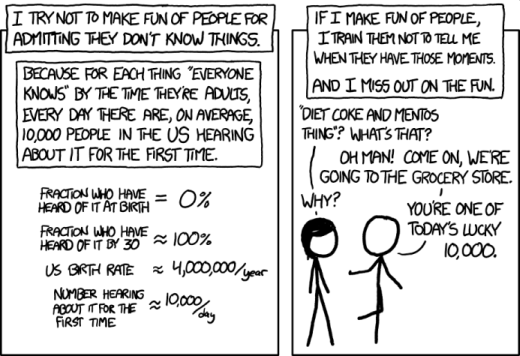
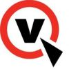
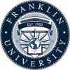

Is there anything more satisfying than trying to figure something out, _finally_ getting it, and then sharing it with someone else who will appreciate it? Or taking some piece of knowledge, passing it on to someone, and getting to witness their ["ah ha" moment](https://xkcd.com/1053/)?

For over a decade, I've been developing software in a variety of settings and industries, focusing primarily on C# and the .NET stack, but branching into React, Erlang, and whatever else the job calls for. I'm a constant learner with an appreciation for good docs, DevOps, and the Agile process. I enjoy a good challenge, producing clear and maintainable code, and sharing what I learn with others.

If you found something interesting and want to reach out, leave a comment on the article that brought you here or at the [bottom](#comments) of this page. And if something was really helpful and you'd like to thank me, [I won't turn down a cup of java](https://www.buymeacoffee.com/fhnVUiB19)! ☕

## Pet Projects

I don't have time for a lot of side projects, especially since each one requires some level of tlc forever to stay relevant, but I've got a few:

- [Generate Links for Headers](https://grantwinney.com/generate-links-for-headers/) (browser addon)
- [Hide Comments Everywhere](https://grantwinney.com/hide-comments-everywhere/) (browser addon)
- [GhostSharp](https://grantwinney.com/ghostsharp/) _(C#_ [_wrapper_](https://grantwinney.com/what-is-an-api-wrapper/) _around the_ [_Ghost API_](https://docs.ghost.org/api/)_)_

## Experience

|                                                                                     |                                                                                                                                                                                                                                                                                                                                                                                                                                                                                                                                                                                                                                                                                                                                                                                                                                                                                                                                                                                                                              |
| ----------------------------------------------------------------------------------- | ---------------------------------------------------------------------------------------------------------------------------------------------------------------------------------------------------------------------------------------------------------------------------------------------------------------------------------------------------------------------------------------------------------------------------------------------------------------------------------------------------------------------------------------------------------------------------------------------------------------------------------------------------------------------------------------------------------------------------------------------------------------------------------------------------------------------------------------------------------------------------------------------------------------------------------------------------------------------------------------------------------------------------- |
|                     | **Sr Software Developer**  [Harley-Davidson](https://www.harley-davidson.com)   _May 2021 - Present_  &#x2022; Leads a team of devs as needed. Previous projects include a parts catalog integration and increasing dealer productivity with a scheduled reporting system and access to more complete, accurate VIN data. &#x2022; Participates in all facets of software design, including planning, estimation, architecture/design and development, documentation, and feature demos. &#x2022; Strives for collaboration with QAs, BAs, DBAs, etc., using the Agile methodology. &#x2022; Pursues opportunities to help other members of the team, sharing knowledge, automating processes through DevOps, and working together to solve issues and come to the best solution. &#x2022; Primary technologies and practices include Agile/Scrum, Azure DevOps, React, C#/.NET Core, RESTful APIs, and xUnit / NUnit.                                                                                                                 |
|                | **Technical Editor**  [Code Maze](https://code-maze.com)   _Jan 2024 - Present_  &#x2022; Works with authors and senior editors, providing technical editing and proofreading for .NET articles that cover a variety of technologies and topics.                                                                                                                                                                                                                                                                                                                                                                                                                                                                                                                                                                                                                                                                                                                                                                       |
|                | **Sr Software Developer**  [Beacon Hill Staffing Group](https://www.beaconhillstaffing.com/)   _Mar 2020 - May 2021_  &#x2022; Led a team of developers on a variety of projects, including a new custom coverage initiative, upgrading a parts catalog integration, and a web portal in support of their [Certified Pre-Owned (CPO) program](https://investor.harley-davidson.com/news/news-details/2021/Harley-Davidson-Launches-H-D1-Marketplace/default.aspx). &#x2022; Participated in all facets of software design, including planning, estimation, architecture/design and development, documentation, and feature demos. &#x2022; Worked closely with QAs, BAs, DBAs, etc., using the Agile methodology. &#x2022; Pursued opportunities to help other members of the team, sharing knowledge, automating processes, and working together to solve issues and come to the best solution. &#x2022; Primary technologies and practices included Agile/Scrum, Azure DevOps, React, C#/.NET Core, RESTful APIs, and xUnit / NUnit. |
|  | **Software Developer**  [Virtual Hold Technology](https://www.vhtcx.com/)   _Oct 2015 - Feb 2020_  &#x2022; Developed the next generation of their primary telephony application. &#x2022; Collaborated with a team of developers, using pair programming and Agile. &#x2022; Communicated with the project manager and other stakeholders. &#x2022; Contributed to internal and external documentation and demonstrating new features. &#x2022; Primary technologies and practices included Agile/Scrum, TravisCI/Jenkins, GitHub, and any language or tool required for the task at hand (Erlang/OTP, Dialyzer, Ruby and RSpec, C# and NUnit, etc.).                                                                                                                                                                                                                                                                                                                                                                                 |
|               | **Software Developer**  [PartsSource Inc](https://www.partssource.com/)   _Dec 2007 - Oct 2015_  &#x2022; Developed, maintained, and supported their flagship application, used by 150 employees. &#x2022; Significant projects included integrating credit card processing, ensuring PCI compliance, working with the DBA to improve query performance across the app, and conversion of a manual fax process to an online service to save time and improve record-keeping. &#x2022; Primary technologies and practices included C#, NUnit (testing), TeamCity (CI), Crystal Reports, and Subversion.                                                                                                                                                                                                                                                                                                                                                                                                                         |
|                        | **IT Helpdesk Support II / III**  [Progressive Insurance](https://www.progressive.com/)   _Feb 2004 - Dec 2007_  &#x2022; Worked as part of a team to resolve computer-related issues for Progressive's 30,000 employees. &#x2022; Acted as a coach and escalation point for other helpdesk support reps as needed. &#x2022; Maintained troubleshooting documentation and determined escalation steps, developing communication and critical listening skills.                                                                                                                                                                                                                                                                                                                                                                                                                                                                                                                                                                 |

## Education

|   |   |
|---|---|
||[Franklin University](https://www.franklin.edu/)  **Bachelor's Degree, Computer Science**  While holding a full-time job and starting a family, I gradually worked towards my degree, earning it Summa Cum Laude with a 4.0 GPA.|

## Volunteering

|                                                                          |                                                                                                                                                                                                                                                                                                          |
| ------------------------------------------------------------------------ | -------------------------------------------------------------------------------------------------------------------------------------------------------------------------------------------------------------------------------------------------------------------------------------------------------- |
|            | Judge for [Believe in Ohio](http://www.believeinohio.org/)  **The Ohio Academy of Science**   _2015, 2016, 2020_ Participated as a judge in the annual student STEM entrepreneurship program, assessing commercialization and business plans in the regional and state final competitions. |
|  | Mentor on [Exercism](https://exercism.io/about)   _July - Nov 2018_ As a mentor, I was able to help others learn more about C#. I get to meet them where they're at, and encourage them to take the next step... and in the process, I learned more too.                                       |
|        | Contributor on Stack Overflow   _2011 - 2019_ I enjoyed helping others by sharing what I'd learned. Platforms like Stack Overflow allow developers to help one another through the tough spots, and it was nice to give back once in awhile.                                                   |