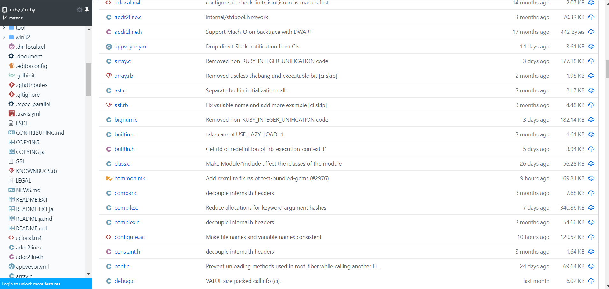

---
categories:
- GitHub
- tools-of-the-trade
date: "2020-04-04T19:01:02Z"
description: ""
draft: false
cover:
  image: photo-1527896573815-b7dd74893deb.jpg
slug: 13-addons-that-power-up-your-github-game
summary: GitHub is an amazing set of tools around Git, but it's lacking in certain
  areas. Where it fails to impress, browser addons often pick up the slack. Here's
  13 addons (plus a few honorable mentions) that will take your GitHub experience
  to the next level!
tags:
- github
- tools-of-the-trade
title: 13 addons to power up your GitHub game
---
Git is the defacto vcs for most developers today. It happens to lend itself well to all kinds of not-strictly-code-related things too, like [collaborative list making](https://grantwinney.com/github-a-tool-for-collaborative-list-making/) and [other surprising purposes](https://reclaimthenet.org/china-github-coronavirus-censorship/).

GitHub, in turn, is the defacto Git _platform,_ tacking on a bunch of fancy tooling around Git. So your issues and PR's are right there, you get a wiki for documentation, a "project" board, a UI that lets people manage their repos without resorting to the command line, etc, etc.

The experience isn't always the best it could be, though. The UI tends to make poor use of available screen real estate, the [wiki experience is subpar](https://grantwinney.com/5-things-you-can-do-with-a-locally-cloned-github-wiki/), and the project area is (afaik) tied to a single repo which is pretty unrealistic in an enterprise setting.

Where GitHub fails to impress, browser addons (and the services they tie into) can pick up the slack, so here's 13 addons (plus a few honorable mentions) that will take your GitHub experience to the next level!

- If an addon hasn't been touched in years and doesn't seem to be actively maintained, I might exclude it.
- I only included addons that solve one (or a few) problems, not general addons that address every issue under the sun.
- These are listed in the Chrome store, but easily work for Brave, Opera and Edge too. If there's a Firefox version as well, I listed it.

One more thing.. shockingly, after installing all of these addons to test them out, none of them seemed to get in each others way. Let's just take a moment to appreciate that fact, shall we? 😮

---

## What is an Access Token? (READ FIRST)

Most of these addons use the [GitHub API](https://developer.github.com/v3), so what you experience when using them (and what you read in their docs) starts to look pretty similar. GitHub allows you to use their API without telling them who you are, but [at a _severely_ limited rate](https://developer.github.com/v3/#rate-limiting) and only for public resources. Like, on the order of 60 requests/hour vs _5000 requests/hour_ for authenticated requests!

Needless to say, unauthenticated requests can run out pretty quickly if you're using GitHub a lot, and most of us are, so you want to create access tokens when possible. You could create a _single_ access token with every permission possible, and plug it into each of the following addons when they ask for it, but then you may as well just give each of the addons your username and password. 🙄

What I'd highly suggest is to [create a new, separate token](https://github.com/settings/tokens/new) for each addon, with a note that indicates which addon it's for, and give it only the permissions the addon needs. Most of the addons include a link in their respective Options pages that includes just the permissions it needs. If you decide to remove an addon, [delete the access token](https://github.com/settings/tokens) associated with it too!

Alright, enough of that! On to the main attraction...

---

## Sourcegraph (web-based IDE)

[About](https://about.sourcegraph.com/) | [Docs](https://sourcegraph.com/docs/integration/browser_extension) | [Source Code](https://github.com/sourcegraph/sourcegraph-public-snapshot) | [Privacy](https://sourcegraph.com/docs/integration/browser_extension/references/privacy)  
[Chrome](https://chrome.google.com/webstore/detail/sourcegraph/dgjhfomjieaadpoljlnidmbgkdffpack)

If you need to do a little debugging on a repo, you have to clone it locally and open it in your favorite IDE or code editor, something that can be expensive (time-wise) if you just need to take a quick peek. Well you _had_ to clone it, anyway.

[Sourcegraph](https://sourcegraph.com/docs/integration/browser_extension) is an IDE for the browser that works with multiple languages. Just hover over a keyword or identifier in your codebase, and the addon pops up a link that takes you to sourcegraph's site, which in turn provides syntax highlighting and click-through navigation for your application. I tried it with a C# application I wrote for a recent post on [MVP](https://grantwinney.com/its-possible-to-test-a-winforms-app-using-mvp/), and it had no problem navigating around.

Sourcegraph brings the IDE experience to your browser

It's [free to use](https://about.sourcegraph.com/pricing/) for small teams, and you can [install it on premise](https://sourcegraph.com/docs#quickstart) for free too. Their [future goals](https://about.sourcegraph.com/plan) are lofty, to say the least. It seems they'd like to replace the need for separate, local IDEs using a protocol called [LSP](https://microsoft.github.io/language-server-protocol/), and to eventually have a global graph of _all_ OSS to make it easier to find and share code. 🤯

**Alternative:** [Octohint](https://chrome.google.com/webstore/detail/octohint/hbkpjkfdheainjkkebeoofkpgddnnbpk) _(_[_source code_](https://github.com/pd4d10/octohint)_)_ appears to do something similar, although I didn't try it out and I have no idea how it's implemented.

---

## Octotree (easy-to-navigate code tree)

[About](https://www.octotree.io/) | [Docs](https://github.com/ovity/octotree/blob/master/README.md) | [Source Code](https://github.com/ovity/octotree) | [Privacy](https://www.octotree.io/privacy)  
[Chrome](https://chrome.google.com/webstore/detail/octotree/bkhaagjahfmjljalopjnoealnfndnagc) | [Firefox](https://addons.mozilla.org/en-US/firefox/addon/octotree/) | [Opera](https://addons.opera.com/en/extensions/details/octotree/) | [Safari](https://itunes.apple.com/us/app/octotree-pro/id1457450145?mt=12) | [Access Tokens](https://github.com/ovity/octotree#access-token)

Once you've installed sourcegraph, you can navigate your codebase from your browser like a pro, but what about when you need to find a certain file in the first place? You have to either click through multiple levels of directories, or use GitHub's built-in [file search function](https://help.github.com/en/github/searching-for-information-on-github/finding-files-on-github), which is powerful but a little cumbersome.

Octotree produces a file explorer style "directory structure" view of your entire repo. Just expand to the file you need, and click the name to go to that file or click the arrow to the left of it to see the "raw" version of the file. I think this complements sourcegraph really well, and makes the IDE experience in the browser that much more awesome.

---

## ZenHub (kanban-style project management)

[About](https://www.zenhub.com/product) | [Docs](https://help.zenhub.com/support/solutions/43000361405) | [Privacy](https://www.zenhub.com/privacy-policy)  
[Chrome](https://chrome.google.com/webstore/detail/zenhub-for-github/ogcgkffhplmphkaahpmffcafajaocjbd)

One of the toughest things to grok when you join a new team, is to figure out where everything _is._ Where the source code is, where the issues and PR's related to that source code are, where the project management that organizes and prioritizes the stories related to those issues and PR's are... where the internal documentation lives, where the _external_ documentation lives, and on and on _and on..._

If you can keep your tools in a single area, it makes life that much easier. I haven't played with GitHub's projects much, but they seem tied to a single repo. In my experience, a single team working on a single project might actually be committing changes to several (or dozens) of related repos.

[ZenHub](https://www.zenhub.com/product) lets you group a bunch of projects into a single "workspace", and then integrates itself smoothly into the GitHub UI, so you can manage the workspace from any repo. I was able to easily group two related repos, pull in their issues, move the cards around, and even mark an issue in one repo as "blocked" by an issue in the other repo.

ZenHub tracks progress across multiple repos, right from the GitHub UI

The ZenHub board is a kanban style, where you can easily drag issues (and PR's, etc) around the board to indicate what their current status is. It's free for personal, public repos too, so check it out.

---

## GitHub File Icons (file icons from Atom editor)

[Source Code](https://github.com/lvarayut/github-file-icons)  
[Chrome](https://chrome.google.com/webstore/detail/github-file-icons/kkokonbjllgdmblmbichgkkikhlcnekp)

GitHub shows a generic text file icon for every file, regardless of its type. Considering [colors and shapes were the first things most of us learned](https://www.scholastic.com/parents/family-life/creativity-and-critical-thinking/learning-skills-for-kids/why-colors-and-shapes-matter.html), I think GitHub could do a little better. [GitHub File Icons](https://chrome.google.com/webstore/detail/github-file-icons/kkokonbjllgdmblmbichgkkikhlcnekp) brings the same as Octotree (which come from the [Atom](https://ide.atom.io/) editor) into the main GitHub UI. So if you use Octotree, this fits in really nicely.

GitHub File Icons add file type specific icons (optionally with color)

**Alternative:** The [github-vscode-icons](https://chrome.google.com/webstore/detail/github-vscode-icons/hoccpcefjcgnabbmojbfoflggkecmpgd) addon _(_[_source code_](https://github.com/dderevjanik/github-vscode-icons)_)_ uses icons from [VS Code](https://code.visualstudio.com/), which IMO stand out _much_ better. I find the other icon colors a bit washed out. Presently though, this addon seems to have an issue checking for updated icons.. they appear for a moment, then all change to a small "loading" icon until you refresh the page. So ... kinda broken unfortunately. :(

Vanilla GitHub vs GitHub File Icons vs github-vscode-icons

---

## Enhanced GitHub (view repository size)

[Docs](https://github.com/softvar/enhanced-github/blob/master/README.md) | [Source Code](https://github.com/softvar/enhanced-github)  
[Chrome](https://chrome.google.com/webstore/detail/enhanced-github/anlikcnbgdeidpacdbdljnabclhahhmd) | [Access Tokens](https://github.com/softvar/enhanced-github#github-api-rate-limiting)

Did you know you can store any type of file on GitHub, with [files up to 100 MB and repos up to 100 GB](https://help.github.com/en/github/managing-large-files/what-is-my-disk-quota#file-and-repository-size-limitations) (although they recommend 50 MB and 1 GB, respectively, for top performance)? That being said, you need to have a legitimate reason for files and repos that large, but assuming there _is_ one, wouldn't you like to know it before cloning some 5 GB repo to your local disk?!

[Enhanced GitHub](https://chrome.google.com/webstore/detail/enhanced-github/anlikcnbgdeidpacdbdljnabclhahhmd) displays the size of the repo right above the"Clone" button. It also displays sizes of individual files, which is cool although I don't find that as useful. Another feature that I do like though is "Copy File", which.. um... copies the current file to your clipboard. Kinda self-explanatory, now that I think about it.

View a repository's size before deciding to clone

Regarding privacy, similar to the other addons, [it can't access private repos](https://github.com/softvar/enhanced-github#features) unless you create an access token, but again you might as well so you don't hit the unauthenticated API rate limit.

---

## GitZip (download partial repos)

[About](https://gitzip.org/) | [Source Code](https://github.com/GitZip/chrome-extension) | [Privacy](https://gitzip.org/privacy_policy.html)  
[Chrome](https://chrome.google.com/webstore/detail/gitzip-for-github/ffabmkklhbepgcgfonabamgnfafbdlkn) | [Firefox](https://addons.mozilla.org/en-US/firefox/addon/gitzip/)

_**(possibly dead?)**_

One of the ways I use GitHub is to upload code samples from various posts I've written, going back several years. I create a new directory for the blog post in that repo, then upload the code to that directory, and link to it from the post. It's sorta like Finder or Windows Explorer, except you can't download just the directory.. you have to clone the entire repo and dig around in it! Until now...

[GitZip](https://gitzip.org/) lets you click on one or more files or directories (actually, you have to click the white space _next to_ the name), and then you get a handy "download" button for your selection, which gets (gits?) you a zip file. Who says naming things is hard?

This complements the Enhanced GitHub addon pretty well - if you find out a repo is too large and you don't want to bother cloning it, use GitZip to download just the parts you _are_ interested in! I can imagine other sites where this would be useful, like programming books that upload the related code to a repo, one lesson or exercise per directory.

After a couple tries, I hit my unauthenticated limits. Just click the GitZip icon to create an access token, and you'll be back in business.

---

## Wide GitHub (same ol' GitHub.. but wider)

[Source Code](https://github.com/xthexder/wide-github)  
[Chrome](https://chrome.google.com/webstore/detail/wide-github/kaalofacklcidaampbokdplbklpeldpj/related)

There are times when you fully expect an app won't use all your screen real estate.. playing a retro PC game, or [installing Windows 3.1](https://grantwinney.com/installing-windows-3-1-in-vmware-player/) for example. But in a modern web app, there's no reason _not_ to take advantage of a wider screen. For some reason though, GitHub doesn't and (AFAIK) never has.

[Wide GitHub](https://github.com/xthexder/wide-github) applies some CSS that takes full advantage of your 32:9 super-duper ultra-mega-wide curvy monitor. Now your GitHub code can wrap all around you, like a giant omnimax theater.. for code. But if you hit a page that seems less readable in wide format, just click the icon to disable it.

If you already use [Stylus](https://add0n.com/stylus.html) (or Tampermonkey, etc), there are instructions on [how to use them](https://github.com/xthexder/wide-github/blob/master/README.md#installing) instead. But the addon is easier and you'll get automatic updates, so there's that... decisions, decisions.

---

## GitHub 404 Breakdown (git blame meets 404)

[Source Code](https://github.com/SidneyNemzer/github-404-breakdown)  
[Chrome](https://chrome.google.com/webstore/detail/github-404-breakdown/pnhdlhabpckpibnkkddmgcimdejbljge)

When you come across a broken GitHub link, you get a 404 - no surprises there. The problem is, the 404 page doesn't tell you if the entire repo is gone, or the branch that was linked was merged back to master, or just the linked file was deleted. Your forced to do some digging to figure out which might be true.

If everything goes well and you never come across a broken link, then you'll never even notice [GitHub 404 Breakdown](https://chrome.google.com/webstore/detail/github-404-breakdown/pnhdlhabpckpibnkkddmgcimdejbljge). But when you inevitably _do_ hit a broken link, then this nice little addon tests every portion of the URL and lets you know exactly where things broke down.

---

## GitHub Issue Link Status (inline issue and PR statuses)

[Source Code](https://github.com/fregante/github-issue-link-status)  
[Chrome](https://chrome.google.com/webstore/detail/github-issue-link-status/nbiddhncecgemgccalnoanpnenalmkic) | [Firefox](https://addons.mozilla.org/en-US/firefox/addon/github-issue-link-status/)

It's amazing how something as straight-forward as adding a little color can instantly tell you something important, eliminating the need to have to spend a couple extra brain cycles thinking about it.

[GitHub Issue Link Status](https://github.com/fregante/github-issue-link-status) does just that, adding different colors and icons to issues and PRs, dependent on whether they're open, closed, or merged. And it seems to work all over the GitHub interface, not just the issue or PR screens.

---

## GitHub Custom Tab Size

[Source Code](https://github.com/lukechilds/github-custom-tab-size)  
[Chrome](https://chrome.google.com/webstore/detail/github-custom-tab-size/jcjfkmdkcaopkioccnpbhiemfcmpnghe)

Commit a file with tabs in it, and then open it on GitHub. Oddly, if you _edit_ the file right on GitHub, you can choose between a few sizes for tabs. But if you just want to view the file (far more likely), you get 8 spaces per tab. Maybe it's GitHub's way of showing you the truth... spaces **are** better! _*ducks*_

When editing a file, you can choose 2, 4, or 8 spaces for tabs... but not when _viewing!s_

The [GitHub Custom Tab Size](https://chrome.google.com/webstore/detail/github-custom-tab-size/jcjfkmdkcaopkioccnpbhiemfcmpnghe) addon gives you an easy way to change that, especially helpful if you're working in a codebase with deeply nested code. Yeah yeah, this can be a sign of a code smell.. but until you manage to refactor that old codebase that's 20 levels deep, this addon might help preserve your sanity.

---

## Better Pull Request for GitHub (navigation for large PRs)

[Source Code](https://github.com/berzniz/github_pr_tree)  
[Chrome](https://chrome.google.com/webstore/detail/better-pull-request-for-g/nfhdjopbhlggibjlimhdbogflgmbiahc)

If you've been doing PRs as a team for any length of time, sooner or later you'll come across a simply massive PR. It might be 2 lines changed in each of 100 files, or a project that kept increasing in scope across too many sprints. Whatever happened, it'll be daunting to scroll through, in part due to the fact that GitHub just lays out all the file changes without any sort of navigation or table of contents.

[Better Pull Request for GitHub](https://chrome.google.com/webstore/detail/better-pull-request-for-g/nfhdjopbhlggibjlimhdbogflgmbiahc/related) generates a table of contents (only when you're viewing a PR) that looks very similar to the navigational explorer window you'd find in nearly any IDE. Clicking a link takes you right to the file in question, and as you scroll the looooong PR, the selected file actually changes depending on where you are on screen.

Although Octotree is collapsed here, it plays nicely with the navigational tree that Octotree creates too. Better Pull Request inserts its panel into the PR page smoothly, making it appear like it's just another part of the UI.

---

## OctoLinker (links libraries to their official docs)

[About](https://octolinker.now.sh/) | [Source Code](https://github.com/OctoLinker/OctoLinker)  
[Chrome](https://chrome.google.com/webstore/detail/octolinker/jlmafbaeoofdegohdhinkhilhclaklkp)  
[Public Access Token](https://github.com/settings/tokens/new?scopes=public_repo&description=OctoLinker) | [Private Access Token](https://github.com/settings/tokens/new?scopes=repo&description=OctoLinker)

This one definitely follows in the suit of other addons that enhance GitHub to make it more of an IDE experience right in your browser. Every application you write, regardless of the language, will depend on other libraries. If you see a reference to a library, you have to manually look it up.

[OctoLinker](https://octolinker.now.sh/) looks at the file type, and if it's a [supported language](https://octolinker.now.sh/#languages) (like Python, Ruby, JavaScript, etc), it inserts links for any libraries it finds to their respective docs.

It's supposed to work for relative file references between your files too, but the only thing I had to try it on were some Python scripts, and it didn't work with those.

---

## Notifier for GitHub (simple notification count)

[Source Code](https://github.com/sindresorhus/notifier-for-github)  
[Chrome](https://chrome.google.com/webstore/detail/notifier-for-github/lmjdlojahmbbcodnpecnjnmlddbkjhnn) | [Firefox](https://addons.mozilla.org/en-US/firefox/addon/notifier-for-github/)  
[Public Access Token](https://github.com/settings/tokens/new?scopes=notifications&description=Notifier%20for%20GitHub%20extension) | [Private Access Token](https://github.com/settings/tokens/new?scopes=notifications,repo&description=Notifier%20for%20GitHub%20extension)

GitHub has a spiffy [Notifications](https://github.com/notifications) area that alerts you to [all kinds of things](https://help.github.com/en/github/managing-subscriptions-and-notifications-on-github/about-notifications#default-subscriptions) like assigned issues and PR's, threads you commented on, other people @mentioning you, etc. I'd suggest going into your [notification settings](https://github.com/settings/notifications) and deciding what exactly you even want to be notified on. You'll notice they come in 2 flavors - via the UI if you have GitHub open onscreen, and via email.

If you want to know about new notifications, but you neither need more emails nor leave GitHub visible all day, then checkout [Notifier for GitHub](https://github.com/sindresorhus/notifier-for-github). It's so simple there's nothing really to show.. it displays an icon in your toolbar with a notification count, and clicking on it opens the GitHub notifications page.

Oh look, I found something to show anyway. 1 unread item is offscreen.

It's just making a call to the [Notifications API](https://developer.github.com/v3/activity/notifications/#list-notifications-for-the-authenticated-user), which returns a JSON block with detailed info about your notifications, and then it counts the number of returned items. Actually, since the author has access to all that data, I wish there was an option to hover over the toolbar icon and see a brief summary of the newest notifications, but oh well. It's nice anyway, if you're trying to stay on top of alerts.

**Alternative:** There's another addon that actually _does_ show information about the notifications, called [Notifications Preview for GitHub](https://chrome.google.com/webstore/detail/notifications-preview-for/kgilejfahkjidpaclkepbdoeioeohfmj/related), but [it seems to be broken with the new beta interface](https://github.com/tanmayrajani/notifications-preview-github/issues/79)... which probably means it traverses the DOM instead of using the API, and the new UI likely completely changed the DOM.

---

## Honorable Mentions

Some addons look promising, but aren't quite ready for prime-time yet. Others are popular, but try to fix everything instead of focusing on one thing. Here are some addons I came across that are worth a look, but I

### Paint GitHub (a picture is worth a thousand words)

[Chrome](https://chrome.google.com/webstore/detail/paint-github/dmcjbappfnlamankemdmmdjiecnclapl)

A picture is worth a thousand words, especially when you're trying to describe a problem you're having. [Paint GitHub](https://chrome.google.com/webstore/detail/paint-github/dmcjbappfnlamankemdmmdjiecnclapl) adds a new tab with a canvas to the "New Issue" screen, allowing you to create a freehand drawing and then "upload" it to GitHub for attachment. If you want to draw over an existing image, like maybe a screen capture of the problem you're having, you can insert it with "Insert image".

It appears to be in the early stages of development, but I hope the author continues with it. You can draw free-hand but not much else - it'd be great to have all the basic functions of a "paint" style app like adding text and geometric shapes, etc. But... it works as-is and (for some cases) eliminates the need to edit an image in a separate paint app and then drag it over to the "New Issue" panel.

### Quick add issue to GitHub

[Source Code](https://github.com/stilliard/quick-add-github-issue-browser-extension)  
[Chrome](https://chrome.google.com/webstore/detail/quick-add-issue-to-github/mgamfhobfmlghohfjdiecjhddoigenkk) | [Access Token](https://github.com/settings/tokens/new?scopes=repo,read:org&description=Quick%20add%20issue%20to%20GitHub)

It's pretty self-explanatory, allowing you to quickly add issues to a repo. Unfortunately, it only works for a single user or organization, not across _all_ the organizations a person might belong too. Hope the author makes a few changes to it.

### Refined GitHub

[Chrome](https://chrome.google.com/webstore/detail/refined-github/hlepfoohegkhhmjieoechaddaejaokhf)

I didn't try [Refined GitHub](https://chrome.google.com/webstore/detail/refined-github/hlepfoohegkhhmjieoechaddaejaokhf), but the author (who also wrote _Notifier for GitHub,_ above) is prolific on GitHub for his OSS, and the addon is very highly rated. It's definitely worth checking out, but I'm personally not interested in an addon that fixes all the things for all the people.
