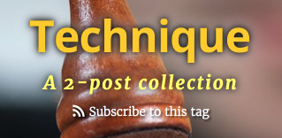
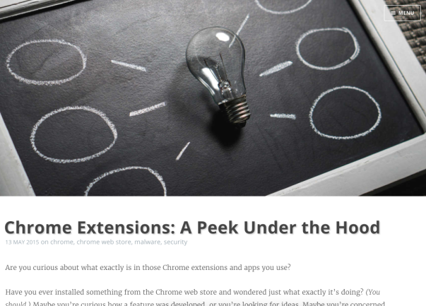
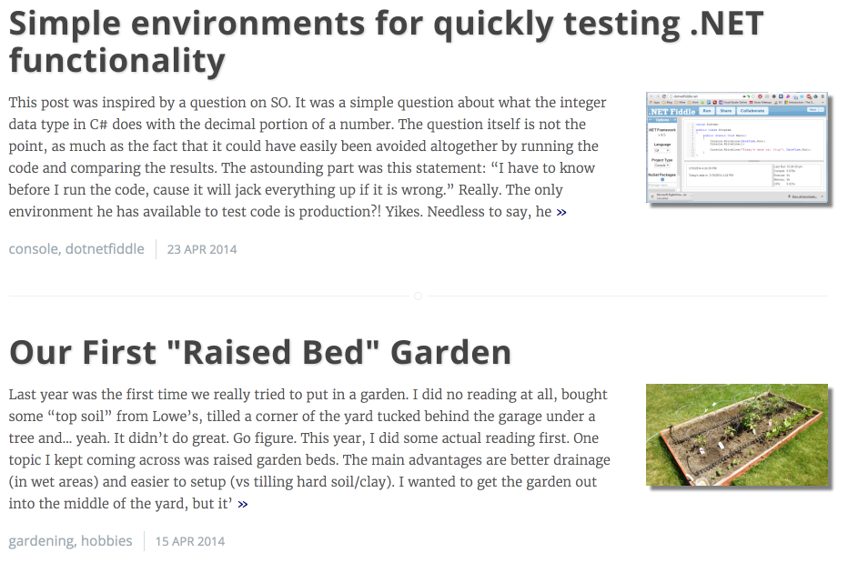
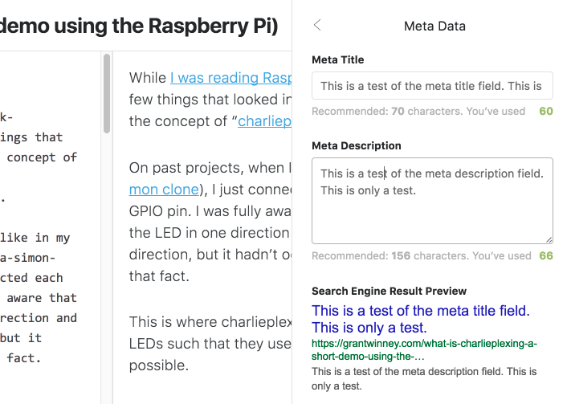
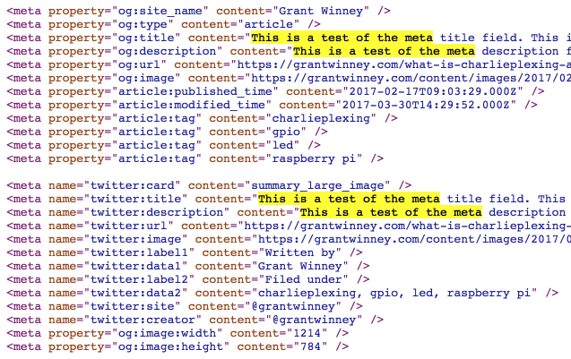
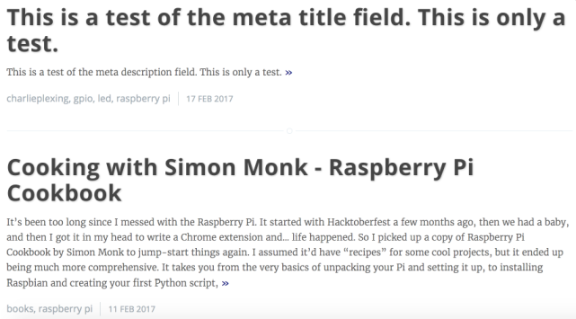

---
categories:
  - ghost-blog
date: 2017-04-01T18:47:23Z
description: ""
draft: false
cover:
  image: photo-1476283721796-dd935b062838.jpg
slug: 5-quick-hacks-for-your-ghost-theme
summary: These "hacks" for Ghost add some cool features to any blog, and should be usable with any theme.
tags:
  - ghost-blog
title: 5 Quick Hacks for Your Ghost Theme
---
As of this writing, I'm using the default "Casper" theme that installs with Ghost (read more about [my migration from WordPress to Ghost](https://grantwinney.com/migrating-a-blog-from-wordpress-to-ghost/)), but these hacks should be usable in any theme (with adjustments) as needed. Using these requires that you're able to SSH into your Ghost installation, or otherwise have access to upload and modify files.

## Hack #1: Adding a "Subscribe to Tag" RSS feed button

Ghost can generate RSS feeds for individual tags, but they're not all that discoverable. To help your visitors, **add the last line** in the following snippet to the `ghost/content/themes/casper/tag.hbs` file. It combines your blog url and the tag url to generate a custom RSS link your visitors can use.

```html
<h1 class="page-title">{{name}}</h1>
<h2 class="page-description">
    {{#if description}}
        {{description}}
    {{else}}
        A {{../pagination.total}}-post collection
    {{/if}}
</h2>
<a class="icon-feed rss-tag" href="{{@blog.url}}{{url}}rss/">Subscribe to this tag</a>
```

This produces a new "subscribe" link under the tag description when viewing a particular tag. _(Here I've applied some color and shadow effects to the other elements too.)_



---

## Hack #2: Using a blog cover image for posts that have none

When you view all posts for a tag, it loads a cover image at the top. If the tag has no image assigned to it, the `tag.hbs` template loads your blog's cover image instead:

```html
{{!-- If we have a tag cover, display that - else blog cover - else nothing --}}
<header class="main-header tag-head {{#if tag.image}}" 
        style="background-image: url({{tag.image}}){{else}}{{#if @blog.cover}}" style="background-image: url({{@blog.cover}}){{else}}no-cover{{/if}}{{/if}}">
```

But what about posts? If there isn't a cover image for a post, the `post.hbs` template leaves an empty area - but you can change that behavior to mimic the tag view. Find the code in `post.hbs` that loads cover images, shortly after the `{{#post}}` expression, and modify it to load the blog cover image when no post cover image is available:

```html
{{!-- If we have a post cover, display that - else blog cover - else nothing --}}
<header class="main-header post-head {{#if image}}" style="background-image: url({{image}}){{else}}{{#if @blog.cover}}" style="background-image: url({{@blog.cover}}){{else}}no-cover{{/if}}{{/if}}">
```

Here's a post that has no cover image assigned to it, so it's loading my blog cover image instead.



---

## Hack #3: Adding thumbnail images next to post listings

Many of the themes in WordPress load a "featured" thumbnail image next to each individual post when viewing lists of posts. If, like me, you miss this feature and think the front page is a bit bland without thumbnails, you can modify one of the templates to include them.

Add the second line in the snippet below to `ghost/content/themes/casper/partials/loop.hbs`. That's the file that handles lists of posts, like on the front page of your blog or when you're viewing an individual tag. It inserts your post's cover image if there is one.

```html
<section class="post-excerpt">
    {{#if image}}{{/if}}
    <p>{{excerpt words="26"}} <a class="read-more" href="{{url}}">&raquo;</a></p>
</section>
```

The `front-page-image` class is for adding styling, because it's gonna look pretty ugly without it. Here's how I defined it. You could place the following in a separate file and reference it in the `{{!-- Styles'n'Scripts --}}` section of `default.hbs`, include it in the "Code Injection" part of the admin panel, or just place it inline in the `img` element. Play around with it until you get something you like.

```css
/* Add thumbnail image to the main posts list */
.front-page-image {
    width: 200px;
    max-height: 200px;
    float: right;
    margin-left: 30px;
    margin-bottom: 15px;
    box-shadow: 5px 5px 3px gray;
}
```

Here's what it ends up looking like. Notice how I have longer descriptions too. You can change `{{excerpt words="26"}}` to a larger number in the `tag.hbs` file. I set it to 100.



---

## Hack #4: Using a post's meta data as its title and excerpt in post listings

Ghost has built SEO functionality right into its core. While editing a post, you can add meta data about it. Ghost then uses that meta data to generate markup that can be consumed by search engines or used when posting to social media sites.





What if you wanted to use this data, when present, as the "title" and "excerpt" on your blog in lists of posts like on the front page? I mean, you've already taken the extra step of adding a concise description of your post, so why not use that instead of having Ghost simply display the first xx words of your post?

Here's where `ghost/content/themes/casper/partials/loop.hbs` loops through each of your posts, writing the title and excerpt.

```html
{{#foreach posts}}
<article class="{{post_class}}">
    <header class="post-header">
        <h2 class="post-title"><a href="{{url}}">{{title}}</a></h2>
    </header>
    <section class="post-excerpt">
        <p>{{excerpt words="26"}} <a class="read-more" href="{{url}}">&raquo;</a></p>
    </section>
```

You can modify that to check for the presence of a `meta_title` and `meta_description` first, then fall back to the regular title and first xx words of your post if needed.

```html
{{#foreach posts}}
<article class="{{post_class}}">
    <header class="post-header">
        <h2 class="post-title"><a href="{{url}}">{{#if meta_title}}{{meta_title}}{{else}}{{title}}{{/if}}</a></h2>
    </header>
    <section class="post-excerpt">
        <p>{{#if meta_description}}{{meta_description}}{{else}}{{excerpt words="26"}}{{/if}} <a class="read-more" href="{{url}}">&raquo;</a></p>
    </section>
```

And here's how it renders. The first post has a meta title _and_ meta description specified, but the second has neither.



---

## Hack #5: Adding a Table of Contents to your posts

Last but not least, what if you'd like to generate a table of contents from the headers in your posts? It'd be monotonous to add (and update) them yourself.

I originally found a nice script to generate a table of contents, then forked it, fixed it, and added a few more features to make it work with Ghost. Unfortunately, upgrading from Ghost 0.11 to 1.0 broke it for some reason. Instead of fixing it, I[ wrote a new script that should work with any theme](https://grantwinney.com/creating-a-table-of-contents-for-your-blog).

---

**What do you think of these little hacks?**

Did you find them helpful? Did you improve on any of them, or come up with your own? Feel free to share your thoughts and comments below!
