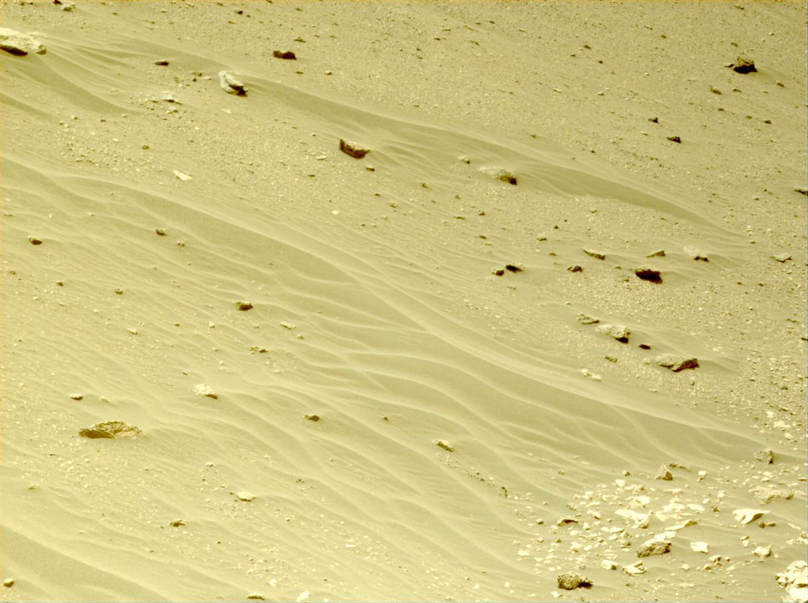
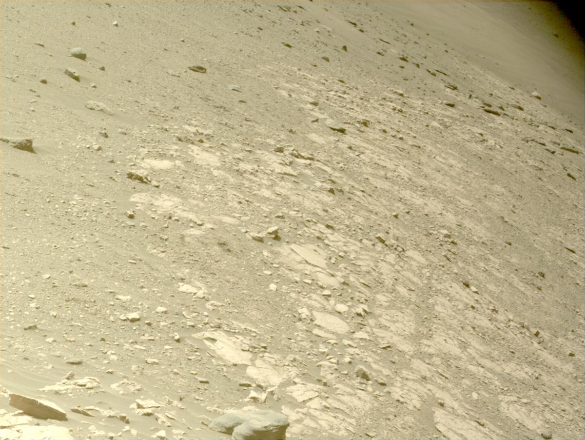
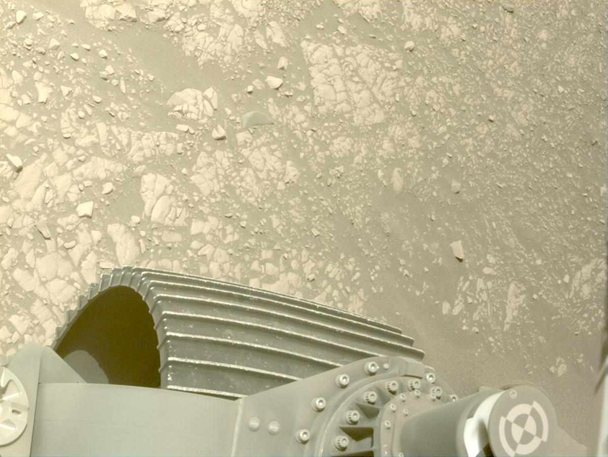
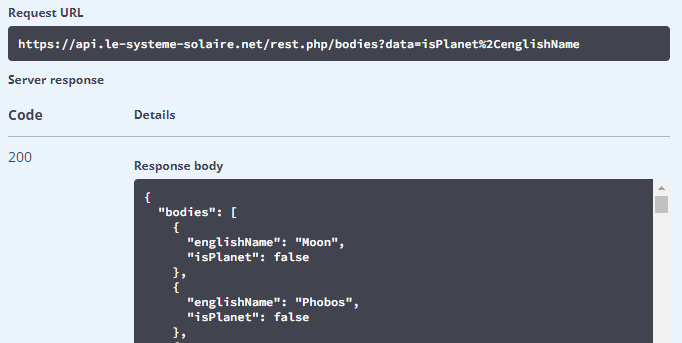

---
categories:
  - APIs
date: 2022-08-28T18:23:48Z
description: ""
draft: false
cover:
  image: photo-1499578124509-1611b77778c8.jpg
slug: 6-space-related-apis-to-check-out-ahead-of-the-artemis-i-launch
summary: The week of NASA launching Artemis I is a good time to check a few of the many APIs that make tons of raw space data accessible for anyone to use.
tags:
  - astronomy
title: 6 space-related APIs to check out ahead of the Artemis I launch
---
NASA is set to launch the first of a series of Orion rockets that will eventually take us back to the moon for the first time in 50 years. It seems the goal this time around is much more than visiting the moon. I won't say "just" visiting the moon because, c'mon, visiting the moon is still mind-blowing!

There's talk of building another space station, The Gateway, to orbit the moon. It'll be similar to ISS but able to move easier to conduct different kinds of research around the moon and designed to be less reliant on Earth. There's talk of a lunar base too, and of using everything they learn to go even further, on to Mars.

It's amazing, considering a little over a hundred years ago we were barely off the ground with the first airplanes. Walking and living on the moon was the stuff of dreams and sci-fi.

Given that the launch is just around the corner, I figured it as good a time as any to explore some of the APIs that allow us to access all kinds of data about space and the people who work and live there. But first...

- [Read this](https://grantwinney.com/what-is-an-api/) if you're unfamiliar with APIs.
- Get [Postman](https://www.getpostman.com/) to make your life easier when accessing APIs.
- [Check out my previous posts](https://grantwinney.com/tags/api/) if you'd like to learn about other interesting APIs.

## ISS Notify API

This API, which I've written about before, allows you to find the current location of the ISS with one simple call. It's tiny but useful.

```none
GET http://api.open-notify.org/iss-now.json
```

Couldn't you imagine having a large map of the Earth overlaid with a matrix of LEDs, where you could watch the progress of the ISS as it flies around the planet once every 90 minutes? Maybe using RGB LEDs, turning them yellow where it happens to be daytime, then turning one red for the ISS. Hmm...

[Learn About the ISS and its Crew with the ISS Notify API](https://grantwinney.com/what-is-iss-notify-api/)

## NASA API

Then there's the official NASA API, with all kinds of interesting endpoints. In the post I wrote a few years ago, I explored the photo of the day and viewing images from the various rovers we've sent to Mars. _(Incidentally,_ [_the Curiosity rover just hit 10 years_](https://www.nasa.gov/feature/curiosity-celebrates-10-years-on-mars) _and it's still kicking!)_

[View the Mars Rover, Landsat Images, and More with the NASA API](https://grantwinney.com/what-is-nasa-api/)

When I wrote about this before, the Perseverance wasn't around yet (it launched in 2020 and landed in Feb 2021), so you can check out the images coming back from that rover too.

```none
https://api.nasa.gov/mars-photos/api/v1/rovers/perseverance/photos?sol=531&api_key=your-api-key
```







There's a lot of other endpoints, some of which I don't fully understand, but here's one that returns the weather on Mars as reported by [Insight](https://mars.nasa.gov/insight/).

```none
https://api.nasa.gov/insight_weather/?api_key=your-api-key&feedtype=json&ver=1.0
```

## MAAS2 API

It's interesting to think how everything we use is one layer upon another, and whatever we create with those layers is a potential layer for someone else to use. It's true for software, and everything else we use too.

The Curiosity rover includes a component called the [REMS](https://cab.inta-csic.es/proyectos/mision-msl-rems/) environmental station, which records the weather on Mars. That data's transmitted back to Earth, and the MAAS2 API uses it to display the Martian weather for any SOL (a Martian day). Then you can use it for whatever project you dream up.

The request is really simple: _(there used to be a Swagger page, but it's gone)_

```json
GET https://api.maas2.apollorion.com

{
  "status": 200,
  "id": 3251,
  "terrestrial_date": "2022-03-24T00:00:00.000Z",
  "ls": 195,
  "season": "Month 7",
  "min_temp": -68,
  "max_temp": -5,
  "pressure": 760,
  "pressure_string": "Higher",
  "abs_humidity": null,
  "wind_speed": null,
  "atmo_opacity": "Sunny",
  "sunrise": "05:18",
  "sunset": "17:22",
  "local_uv_irradiance_index": "Moderate",
  "min_gts_temp": -66,
  "max_gts_temp": 5,
  "wind_direction": null,
  "sol": 3423,
  "unitOfMeasure": "Celsius",
  "TZ_Data": "America/Port_of_Spain"
}
```

## SpaceX API (unofficial)

They state plainly that this is _not_ an official SpaceX API, but it does make accessible a lot of SpaceX data. You don't need an API key, but they limit any single IP address to 50 requests per second - generous until a bunch of people behind one address all try hitting it at once, like maybe in a classroom setting at a school.

Click on the following link, then the "docs" folder, and scroll to the bottom of the page for a brief description of each available endpoint. Click on any of those endpoints to drill down into the details. There's examples of how to use each one.

[r-spacex/SpaceX-API](https://github.com/r-spacex/SpaceX-API)

You can get data about the Starlink satellites, which currently returns 160,000 lines of JSON, implying there are thousands of Starlink satellites. I figured there were like maybe a few hundreds currently, but nope... _[thousands](https://starlinkinsider.com/starlink-launch-statistics/)_, with tens of thousands more planned. 😲

If you already know the ID, you can grab the data for just that one. All kinds of interesting info in here, like when the satellite decays (which I assume is when it burns up in the atmosphere), where it is, how high it is and how fast it's going, etc.

```json
GET https://api.spacexdata.com/v4/starlink/5eed7714096e590006985634

{
    "spaceTrack": {
        "CCSDS_OMM_VERS": "2.0",
        "COMMENT": "GENERATED VIA SPACE-TRACK.ORG API",
        "CREATION_DATE": "2022-08-27T03:09:42",
        "ORIGINATOR": "18 SPCS",
        "OBJECT_NAME": "STARLINK-24",
        "OBJECT_ID": "2019-029D",
        "CENTER_NAME": "EARTH",
        "REF_FRAME": "TEME",
        "TIME_SYSTEM": "UTC",
        "MEAN_ELEMENT_THEORY": "SGP4",
        "EPOCH": "2022-08-26T17:54:37.802304",
        "MEAN_MOTION": 15.4627316,
        "ECCENTRICITY": 0.0004341,
        "INCLINATION": 53.0023,
        "RA_OF_ASC_NODE": 137.5737,
        "ARG_OF_PERICENTER": 182.2789,
        "MEAN_ANOMALY": 177.8198,
        "EPHEMERIS_TYPE": 0,
        "CLASSIFICATION_TYPE": "U",
        "NORAD_CAT_ID": 44238,
        "ELEMENT_SET_NO": 999,
        "REV_AT_EPOCH": 17906,
        "BSTAR": 0.0013509,
        "MEAN_MOTION_DOT": 0.00067781,
        "MEAN_MOTION_DDOT": 0,
        "SEMIMAJOR_AXIS": 6805.777,
        "PERIOD": 93.127,
        "APOAPSIS": 430.596,
        "PERIAPSIS": 424.687,
        "OBJECT_TYPE": "PAYLOAD",
        "RCS_SIZE": "LARGE",
        "COUNTRY_CODE": "US",
        "LAUNCH_DATE": "2019-05-24",
        "SITE": "AFETR",
        "DECAY_DATE": null,
        "DECAYED": 0,
        "FILE": 3548620,
        "GP_ID": 211075775,
        "TLE_LINE0": "0 STARLINK-24",
        "TLE_LINE1": "1 44238U 19029D   22238.74627086  .00067781  00000-0  13509-2 0  9998",
        "TLE_LINE2": "2 44238  53.0023 137.5737 0004341 182.2789 177.8198 15.46273160179067"
    },
    "launch": "5eb87d30ffd86e000604b378",
    "version": "v0.9",
    "height_km": 430.358249647551,
    "latitude": 11.896846595007474,
    "longitude": -21.623815638425082,
    "velocity_kms": 7.653935367803395,
    "id": "5eed7714096e590006985634"
}
```

Other endpoints provide data about the rockets, their payloads and crews, and even the ships (i.e tugboats) that are involved in the process too... or you can just check out the current location of the car that Musk launched into space. _(sigh)_

```none
https://api.spacexdata.com/v4/roadster
```

## Solar System OpenData API

The Solar System OpenData API provides access to information about all kinds of celestial bodies - where they're at, their physical characteristics, etc. It doesn't seem to require an API key either, and I don't see anything about rate limiting.

[Solar system OpenData](https://api.le-systeme-solaire.net/en/)

There's a very helpful description at the bottom of the page, with all the parameters you can send in and all the data you can expect to get back. They've got a Swagger page setup [here](https://api.le-systeme-solaire.net/swagger/) too, which is convenient for taking things for a spin. (If you're not familiar with it, you can [read more about Swagger here](https://swagger.io/docs/specification/2-0/what-is-swagger/), but it's basically a way to automate clean documentation for your API that also lets people try out the endpoints.)

You can pull back data on all celestial bodies at once with a simple call to `/bodies`, or limit the response by attaching an id to the end like "lune" (French for the moon).

```json
GET https://api.le-systeme-solaire.net/rest/bodies/lune

{
    "id": "lune",
    "name": "La Lune",
    "englishName": "Moon",
    "isPlanet": false,
    "moons": null,
    "semimajorAxis": 384400,
    "perihelion": 363300,
    "aphelion": 405500,
    "eccentricity": 0.05490,
    "inclination": 5.14500,
    "mass": {
        "massValue": 7.34600,
        "massExponent": 22
    },
    "vol": {
        "volValue": 2.19680,
        "volExponent": 10
    },
    "density": 3.34400,
    "gravity": 1.62000,
    "escape": 2380.00000,
    "meanRadius": 1737.00000,
    "equaRadius": 1738.10000,
    "polarRadius": 1736.00000,
    "flattening": 0.00120,
    "dimension": "",
    "sideralOrbit": 27.32170,
    "sideralRotation": 655.72800,
    "aroundPlanet": {
        "planet": "terre",
        "rel": "https://api.le-systeme-solaire.net/rest/bodies/terre"
    },
    "discoveredBy": "",
    "discoveryDate": "",
    "alternativeName": "",
    "axialTilt": 6.68,
    "avgTemp": 0,
    "mainAnomaly": 0,
    "argPeriapsis": 0,
    "longAscNode": 0,
    "bodyType": "Moon"
}
```

You can customize the data coming back too, like limiting it to just the name and whether it's a planet.

```json
GET https://api.le-systeme-solaire.net/rest/bodies/lune?data=isPlanet,englishName

{
    "englishName": "Moon",
    "isPlanet": false
}
```

This is where the Swagger page really comes in handy. Click "Try it out" next to an endpoint, play around with different combinations of data, and hit "Execute" to see the results and (especially helpful) the exact API call that you can use in your app or whatever.



## RocketLaunch.Live

One more and then I think I'm API'd out for the day. :)

The [Rocket Launch API](https://www.rocketlaunch.live/api) provides, shockingly, information about upcoming rocket launches. You need an API key for it, although I think they're free, but there's one call you can make without a key that returns the next 5 launches. And look what's up next... the Artemis I.

```json
GET https://fdo.rocketlaunch.live/json/launches/next/5

{
    "valid_auth": false,
    "count": 5,
    "limit": 5,
    "total": 117,
    "last_page": 24,
    "result": [
        {
            "id": 38,
            "cospar_id": "",
            "sort_date": "1661776380",
            "name": "Artemis I (EM-1)",
            "provider": {
                "id": 2,
                "name": "NASA",
                "slug": "nasa"
            },
            "vehicle": {
                "id": 15,
                "name": "SLS",
                "company_id": 2,
                "slug": "sls"
            },
            "pad": {
                "id": 36,
                "name": "LC-39B",
                "location": {
                    "id": 61,
                    "name": "Kennedy Space Center",
                    "state": "FL",
                    "statename": "Florida",
                    "country": "United States",
                    "slug": "kennedy-space-center"
                }
            },
            "missions": [
                {
                    "id": 35,
                    "name": "Artemis I (EM-1)",
                    "description": "On its debut flight, the Space Launch System (SLS) will send an uncrewed Orion Multi-Purpose Crew Vehicle on a four to six-week mission to the Moon and back, including 6 days in a retrograde lunar orbit."
                }
            ],
            "mission_description": "On its debut flight, the Space Launch System (SLS) will send an uncrewed Orion Multi-Purpose Crew Vehicle on a four to six-week mission to the Moon and back, including 6 days in a retrograde lunar orbit.",
            "launch_description": "A NASA SLS rocket will launch the Artemis I (EM-1) mission on Monday, August 29, 2022 at 12:33 PM (UTC).",
            "win_open": "2022-08-29T12:33Z",
            "t0": null,
            "win_close": "2022-08-29T14:33Z",
            "est_date": {
                "month": null,
                "day": null,
                "year": null,
                "quarter": null
            },
            "date_str": "Aug 29",
            "tags": [
                {
                    "id": 48,
                    "text": "Lunar Orbit"
                },
                {
                    "id": 91,
                    "text": "Series: NASA Artemis"
                },
                {
                    "id": 23,
                    "text": "Test Flight"
                },
                {
                    "id": 21,
                    "text": "Uncrewed"
                },
                {
                    "id": 14,
                    "text": "Vehicle Debut"
                }
            ],
            "slug": "em-1",
            "weather_summary": "Humid and Mostly Cloudy\nTemp: 80.89F\nWind: 5.54mph\n",
            "weather_temp": 80.89,
            "weather_condition": "Humid and Mostly Cloudy",
            "weather_wind_mph": 5.54,
            "weather_icon": "wi-day-cloudy",
            "weather_updated": "2022-08-28T12:00:19+00:00",
            "quicktext": "SLS - Artemis I (EM-1) - Mon Aug 29, 2022 12:33:00 UTC (L-21:53:59) - https://rocketlaunch.live/launch/em-1 for info/stream",
            "media": [],
            "result": -1,
            "suborbital": false,
            "modified": "2022-08-27T14:57:20+00:00"
        },
```

So many APIs, so little time. Hopefully this gives you a small taste of what's out there though.

I know I'll be tuning in to watch the launch on NASA's live stream. Just think.. if all goes well, we'll be on our way to colonizing the moon and then Mars! Amazing...
