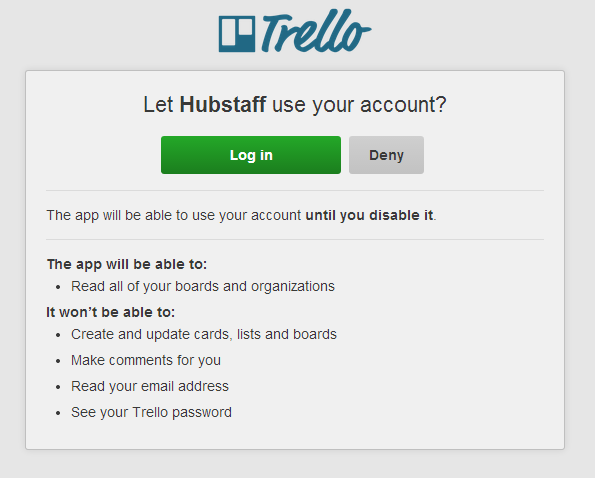

---
categories:
- API
- Security
- Coding
date: "2018-06-19T13:45:34Z"
description: ""
draft: false
cover:
  image: photo-1586864387634-2f33030dab41.jpg
slug: a-look-at-the-many-ways-apis-can-authorize-access
summary: After writing about so many APIs and having to figure out the auth process
  for each, I wanted to compare and contrast how some of these services approach authentication
  and authorization, and why they might've decided to do it the way they did.
tags:
- API
- Security
- Coding
title: A look at the many ways APIs can authorize access
---
When you encounter an [API](https://grantwinney.com/what-is-an-api/) that gives you access to some data - maybe yours (tweets, photos), maybe someone else's (space photos, climate stats) - you'll usually encounter some form of required [authentication/authorization](https://www.cyberciti.biz/faq/authentication-vs-authorization/) before being allowed to access it. That's because the usual purpose of an API is to safely expose specific data for easy consumption by some other application that builds on top of it. Maybe it's an app that helps you schedule tweets like [Buffer](https://buffer.com/), or a browser extension that adds new functionality to your Trello boards like [Plus for Trello](https://chrome.google.com/webstore/detail/plus-for-trello-time-trac/gjjpophepkbhejnglcmkdnncmaanojkf). In the case of Ghost, the platform my blog runs on, [the consumer is Ghost itself](https://api.ghost.org/v1.22.0/docs) (although you could develop your own app on top of it too).

If you write an API to expose data to the outside world, there's questions you'll want to ask. How do you know the user is who they claim to be? Or that they actually granted access to the app requesting their data? Or whether the requester even _is_ a user or an app? How do you limit the rate at which data can be accessed? It depends on how sensitive the data is, what you want to let them do with it, whether there are different levels of access for different users, etc.

I've written about a number of [APIs](https://grantwinney.com/tags/api/) in the past, and wanted to compare how these different services approach authentication and authorization, and why they might've decided to do it the way they did.

---

## Nothing

The easiest way to authenticate users is to, uh... not. If you've got an API that only allows read operations, like the the [Penguin Random House API](https://grantwinney.com/what-is-penguin-random-house-api/) that provides access to author and book data, then this is at least a fairly safe operation. Safe, in that you don't have random unknown users uploading data.

But potentially unsafe too, in that it's more difficult to rate limit. Even the most powerful server serving up resources behind an API has its limits. And as an API grows in popularity, or if it's possible to request extraordinarily large amounts of data, then this might cause slow response times for everyone... or even take the server down.

I'm not sure exactly how you can limit rates if you don't know who's making the request, other than blocking an IP address after a certain threshold is reached. But the use of [VPNs](https://www.howtogeek.com/133680/htg-explains-what-is-a-vpn/) that mask true IPs can make this difficult. And accessing an API from a university or corporation, where thousands of users may be masked behind a few outward-facing IP addresses, could result in blocking way more people than intended. Off the top of my head, I'd think that caching similar result sets, or integrating with a service like [Cloudflare](https://www.cloudflare.com/rate-limiting/), might help there.

Other examples include the [US Census Bureau](https://grantwinney.com/what-is-us-census-bureau-api/), which (interestingly) provides a way to request a key, but doesn't seem to require it. Same goes for the [Google Maps API](https://grantwinney.com/what-is-google-maps-api/). The [ISS Notify API](https://grantwinney.com/what-is-iss-notify-api/) and [PasswordRandom API](https://grantwinney.com/passwordrandom-api/) have no auth or documented rate limits, but they're relatively small so it's probably not a big deal for them.

The upside is ease of access. It doesn't get any easier than having to do absolutely _nothing_. But it's difficult to limit which, or how much, data can be accessed when there's nothing to easily identify the consumer.

---

## API Key

Some APIs require that consumers create an account and generate an API key, which is either appended to the end of the query string or as a header on every API request. This allows a service to know who the requester is and enforce rate limits, among other things.

The [NASA API](https://grantwinney.com/what-is-nasa-api/) lets you use a generic "demo" key with a rate limit of 50 requests per day _(enough to try it out),_ but if you request an API key _(an easy process)_ the rate limit increases to 1000 requests _per hour_. From what I've observed, rate limits tend to usually be greater (when they're specified at all) for APIs where some sort of authentication is required.

The [Internet Game Database API](https://grantwinney.com/what-is-internet-game-database-api/) has API keys and clearly defined rate limits, providing a [free tier](https://api.igdb.com/pricing) with 3000 requests per month. The [NOAA API](https://grantwinney.com/what-is-noaa-api/) emails you a token upon request, and once you have it, the rate limits are high for a personal account - 5/second and 10,000/day.

The [OpenWeatherMap API](https://grantwinney.com/what-is-openweathermap-api/), unlike some others I looked at, provides a very nice interface for deleting keys and creating new ones as needed, with the push of a single button. Since it's conceivable a user's key could be exposed by accident, or shared with a malicious application, giving them a way to reset it is a very good practice.

The upside is that the user is now known, so the API can customize their access, such as letting them update their profile or setting limits. The downside is that a single API key is an all or nothing proposition, providing access to _everything_. As a user you would want to be _very_ careful who you handed it out to! Additionally, the API has no clue who's trying to access it... is it you? An application on your behalf? It's not very fine-grained, and someone writing an application needs to show users how they can find their own key.

---

## Auth Token

A step up from a simple key is an authentication token. It involves an extra step, but better supports the idea of third-party applications consuming an API on a user's behalf, since it combines two identifiers - one for the user, one for the application - into a single token.

[Backblaze](https://secure.backblaze.com/r/00d15h) has their [B2 API](https://grantwinney.com/what-is-backblaze-b2-api/) that requires applications to register for an application id, combine it with a user's account id _(which the user can find after logging in),_ [base64 encode](https://stackoverflow.com/a/201510/301857) it, and make a one-off request for an "auth token". If you use Postman, select "Basic Auth" in the Authorization tab and set the username and password fields to your account id and application id, respectively, and it'll create the header for you. The one-off request returns an authorization token, which gets attached as an "Authorization" header on other requests.

```json
{
  "accountId": <your_account_id>,
  "authorizationToken": <your_auth_token>,
  "apiUrl": "https://api001.backblazeb2.com",
  "downloadUrl": "https://f001.backblazeb2.com",
}
```

The upside over a simple API key is that applications could potentially request specific permissions, which become part of the application id and are completely separate from the user id. The downside is that users would still have to know how to find their account id. Also, once you hand over your account id (or API key, for that matter) to an application, there's no guarantee you can make it _forget_. The best you could hope for is that the account ID (or API key) could be reset, which could affect a dozen other applications you gave it to and be a total pain.

---

## OAuth 1.0

Then there's the OAuth protocol. The previous process seems to be their own (very similar) implementation, but OAuth is an agreed-upon standard, so all parties involved know exactly what to expect.

If an API provider supports it, then an application can register its name, other basic info, and the specific permissions it'd like to access on a user's behalf. At this point, no user exists yet - the application is simply letting its existence be known. In return, the API provider generates a consumer key and consumer secret _(_[_see a definition of each_](https://stackoverflow.com/a/28057700/301857)_)_.

When a user decides to use the application, they don't hand over their keys or IDs, usernames or passwords, or anything else personal. Instead, the application redirects users to the API provider's authentication page where they can login and confirm access to their data. The API provider handles authenticating the user, remembering the connection between user and application, and generating an access token and access secret that authorizes the application to act on the user's behalf - but because of that earlier registration process, the app can _only_ access what it initially requested (and usually only for a limited amount of time).

Here's a thread with some helpful analogies: [What exactly is OAuth (Open Authorization)?](https://stackoverflow.com/q/4201431/301857)

The [Twitter API](https://grantwinney.com/what-is-twitter-api/) supports [OAuth 1.0](https://tools.ietf.org/pdf/rfc5849.pdf). If you're using Postman to test it out, just select OAuth 1.0 as the type in the Authorization tab, fill in the keys and tokens _(_[_find out how to access them_](https://grantwinney.com/what-is-twitter-api/)_),_ and make a call to an endpoint. Postman adds an `Authorization` header that looks something like this:

```none
OAuth
oauth_consumer_key="<consumer-key>",
oauth_token="<access-token>",
oauth_signature_method="HMAC-SHA1",
oauth_timestamp="1528911816",
oauth_nonce="<random-nonce>",
oauth_version="1.0",
oauth_signature="<oauth-signature>"
```

The consumer key (generated after registration) and access token (generated after a user signs in) are sent as-is, but the secrets are combined to create a "signature". I tried implementing all this on my own for a script I wrote - then I got smart and found an existing solution called [Tweetinvi](https://github.com/linvi/tweetinvi) that already figured it out. You can dig through their code to see how they do it, but that's a wheel I don't care to reinvent unless I have to. 😣

Here's an app trying to authorize with Twitter to gain access to a user's account:

The [Trello API](https://grantwinney.com/what-is-trello-api/) supports two methods. They have their own [authorization route](https://developers.trello.com/page/authorization#authorizing-a-client), which combines an application key with a token that's generated when a user visits a particular link and authenticates with Trello. They also support [OAuth 1.0](https://developers.trello.com/page/authorization#using-basic-oauth), combining the aforementioned application key with an application "secret", and providing some URLs through which the user can authenticate themselves and authorize the application.

Here's an app trying to authorize with Trello:



The upsides include users of a service not having to hand any personally identifiable information to third-party applications, and access can (or should be able to) be revoked at any time from the API provider's side.

Say I login to Twitter and authorize Buffer to post tweets on my behalf. I can login to Twitter again later, find Buffer in the list of apps I authorized, and revoke access... I don't even have to tell Buffer. Now if Buffer attempts further action using the same auth token, Twitter can just reject the request. If a user authenticates 20 different apps to access their data, they can easily cut one or more them off without affecting the others.

The downside is that it's more complicated to implement and use. "More complicated" doesn't always mean "better", but in this case it's worth it.

---

## OAuth 2.0

Now this gets interesting... depending on your definition. 😏

There are two versions of OAuth, but 2.0 is _not_ an upgrade to 1.0 - it's a replacement. It's a complete rewrite with similar end-goals, that attempts to reduce complexity, improve the experience in obtaining an auth token, and help separate the job of issuing tokens vs serving up the API endpoints. If only it were that simple!

You can [read more about OAuth 2.0](https://hueniverse.com/introducing-oauth-2-0-b5681da60ce2) in this (still applicable, I think) article by Eran Hammer, who was closely involved with its design. I think it's enough to know [there's a difference](https://stackoverflow.com/q/4113934/301857), and that its design has been somewhat contentious, with one of the original authors even [disowning it](https://hueniverse.com/oauth-2-0-and-the-road-to-hell-8eec45921529) and then [writing his own replacement](https://hueniverse.com/auth-to-see-the-wizard-4a7c3572f618). Worth reading about if you're planning on implementing your own API and wavering between which protocol to support.

The [Slack API](https://grantwinney.com/what-is-slack-api/) requires an application to specify which permissions and scopes it needs, and which channel in the workspace it should be attached to. Then they issue an an OAuth access token, which is attached to each request. In Postman, you can click the "Authorization" tab and select the OAuth 2.0 type. Paste the access token into the field on the right, and your request will automatically get an "Authorization" header with a value of `Bearer <your-auth-token>`.

Once an application obtains the auth token to access a user's data, that's the only thing it needs (there's no signature to calculate from multiple values like OAuth 1.0) until the token expires, so it _must_ be submitted over https or risk a [mitm attack](https://www.incapsula.com/web-application-security/man-in-the-middle-mitm.html).

[Dropbox](https://grantwinney.com/what-is-dropbox-api/) works similarly, where an app is registered with the permissions it needs... although with Dropbox the only permissions are pretty much "access everything" or "access a single folder". But then it provides an OAuth 2.0 token, which you attach to the requests, and has the same look as the Slack one.

The [Ghost API](https://grantwinney.com/what-is-the-ghost-api/) works a bit differently. You can set a portion of the API, the part that requests data, to be public if you'd like. If you do that, then GETs on most data can be performed by attaching a publicly available client id and secret _(a bit of a misnomer)_ to a request like `&client_id=<client_id>&client_secret=<client_secret>`. Getting the id and secret are a little awkward but not hard. If you keep it private, then it's two steps. You have to call one endpoint and pass it an `x-www-form-urlencoded` body like `grant_type=password&username=<username>&password=<password>&client_id=<client_id>&client_secret=<client_secret>`. That returns an OAuth 2.0 token for use with other requests.

The [Google Books API](https://grantwinney.com/what-is-the-google-books-api/) provides [two methods](https://developers.google.com/books/docs/v1/using). An API key for public data requests, or OAuth 2.0 token for private data. What's nice about Google is that they provide a whole series of [libraries in various languages](https://developers.google.com/api-client-library/) to make accessing their APIs easier.

---

I hope you found something of interest here! After writing about [quite a few APIs](https://grantwinney.com/tags/api/) and having to figure out the authorization process for each, I've been considering their various approaches.

It seems like most services are using OAuth, and that OAuth 1.0 is not going away soon due to concerns that 2.0 is less secure. It also seems like a simple API key is fairly popular for services that only allow GET operations, but that there needs to be a way to reset an API key in the event it's accidentally exposed or shared with an application that turns out to be untrustworthy.
