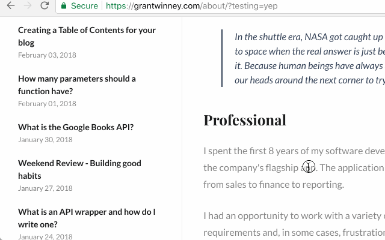

---
categories:
- browser-extension
date: "2018-02-25T21:33:09Z"
description: ""
draft: false
cover:
  image: photo-1563115298-e9585e7943d4.jpg
slug: automatically-adding-links-next-to-all-headers-on-the-page-a-chrome-extension
summary: Ever needed to link directly to one section of a webpage? You can, as long as there's a header (or another element nearby like a div) with an ID assigned to it. Getting the ID isn't tough, but it's a bit of a pain. It doesn't have to be that hard.
tags:
- browser-extension
title: Automatically add links to all headers on a website (a Chrome extension)
---
Ever needed to link directly to one section of a webpage? You can, as long as there's a header (or another element nearby like a div) with an ID assigned to it. The presence of an ID isn't guaranteed for every website, but a lot of personal blogs and technical doc sites use them.

Getting the ID isn't tough, but it's a bit of a pain. You have to view the source code for the page, find the header to get the ID, and then append the ID to the URL before sharing it.

It doesn't have to be that hard.

## A smarter way to link directly to a section

This weekend I wrote an extension for the Chrome browser to make this easier. When you open a webpage, it scans the DOM for headers, and generates a link for each header that has an ID. When you hover over the header, you can see the link and click on it to copy it to your clipboard.

[**Get it from the Chrome webstore**](https://chrome.google.com/webstore/detail/generate-links-for-header/dckfkngmahjdokkkmconmfjdmicjcmgf)**.**

### See it in action

## Random resources and notes

This was a true "programming by stack overflow" experience, as there were a myriad of things I didn't know how to do before writing this. But that's the fun part of writing something like this - you end up learning about things you didn't even know existed!

### Getting the bookmark (chain link) icon

For the icon, I considered using an image first, then thought I'd use a [unicode](http://www.fileformat.info/info/unicode/char/1f517/browsertest.htm) character. But I was concerned the image might be difficult to inject into the page, and that the unicode character might not render correctly on some systems.

I ended up using the same SVG element that GitHub uses for their anchor icon. Here's an interesting article I found while doing research:

[How To Define SVG Content for Reuse — The defs, symbol, And use Elements](http://vanseodesign.com/web-design/svg-definition-reuse/)

### Positioning the icon

I used a few other posts to figure out how to position the icon where I did, making it seem to hover to the left of the header, and hiding it until the user hovers over the header. Gotta give credit where it's due:

- [How to Set a Fixed Width for a Div Element with Display Inline?](https://stackoverflow.com/a/8262470/301857)
- [Using only CSS, show div on hover over \<a>](https://stackoverflow.com/a/27208577/301857)
- [How to affect other elements when a div is hovered](https://stackoverflow.com/a/4502693/301857)

I also made use of [css transitions](https://developer.mozilla.org/en-US/docs/Web/CSS/CSS_Transitions/Using_CSS_transitions) for a nice little fade-in/fade-out effect on the icon, whereas the GitHub icon is either visible or not.

### Linking the icon to the header

I had considered [building the link in javascript](https://stackoverflow.com/a/4772817/301857), which worked, but ultimately I didn't need that level of flexibility so I opted to just hardcode it instead.

As for constructing the URL itself, I found the [location](http://www.javascriptkit.com/jsref/location.shtml) object to be immensely useful. I wasn't sure whether an anchor should come _before_ a querystring or after, so [this was useful](https://stackoverflow.com/a/34772568/301857) - fwiw, the querystring comes _before_ the anchor.

### Copying the link to the clipboard

I had no idea how to copy something to the clipboard, and figured it'd be somewhat restricted because, well, can you imagine if every site could touch your clipboard? I found a great SO post on [how to copy to the clipboard](https://stackoverflow.com/a/33928558/301857), and it was so helpful I [awarded a bounty](https://meta.stackoverflow.com/a/306183/301857) to it.

The [execCommand](https://developer.mozilla.org/en-US/docs/Web/API/Document/execCommand) the thread suggested works on [all modern browsers](https://developer.mozilla.org/en-US/docs/Web/API/Document/execCommand#Browser_compatibility), including Chrome.

After I had the script though, I still had to figure out how to get it into the website - having it in the extension was not good enough. SO to the rescue again, which a helpful post on how to [insert code into the page context](https://stackoverflow.com/a/9517879/301857).

### Miscellaneous

I ended up not using this, but [Window.getComputedStyle()](https://developer.mozilla.org/en-US/docs/Web/API/Window/getComputedStyle) looks extremely helpful if you need it.

> The Window.getComputedStyle() method returns an object that reports the values of all CSS properties of an element after applying active stylesheets and resolving any basic computation those values may contain. Individual CSS property values are accessed through APIs provided by the object or by simply indexing with CSS property names.

## For the future...

It'd be nice to display a small confirmation that the text has been copied, [maybe like this](https://www.w3schools.com/howto/howto_js_snackbar.asp), but I don't think it's necessary.
