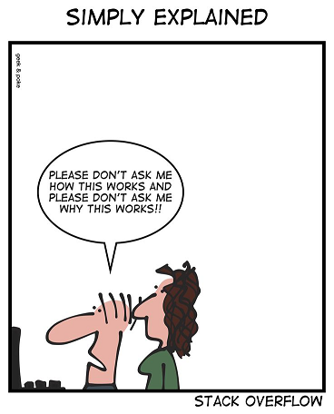

---
categories:
- Reflections
date: "2021-02-03T13:28:48Z"
description: ""
draft: false
cover:
  image: pexels-christina-morillo-1181376.jpg
slug: be-ready-to-explain-your-code
summary: Does the mere thought of explaining your code cause anxiety? Be confident!
  We should all understand what we're writing and why. It's an opportunity (for everyone)
  to learn!
tags:
- reflection
title: Be ready to explain your code
---
When we're programming, there's all kinds of ways to code defensively. We surround blocks of code with "try / catch" structures that prevent our apps from crashing. We log errors, to help track down problems later on. We include tests to help make sure next week's changes don't break last weeks' code. We document our work so that other devs, business, end-users etc will find it when they (or you and me in 6 months!) need to figure out why something works the way it does.

All of these things defend our code against being subpar, riddled with bugs.

But there's another kind of defensive programming that benefits everyone - making sure you understand what you're writing and why you're writing it that way. That doesn't mean you can't lift a snippet from someone else.. there's no need to reinvent the wheel. But whether you invent your own wheel or use someone else's, anyone driving your car down the highway afterwards reasonably assumes you knew how the wheel works.

Imagine someone on your team asking you, genuinely and in the spirit of learning, why'd you write that piece of code that way.. can you explain it to me? What do you tell them?

I've had the benefit several times recently (yes, it's a benefit for both of us) to explain my code to a developer with less experience. Nothing makes me realize gaps in my knowledge, or where things could be written better, than explaining my code to someone else. I'm forced to double-check my assumptions, look up docs to verify things, maybe even realize there was a better way.

Doing regular [code reviews](https://grantwinney.com/what-is-a-code-review/) is a good way to do this, but that's usually an asynchronous process.. sitting with someone and talking it out is even better. If you ever have the opportunity to explain your code to someone else, don't get defensive, but do defend it. You might both learn something!
