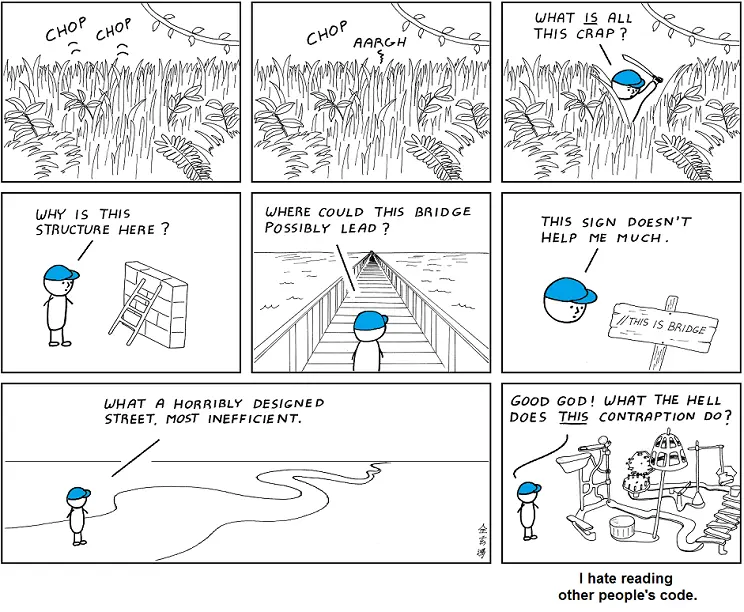

---
categories:
  - Reflections
date: 2022-01-22T22:45:01Z
description: ""
draft: false
cover:
  image:
slug: beware-the-refactor-bug
summary: Refactoring code is part of the dev life, and can even help keep the code healthy, but going too far can do more harm than good. Ever after a decade of writing code, I still have to remind myself from time to time!
tags:
  - refactoring
title: Beware the bite of the refactor bug
---
It's been an interesting couple of weeks. After a break during Christmas, burning through unused PTO, I came back ready to extend some logic in an old screen. In other words, another day in monolithic WinForms paradise.🍹 And then I proceeded to commit one of the cardinal sins of development - rewriting too much at once. Never go full rewrite.

Every time I'm about to update some part of a system, my brain starts playing tug o' war. Part of me wants to touch as little as possible to make things work, while another part wants to make things "better". Better can be dangerously ambiguous, but I figured I had a good reason. Most of the code was tightly coupled to UI elements, the bane of automated testing, so I tried rewriting it using [an MVC pattern](https://grantwinney.com/its-possible-to-test-a-winforms-app-using-mvp/) before adding _more_ code that would just add to the problem. It was only 2000 lines of code after all. What could go wrong?

Bear in mind that the absolute _best case scenario_ after any huge refactor is that everything works _exactly_ as before and goes completely unnoticed by the end-user. While being applauded by your fellow devs, of course. Let's be honest now, we're hoping for a little praise when we make ourselves code martyrs, right? Riiiight..

There's a certain wisdom in touching as little as possible. Imagine a hundred different people working on an (old yet vital) building over the years, applying patches and stopgaps, retaining walls and scaffolding. A piece of coat wire hanger here, and a few mysterious yet deliberately placed nails there. You don't know the reason for them all, and it might be ugly as sin, but there's a reason for each one of them. It's similar with code - just ripping those modifications down and rearranging everything is asking for a world of hurt. Code that's working is, well, working... and every line was added to solve some problem or fix some bug.

There's nothing wrong with leaving things better than you found them though. What works for the boy scouts certainly can work for developers, but there's a middle ground. As a boy scout, we'd pitch in help at the mess hall during summer camp. We did _not_ burn the mess hall to the ground and try to build a better one. I mean, unless they had asked us to. We did appreciate a good bonfire. 🔥

After some time well wasted, I remembered that I was [hired to maintain and extend](https://grantwinney.com/were-all-contractors/) an app, for a particular set of time, as long as it's working for all parties involved. I was not hired to treat the app like my pet project. I [cut my losses](https://grantwinney.com/sunk-costs-timeboxing-asking-for-help/), left the code of yesteryear's developers alone, and just extended the code. I put a few things in the controller where they'd be testable, and made peace with the fact that some things would have to remain in the view.

It wasn't all wasted time though. Most of our work as developers is _not_ in coding, but in _thinking_ about coding. We plan, we discuss, we come to understand what we're building on. Writing code, especially now as a team lead, is maybe 25% of my day after discussions with project managers, planning with the team, noodling it over in my own head, rinse and repeat. Sometimes tearing something down a few times is what it takes to understand how things work. Thank you git revert!
