---
categories:
  - Build
date: 2016-02-06T11:55:48Z
description: ""
draft: false
postimage: pexels-sejio402-29226626.webp
slug: building-a-4-stroke-internal-combustion-engine-with-the-smithsonian-motor-works-model
summary: Last summer, I found this “Smithsonian Motor-Works” set at a garage sale. Once built, it models a 4-stroke internal combustion engine. I’d shelved it for a rainy day and rediscovered it last weekend while cleaning the basement. Time for a little father/son bonding!
tags:
  - stem
title: Building the model 4-stroke combustion engine from Smithsonian
---
Garage sales are great for finding random, interesting things to do with the kids, usually for dirt cheap. Last summer, I found this “Smithsonian Motor-Works” set for $5, which I figured was a steal. Once built, it’s supposed to model a 4-stroke internal combustion engine.

I’d shelved it for a rainy day and completely forgotten about it, then rediscovered it last weekend during an overdue cleaning session in the basement. The girls were at a play and the toddler was napping, so it was the perfect time for a little father/son bonding over a cool project.

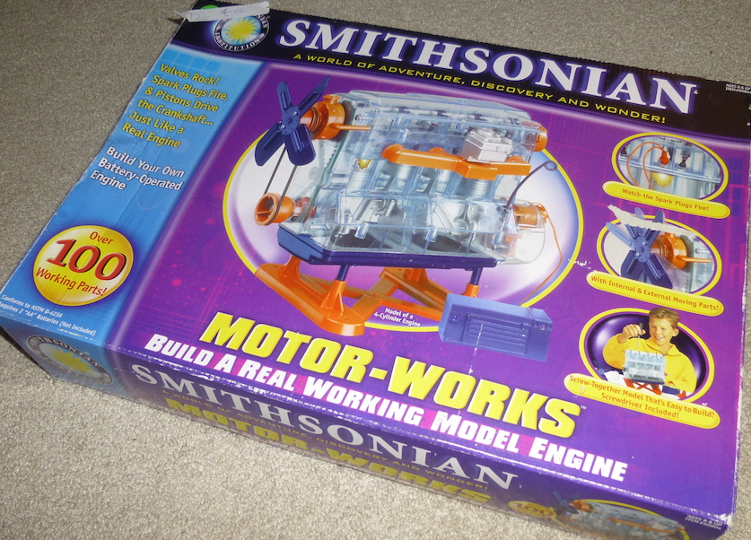

The concept is awesome, but the materials are not. I wouldn’t recommend ever buying this at full price. [Amazon ratings are abysmal](http://www.amazon.com/NSI-90805-Smithsonian-Motor-Works/dp/B000246MNS), mostly because of thin/cheap/missing parts. The Smithsonian is a respected name, but obviously partnered with the wrong manufacturer. I’d be hesitant to buy another similar toy with their label on it.

Enough of that.. if you've got one and you're feeling intrepid, read on! Hopefully I can help you avoid a few issues. Read through the Amazon reviews too. Plenty of helpful suggestions in there before you get started.

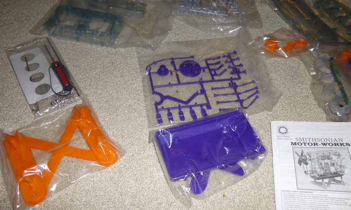

It wasn’t an overly difficult model, and we lucked out. Our set had all the right pieces in the right quantities, not something you should even have to worry about. :p

It was mostly screwing everything together in the right order… lots and _lots and_ _**lots**_ of tiny screws. The cheap kind with the heads that strip while you’re screwing them in.

My son would start the screws, then I’d finish them up. That worked out well, since it was tough to apply enough force to _not_ strip the head, while applying the minimal force necessary so the plastic didn’t crack (which almost happened a few times). There were about 60 screws in the set, and only 2 left over, so no room for error.

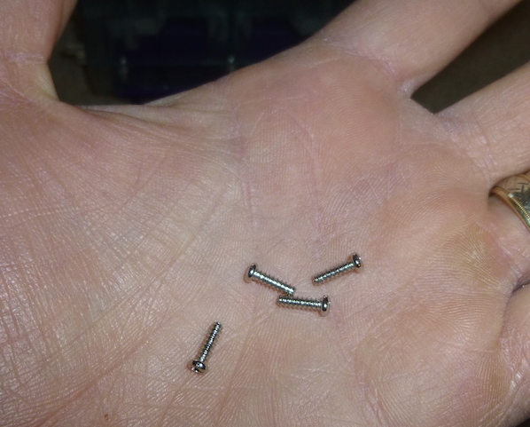

One of the most common complaints was misaligned holes. It happened to us when we inserted the valve into the cylinder head, seen below on the lower-right. The upper hole didn’t quite line up with the lower, so the valve (purple pin) would stick instead of springing back. The valves need to slide back and forth (open and close) freely.

The plastic is thin and malleable (not really a good thing… cheap “feel”), so applying some pressure to it for a few minutes was enough to bend it back to the right position and make it stay.

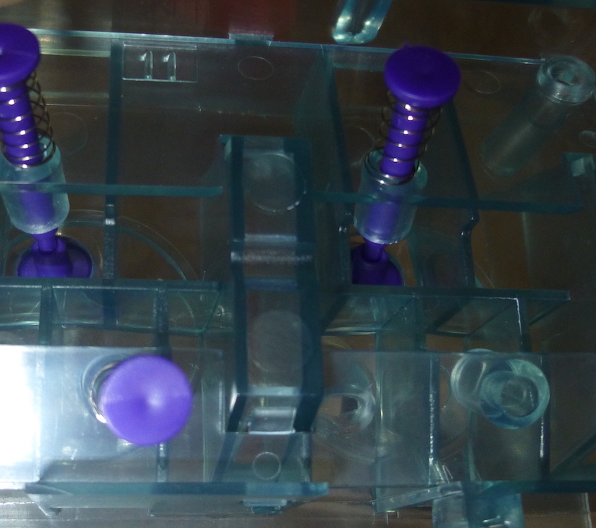

The instructions were decent for the most part, but the diagrams could’ve used some work. Here’s one that shows the camshaft with the cams lined up a certain way. There are indicator lines on the cams to indicate which way they should be installed. That’s helpful.

Unfortunately, half of them aren’t visible in the diagram due to the orientation of the sketch. Not so helpful, as you end up guessing which way half of them should go, and hoping they line up correctly with the valves, so they’ll open and close them.

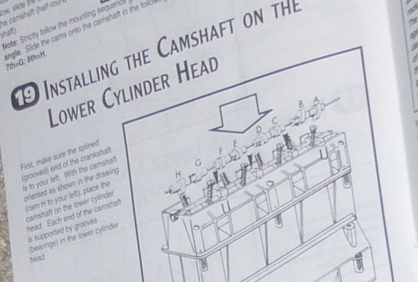

Here’s the camshaft, oriented just like the diagram.

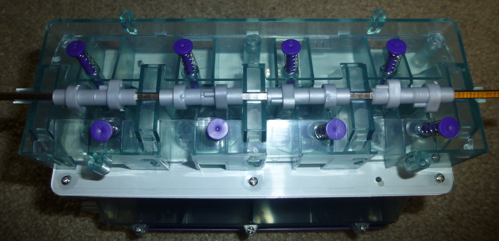

Here it is again, rotated 180º so you can see the indicators on the other side. Even an inset inside the larger image would’ve helped. Not that it’s a huge deal if you have to fix it, but every time you have to remove the screws you risk stripping them out.

For the most part though, it went well. My daughter jumped in when the girls got home. Here we are, attaching the cylinder block to the lower crank case, after assembling the crankshaft and piston assemblies, and then later installing a cover over the timing belt and pulley, attaching the cylinder block to the crank case, and installing a cover over the timing belt.

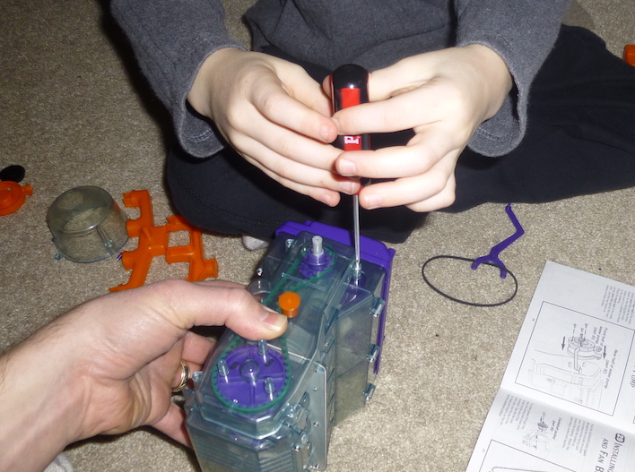

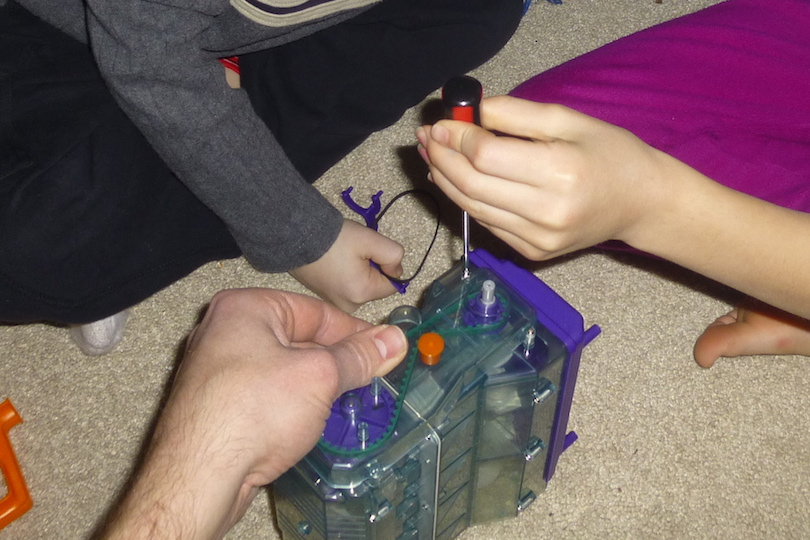

Here’s the motor, battery compartment and spark plug lights. I thought the headphone jacks were a nice touch, until we ran into another quality issue.

The plastic shielding on one of the jacks literally fell apart in my hand. It just crumbled. The black part by my hand ended up splitting into several pieces too. I managed to glue it back together and then wrap it in electrical tape. The toy’s not _that_ old, and even if it were left somewhere really cold, _nothing else on the toy was remotely brittle_, not even the other jack. Sigh.

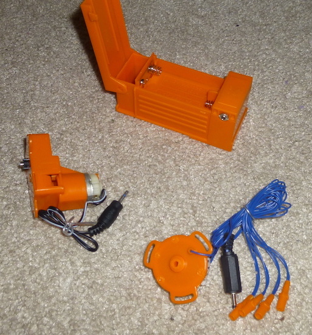

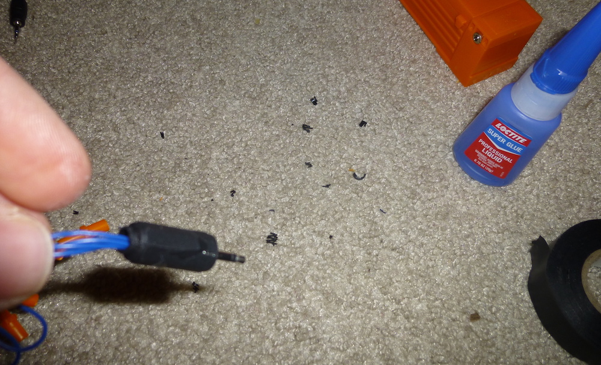

A few hours in, and we were getting pretty close to finishing it up. The manual has you do some final calibration to make sure parts are lined up correctly, so the “spark plugs” will light up when the pistons are in the correct positions.

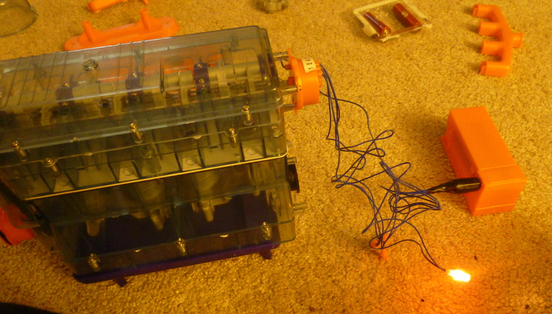

I mounted the finished product – engine and battery compartment – to a spare piece of wood for easier transport.

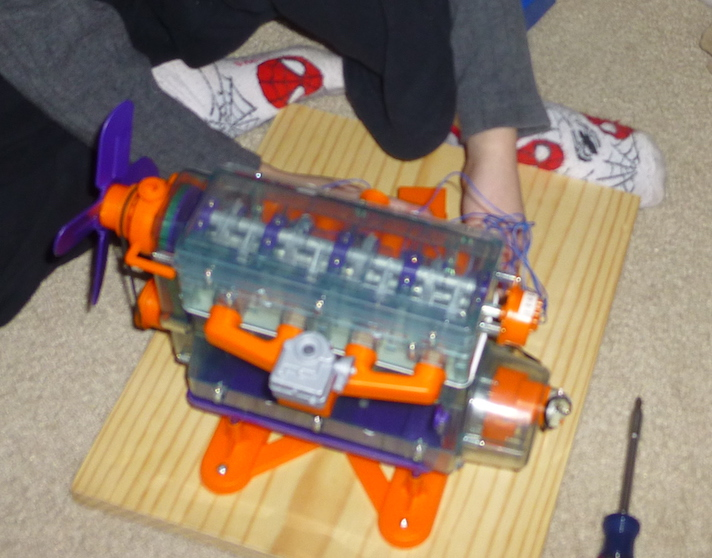

When my parents came over the next day (I was at work), grandpa took the time to explain to the kids how it all worked, which was awesome. He’s been a car enthusiast for a long time, so I think he enjoyed seeing it and getting to teach his grandson about it too.

There’s a half-dozen pages dedicated to how it all works in the manual, which goes great with the model. You absolutely cannot help reading it without thinking, how in the world did we ever get this to work?! Your car is literally _exploding_ gasoline (in very small amounts) 50x a second!

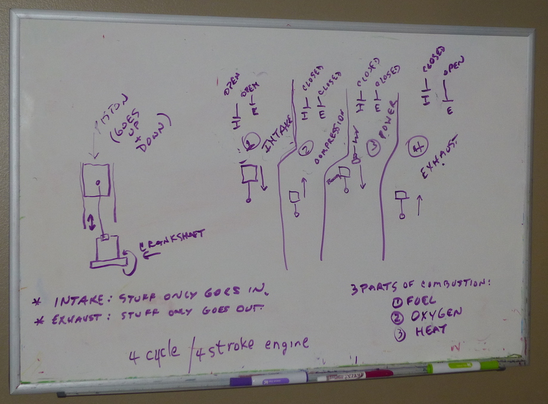

Nearly every day since we made it, one of my kids fires it up and watches it go. Unfortunately, they didn’t include an on/off switch, and they keep forgetting to remove the batteries. You’re supposed to unplug the jacks when you’re done, but since the one crumbled I had to glue it to the side of the battery compartment. We’ve gone through more batteries than usual this week. :)

[Here’s a short video of the finished product](https://res.cloudinary.com/dxm4riq52/video/upload/q_auto/v1583296635/The_Smithsonian_Motor-Works_Model_Finished_Product_rnnqlm.mp4). Sounds like a washing machine, but everything works! You can see the pistons moving up and down, and the spark plugs firing when the pistons are near the top (end of the compression cycle).

Have you ever put anything together like this? Do you know of any better models than what the Smithsonian produced?

You can find all kinds of animations on YouTube about [how a 4-stroke engine works](https://www.youtube.com/results?search_query=4+stroke+engine&page=&utm_source=opensearch).
