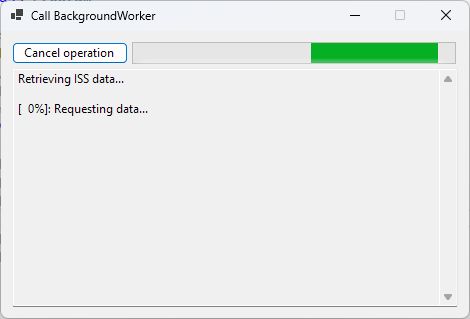
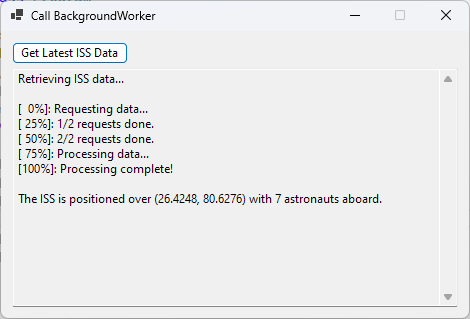
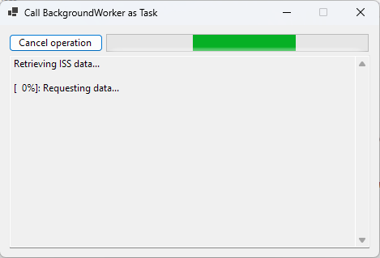
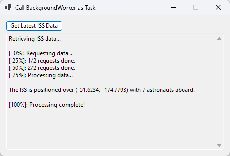

---
categories:
  - Coding
date: 2022-12-06T00:20:13Z
description: ""
draft: false
cover:
  image:
slug: convert-backgroundworker-to-task-with-taskcompletionsource
summary: Sometimes the safer way to "update" old code is to leave it be and paint over it with a newer construct. Let's see how to modernize a BackgroundWorker using Tasks and TaskCompletionSource.
tags:
  - async
  - surviving-winforms
title: Converting a BackgroundWorker to a Task with TaskCompletionSource
---
The reality about working with an application that's years - maybe even decades - old is that we don't have the time or resources to rewrite everything to be modern, nor would that be wise. Every legacy app, and the different areas within it, represents ideas and business functions that a company has paid dozens or hundreds of employees millions of dollars for, over the course of many years.

It's a good feeling getting to overhaul something when the opportunity arises, but "modern" is a moving target and certain areas of the code will chug along for years, happily unaware it lives in the dark ages.

Even when we can't change code, though, it's always possible to hide it without having to replace the old code right away.. or at all, if it's in some codebase you don't have access to. Take the [BackgroundWorker](https://learn.microsoft.com/en-us/dotnet/api/system.componentmodel.backgroundworker?view=netframework-2.0) for example, which has been around since 2005 (.NET 2.0). It has methods for safely sending progress updates to the UI, cancelling it before completion, and setting the result when it finally _does_ complete. 10 years ago, it was a great way to toss some piece of work to a separate thread.

Now, of course, there's [async/await and Tasks](https://grantwinney.com/using-async-await-and-task-to-keep-the-winforms-ui-more-responsive).

When I wrote about Tasks before, I considered how you might turn a bunch of synchronous code into async code, but what if the code is _already_ asynchronous? What if you just want to modernize it, like effectively turning a BackgroundWorker into a Task? [TaskCompletionSource](https://learn.microsoft.com/en-us/dotnet/api/system.threading.tasks.taskcompletionsource-1) to the rescue!

> The code in this article is available on [GitHub](https://github.com/grantwinney/Surviving-WinForms/tree/master/Threading/TaskCompletion), if you'd like to use it in your own projects or just follow along while you read.

_Assuming you can, I'd suggest cloning the repo and opening it in VS 2022 or later to follow along. To test both examples I describe below, open the Program.cs file and comment one "Application.Run" line out or the other._

## Sample legacy class with BackgroundWorker

Let's start with a class that lives in some legacy library, the source code of which we'll pretend we don't have access to..... even though it's right in the repo. It uses a BackgroundWorker to call out to [a space API](https://grantwinney.com/what-is-iss-notify-api) and return some data about the ISS. I picked this particular API because it's dead simple to use and requires no authentication.

Before you get too excited about the code below, I targeted this "legacy" library for .NET 2.0 (when the BackgroundWorker was introduced), so everything else had to work within those constraints too. That meant relying on [WebRequest](https://learn.microsoft.com/en-us/dotnet/api/system.net.webrequest?view=netframework-2.0) instead of [RestSharp](https://restsharp.dev/), and [covariance](https://learn.microsoft.com/en-us/dotnet/csharp/programming-guide/concepts/covariance-contravariance/) in the form of `List<object>` instead of a [Tuple](https://learn.microsoft.com/en-us/dotnet/csharp/language-reference/builtin-types/value-tuples). Fortunately, [Json.NET](https://www.newtonsoft.com/json) supports .NET 2.0, so at least deserialization of the response was easy.

```csharp
public class OldSpaceLibrary
{
    public readonly BackgroundWorker Worker = new BackgroundWorker { WorkerReportsProgress = true, WorkerSupportsCancellation = true };

    public ISSLocation ISSLocation { get; private set; }
    public ISSAstronauts ISSAstronauts { get; private set; }

    public OldSpaceLibrary()
    {
        Worker.DoWork += Worker_DoWork;
        Worker.RunWorkerCompleted += Worker_RunWorkerCompleted;
    }

    public void GetData()
    {
        if (Worker.IsBusy)
            return;

        ISSLocation = null;
        ISSAstronauts = null;

        Worker.RunWorkerAsync();
    }

    private void Worker_DoWork(object sender, DoWorkEventArgs e)
    {
        Worker.ReportProgress(0, "Requesting data...");
          
        Thread.Sleep(2000);   
        if (Worker.CancellationPending)
        {
            e.Cancel = true;
            return;
        }

        var issLocation = JsonConvert.DeserializeObject<ISSLocation>(
            GetDataAsString("http://api.open-notify.org/iss-now.json"));
        Worker.ReportProgress(25, "1/2 requests done.");

        Thread.Sleep(2000);
        if (Worker.CancellationPending)
        {
            e.Cancel = true;
            return;
        }

        var issAstronauts = JsonConvert.DeserializeObject<ISSAstronauts>(
            GetDataAsString("http://api.open-notify.org/astros.json"));
        issAstronauts.People.RemoveAll(x => x.Craft != "ISS");
        Worker.ReportProgress(50, "2/2 requests done.");
        Worker.ReportProgress(75, "Processing data...");

        Thread.Sleep(2000);
        if (Worker.CancellationPending)
        {
            e.Cancel = true;
            return;
        }

        Worker.ReportProgress(100, "Processing complete!");

        e.Result = new List<object> { issLocation, issAstronauts };
    }

    private string GetDataAsString(string endpoint)
    {
        var request = WebRequest.Create(endpoint);
        using (var response = (HttpWebResponse)request.GetResponse())
        using (var dataStream = response.GetResponseStream())
        using (var reader = new StreamReader(dataStream))
            return reader.ReadToEnd();
    }

    private void Worker_RunWorkerCompleted(object sender, RunWorkerCompletedEventArgs e)
    {
        if (!e.Cancelled && e.Error == null)
        {
            var data = (List<object>)e.Result;
            ISSLocation = (ISSLocation)data[0];
            ISSAstronauts = (ISSAstronauts)data[1];
        }
    }
}
```

I think, if you're familiar with BackgroundWorker, most of the above should be pretty straight-forward. The `GetData` method is the entry point for whatever's calling this class. It starts the BackgroundWorker, where the main work happens in the `DoWork` method on a different thread, periodically sending updates to the UI with `ReportProgress` and eventually returning a result, which is picked up by the `RunWorkerCompleted` method. There's code to check the `CancellationPending` flag occasionally too, to see if the worker thread should be terminated early.

There's some things that are goofy in this "legacy" class that hopefully wouldn't happen in real life, but I'm just trying to make a point here, not a masterpiece of engineering, lol.

## Approach #1: Using the BackgroundWorker as-is

One approach to using the above is to just call it as-is, subscribing to the `ProgressChanged` and `RunWorkerCompleted` events. I'm using the `GetData` button below for two things - to start the worker, and to cancel it if they click the button a second time (by calling `CancelAsync` ).

Note: Even if the worker is cancelled or throws an exception, you'll always end up in the `RunWorkerCompleted` event back on the main thread, so that's where I'm checking all the different conditions.

```csharp
/// <summary>
/// Using the BackgroundWorker as provided in the "legacy space library" class.
/// </summary>
public partial class frmCallBackgroundWorker : Form
{
    private readonly OldSpaceLibrary oldSpaceLibrary = new();

    public frmCallBackgroundWorker()
    {
        InitializeComponent();

        oldSpaceLibrary.Worker.ProgressChanged += Worker_ProgressChanged;
        oldSpaceLibrary.Worker.RunWorkerCompleted += Worker_RunWorkerCompleted;
    }

    private void btnGetData_Click(object sender, EventArgs e)
    {
        if (oldSpaceLibrary.Worker.IsBusy)
        {
            oldSpaceLibrary.Worker.CancelAsync();
            btnGetData.Enabled = false;
            return;
        }

        btnGetData.Text = "Cancel operation";
        prgStatus.Value = 0;
        prgStatus.Show();
        txtStatus.Text = "Retrieving ISS data...\r\n\r\n";

        oldSpaceLibrary.GetData();
    }

    private void Worker_ProgressChanged(object sender, System.ComponentModel.ProgressChangedEventArgs e)
    {
        txtStatus.AppendText($"[{e.ProgressPercentage,3}%]: {e.UserState}\r\n");
        prgStatus.Value = e.ProgressPercentage;
    }

    private void Worker_RunWorkerCompleted(object sender, System.ComponentModel.RunWorkerCompletedEventArgs e)
    {
        if (e.Error != null)
            txtStatus.AppendText($"Failed: {e.Error.Message}");
        else if (e.Cancelled)
            txtStatus.AppendText("Cancelled!");
        else
        {
            var location = oldSpaceLibrary.ISSLocation.Position;
            var astronauts = oldSpaceLibrary.ISSAstronauts.People;
            txtStatus.AppendText($"\r\nThe ISS is positioned over ({location.Latitude}, {location.Longitude}) with {astronauts.Count} astronauts aboard.");
        }

        btnGetData.Text = "Get Latest ISS Data";
        btnGetData.Enabled = true;
        prgStatus.Hide();
    }
}
```

If things run successfully, the user gets a nice message using the data returned from the two API calls.





## Approach #2: Wrapping the BackgroundWorker in a Task

As I said earlier, there's a class called [TaskCompletionSource](https://learn.microsoft.com/en-us/dotnet/api/system.threading.tasks.taskcompletionsource-1) that allows us to take something that's already async and make it appear to the outside world as if it were a Task all along, hiding the details.

First, let's create a class (called SpaceTask) that turns the BackgroundWorker into a Task. It subscribes to the `RunWorkerCompleted` method and handles the same conditions as before (error, cancelled, success) but now it calls specific methods on the TaskCompletionSource instead of just updating the UI directly. If an exception is thrown, it sets an exception on the task. If the worker is cancelled, it marks the task as cancelled too.

The caller still just calls `GetData`, but instead of having to subscribe to other events to get the final result, they get a Task instead (the last line below). I added a couple properties to help the caller determine if the Task is still running and get updates on the progress of the task (using the aptly named [Progress](https://learn.microsoft.com/en-us/dotnet/api/system.progress-1) class).

```csharp
/// <summary>
/// Wrapping the BackgroundWorker in a Task, to hide the implementation details of the BGW
/// </summary>
public class SpaceTask
{
    private TaskCompletionSource<Tuple<ISSLocation, ISSAstronauts>> tcs = new();
    private readonly OldSpaceLibrary oldSpaceLibrary = new();

    public bool IsRunning { get; private set; }

    public void CancelTask()
    {
        oldSpaceLibrary.Worker.CancelAsync();
    }

    public Task<Tuple<ISSLocation, ISSAstronauts>> GetData(IProgress<string> progress = null)
    {
        if (IsRunning)
            throw new Exception("Task is already running. Please wait until it's complete.");

        IsRunning = true;

        oldSpaceLibrary.Worker.ProgressChanged += (s, e) =>
        {
            progress?.Report($"[{e.ProgressPercentage,3}%]: {e.UserState}");
        };

        oldSpaceLibrary.Worker.RunWorkerCompleted += (s, e) =>
        {
            if (e.Error != null)
                tcs.SetException(e.Error);
            else if (e.Cancelled)
                tcs.SetCanceled();
            else
                tcs.SetResult(Tuple.Create(oldSpaceLibrary.ISSLocation, oldSpaceLibrary.ISSAstronauts));

            IsRunning = false;
        };

        oldSpaceLibrary.GetData();

        return tcs.Task;
    }
}
```

And here's how we might call the new SpaceTask class from anywhere in the application that's interested in ISS data. There's nothing in the code below that suggests we're still dealing with a BackgroundWorker. For all intents and purposes, it's just a Task. The underlying details are hidden by the `SpaceTask` class, nothing to see here, _thankyouverymuch_.

If someone's interested in updates, they can create a new `Progress<T>` handler (like I'm doing below) and pass that to the other class. One of the interesting differences with Tasks is that cancellations and exceptions are handled more inline.. they don't require subscribing to additional events like the BackgroundWorker. If the Task is cancelled it throws a TaskCanceledException, if there's an error it throws that instead, and both can be caught and handled like I'm doing below.

```csharp
SpaceTask task;

private async void btnGetData_Click(object sender, EventArgs e)
{
    if (task?.IsRunning ?? false)
    {
        task.CancelTask();
        btnGetData.Enabled = false;
        return;
    }

    btnGetData.Text = "Cancel operation";
    prgStatus.Value = 0;
    prgStatus.Show();
    txtStatus.Text = "Retrieving ISS data...\r\n\r\n";

    try
    {
        var progressHandler = new Progress<string>(statusUpdate =>
        {
            txtStatus.AppendText($"{statusUpdate}\r\n");
        });

        task = new();

        var data = await task.GetData(progressHandler);

        var location = data.Item1.Position;
        var astronauts = data.Item2.People;
        txtStatus.AppendText($"\r\nThe ISS is positioned over ({location.Latitude}, {location.Longitude}) with {astronauts.Count} astronauts aboard.\r\n\r\n");
    }
    catch (TaskCanceledException)
    {
        txtStatus.AppendText("Cancelled!");
    }
    catch (Exception ex)
    {
        txtStatus.AppendText($"Failed: {ex.Message}");
    }

    btnGetData.Text = "Get Latest ISS Data (task)";
    btnGetData.Enabled = true;
    prgStatus.Hide();
}
```






[Grab the example from GitHub](https://github.com/grantwinney/Surviving-WinForms/tree/master/Threading/TaskCompletion) and try it out yourself. Good luck!

If you just can't get enough of backgroundworkers and tasks, and comparisons between them, this series of posts by Stephen Cleary are still valid (even if they're a little dated). _(You'll see his name all over the place on stackoverflow, answering everyone's questions about threading in C#.)_

[Task.Run vs BackgroundWorker: Intro](https://blog.stephencleary.com/2013/05/taskrun-vs-backgroundworker-intro.html)

And here's a post from MS on their recommended async design pattern:
[Task-based Async Pattern (TAP): Introduction and overview | Microsoft Learn](https://learn.microsoft.com/en-us/dotnet/standard/asynchronous-programming-patterns/task-based-asynchronous-pattern-tap)
