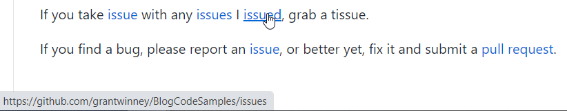
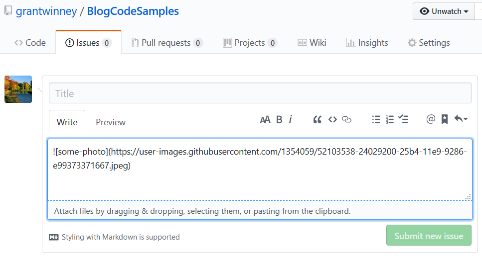
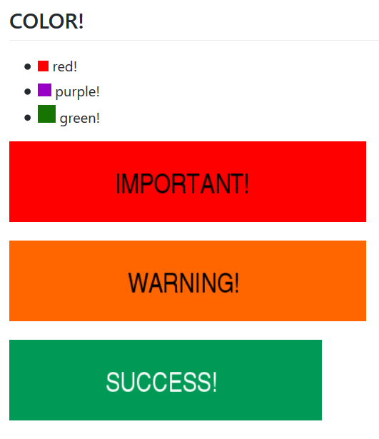

---
categories:
- GitHub
date: "2019-02-06T11:54:00Z"
description: ""
draft: false
cover:
  image: magic-github.jpg
slug: cool-markdown-tricks-for-github
summary: Here's a few tricks for rendering markdown in GitHub that most people wouldn't
  know about. Oh, and they work for new Issues, Pull Requests, and in the Wiki too!
tags:
- GitHub
title: 5 Markdown Tricks for GitHub
---
If you frequently use GitHub, then you know any directory with a Readme markdown file in it automagically displays it, making it a convenient place to let visitors know helpful information about a project... about setting it up, how to contact the author, where to turn for help, etc.

But there are some little tricks you can take advantage of too, which most people wouldn't know about. Here's my top 5. These tricks work in any markdown file, including new Issues, Pull Requests, and in the Wiki.

---

## Create Reusable Links

The normal way to create a link using markdown is this:

```none
[This is your link text](http://example.com/)
```

But what if you have a long Readme file or wiki page, and the same link is used in multiple places?

```none
If you take [issue](http://example.com/) with any [issues](http://example.com/)
I [issued](http://example.com/), grab a tissue.
```

To make updates easier (not to mention, keeping things [DRY](https://en.wikipedia.org/wiki/Don't_repeat_yourself)), you can create a list of links at the bottom of the file, and reference them in multiple places by name. The list won't render on the page, so visitors won't even know it's there, and it makes one convenient place to do updates.

```none
If you take [issue][issues] with any [issues][issues]
I [issued][issues], grab a tissue.

If you find a bug, please report an [issue][issues], or better yet,
fix it and submit a [pull request][pulls].

  [issues]:    https://github.com/grantwinney/BlogCodeSamples/issues
  [pulls]:     https://github.com/grantwinney/BlogCodeSamples/pulls
```



You can use the same technique with images too!

```none
[example]: https://user-images.githubusercontent.com/image-4.png "example image"

![example]

lorem ipsum whatever lorem ipsum whatever lorem ipsum whatever 

![example]
```

---

## Add Hidden Comments

If you want to add a comment to your markdown file on GitHub - something to note but that shouldn't render when the page is viewed - here's a little hack that takes advantage of the same "[link](https://daringfireball.net/projects/markdown/syntax#link)" syntax used in the previous example. _(The double-slash is the link id, the hash is the URL, and the comment in parenthesis is the link title.)_

```
[//]: # (This comment won't be rendered to the visitor!)
```

You can add these to anything that accepts a link label, wherever you find them useful - maybe in a [Pull Request template](https://help.github.com/articles/creating-a-pull-request-template-for-your-repository/) to give contributors instructions that won't render when the PR is submitted, or near a confusing part of a wiki page so the next person who tries to edit it sees a brief explanation before submitting their change.

---

## Quickly Insert Images

Although the Wiki has a button that lets you upload images to it, and the Issues page lets you drag and drop images, the interface in the main repo has no such button. You can (ab)use the Issues page though, to avoid the pain of having to upload images into your repo... which keeps the size of your repo down too.

Just create a new issue and drag your image into the editor pane. It'll upload it and generate a unique URL for you. Don't even bother saving the issue... just copy the markdown it generates and drop it into your Readme.



The only caveat is that it's not under source control, but I can't really see that being an issue. I've never had a need to keep revisions of images, but if you do then this may not be the tip for you.

---

## Resize Images

But what if you get your image inserted and it's obnoxiously huge? You can't resize an image using markdown.

Well, GitHub doesn't support _all_ HTML tags - for example the `style` tag - but it _does_ support a subset. You can [check out their filter](https://github.com/jch/html-pipeline/blob/master/lib/html/pipeline/sanitization_filter.rb#L38-L107) for yourself, but here's the list of tags they support:

```
h1 h2 h3 h4 h5 h6 h7 h8 br b i strong em a pre code img tt div ins del
sup sub p ol ul table thead tbody tfoot blockquote dl dt dd kbd q samp
var hr ruby rt rp li tr td th s strike summary details caption figure
figcaption abbr bdo cite dfn mark small span time wbr
```

The `img` tag is in the list, so just switch to standard HTML to resize it. It even supports other attributes, allowing things like word wrapping.

```html

```

---

## Add Some Color to Your Life

You can't color your text using markdown, but you _can_ use an image placeholder service like [placeholder.com](https://placeholder.com/) to create some useful effects that make sections of your Readme file, etc stand out.

```markdown
## COLOR!

-  red!
-  purple!
-  green!


```

The above markdown is rendered like this:



---

**What else?**

I was hoping to find some trick for generating a table of contents, but alas after [years of ongoing discussion](https://github.com/isaacs/github/issues/215)... nada. There are other solutions like [github-markdown-toc](https://github.com/ekalinin/github-markdown-toc) and the [Github Markdown Outline](https://chrome.google.com/webstore/detail/github-markdown-outline-e/gccinjjdbfdkkkebfbeipopijjfohfgj) chrome extension, but nothing native. Who knows though... maybe since [Microsoft bought GitHub](https://itsfoss.com/microsoft-github/) and is [actively adding features](https://dzone.com/articles/github-roadmap-better-for-everyone), we'll see more features built-in.

If you find any cool tricks of your own, I'd love to know about them! Share below...
