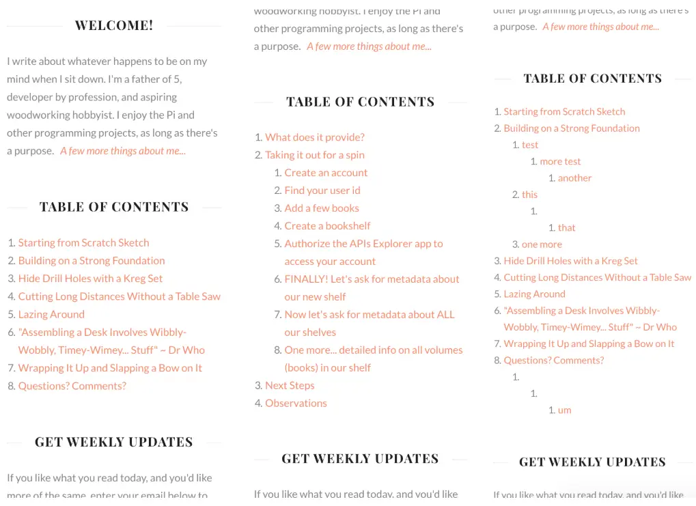
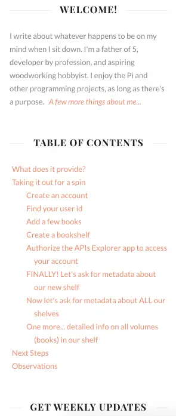

---
categories:
  - Coding
date: 2018-02-03T14:08:21Z
description: ""
draft: false
slug: creating-a-table-of-contents-for-your-blog
summary: A table of contents is convenient for visitors, so I wrote a script to generate one for any blog automatically!
tags:
  - ghost-blog
title: Creating a table of contents for your blog
---
I wrote about [5 quick hacks for your Ghost theme](https://grantwinney.com/5-quick-hacks-for-your-ghost-theme) last year, after switching to Ghost as a blogging platform. The last hack I mentioned was generating a "table of contents" using a handlebars script I'd found. Ghost was still considered beta at the time, and when 1.0 was released, the script stopped working correctly. I never bothered going back to figure out why.

A table of contents is nice to have though, and convenient for your visitors, so I wrote a new script that should work for any html page (with minor adjustments). Here it is in entirety, or [check GitHub for the latest version](https://github.com/grantwinney/table-of-contents-for-html-page).

```javascript
/*
 * For displaying a table of contents - pass the entire document (DOM) to getTocMarkup
 */

function getHeaderLevel(header) {
    return Number(header.nodeName.slice(-1));
}

function createTocMarkup(headers) {
    var prevLevel = 1;
    var output = "";

    headers.forEach(function(h) {
        var currLevel = getHeaderLevel(h);
        if (currLevel > prevLevel) {
            var ranOnce = false;
            while (currLevel > prevLevel) {
                if (ranOnce) {
                    output += "&nbsp;";
                }
                output += "<ol style=\"margin-bottom:0px\"><li>";
                prevLevel += 1;
                ranOnce = true;
            }
        } else if (currLevel == prevLevel) {
            output += "</li><li>";
        } else if (currLevel < prevLevel) {
            while (currLevel < prevLevel) {
                output += "</li></ol>";
                prevLevel -= 1;
            }
            output += "<li>";
        }

        output += `<a href="#${h.id}">${h.innerText}</a>`;
    });

    if (output != "") {
        // Change 2 to the max header level you want in the TOC; in my case, H2
        while (prevLevel >= 2) {
            output += "</li></ol>";
            prevLevel -= 1;
        }
        output = `<h2 class="widget-title">Table of Contents</h2>${output}`;
    }

    return output;
}

function getTocMarkup(document) {
    // I was only interested in the headers within the element that had the .post-content class,
    // which is specific to the Ghost blog. If you're using this elsewhere, or are interested in
    // the entire document, delete this line and use document.querySelectorAll(...) on the next line.
    var body = document.getElementsByClassName('post-content')[0];
    
    // Add or remove header tags you do (or don't) want to include in the TOC
    var headers = body.querySelectorAll('h2, h3, h4, h5, h6');

    // Change the number to 1 if you want headers no matter what.
    // Or if you want at least 3 headers before generating a TOC, change it to 3.
    if (headers.length >= 2) {
        return createTocMarkup(headers);
    } else {
        return "";
    }
}
```

And a sample of the HTML it generates, using this post as an example:

```html
<h2 class="title bordered uppercase">Table of Contents</h2>
<div style="margin-left:15px; margin-bottom:20px">
    <ol style="list-style-type:disc; margin-left:10px">
        <li><a href="#general-usage">General Usage</a></li>
        <li><a href="#usage-in-ghost">Usage in Ghost</a>
            <ol style="list-style-type:disc; margin-left:20px">
                <li><a href="#wildbird">Wildbird</a></li>
                <li><a href="#casper">Casper</a></li>
            </ol>
        </li>
        <li><a href="#snapshots">Snapshots</a></li>
        <li><a href="#other-implementations">Other Implementations</a></li>
    </ol>
</div>
<hr>
```

## General Usage

Just call the function and write the return value out to the page.

```html
<script type="text/javascript">
    document.write(getTocMarkup(document));
</script>
```

## Usage in Ghost

Here's how I've got it displayed in the side bar in Ghost.

1. Copy the above script into a file named `toc.js`, and drop the file into the `assets/js` directory.
2. Reference the file from `default.hbs`, somewhere between the `<head></head>` tags so it's available as the page loads.  
    `<script type="text/javascript" src="{{asset "js/toc.js"}}"></script>`
3. Call it from wherever you want to display it.

### Wildbird

To get it to work with the Wildbird theme specifically, I modified the `sidebar.hbs` file so that, if the current page is a "post", it'll insert a new section containing a table of contents.

```html
{{!-- Table of Contents --}}
{{#is "post"}}
<section class="widget widget-text">
    <script type="text/javascript">
        document.write(getTocMarkup(document));
    </script>
</section><!-- .widget -->
{{/is}}
```

### Casper

If you want it to work with the Casper theme, you'll need to make a couple changes.

- First, change this line in the `toc.js` script, so that `post-content` is `post-full-content`, since that's the name of the class on the element that contains the body of your post.
- Second, you'll have to update the `post.hbs` file directly, since there's no `sidebar.hbs` file like in the Wildbird theme. Look for the section that starts with `<section class="post-full-content">`. After that markup, setup an empty div where you'd like to display the table of contents. Leave `{{content}}` since that displays the body of your post. Now you can pass the document to the `toc.js` script and set the results to the div you just created. That has the effect of inserting the TOC at the top of your post, right after the image (if any).

```html
<div id="toc"></div>

{{content}}

{{!-- Table of Contents --}}
<script type="text/javascript">
    var toc = document.getElementById('toc');
    toc.innerHTML = getTocMarkup(document);
</script>
```

---

## Snapshots

Here's how it looks when rendered, showing a single level of headers, two levels, and multiple levels, respectively. It handles omitted headers, like going right from `<H2>` to `<H5>`, but uh.. it could be better. Heh.



While you're at it, you could create a `<div id="toc"></div` element or similar, and generate your TOC inside of that. Then use CSS styling to your heart's content. Here's what it looks like without numbers, and indenting on linewrap. If you're using Ghost, you could even put the CSS in the "code injection" section of the admin panel.



## Other Implementations

I'm happy with my solution, but it requires modifying your theme files directly, which isn't the most user-friendly thing. If you'd like to see this solution re-implemented so you can paste it into the blog footer with Ghost's _"code injection"_ section, check out László's blog post, [A jQuery Table of Contents for your Ghost Blog Entries](https://kb.zensoft.hu/toc-for-your-blog/).
