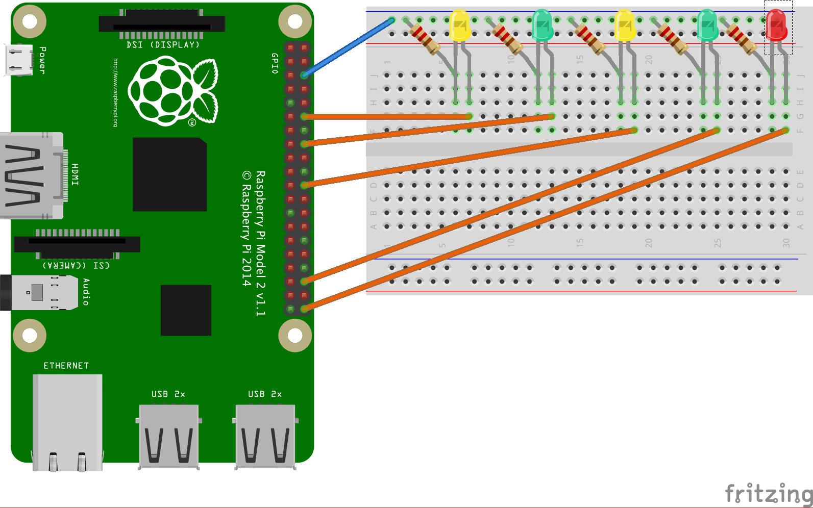

---
categories:
- Raspberry PI
- Sonic Pi
- Coding
date: "2016-06-21T13:02:00Z"
description: ""
draft: false
cover:
  image: photo-1500702790369-fe461685b3c8.jpg
slug: creating-music-with-sonic-pi-on-raspberry-pi
summary: After watching Scott Fradkin live-code Sonic Pi for an hour at a conference,
  it inspired me to make a little music of my own.
tags:
- Raspberry PI
- Sonic Pi
- Coding
title: Creating Music with Sonic Pi on a Raspberry Pi
aliases:
- /creating-music-with-sonic-pi-on-the-raspberry-pi
---
Back in May, at the [Stir Trek conference](http://stirtrek.com/) in Columbus OH, I got to watch Scott Fradkin live-code using Sonic Pi for nearly an hour, not only explaining what it was capable of, but showing it too.

He kept building it up as the session went on, and everyone in the room had a chance to see _and_ hear what he was creating. By the end of the session, he had a good beat going! If you want to see the script he used, it's on [GitHub](https://github.com/sfradkin/presentations/tree/master/sonic-pi-programming-fun-profit).

If you've never heard of it before though, you're probably wondering.. what _is_ Sonic Pi?

## What is Sonic Pi?

[Sonic Pi](http://sonic-pi.net/) is an environment for programming sounds, where one can learn about music and coding at the same time. [Sam Aaron](https://linktr.ee/samaaron) started on it to help students in the UK learn computer programming:

> Sonic Pi encourages you to learn about both computing and music through play and experimentation. The most important thing is that you’re having fun, and before you know it you’ll have accidentally learned how to code, compose and perform.  
> _–_ Sam Aaron_, “Welcome to Sonic Pi” tutorial_

It's written in a way that's very forgiving to newcomers, using a Ruby-like syntax that reads more like English and is more forgiving with formatting than other languages.

### Installing

Everything you need to get started is on the [sonic-pi](https://sonic-pi.net/) site - downloads for every major system, an [online tutorial](https://sonic-pi.net/tutorial.html), a [free book](https://magpi.raspberrypi.org/books/essentials-sonic-pi-v1), their [forums](https://in-thread.sonic-pi.net/) (which seem very welcoming), and more.

If you're working on the Pi (as I will be in the example later on), the Jessie version of Raspbian comes preinstalled with Sonic Pi, so you don’t need to do anything else. However, you can run Sonic Pi on Mac, Windows, different *nix environments and more, so you can create music without being on the Raspberry Pi. There are [builds for all the major OS’s](https://github.com/sonic-pi-net/sonic-pi/releases).

### Trying it out

When you start Sonic Pi for the first time, it opens a tutorial in the lower-left corner. I’d highly recommend following the first section, “Welcome to Sonic Pi”, and probably the second section too, “Synths”.

Here’s the equivalent of “Hello World” in Sonic Pi, taken from the tutorial. It just plays a steady beat like a metronome, in an infinite loop until you stop it.

```python
live_loop :flibble do
  sample :bd_haus, rate: 1
  sleep 0.5
end
```

One of the cooler features of it is that you don't need to wait for the code to compile to try it. You can run a complex sound in a loop, change it on the fly, and listen to your changes immediately, which he refers to as "live coding". I saw some of this in action at a conference a few years ago, and there's plenty of examples on [Sam's YouTube channel](https://www.youtube.com/c/SamAaron/videos).

## What is OSC?

Sonic Pi can record the music we create and generate a wav file, which can then be copied over to a Raspberry Pi (or any other) project and used as-is. But that's so.. static!

Alternatively, we can take advantage of the OSC protocol:

> OpenSound Control (OSC) is “a protocol for communication among computers, sound synthesizers, and other multimedia devices that is optimized for modern networking technology.” – [_OpenSound Control User Guide_](http://osw.sourceforge.net/html/osc.htm)

There’s a lot more on that page, but the important part is that it enables the Raspberry Pi to communicate with Sonic Pi, sending it the notes to play. It's more dynamic, allowing us to make changes without having to record a new wav file.

### Trying it out - the command line

Sonic Pi was designed with OSC in mind, and is configured to listen for OSC messages on localhost port 4557, so that’s where we send our messages. [Nick Johnstone](http://widdersh.in/controlling-sonic-pi-from-vim-or-anywhere-else/) created a ruby gem called [sonic-pi-cli](https://github.com/Widdershin/sonic-pi-cli), which allows us to send messages via the command line, so let's take advantage of that.

After [installing Ruby](https://www.ruby-lang.org/en/documentation/installation/) _(not necessary on the Pi),_ install the gem:

`sudo gem install sonic-pi-cli`

Make sure Sonic Pi is running, then send it a note to play:

`sonic_pi play :E4`

If you don’t have Sonic Pi running, sonic-pi-cli won’t be able to communicate, you won’t hear any sounds, and you’ll get a helpful little reminder to start it up:

`ERROR: Sonic Pi is not listening on 4557 – is it running?`

### Trying it out - a Python script

Assuming that worked, we still need to find a way to communicate with Sonic Pi from Python. There are [packages written for Python](http://stackoverflow.com/q/22135511/301857) that do just that, including python-osc, pyOSC and pyliblo, but let's just build on top of what we’ve already got.

Raspbian has Ruby and Python installed by default, so we can run commands from Python, to be intercepted by the Ruby gem, and forwarded on to Sonic Pi. Either place the following two lines in a script and run them, or type “python” in the terminal to open the python shell and then paste them in one at a time:

```python
from subprocess import call
 
call(["sonic_pi", "play :E5"])
```

## Big Ben Chimes on a Raspberry Pi

If you've got enough to go on now, then good luck and have fun! If you're interested in seeing an example using the Raspberry Pi, then read on...

The idea for this project started when I was reading through the Sonic Pi tutorial, and somehow found myself on the wikipedia page for the [Westminster Quarters](https://en.wikipedia.org/wiki/Westminster_Quarters). That’s a melody used by some churches, grandfather clocks, Big Ben, etc., on each quarter hour.

I figured it might make a fun project that tied in the Pi, Python and Sonic Pi, in a unique way. I added the LEDs because the visual feedback is nice.

### The Circuit

First, here’s the circuit I designed. It’s really basic, just connecting a series of LEDs to board pins 12, 16, 22, 36 and 40, which can be turned on or off in sequence with the notes being played.



### The Script

Make sure Sonic Pi is running, and then [check out and run the script](https://github.com/grantwinney/52-Weeks-of-Pi/tree/master/04-Sonic-Pi-Grandfather-Clock), or just copy the code below:

```python
from datetime import datetime
from subprocess import call
import threading
import time
import RPi.GPIO as GPIO
# import GPIOmock as GPIO
 
 
PAUSE_BETWEEN_NOTES = 0.75
CHECK_TIME_INTERVAL = 10
 
# LEDs to blink with each 15 min
QUARTER_LED_PINS = [12, 16, 22, 36]
CHIME_LED_PIN = 40
 
 
# Sets of notes for Westminster Quarters
# https://en.wikipedia.org/wiki/Westminster_Quarters
NOTE_SET_1 = ["Gs4", "Fs4", "E4", "B3"]
NOTE_SET_2 = ["E4", "Gs4", "Fs4", "B3"]
NOTE_SET_3 = ["E4", "Fs4", "Gs4", "E4"]
NOTE_SET_4 = ["Gs4", "E4", "Fs4", "B3"]
NOTE_SET_5 = ["B3", "Fs4", "Gs4", "E4"]
 
NOTE_PERM_1 = [NOTE_SET_1]
NOTE_PERM_2 = [NOTE_SET_2, NOTE_SET_3]
NOTE_PERM_3 = [NOTE_SET_4, NOTE_SET_5, NOTE_SET_1]
NOTE_PERM_4 = [NOTE_SET_2, NOTE_SET_3, NOTE_SET_4, NOTE_SET_5]
 
 
def play_note(note):
    call(["sonic_pi", "play :" + note])
 
 
def play_perm(note_perm):
    set_num = 0
    for note_set in note_perm:
        GPIO.output(QUARTER_LED_PINS[set_num], GPIO.HIGH)
        for num in range(4):
            play_note(note_set[num])
            time.sleep(PAUSE_BETWEEN_NOTES)
        GPIO.output(QUARTER_LED_PINS[set_num], GPIO.LOW)
        time.sleep(PAUSE_BETWEEN_NOTES)
        set_num += 1
 
 
def play_hour_chimes(hour):
    for num in range(hour if 0 < hour < 13 else abs(hour - 12)):
        call(["sonic_pi", "play :E3"])
        GPIO.output(CHIME_LED_PIN, GPIO.HIGH)
        time.sleep(PAUSE_BETWEEN_NOTES + 0.25)
        GPIO.output(CHIME_LED_PIN, GPIO.LOW)
        time.sleep(PAUSE_BETWEEN_NOTES)
 
 
def sleep_to_next_minute():
    time.sleep(60)
 
 
def monitor():
    while True:
        curr_time = datetime.now().time()
        curr_minute = curr_time.minute
        if curr_minute == 15:
            play_perm(NOTE_PERM_1)
            sleep_to_next_minute()
        elif curr_minute == 30:
            play_perm(NOTE_PERM_2)
            sleep_to_next_minute()
        elif curr_minute == 45:
            play_perm(NOTE_PERM_3)
            sleep_to_next_minute()
        elif curr_minute == 00:
            play_perm(NOTE_PERM_4)
            play_hour_chimes(curr_time.hour)
            sleep_to_next_minute()
        else:
            time.sleep(CHECK_TIME_INTERVAL)
 
 
def start_monitor():
    t = threading.Thread(target=monitor)
    t.daemon = True
    t.start()
 
 
def initialize_gpio():
    GPIO.setmode(GPIO.BOARD)
    GPIO.setup(QUARTER_LED_PINS, GPIO.OUT, initial=GPIO.LOW)
    GPIO.setup(CHIME_LED_PIN, GPIO.OUT, initial=GPIO.LOW)
 
 
def main():
    try:
        initialize_gpio()
        start_monitor()
        raw_input("\nPress any key to exit.\n")
    finally:
        GPIO.cleanup()
 
 
if _name_ == '_main_':
    main()
```

You may want to adjust the minutes in the `monitor` function, changing “00” to whatever the current minute is, so you can see feedback immediately when you run the script. Or just wait until the nearest quarter-hour!

### The Demo

Here’s a short video showing it in action.

## What's Next?

You can learn more about why Sam chose Ruby, the advanced concepts it can teach, and how it supports live coding.



Another good video of someone just having fun with it. 😄



If you're interested in learning more, here's some links to other resources:

- [Code Music with Sonic Pi](https://magpi.raspberrypi.com/books/essentials-sonic-pi-v1), an e-book by Sam Aaron
- [Overtone](http://overtone.github.io/), Sonic-Pi’s “big brother”
- [Open Sound Control server and client implementations in pure Python](https://pypi.org/project/python-osc/)
- A [Ruby CLI for Sonic Pi](https://github.com/Widdershin/sonic-pi-cli), created by Nick Johnstone
