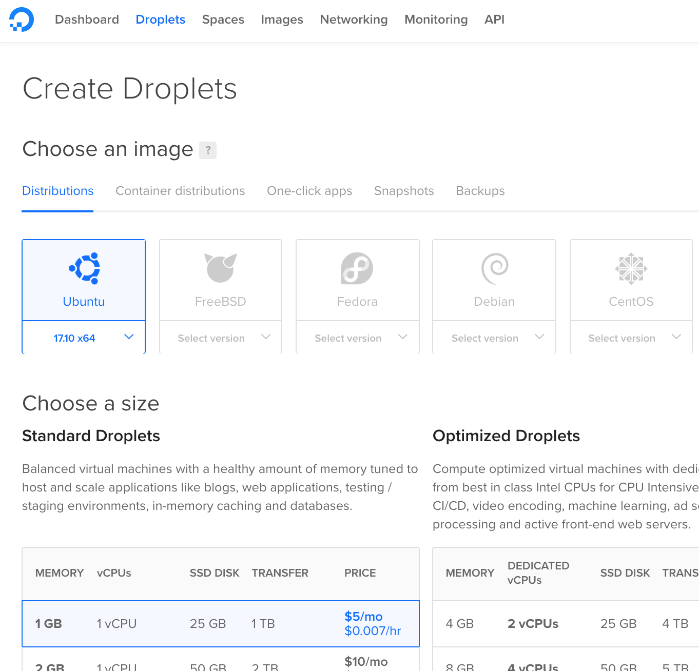
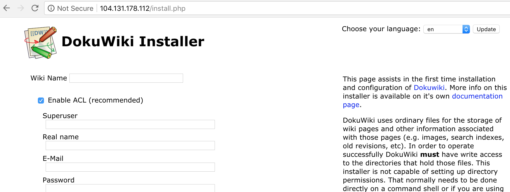
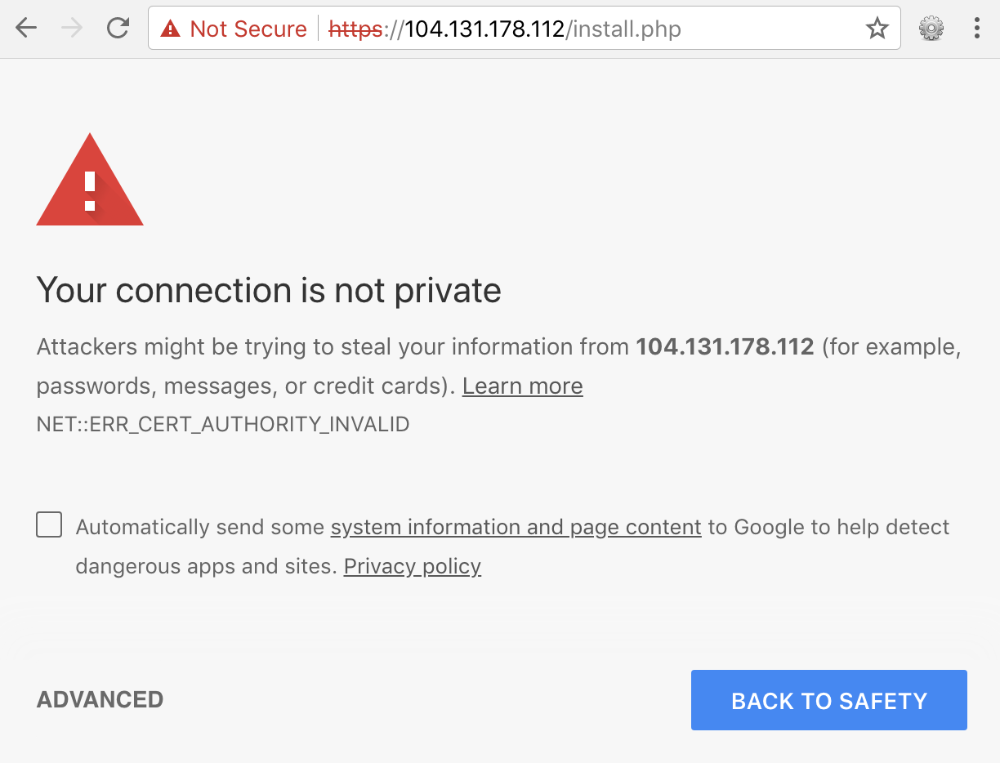
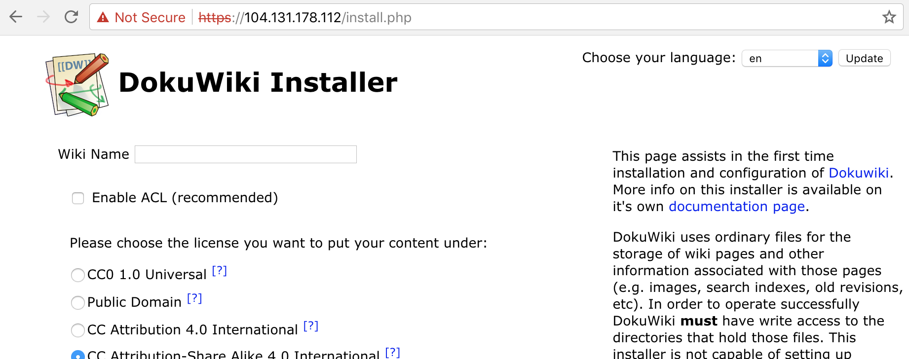
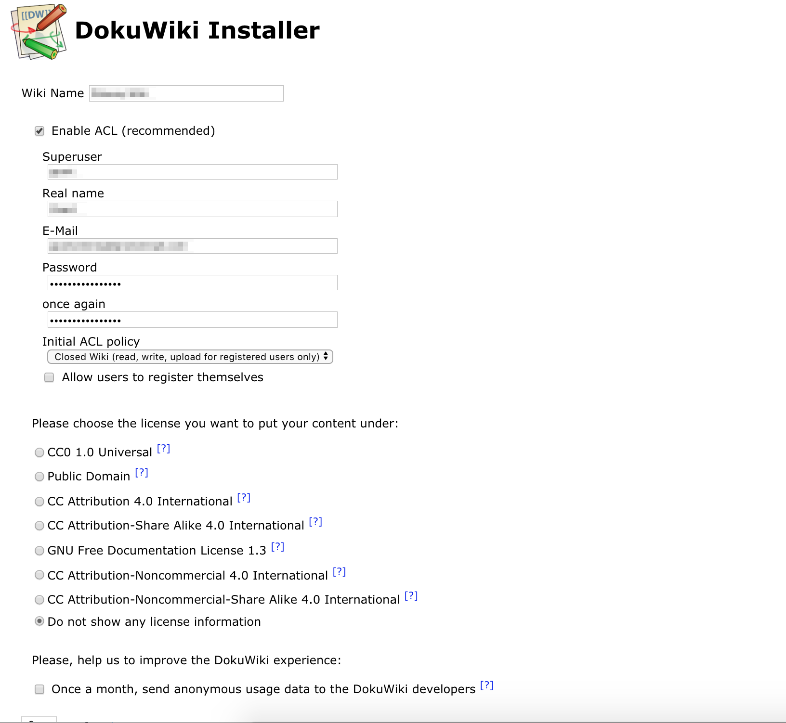
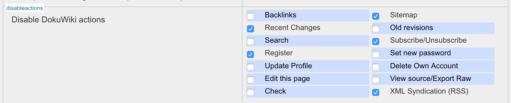
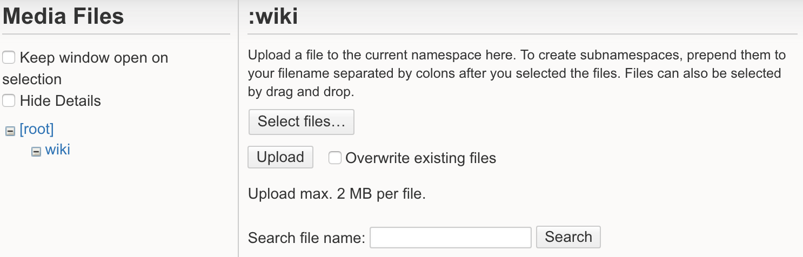
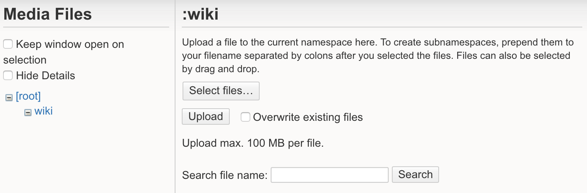
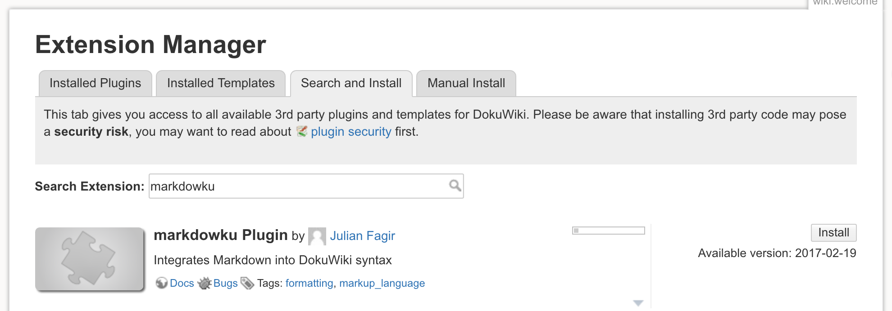
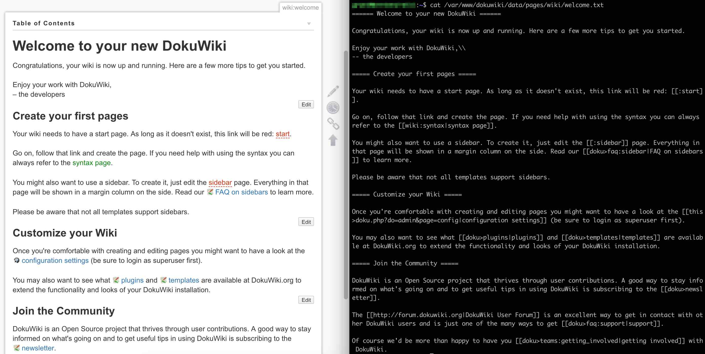

---
categories:
- DigitalOcean
- Wiki
- Documentation
date: "2018-04-01T02:46:32Z"
description: ""
draft: false
cover:
  image: setting-up-a-dokuwiki-2.jpg
slug: creating-your-own-secure-wiki-using-dokuwiki
summary: I've been thinking for awhile now that I wanted to setup a wiki. I wanted
  something light-weight, with support for uploading images and files. And I wanted
  to retain control over the data and configuration, as well as encrypt access to
  it. Here's how to install DokuWiki on Ubuntu with DigitalOcean.
tags:
- DigitalOcean
- Wiki
- Documentation
title: Create a secure, personal instance of DokuWiki on DigitalOcean
---
I've been thinking for awhile now that I wanted to throw together a wiki for my personal use. Something light-weight that supported uploading images and files - nothing too fancy. And I wanted to self-host it so I have greater control over the data and installation, and can restrict and secure access to it while still accessing it from anywhere.

Before you tread this path, there are plenty of nice free/inexpensive tools for notetaking too - Evernote, Confluence, Dropbox Paper, docs.google.com, [etc](https://www.workzone.com/blog/evernote-alternatives/), but sometimes there's a hidden cost in "free" services.

If you want a wiki, but you need more than what I've listed, check out [WikiMatrix](https://www.wikimatrix.org/compare/TiddlyWiki+DokuWiki+MediaWiki) to compare what's out there - just try not to get overwhelmed. For what I wanted it looked like [DokuWiki](https://www.dokuwiki.org/) would do the job, so that's what I went with.

## Create an Ubuntu Droplet

First, you'll need a place to host your wiki. DokuWiki can be installed on Ubuntu, so we'll spin up an Ubuntu virtual machine using [DigitalOcean](https://m.do.co/c/448f25462030). I've been using DO for years for this blog, and I can't recommend them enough. Creating new VMs is painless, [backing them up](https://www.digitalocean.com/community/tutorials/an-introduction-to-digitalocean-backups) and [restoring them](https://www.digitalocean.com/community/tutorials/an-introduction-to-digitalocean-backups#restore-droplet) is easy, they respond quickly, and their documentation is superb.

Create a new [DigitalOcean](https://m.do.co/c/448f25462030) account. They call their virtual machines "droplets", so click the big green "Create" button near the top, then choose "Droplets" and "Ubuntu".

- I chose Ubuntu 17.10. There are other versions available, but you might as well choose the most recent.
- Select the smallest droplet size. You can always upgrade later, but it should work just fine for DokuWiki and a few users.
- Pay close attention to the SSH options. You'll want to be able to SSH into your new machine. Reading this may help: [How To Use SSH Keys with DigitalOcean Droplets](https://www.digitalocean.com/community/tutorials/how-to-use-ssh-keys-with-digitalocean-droplets)
- Choose whatever data center is closest to where you live.
- Under "additional options" consider selecting "backups". You don't need to do this, but for a whopping $1 a month you gain the ability to roll back your entire droplet if anything gets messed up with it (such as an update gone bad).

Give the droplet a name if you'd like, then click "create" at the bottom. After a minute or so, the droplet is created and you get an email with the root password for logging in.



## Configure Ubuntu

The email you receive from DigitalOcean has everything you need to login to your new machine.

```none
Your new Droplet is all set to go!
You can access it using the following credentials:

Droplet Name: my-wiki
IP Address: 111.111.111.111
Username: root
Password: some-long-hexadecimal-string
```

Open up the terminal window or command prompt of your choice, and type something like this, replacing the IP address with whatever DO assigned to you. It'll prompt you for the password, then make you change it.

```sh
ssh root@111.111.111.111
```

[Create a new user with sudo privileges](https://www.digitalocean.com/community/tutorials/how-to-create-a-sudo-user-on-ubuntu-quickstart), so you're not performing everything that follows as root. That's just good practice.

[Enable the built-in firewall](https://www.digitalocean.com/community/tutorials/initial-server-setup-with-ubuntu-16-04#step-seven-%E2%80%94-set-up-a-basic-firewall) to restrict what your server allows connections to. This entire document is full of good advice on setting up your server - I suggest checking the rest of it out. I'm not covering it here, except to say you'll need to add two other rules: _(or you won't even be able to view your new wiki)_

```sh
sudo ufw allow http
sudo ufw allow https
```

## Install DokuWiki

**Follow steps 2-9** of [installing DokuWiki on Ubuntu](https://www.dokuwiki.org/install:ubuntu), paying attention to the following:

Step 7:  
Ignore a, b, and c, since you're not doing this for testing purposes.

Step 8:  
Look for the last `Directory` block:

```xml
<Directory /var/www/>
    Options Indexes FollowSymLinks
    AllowOverride None
    Require all granted
</Directory>
```

Step 10:  
**Don't actually do this step yet**, but visit the setup link. If everything is good so far, you should see a page like this one:



## Secure Your Droplet

_Note: If you're planning on assigning a domain name to your wiki, you might consider_ [_securing your site with a free certificate from Let's Encrypt_](https://www.digitalocean.com/community/tutorials/how-to-secure-apache-with-let-s-encrypt-on-ubuntu-16-04)_. If you're just using the droplet's IP address to access your wiki like I plan on doing, or you're already familiar with self-signed certificates, then continue..._

Follow these DigitalOcean instructions:  
[How To Create a Self-Signed SSL Certificate for Apache in Ubuntu 16.04](https://www.digitalocean.com/community/tutorials/how-to-create-a-self-signed-ssl-certificate-for-apache-in-ubuntu-16-04)

Step 1:  
If you don't care about how long the SSL certificate lives, you could change the `-days` parameter to something longer like 36500 (a hundred years).

You'll be prompted for some info. The "Common Name" is the IP address of your new droplet, and _**you need that**_. Everything else is optional and you can just click Enter through them.

Step 2:  
Under _"Modify the Default Apache SSL Virtual Host File"_ you'll want to make one more modification to the `default-ssl.conf` file, changing `DocumentRoot /var/www/html` to `DocumentRoot /var/www/dokuwiki`

Also, you can just ignore the suggested change to "BrowserMatch" unless you're planning on using IE 6 to access your wiki.

Step 3:  
After allowing 'Apache Full' in the firewall, I was done. There was no separate 'Apache' entry to delete. You probably won't have one either.

After following the rest of the document, refresh the DokuWiki install page from earlier (or reopen it). It should redirect you from the secure (https) version of the site, and (in most browsers) throw up a nice big red warning page.



Just bypass it using whatever method your browser gives you. That's the downside of a self-signed certificate, and why you should never use one for a production site. Your communication with the server is encrypted though, so let's continue with setting up the wiki.



## Configure DokuWiki

Now that the line to the server is encrypted, let's continue setting up DokuWiki. We'll be setting up a password and other information, and I didn't want to send that in plaintext.

**Follow steps 10-11** of [installing DokuWiki on Ubuntu](https://www.dokuwiki.org/install:ubuntu), paying attention to the following:

Step 10:  
Here's how I recommend configuring your installation, but you may want something different. Click "Enable ACL" to setup the initial user, which you can then use to login and change other options. I also chose to disable sending anonymous usage data because I tend to be a tad paranoid about exactly what data is being sent, but ymmv.



Step 12:  
I didn't bother setting up postfix for sending email because I don't plan on giving anyone else access. If I do run through it, I'll update these instructions. If you're interested in trying it, [this tutorial for using Gmail looks pretty comprehensive](https://linode.com/docs/email/postfix/configure-postfix-to-send-mail-using-gmail-and-google-apps-on-debian-or-ubuntu/).

## Other Things to Consider

There's [a lot more you can configure](https://www.dokuwiki.org/config) too. Here are a few other things you might consider adjusting.

### Further Secure Your Site

If you truly want a private wiki that no one else can register an account for, or view details about, you'll want to set some other configuration settings. For example, even if you're not logged in you can view the sitemap for the wiki... that lets anyone view the _list_ of pages available (although not the actual content).

Login, go to `Admin / Configuration Settings` and look for the following panel. I'd suggest disabling the following options, but you may want to experiment on your own and see how it affects the site when you're logged out.



### Increase Maximum Upload Size

If you try to upload a file to your new wiki, you'll see something like this. Notice the 2MB limit on uploads. If you were setting up a server for a bunch of people to use, this might be reasonable; however, if it's for you then you might want to upload much larger files.



To fix this, let's make a couple changes to the `php.ini` file, which can be found here. _(This is one advantage of hosting our own server. You often cannot edit the php.ini file in a shared environment.)_

```sh
sudo nano /etc/php/7.2/apache2/php.ini
```

If you don't have a file there for some reason, you can search for it with `find`:

```sh
sudo find / -name php.ini
```

Open the file and look for `upload_max_filesize`. Change the "2M" to whatever you want, like "100M". Now you'll be able to upload 100 MB files.

```none
;;;;;;;;;;;;;;;;
; File Uploads ;
;;;;;;;;;;;;;;;;

; Whether to allow HTTP file uploads.
; http://php.net/file-uploads
file_uploads = On

; Maximum allowed size for uploaded files.
; http://php.net/upload-max-filesize
upload_max_filesize = 2M
```

Apparently you have to modify one more setting, and that's to [make `post_max_size` greater than `upload_max_filesize`](https://stackoverflow.com/a/2184541/301857). Better yet, the comments in the file suggest setting it to 0 to just disable, which works fine for me. Maybe not a great idea for a public facing blog with lots of users, but if it's just for you then I wouldn't sweat it.

```none
;;;;;;;;;;;;;;;;;
; Data Handling ;
;;;;;;;;;;;;;;;;;

; Maximum size of POST data that PHP will accept.
; Its value may be 0 to disable the limit. It is ignored if POST data reading
; is disabled through enable_post_data_reading.
; http://php.net/post-max-size
post_max_size = 0
```

Restart your server with `sudo service apache2 restart` and try uploading again.



### Add Support for Markdown

I use markdown all over - on my blog, Stack Overflow, GitHub, etc. If you'd like to add support for it to DokuWiki, click on the "Admin" link and go to "Extension Manager". From there, do a search for "markdown". As of this writing, [markdowku](https://www.dokuwiki.org/plugin:markdowku) appears to be the most recently maintained plugin. Click the "Install" link next to it and try it out - it seems to be working for me.



### View Raw Wiki Files

Everything your wiki needs is stored in `/var/www/dokuwiki`. You might as well get a little familiar with that directory, in case you ever need to fix something. For example, you can view the text file representing the main page here:

```sh
cat /var/www/dokuwiki/data/pages/wiki/welcome.txt
```

Here's a side-by-side view of the source file and the rendered page in the browser:



### Regarding "Let's Encrypt"...

I already have a free certificate from Let's Encrypt for my blog. If you do too, you might consider [configuring wildcard certificates](https://letsencrypt.org/2017/07/06/wildcard-certificates-coming-jan-2018.html) so you can assign your wiki to something like "wiki.your-blog-domain.com". I haven't gone through this yet, so no clue how simple or complicated it'll be.

That's it! You have a personal, secure environment to store 25 GB worth of notes, images, files, etc - for only $5 a month. If you end up needing more space, you can easily add extra through the DigitalOcean admin panel. If you manage to get it working, let me know... I'd love to hear how it goes. Good luck!
