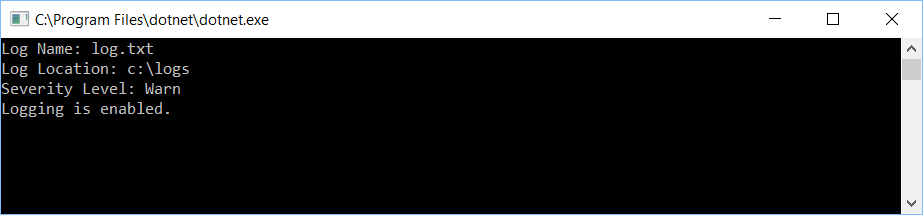
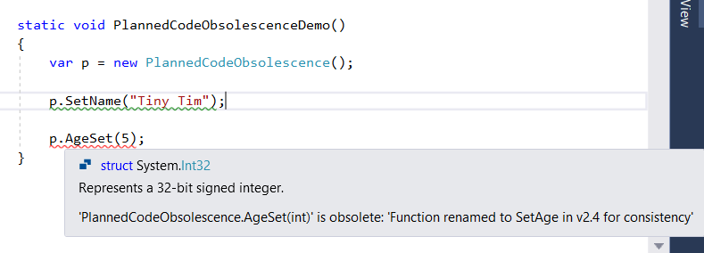
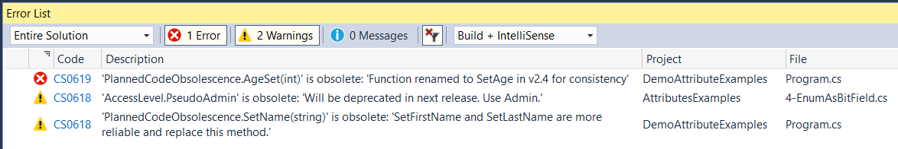

---
categories:
- C#
- Attributes
- Metadata
- Coding
date: "2019-04-04T15:57:19Z"
description: ""
draft: false
cover:
  image: photo-1571907483086-3c0ea40cc16d.jpg
slug: csharp-attributes
summary: Ever thought it'd be convenient to attach metadata to your code at design
  time, then read it at runtime? Attributes let you do just that - to methods, classes,
  tests, enumerations, and more. Use reflection to read them at runtime and take some
  action. Here's a few examples for the uninitiated...
tags:
- C#
- Attributes
- Metadata
- Coding
title: Using Attributes in C#
aliases:
- 5-examples-of-attributes-in-c-and-why-youll-want-to-make-your-own
- blog/test
---
Ever thought it'd be convenient to attach some extra info to your code? Not just documentation to read at design time, but something that can actually be consumed at runtime and change how your program runs?

[Attributes](https://docs.microsoft.com/en-us/dotnet/csharp/programming-guide/concepts/attributes/) let you attach metadata to methods, classes, tests, enumerations... pretty much anything. Then you can use reflection to read them at runtime and take some action. If you haven't used them much before, or if it's just been awhile, let's look at a few practical examples.

## Parsing Config Files

It's common for a .NET app to include a config file of some sorts (app.config, web.config, etc). These are great because you can simply change values, without having to recompile the app.

```xml
<?xml version="1.0" encoding="utf-8" ?>
<configuration>
  <configSections>
    <section name="application"
             type="AttributesExamples.Application, AttributesExamples" />
  </configSections>
  <application>
    <logging name="log.txt"
             location="c:\logs"
             level="Warn" />
  </application>
</configuration>
```

They're slightly less great because there's several ways to read those values from your code, and some of them are a pain. By using the [ConfigurationProperty](https://docs.microsoft.com/en-us/dotnet/api/system.configuration.configurationproperty?view=netframework-4.7.2) attribute, and any of the various classes that extend the [ConfigurationValidator](https://docs.microsoft.com/en-us/dotnet/api/system.configuration.configurationvalidatorattribute?view=netframework-4.7.2) attribute, you can actually set up a class to represent the config file at runtime.

```csharp
using System;
using System.Configuration;

namespace AttributesExamples
{
    public enum Severity
    {
        Info = 1,
        Warn = 2,
        Error = 3
    }

    public class Application : ConfigurationSection
    {
        public static LogSettings LoggingConfig => (ConfigurationManager.GetSection("application") as Application).LogSettings;

        [ConfigurationProperty("logging", Options = ConfigurationPropertyOptions.IsRequired)]
        public LogSettings LogSettings
        {
            get { return (LogSettings)this["logging"]; }
        }
    }

    public class LogSettings : ConfigurationElement
    {
        [ConfigurationProperty("name", IsRequired = false, DefaultValue = @"log.txt")]
        [StringValidator(InvalidCharacters = @":;()!@3$%^&*'""<>", MinLength = 1, MaxLength = 32)]
        public string LogName
        {
            get { return Convert.ToString(this["name"]); }
        }

        [ConfigurationProperty("location", IsRequired = true)]
        public string LogPath
        {
            get { return Convert.ToString(this["location"]); }
        }

        [ConfigurationProperty("level", IsRequired = false, DefaultValue = Severity.Info)]
        public Severity SeverityLevel
        {
            get { return (Severity)Enum.Parse(typeof(Severity), Convert.ToString(this["level"])); }
        }

        [ConfigurationProperty("enabled", IsRequired = false, DefaultValue = true)]
        public bool LoggingEnabled
        {
            get { return Convert.ToBoolean(this["enabled"]); }
        }
    }
}
```

Setting up the class is a little time-consuming, but once it's done you have a nice way of accessing and displaying your config settings.

```csharp
var settings = Application.LoggingConfig;

Console.WriteLine($"Log Name: {settings.LogName}");
Console.WriteLine($"Log Location: {settings.LogPath}");
Console.WriteLine($"Severity Level: {settings.SeverityLevel}");
Console.WriteLine($"Logging {(settings.LoggingEnabled ? @"is" : @"is not")} enabled.");
```



If you want to learn more:

- [Configuring Apps by using Configuration Files](https://docs.microsoft.com/en-us/dotnet/framework/configure-apps/)
- [What is App.config in C#.NET? How to use it?](https://stackoverflow.com/questions/13043530/what-is-app-config-in-c-net-how-to-use-it)

## Unit Testing

All of the major testing frameworks make use of attributes, whether it's [NUnit](https://nunit.org/), [xUnit](https://github.com/xunit/xunit), or [MSTest](https://docs.microsoft.com/en-us/dotnet/core/testing/unit-testing-with-mstest).

Here's a ridiculous `Employee` class, thoroughly vetted by some NUnit tests. You can decorate any method you want with `SetUp` and `TearDown` attributes, which act like a constructor and destructor run before and after _every_ test. Tests have a `Test` attribute, and you can even reuse the same test for multiple values with the `TestCase` attribute. NUnit makes use of all these attributes to know what, when, and how to run things.

```csharp
using NUnit.Framework;

namespace AttributesExamples
{
    [TestFixture]
    public class UnitTesting
    {
        Employee emp;

        [SetUp]
        public void AnyNameWeWant()
        {
            emp = new Employee();
        }

        [TearDown]
        public void SomeOtherName()
        {
            emp = null;
        }

        [Test]
        [TestCase("Lucky", "Day", "Lucky Day")]
        [TestCase("Dusty", "Bottoms", "Dusty Bottoms")]
        [TestCase("Ned", "Nederlander", "Ned Nederlander")]
        public void GetFullName_ReturnsFullName(string firstName, string lastName, string expectedFullName)
        {
            emp.SetName(firstName, lastName);

            Assert.AreEqual(expectedFullName, emp.GetFullName());
        }
    }

    public class Employee
    {
        private string firstName;
        private string lastName;

        public void SetName(string firstName, string lastName)
        {
            this.firstName = firstName;
            this.lastName = lastName;
        }

        public string GetFullName()
        {
            return $"{firstName} {lastName}";
        }
    }
}
```


## Planned Code Obsolescence

Another practical use for attributes is warning users of your library that you plan on [deprecating some piece of code](https://docs.microsoft.com/en-us/dotnet/api/system.obsoleteattribute?view=netframework-4.7.2). Even Microsoft, known for its unprecedented backwards-compatibility in the .NET Framework, marks their code as obsolete from [time](https://github.com/dotnet/coreclr/blob/baa4f19a7158e31b7012ff2dafebfb5f1b1edee4/src/System.Private.CoreLib/shared/System/Reflection/AssemblyFlagsAttribute.cs) to [time](https://github.com/dotnet/coreclr/blob/3b807944d8822b44eb5085d6b95b130b4a91808f/src/System.Private.CoreLib/shared/System/ExecutionEngineException.cs).

```csharp
using System;

namespace AttributesExamples
{
    public class PlannedCodeObsolescence
    {
        string firstName;
        string lastName;
        int age;

        [Obsolete("SetFirstName and SetLastName are more reliable and replace this method.")]
        public void SetName(string name)
        {
            var names = name.Split();
            firstName = names[0];
            lastName = names[1];
        }

        public void SetFirstName(string first)
        {
            firstName = first;
        }

        public void SetLastName(string last)
        {
            lastName = last;
        }

        [Obsolete("Function renamed to SetAge in v2.4 for consistency", true)]
        public void AgeSet(int age)
        {
            SetAge(age);
        }

        public void SetAge(int age)
        {
            this.age = age;
        }
    }
}
```

When you mark something as obsolete, any attempts to use it are underlined in green as a warning. You might leave things like this for several releases, and when you're ready you set the error parameter to `true`, which tells the compiler to treat usage as an error instead of a warning.





## Bit Field Enums

If you've ever needed to store a bunch of related flags, you _could_ do something like this. It's tedious - and unnecessary.

```csharp
public class PreferredContactMethods
{
    public IsLandPhoneAllowed { get; set; }
    public IsCellPhoneAllowed { get; set; }
    public IsEmailAllowed { get; set; }
    ...
    ...
}
```

Instead, create an enumeration and use the [Flags](https://docs.microsoft.com/en-us/dotnet/api/system.flagsattribute?view=netframework-4.7.2) attribute so the system knows to treat it like a bit field. What is that, you ask? Great question.

Imagine you had a bunch of switches or flags, to signify "on" and "off" for a variety of settings. You could use 1 for "on" and 0 for "off". So if you had three such flags, and the second was "off" while the first and third were "on", you might represent them like this: `1 0 1`

As it turns out, using bits to represent your flags is a perfect fit, but then how do you code that? Well, 101 in binary is the same as 22 + 21 + 20 = 7 in decimal. If you only use the power of 2 for each flag, you can combine values and know exactly which flags are "on". The decimal value of 7 means the first and third flag are set, and nothing else. It's completely unambiguous... and efficient.

Note the numbering for the enum values in the following example.. all powers of 2. By applying the `Flags` attribute, you can make use of other .NET code that allows you to quickly select multiple values at once, as well as quickly test which values are selected.

```csharp
using System;

namespace AttributesExamples
{
    [Flags]
    public enum PreferredContactMethods
    {
        None = 0,
        LandPhone = 1,
        CellPhone = 2,
        Email = 4,
        SnailMail = 8,
        Owl = 16,
        FlooPowder = 32,
        Text = 64,
        Muggle = Email | Text | CellPhone,
        Wizard = Owl | FlooPowder
    }
    
    static void DisplayPreferences()
    {
        var prefContactMethods = PreferredContactMethods.Email | PreferredContactMethods.FlooPowder;

        if (prefContactMethods == PreferredContactMethods.None)
            Console.WriteLine("User hates people. :(");    // won't print

        if (prefContactMethods.HasFlag(PreferredContactMethods.LandPhone))
            Console.WriteLine("What's a landph one? :/");  // also won't print

        if (prefContactMethods.HasFlag(PreferredContactMethods.CellPhone)
            || prefContactMethods.HasFlag(PreferredContactMethods.Email))
            Console.WriteLine("Aren't we modern? :p");     // should print

        prefContactMethods |= PreferredContactMethods.Owl;

        if (prefContactMethods.HasFlag(PreferredContactMethods.Wizard))
            Console.WriteLine("You're a wizard Harry!! ~:›");  // this too
        }
    }
}
```


## Your Own Implementation

Okay, I tricked you. Number 5 is whatever you come up with!

For me, in creating a library called [GhostSharp](https://github.com/grantwinney/GhostSharp) _(a C# wrapper around an API that connects to Ghost blogs),_ I had a single class representing an object that could be POSTed to an API endpoint. The problem was that a PUT (update) to the same endpoint could only be a subset of those fields... trying to pass the same object failed. I could've created two objects - one for POST and one for PUT - but I really wanted to use a single object. The solution?

I created a simple attribute to dress up those fields that were acceptable for an update. I mean, _really_ simple. There's nothing else but a name, but that's all I needed.

```csharp
/// <summary>
/// Represents a field that can be updated in a PUT request.
/// </summary>
public class UpdatableFieldAttribute : Attribute
{
}
```

And here's a portion of the class representing a post (as in a blog post, not the REST action POST 😅). The uuid and comment_id fields cannot be updated, but the title and feature_image can. Adding an attribute is only half the work though.

```csharp
/// <summary>
/// Request sent to Ghost
/// </summary>
public class PostRequest
{
    /// <summary>
    /// Collection of posts.
    /// </summary>
    [JsonProperty("posts")]
    [UpdatableField]
    public List<Post> Posts { get; set; }
}

/// <summary>
/// Represents a Post.
/// </summary>
public class Post
{
    /// <summary>
    /// ID (Update)
    /// </summary>
    [JsonProperty("id")]
    public string Id { get; set; }

    /// <summary>
    /// UUID
    /// </summary>
    [JsonProperty("uuid")]
    public string Uuid { get; set; }

    /// <summary>
    /// Title
    /// </summary>
    [JsonProperty("title")]
    [UpdatableField]
    public string Title { get; set; }

    /// <summary>
    /// Post, formatted in Mobile Doc
    /// </summary>
    [JsonProperty("mobiledoc")]
    [UpdatableField]
    public string MobileDoc { get; set; }

    /// <summary>
    /// Comment ID
    /// </summary>
    [JsonProperty("comment_id")]
    public string CommentId { get; set; }

    /// <summary>
    /// Feature Image
    /// </summary>
    [JsonProperty("feature_image")]
    [UpdatableField]
    public string FeatureImage { get; set; }
    
    ...
    ...
}
```

I'm not going to get into the details of serializing a C# object to JSON, but with the updatable fields marked appropriately I had to write a short piece of code to tell RestSharp when a property should be included in the serialization. Using a little reflection, I could test to see whether the `UpdatableField` attribute was on a given property - if it is (`!= null`) then send it with the rest of the PUT.

```csharp
protected override JsonProperty CreateProperty(MemberInfo member, MemberSerialization memberSerialization)
{
    JsonProperty property = base.CreateProperty(member, memberSerialization);

    property.ShouldSerialize =
        instance =>
        {
            return property.DeclaringType.GetProperty(property.UnderlyingName)
                           .GetCustomAttribute<UpdatableFieldAttribute>() != null;
        };

    return property;
}
```

Attributes are a handy way to add metadata to your code, which can be read back using reflection at runtime. In addition, they offer a bit of documentation too - I can look at my `post` class and quickly confirm which fields are included in an update.

If you're interested in learning about a newer feature called generic attributes, introduced in C# 11, check out *[What are generic attributes in C# 11?](https://grantwinney.com/what-are-generic-attributes/)*. And if you want to learn more about a variety of C# features, [check out my GitHub repo](https://github.com/grantwinney/CSharpDotNetExamples), where you'll find links to plenty more blog posts and practical examples.
