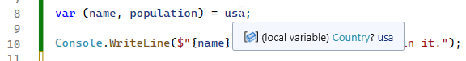
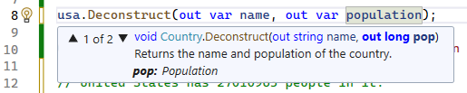
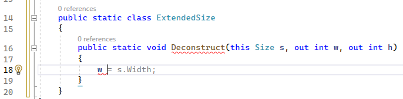
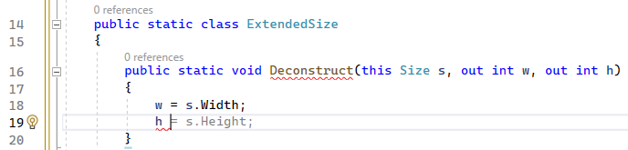

---
categories:
  - Coding
date: 2023-06-15T22:12:31Z
description: ""
draft: false
cover:
  image:
slug: csharp-deconstructors
summary: We can deconstruct tuples in C#, but does it work with other types? And assuming it does (spoiler - it does), is it worth bothering with?
tags:
  - csharp-7
  - csharp
title: Adding deconstructors to C# types
aliases:
  - /adding-deconstructors-in-csharp-is-it-worth-it
---
Earlier this year, I wrote about being able to [deconstruct tuples in C#](https://grantwinney.com/using-tuple-and-deconstruction-to-return-multiple-values/), something that was added to [C# 7](https://learn.microsoft.com/en-us/dotnet/csharp/whats-new/csharp-version-history#c-version-70). That kind of functional behavior is one of the _(so so very few)_ things I miss from my years of writing Erlang code. It neatens up your code a bit, and you can read more about it here:

[Using Tuples and deconstruction to return multiple values in C#](https://grantwinney.com/using-tuple-and-deconstruction-to-return-multiple-values/)

I got to thinking recently though - besides Tuples, is there anywhere else we can use this concept? The answer's yes, we _can_ [define our own deconstruction logic](https://learn.microsoft.com/en-us/dotnet/csharp/fundamentals/functional/deconstruct#user-defined-types) in the classes we create, but now the question is... is it worth it?

> The code in this post is available on [GitHub](https://github.com/grantwinney/CSharpDotNetExamples/tree/master/C%23%2007/DeconstructingUserDefinedTypes), for you to use, expand upon, or just follow along while you read... and hopefully discover something new!

## Can we deconstruct our own types?

Microsoft has [their own example](https://learn.microsoft.com/en-us/dotnet/csharp/fundamentals/functional/deconstruct#user-defined-types), using employees, so we'll do something a little different... okay, maybe not _that_ different. Here's a simple Country class that can hold a collection of States. Add a simple Deconstruct method and voila - we can extract a couple values, like "name" and "population".

```csharp
public class Country
{
    public string Name { get; set; }
    public List<State> States { get; set; } = new List<State>();
    public long TotalPopulation => States.Sum(s => s.Population);

    /// <summary>
    /// Returns the name and population of the country.
    /// </summary>
    /// <param name="name">Name</param>
    /// <param name="pop">Population</param>
    public void Deconstruct(out string name, out long pop)
    {
        name = Name;
        pop = States.Sum(s => s.Population);
    }

    /// <summary>
    /// Returns the name, population, and number of states.
    /// </summary>
    /// <param name="name">Name</param>
    /// <param name="pop">Population</param>
    /// <param name="numberOfStates">Number of states</param>
    public void Deconstruct(out string name, out long pop, out int numberOfStates)
    {
        name = Name;
        pop = States.Sum(s => s.Population);
        numberOfStates = States.Count;
    }
}

public class State
{
    public string Name { get; set; }
    public long Population { get; set; }
}

/***********************/

using DeconstructUserDefinedTypes;

var usa = new Country { Name = "United States" };
usa.States.Add(new State { Name = "Utah", Population = 3380800 });
usa.States.Add(new State { Name = "Maine", Population = 1385340 });
usa.States.Add(new State { Name = "Florida", Population = 22244823 });

var (name, population) = usa;

Console.WriteLine($"{name} has {population} people in it.");
// United States has 27010963 people in it.
```

Right out the gate, I see some deal-breakers. Even if the Deconstruct method has comments on it, they don't show up when you attempt to deconstruct an instance. Hovering over the name where you instantiated the class shows nothing useful. In fact, you don't even know whether there _is_ a Deconstruct method on a class, or whether there's 5 or 50 overloads of it, without delving into the class itself.



It's far more useful to call the Deconstruct method directly, but then it's just like any other public method with a couple "out" variables, so... nothing special there.




Also, since method overloads can't have the same arity (numbers and types of parameters), you can't have one Deconstruct method that (for example) returns a country name and population, and another that returns the country name and total state count (assuming population and state count are both represented by the same type, like integer or long).

There's absolutely nothing here that performs better or is easier to use than just accessing the properties themselves:

```csharp
Console.WriteLine($"{usa.Name} has {usa.TotalPopulation} people in it.");
```

So that begs the question, _is_ there a good reason to use these? Or are they only available because of the way they were implemented for Tuples?

## Can we deconstruct built-in types?

Where I think they might be more helpful is in the use of [extension methods](https://learn.microsoft.com/en-us/dotnet/csharp/fundamentals/functional/deconstruct#extension-methods-for-user-defined-types) on built-in types that we already know and are relatively simple to understand. Take the `Point` and `Size` structs, for example. Let's write a couple extension methods that add a "Deconstruct" method to each of those:

```csharp
public static class ExtendedPoint
{
    public static void Deconstruct(this Point p, out int x, out int y)
    {
        x = p.X;
        y = p.Y;
    }
}

public static class ExtendedSize
{
    public static void Deconstruct(this Size s, out int w, out int h)
    {
        w = s.Width;
        h = s.Height;
    }
}
```

And then a Furniture class, that's maybe part of a home design app or something, and it has a size and location within the house.

```csharp
internal class Furniture
{
    public string Name { get; set; }
    public Point Location { get; set; }
    public Size Size { get; set; }
}
```

If we define a couch (for example) with a given location and size, we can quickly deconstruct those values later on when we need them.

```csharp
var couch = new Furniture
{
    Name = "Couch",
    Location = new Point(3, 4),
    Size = new Size(6, 2)
};

var (x, y) = couch.Location;
var (width, height) = couch.Size;
```

I feel like this works better, because the first thing I'd assume to get from a `Point` is the x and y coordinates, and from a `Size` its width and height. It seems slightly more streamlined than doing `couch.Location.X` and `couch.Location.Y`.

On a side note, gotta say I'm impressed with VS 2022. As I created the Deconstruct method for this example, it correctly guessed that I'd want to set `w` to the width of the `Size` object and `h` to its height. Magic. 🪄





What do you think? Will you use deconstructors? Do you have your own ideas of how and when to implement them?

If you found this content useful, and want to learn more about a variety of C# features, check out [this GitHub repo](https://github.com/grantwinney/CSharpDotNetExamples), where you'll find links to plenty more blog posts and practical examples!
