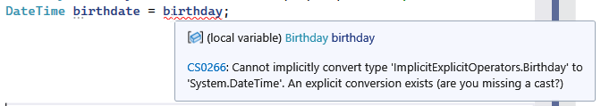

---
categories:
  - Learn
date: 2015-02-11T19:42:36Z
description: ""
draft: false
cover:
  image:
slug: csharp-implicit-vs-explicit-conversion
summary: We use implicit and explicit conversion in C# all the time, without even realizing it. Let's learn more about them and look at examples of each.
tags:
  - csharp
title: Implicit vs Explicit Conversion in C#
---
If you’ve programmed in C# for awhile, you’ve likely used both implicit and explicit conversion without even realizing it. Let's take a look at examples of each.

> If you'd like to follow along while you read, the code in this article is available on [GitHub](https://github.com/grantwinney/CSharpDotNetExamples/tree/master/GeneralConcepts/ImplicitExplicitOperators).

## Implicit Conversion of .NET Data Types

Consider an example. A `Decimal` is capable of storing any `Int32` value, without losing any information about the number the integer represents. So we're allowed to define an integer and then store it in a decimal without the compiler yelling at us. The conversion from integer to decimal is implicit:

```csharp
int quantity = 5;
decimal amount = quantity;  // no problemo
```

What if we go the opposite direction though?

```csharp
decimal amount = 5;
int quantity = amount;  // compiler: "Cannot implicitly convert type 'decimal' to 'int'"
```

This is disallowed, because we run the risk of losing information about the `Decimal`, which can store a fraction as well as a much larger value than `Int32`. The compiler is saving us from ourselves, since we may not realize we’re potentially losing data.

Even though we can’t implicitly convert a `Decimal` to an `Int32`, we can still _explicitly_ convert the values:

```csharp
decimal quantity = 5;
int quantity2 = (int)quantity;  // whatever, cast away!
```

The `(int)` cast here is forcing the conversion, in essence telling the compiler, “Yes, I know the risks, convert it anyway.”

```csharp
decimal quantity = 5;
int quantity2 = (int)quantity; // whatever, cast away!
```

There's a variety of reasons you might need to do this, but the important thing is that you can.

## Implicit Conversion in Our Own Types

The [implicit and explicit conversion operators](https://learn.microsoft.com/en-us/dotnet/csharp/language-reference/operators/user-defined-conversion-operators?redirectedfrom=MSDN) allow us to implement conversiosn in our own types. Here's what Microsoft has to say on the `implicit` operator (emphasis mine) _(note: this verbiage seems to have been removed since the time this article was written, but it's still relevant and important):_

> By eliminating unnecessary casts, implicit conversions can improve source code readability. However, because implicit conversions do not require programmers to explicitly cast from one type to the other, care must be taken to prevent unexpected results. **In general, implicit conversion operators should never throw exceptions and never lose information** so that they can be used safely without the programmer’s awareness. **If a conversion operator cannot meet those criteria, it should be marked explicit.**

In other words, we can use the implicit keyword to hide the exact details of the conversion from others, but don't do something like allowing a decimal to be converted to an integer implicitly and then just silently dropping the fractional portion.

Let's look at some examples.

### Example 1 – Implicitly Convert String to Person

Imagine we have a `Person` class with an `implicit` operator defined on it:

```csharp
public class Person(string name)
{
    private readonly string _name = name;

    /// <summary>
    /// Implicitly convert a string to a new Person.
    /// </summary>
    /// <param name="name"></param>
    public static implicit operator Person(string name)
    {
        return new Person(name);
    }
}
```

We'd normally instantiate the class like this:

```csharp
Person person = new Person("Bob");
```

But thanks to the `implicit` conversion defined, we could also do this:

```csharp
Person person = "Mary";
```

That gives us a new `Person` with the name set to "Mary".

### Example 2 – Implicitly Convert DateTime to Birthday

Now imagine we have a `Birthday` class with its own `implicit` operator:

```csharp
public class Birthday(DateTime birthday)
{
    private readonly DateTime _birthday = birthday;

    /// <summary>
    /// Implicitly convert a DateTime to a new Birthday.
    /// </summary>
    /// <param name="birthday"></param>
    public static implicit operator Birthday(DateTime birthday)
    {
        return new Birthday(birthday);
    }
}
```

Similar to the `Person` class, we can just pass it a `DateTime` and get a new `Birthday`:

```csharp
Birthday birthday = new DateTime(1970, 6, 2);
```

What if we wanted to convert a `Birthday` back to a `DateTime` for some reason? We _could_ define another `implicit` operator, but doing that might go against the general guidance that implicit conversions shouldn't lose data.

Instead, we could create an `explicit` operator:

```csharp
public static explicit operator DateTime(Birthday birthday)
{
    return birthday._birthday;
}
```

Using it means that anyone using our code needs to explicitly convert a `Birthday` to the desired type.

```csharp
DateTime birthdate = (DateTime)birthday;
```

If they don't cast it, the compiler throws an error:



## Final Thoughts

Being able to define our own implicit and explicit conversions is a powerful tool for .NET developers, but it should be used carefully. In particular, if there's any chance of data loss, use an `explicit` conversion instead of an `implicit` one.

One other caveat – there’s no intellisense when using a conversion operator, so any “summary” comment you add above the keyword will go unnoticed and unread by whoever's using your class. Don't depend on someone dipping into your code to see if there's any gotchas or side-effects in your conversions!

If you want to learn more, there's a programming guide from Microsoft titled [Casting and Type Conversions](https://learn.microsoft.com/en-us/dotnet/csharp/programming-guide/types/casting-and-type-conversions) that might be interesting.
