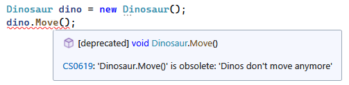
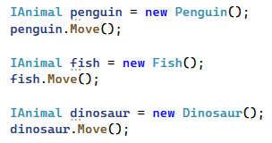
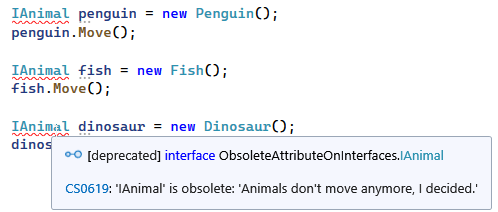

---
categories:
  - Learn
date: 2015-02-04T17:49:31Z
description: ""
draft: false
slug: csharp-obsolete-attribute-on-class-ignored-when-interface-is-involved
summary: The Obsolete attribute on a class is ignored when an interface is involved. It caught me by surprise, but makes sense. Let's see why.
tags:
  - csharp
  - attributes
  - metadata
title: Obsolete Attribute on a Class is Ignored When an Interface is Involved
---
While marking some code as [obsolete](https://msdn.microsoft.com/en-us/library/system.obsoleteattribute\(v=vs.110\).aspx) the other day, it seemed that the attribute was being ignored. As it turns out, there's a reasonable explanation, but it took me by surprise at first.

> If you'd like to follow along with the code yourself, it's available on <a href="https://github.com/grantwinney/BlogCodeSamples/tree/master/Languages/CSharp/ObsoleteAttributeOnInterfaces">GitHub</a>.

## Simple Classes and the Obsolete Attribute

Let's start with a simple class that has a `Move()` method and the `Obsolete` attribute on that method:

```csharp
public class Dinosaur
{
    [Obsolete("Dinos don't move anymore", true)]
    public void Move()
    {
        Console.WriteLine("The dino, uh... remained still.");
    }
}
```

The `error` flag is set to `true`, so it'll throw a compiler error:



Now let's say we have a couple other classes with their own `Move()` methods, without the `Obsolete` attribute:

```csharp
public class Penguin
{
    public void Move()
    {
        Console.WriteLine("The penguin waddled.");
    }
}

public class Fish
{
    public void Move()
    {
        Console.WriteLine("The fish swam.");
    }
}
```

We can instantiate either of these classes and call the `Move()` method to our heart's content.

## Interfaces Hide the Obsolete Attribute

Now that we have several classes with the same method, maybe we want to define an interface that they all implement, perhaps to simplify our code or to support [testing](https://grantwinney.com/what-is-mocking-a-dependency/). So we create an `IAnimal` interface that defines a `Move()` method, and have each of the other classes implement it:

```csharp
public interface IAnimal
{
    void Move();
}

public class Penguin : IAnimal
{
    public void Move()
    {
        Console.WriteLine("The penguin waddled.");
    }
}

public class Fish : IAnimal
{
    public void Move()
    {
        Console.WriteLine("The fish swam.");
    }
}

public class Dinosaur : IAnimal
{
    [Obsolete("Dinos don't move anymore", true)]
    public void Move()
    {
        Console.WriteLine("The dino, uh... remained still.");
    }
}
```

If we instantiate each of the animals against the new interface, we don't get a compiler error anymore. The `Obsolete` attribute seems to be getting ignored for dinos.



In case you're wondering, it doesn't result in a runtime error either:

```text
The penguin waddled.
The fish swam.
The dino, uh... remained still.
```

After thinking about all this for a bit, what else _could_ it do? Given that a single interface can be implemented by any number of classes, what should happen when one class marks the code obsolete, but the others do not? Should _any_ call to `Move()` cause an error? Absolutely not... that would break the other classes that don't have the attribute. And so, **any presence of the attribute on the classes themselves are ignored in favor of the interface**.

In other words, it’s not enough to mark the class itself. If we have interfaces that the class is implementing, its methods may need to be decorated with the attribute too:

```csharp
public interface IAnimal
{
    [Obsolete("Animals don't move anymore, I decided.", true)]
    void Move();
}
```

The caveat is that, **if we add the** *`*Obsolete*`* **attribute to the interface, then every class implementing the interface will inherit the attribute too**, regardless of whether each of those classes actually has the attribute set on it.



## Final Thoughts

When interfaces are involved, the `Obsolete` attribute on a class is ignored by the compiler. The correct fix depends on the situation. It may mean adding the attribute to the interface itself, or it may mean changing the method to throw a `NotSupportedException` or some other appropriate exception.

To learn more, check out the MS docs on [attributes](https://learn.microsoft.com/en-us/dotnet/csharp/advanced-topics/reflection-and-attributes/) and [interfaces](https://learn.microsoft.com/en-us/dotnet/csharp/fundamentals/types/interfaces).
