---
categories:
  - Tools
date: 2020-01-05T12:39:14Z
description: ""
draft: false
cover:
  image:
slug: deploy-requestbin-in-under-5-minutes
summary: If you need to consume a webhook from another service, or verify the payload being sent from your own REST API endpoint, RequestBin can help. It intercepts and displays the contents of any call made to it. Here's how to deploy your own instance in just a few minutes.
tags:
title: Deploy your own RequestBin in under 5 minutes
---
If you've ever needed to consume a webhook from another service, say from [Stripe](https://stripe.com/docs/webhooks) or [GitHub](https://developer.github.com/webhooks/), but you weren't completely sure what the payload was going to look like _(say, the docs are incomplete or missing),_ a tool like RequestBin can help. By setting it as the "target" for the webhook, it intercepts whatever happens to be thrown its way, and displays it.

Same goes if you're developing a REST API and want to make sure that your `POST` and `PUT` actions are sending what you expect. You could develop a separate app that consumes your API the way your customers will and displays the results, but why bother with the overhead? _(At least, initially...)_

The same team that designed RequestBin _(which seems to be abandoned, but more on that below)_ used to host a public instance of it for anyone to use too, but such services don't seem to last, and [theirs didn't either](https://web.archive.org/web/20210116160324/https://github.com/Runscope/requestbin/commit/8ca17a8ed7f603864329391f4be131c4b3355aaf). It's _got_ to be expensive hosting something like that for thousands _(tens of thousands? hundreds?)_ of users for free. 💸

## Deploy with DigitalOcean in <5 minutes

Fortunately, the makers of RequestBin also made it really easy to deploy on your own. Just create a [DigitalOcean](https://m.do.co/c/448f25462030) droplet with [Docker](https://marketplace.digitalocean.com/apps/docker) preinstalled; unless you know you're going to need more resources, the basic $5/mo plan is sufficient. It should only take a minute or so to spin up.

 with `ssh root@<your-droplet-ip-address>`, and then run the commands in the [readme](https://github.com/Runscope/requestbin/blob/master/README.md). The `build` command takes a few minutes on its own, but the `up` command should only take a few seconds.

```NONE
git clone git://github.com/Runscope/requestbin.git
cd requestbin
sudo docker-compose build
sudo docker-compose up -d
```

Assuming no errors in the output, just paste `<your-droplet-ip-address>:8000` into your favorite browser, and away you go!

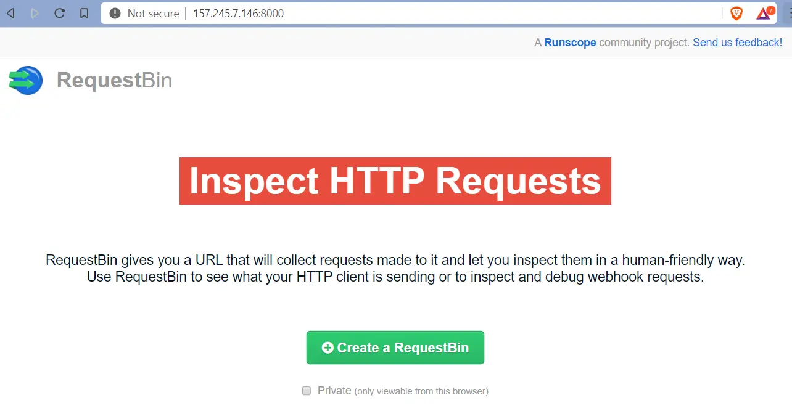

Create your first RequestBin and `POST` some data with a simple curl command like they suggest. Update the page and you should see your data listed.

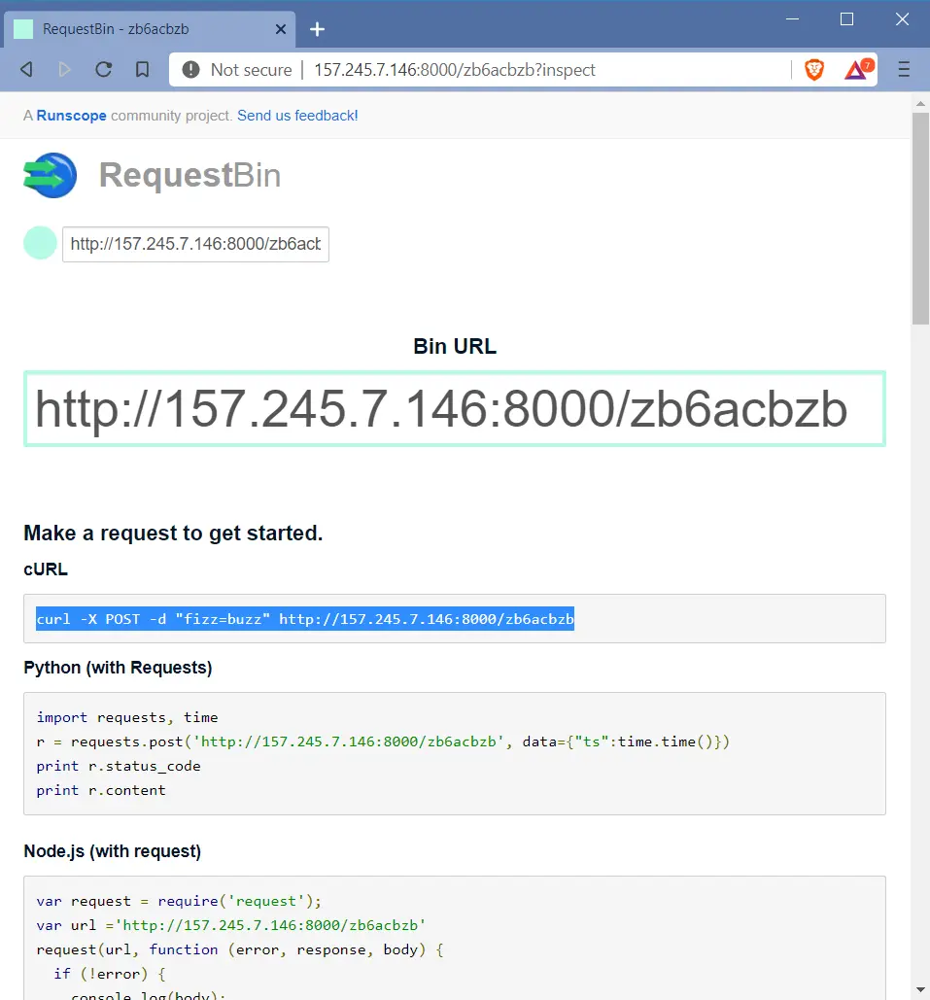

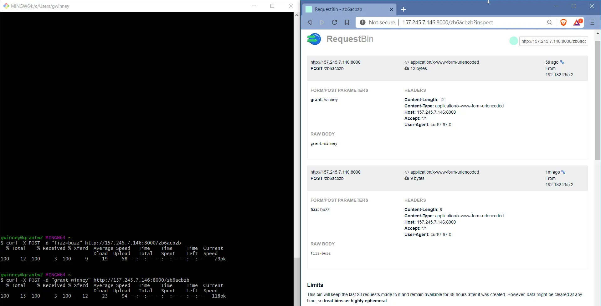

You can also use a tool like [Postman](https://www.getpostman.com/) to make requests to the endpoint, and even save them for future use - something I've made extensive use of while learning and writing about various [APIs](https://grantwinney.com/tags/api/).

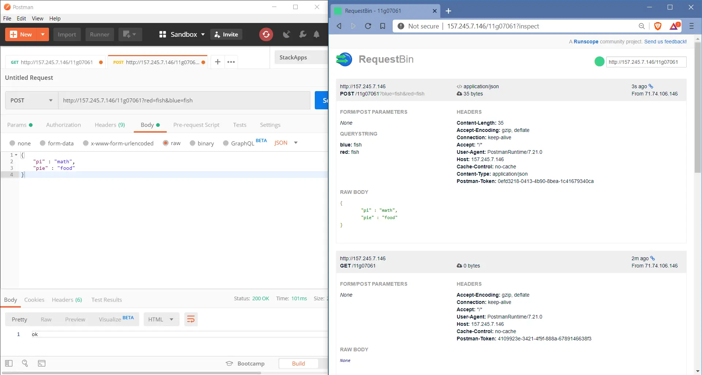

## Changing Built-in Settings (i.e. max TTL, max requests, and port)

There's some settings, like a max of 20 requests, that make sense if you've got an environment that thousands of people will be using. But since it's just you, and maybe a small team, I'd say you could safely increase those a bit.

If the container is up and running, [bring it down](https://docs.docker.com/compose/reference/down/) now and verify it's gone.

```NONE
root@docker-s-1vcpu-1gb-nyc3-01:~# docker container ls
CONTAINER ID        IMAGE               COMMAND                  CREATED             STATUS              PORTS                    NAMES
0f9ecfdde471        requestbin_app      "/bin/sh -c 'gunicor…"   25 minutes ago      Up 25 minutes       0.0.0.0:8000->8000/tcp   requestbin_app_1
99415b11ab7c        redis               "docker-entrypoint.s…"   25 minutes ago      Up 25 minutes       6379/tcp                 requestbin_redis_1

root@docker-s-1vcpu-1gb-nyc3-01:~# cd ~/requestbin/

root@docker-s-1vcpu-1gb-nyc3-01:~/requestbin# sudo docker-compose down
Stopping requestbin_app_1   ... done
Stopping requestbin_redis_1 ... done
Removing requestbin_app_1   ... done
Removing requestbin_redis_1 ... done

root@docker-s-1vcpu-1gb-nyc3-01:~/requestbin# docker container ls
CONTAINER ID        IMAGE               COMMAND             CREATED             STATUS              PORTS               NAMES
```

Open the `requestbin/config.py` file and change some of these values.

- The `BIN_TTL` is the time to live in seconds, so if you want your requests to live for a year, then set `BIN_TTL = 365*24*3600`
- There's no reason to only hold on to 20 requests; if you like, you could set `MAX_REQUESTS = 2000` or some other value. If you set it to a million and everything crashes... not my fault.

While you're at it, you could make it so you don't have to enter a port either, since presumably you're not running anything else on this tiny server.

- Edit `docker-compose.yml` and change the "ports" section to `"80:8000"`
- Edit `Dockerfile` to `EXPOSE 80`
- Remove the current `requestbin_app` image with `docker image rm`
- Run `sudo docker-compose up -d` again and verify your changes took effect

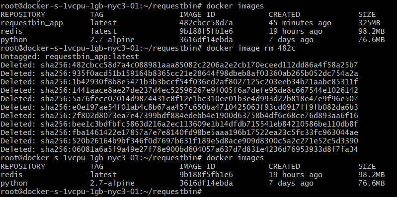

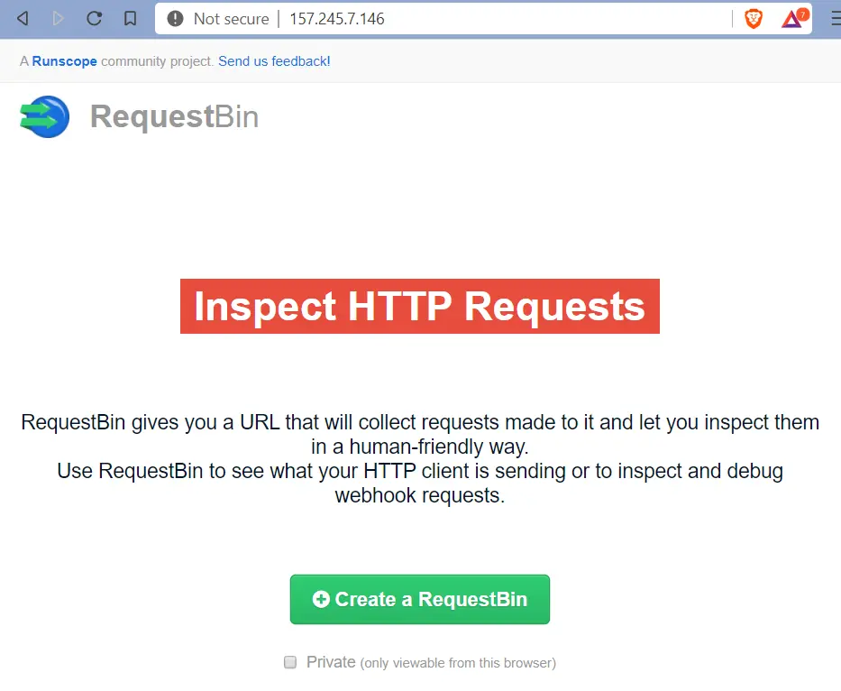

Some of the values are also hard-coded into the HTML page, so even after doing all the above, the _page_ will probably still tell you you're limited to 20 requests. It lies. If you run the `CURL` command 30 times now, you'll see 30 requests on the page.

## Other Considerations

So, hopefully you haven't been passing anything too sensitive to your RequestBin instance yet, because right now it's all plain-text. If you need to pass secure data, consider setting up SSL. That's not something I'm delving into here - not yet, anyway.

[I forked the original project](https://github.com/grantwinney/requestbin) which, as I mentioned, seems to be abandoned. They shutdown the public RequestBin site (understandably), but also haven't merged in PRs or addressed issues for nearly two years.

_Small side note:_ If you go into "Insights", "Dependency Graph", and click "Enable", GitHub warns you of security vulnerabilities _(even on a fork)_... and then opens PRs on your behalf, which you can merge in or close at your discretion! 👍

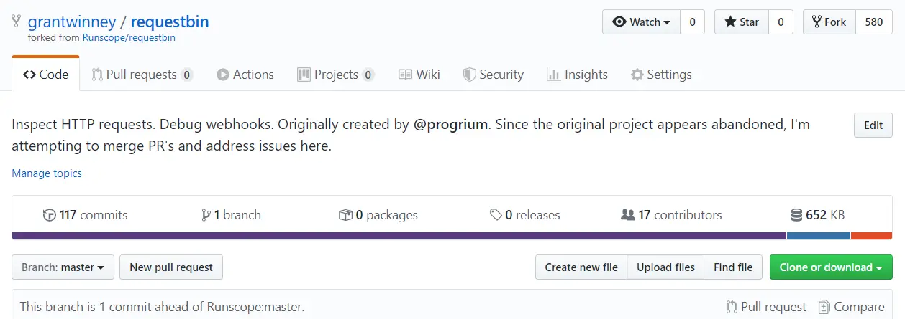

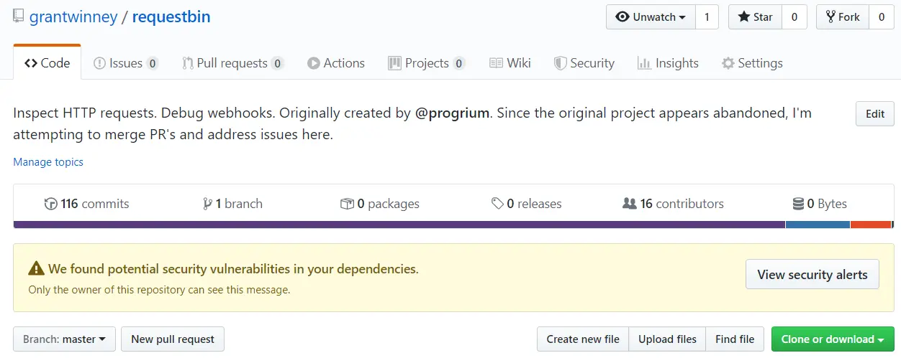

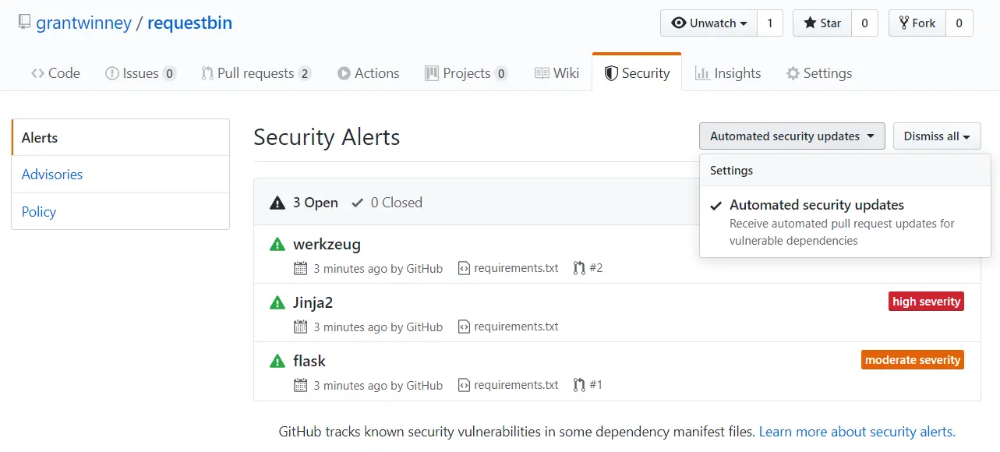

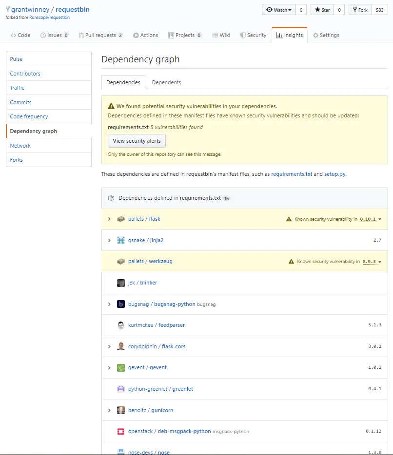

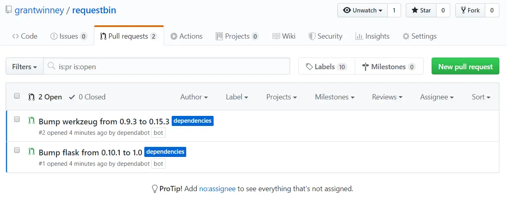

I'd love to update the dependencies (i.e. Python2 is dead), merge the pending PRs, and even try addressing some of the issues myself, but that's probably a fool's errand... at least for this fool. It's a complex project and I don't have the time to dedicate to properly understanding it and bringing it up to speed.
