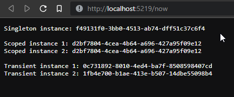

---
categories:
- DI
- Coding
- Questions
date: "2023-07-28T21:41:00Z"
description: ""
draft: false
cover:
  image: photo-1508962914676-134849a727f0.jpg
slug: difference-between-singleton-scoped-transient
summary: It's trivial to register a dependency in a .NET API, but it's important to
  clarify a few terms that drastically change a dependency's lifetime.
tags:
- DI
- Coding
- Questions
title: What's the difference between singleton, scoped, and transient?
---
I saw an issue with a .NET 6 API recently, where dependency injection (DI) was in full use, but instead of getting a new instance of a dependency every time one was requested (as expected), the _same_ instance kept being returned.

The problem didn't actually present itself that nicely (they never do), so it took quite awhile to track down. In the end though, it was obvious (as most solved problems are) that the dependency was registered incorrectly. The fix was a one-line change.

> The code in this post is available on <a href="https://github.com/grantwinney/CSharpDotNetExamples/tree/master/GeneralConcepts/SingletonVsTransientDI">GitHub</a>, for you to use, expand upon, or just follow along while you read... and hopefully discover something new!

When we create APIs in .NET, it's pretty easy to register a class with the DI service, as it's supported right out of the box. But there's different ways a service can be registered, so it's important to understand the differences between [AddSingleton](https://learn.microsoft.com/en-us/dotnet/api/microsoft.extensions.dependencyinjection.servicecollectionserviceextensions.addsingleton?view=dotnet-plat-ext-6.0), [AddScoped](https://learn.microsoft.com/en-us/dotnet/api/microsoft.extensions.dependencyinjection.servicecollectionserviceextensions.addscoped?view=dotnet-plat-ext-6.0), and [AddTransient](https://learn.microsoft.com/en-us/dotnet/api/microsoft.extensions.dependencyinjection.servicecollectionserviceextensions.addtransient?view=dotnet-plat-ext-6.0).

To _(really briefly)_ summarize them:

- Singleton - One instance of a resource, reused anytime it's requested.
- Scoped - One instance of a resource, but only for the current request. New request (i.e. hit an API endpoint again) = new instance
- Transient - A different instance of a resource, everytime it's requested.

It's usually easier to see things in action though, which as it turns out is fairly easy to do. Here's a class with a single property that provides a GUID value, which is generated when the class is instantiated, and some interfaces to use in the next step:

```csharp
public interface IIDSingleton : IID { }
public interface IIDScoped : IID { }
public interface IIDTransient : IID { }

public interface IID
{
    Guid Value { get; }
}

public class ID : IIDSingleton, IIDScoped, IIDTransient
{
    public Guid Value { get; private set; } = Guid.NewGuid();
}
```

And here's a minimal API with a single endpoint that defines some dependencies to inject and how those dependencies should be resolved. When someone requests an `IIDSingleton` for example, it should resolve to a single instance of the `ID` class... always just that single instance, no matter what. When someone requests an `IIDTransient` though, it should _always_ be a new instance.

```csharp
using SingletonVsTransientDI;

var builder = WebApplication.CreateBuilder(args);

builder.Services.AddSingleton<IIDSingleton>(new ID());
builder.Services.AddScoped<IIDScoped, ID>();
builder.Services.AddTransient<IIDTransient, ID>();

var app = builder.Build();

app.MapGet("/now", (IIDSingleton idSingleton,
                    IIDScoped idScoped1, IIDScoped idScoped2,
                    IIDTransient idTransient1, IIDTransient idTransient2) =>
{
    return $"Singleton instance: {idSingleton.Value}\r\n\r\n" +
        $"Scoped instance 1: {idScoped1.Value}\r\nScoped instance 2: {idScoped2.Value}\r\n\r\n" +
        $"Transient instance 1: {idTransient1.Value}\r\nTransient instance 2: {idTransient2.Value}";
});

app.Run();
```

The way I'm requesting two each of the `IIDScoped` and `IIDTransient` dependencies in the endpoint above is silly, but it's to keep the example simple. In reality, we'd usually make requests like these in completely different areas of the code, and whether or not all those independent requests provided us with the same instance of the dependency or a new one would depend on how things were originally registered.

Here it is in action. When I press "refresh" to make a new request to the `/now` endpoint, keep an eye on three things - the singleton instance _never_ changes, the scoped instance doesn't change until a new request is made (aka, I hit refresh), and the transient instance _always_ changes.



Oh, and I didn't want to delve any deeper into DI and IOC in this post, but if you're interested in learning more, here's a few good resources:

- [Using DI with OOP](https://www.techtarget.com/searchapparchitecture/definition/dependency-injection)
- [Using DI specifically with .NET](https://learn.microsoft.com/en-us/dotnet/core/extensions/dependency-injection-usage)
- [Using DI in minimal APIs](https://pmichaels.net/2021/11/28/dependency-injection-in-minimal-apis-in-net-6/) (as I'm doing in the example above)
