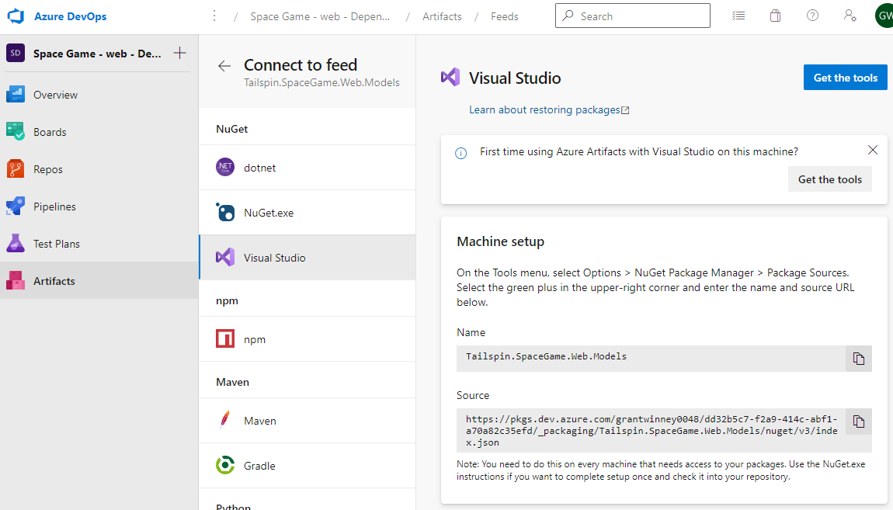
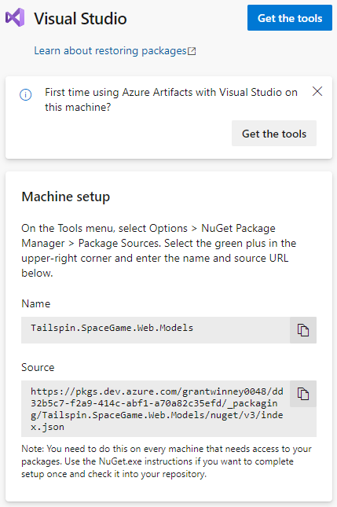
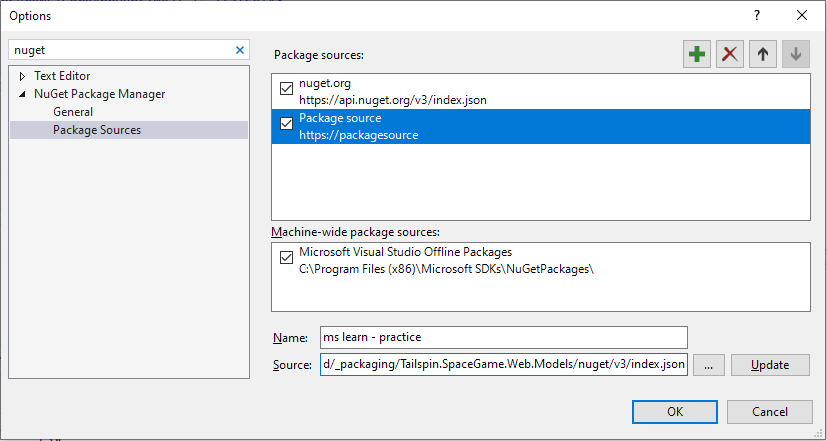
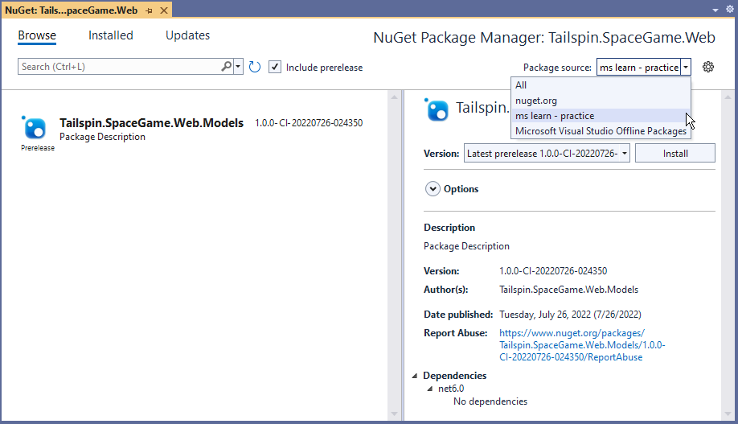
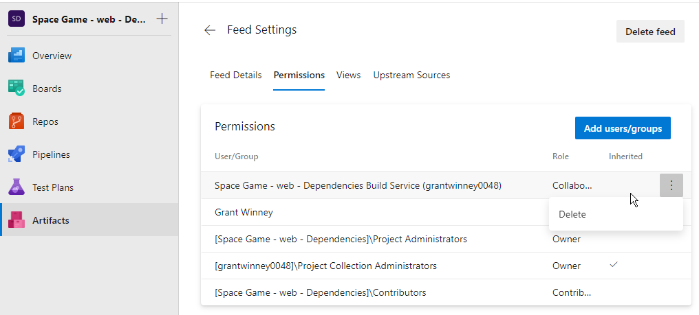
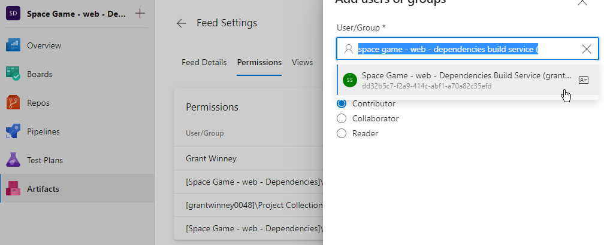
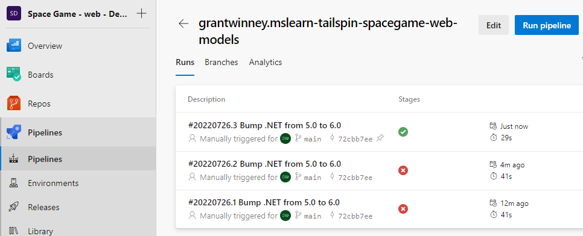
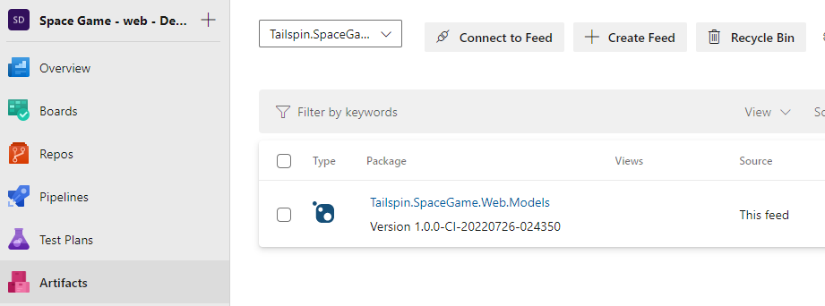

---
categories:
  - Learn
date: 2022-07-30T11:00:15Z
description: ""
draft: false
postimage: /banners/generic-learning-banner.webp
slug: esi-building-apps-with-azure-devops-manage-dependencies
summary: Continuing with Microsoft's ESI lessons, I learned about Azure Artifacts and the benefits of package managers. They're good. Use them. ;)
tags:
  - azure-devops
  - esi
  - devops
title: "ESI: Building Apps with Azure DevOps - Manage Dependencies"
---
I've been making my way through the Enterprise Skills Initiative, a program from Microsoft that has a lot of training material for Azure DevOps. This week was about creating and distributing packages of code using Azure Artifacts.

If you've used the .NET Framework or referenced a DLL, you've used packages. And if you've grabbed anything off of [NuGet](https://docs.microsoft.com/en-us/nuget/what-is-nuget), [npm](https://careerfoundry.com/en/blog/web-development/what-is-npm/), [pip](https://realpython.com/what-is-pip/), or the like, then you've used a [package manager](https://grantwinney.com/whats-a-package-manager/) like Artifacts.

[Manage build dependencies with Azure Artifacts - Training | Microsoft Learn](https://learn.microsoft.com/en-us/training/modules/manage-build-dependencies/)

There's several good reasons for learning how to package code, but the most obvious and popular is reusability. If you've got something you want to share with the world, you package it up, slap a license on it, and upload it to a public package manager so everyone can access your awesomeness.

You can host [private instances of package managers](https://docs.microsoft.com/en-us/nuget/hosting-packages/overview) too, to limit who you're sharing with, which is how a lot of people use Azure Artifacts. Most companies don't want to upload their proprietary code for all the world to see. Now you could make the argument of _"how dare they!",_ but from personal experience I think most companies are actually doing the world a favor by not sharing their code. _(snicker)_

While I'm on the topic, some _individuals_ shouldn't share their code with the world either - and if they do, [they certainly shouldn't remove it](https://www.sciencealert.com/how-a-programmer-almost-broke-the-internet-by-deleting-11-lines-of-code)! _Anyway..._

It's pretty easy to setup a new "feed" in Azure DevOps, and they provide instructions on how to connect to the feed from a variety of sources. Being that I'm primarily a .NET developer, I went right to Visual Studio. I've already used this before at work, to connect to our private feed, but it's interesting to "officially" read about it here.

Another good reason to setup your own feed is when you've got dependencies that you're unlikely (or unable) to change, and that have nowhere else to live.

When I first figured out how to use Artifacts at work, I inherited a project that hadn't been touched in years. It had a dependency that I figure the last developer had on his or her laptop, and they probably just built locally and copied everything to the web server. The file wasn't available in the code repo and I couldn't find it online anymore, but there was still a copy on the web server itself.

Now what to do with it? I could've just included it in the repository, but bloating a code repo with a bunch of extra dll's _(or a 100 mb video like an old coworker did many years ago, heh)_ is silly if you can avoid it, plus what if the same file ends up being needed by other repos too? So I hosted it in Artifacts, created a DevOps job that pulled in the file and built the project, and referenced the new feed in Visual Studio so I could build it locally too. No extra bloat, and I know right where the file is. If I ever find a newer version of it, I can upload that too and change the version in the project.

All in all, another good lesson on an important topic. Nothing I've seen so far in these lessons has gone very indepth, and there's a lot of handholding and spoonfeeding, but it's a good starter. And everyone's got to start somewhere. There's a few links at the end, like always, and one of them was to another [Azure Artifacts overview](https://docs.microsoft.com/en-us/azure/devops/artifacts/start-using-azure-artifacts?view=azure-devops) elsewhere on the Microsoft site.

Oh, and bonus points, the code built and ran, right out of the gate. In the last lesson, someone had started upgrading .NET 5.0 to 6.0 but hadn't upgraded everything. No build errors this time though. The pipeline, on the other hand, failed on the _"Publish NuGet package"_ task.

> The nuget command failed with exit code(1) and error(Response status code does not indicate success: 403 (Forbidden - User '6f64fd29-375b-4882-af48-61221e5a6303' lacks permission to complete this action. You need to have 'AddPackage'. (DevOps Activity ID: D750451C-47AC-4FE5-946E-6F0808287D85)).

I don't know what was wrong for sure, but I deleted one of the user permission settings (below), then re-added the same user with the same default permission, and voila. As usual, I'll just pretend it was intentional and I knew exactly what I was doing. ;)

