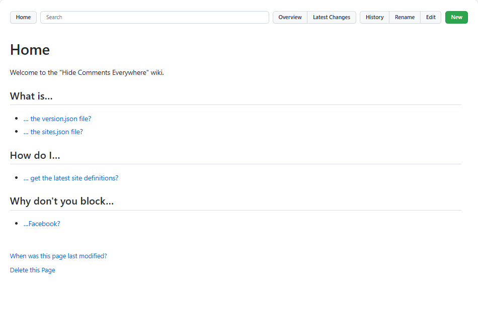

---
categories:
  - Explore
date: 2017-01-16T07:52:51Z
description: ""
draft: false
postimage: /banners/default-explore-banner.webp
slug: 5-things-you-can-do-with-a-locally-cloned-github-wiki
summary: There’s a feature of every GitHub repo that in my experience doesn’t get a ton of love, and that's the wiki. In all fairness, I'm not sure how much love it deserves - it's sorely lacking in features. But did you know it's a separate repo that you can clone and manipulate locally?
tags:
  - git
  - github
title: 5 Things You Can Do With a Locally Cloned GitHub Wiki
---
For software developers, GitHub is a useful (possibly even indispensable) tool. We use it for our personal projects, finding new libraries to use, and collaborating as a team. There’s a feature of every GitHub repo that I hear little about and rarely think about – the wiki.

We can take notes in it and link pages together, but the GitHub wiki's lack of short-codes/widgets (i.e. adding a table of contents to the top of each page) and other basic features (like uploading images via the UI) makes it less useful than it could be.

For nearly a year, I used it at work for internal team documentation, and its shortcomings were frustrating. Then I discovered something that seems to open the door to new possibilities. **A GitHub wiki is just another repo, which means it can be cloned locally and manipulated with other tools.**

## Cloning a GitHub Wiki

GitHub uses a wiki system called [Gollum](https://github.com/gollum/gollum), which is built on top of Git and stores its files in a Git repository. In other words, each repository's wiki is itself a _separate_ Git repository. We can clone a wiki, alter it, and commit our changes to it just like any other repo.

To clone a wiki, we can find the link conveniently shoved into the lower-right corner of the page, way near the bottom if there's already a lot of wiki pages in it.


We're presented with the "https" link, but can change it to the SSH link if needed.

- https: `https://github.com/your-account/your-project.wiki.git`
- ssh: `git clone git@github.com:your-account/your-project.wiki.git`

## Managing a Local Wiki

Now that we can clone a wiki locally, let's see what we can do with it.

### Edit a Wiki Offline (using Gollum)

As mentioned, GitHub uses Gollum to power its wiki. We can install Gollum locally to browse and edit a (cloned) wiki too, which means it's possible to edit pages without an Internet connection and push them back up later.

Installing Gollum differs based on the environment it's going to run in, which is [detailed in the readme file](https://github.com/gollum/gollum?tab=readme-ov-file#installation). For us Windows users, it requires [JRuby](https://github.com/jruby/jruby/wiki/GettingStarted), which in turn requires Java. And although the JRuby site indicates that we just need to decide on _"32- or 64-bit, and whether to bundle the Java Virtual Machine",_ there's no option to bundle it and the installer complains if it's missing.

First, head to the [Java download page](https://www.java.com/en/) and install the JRE, which includes the JVM that JRuby needs. Next, head to the [JRuby download page](https://www.jruby.org/download) and install the x64 Windows exe with Ruby 3.1.x support and accept the defaults. At this point, we can verify in PowerShell that they're both installed:


Verifying Java and JRuby are installed

Finally, start Windows PowerShell as an administrator and run `gem install gollum` to install Gollum – in other terminals, or in a non-admin PS window, it may fail. This took awhile for me, and seemed to lag on certain steps, but it eventually completed:


Let's change to the directory where the wiki is cloned and type "gollum" to fire up the Gollum server, which should show us which port it's running the site on:


Open up the browser to [http://localhost:4567](http://localhost:4567) and check it out. I used the wiki in my [Hide Comments Everywhere](https://github.com/grantwinney/hide-comments-everywhere/wiki) repo – GitHub hosted is on the left, and Gollum local is on the right.





The wiki files are just plain markdown files, so while we _could_ use any editor with these, it's nice to have access to something that looks similar to GitHub. There's some minor differences of course, but it's largely the same.

Every modification (edits, deletes, renames, etc) is committed to the repo individually, and when you're finished making changes, a `git push` sends your changes back to GitHub.

_**Note:**_ _Gollum will only show changes to your wiki pages that have been committed. If you change a page in a text editor, Gollum will not show the updated page until it has been committed to the repo (you don't have to push it up)._

### Generate HTML Docs

Many of us have GitHub repos marked as private, with things we're developing that we don't want to share with the world. But if our project is hidden, so is our wiki. What if we've got some useful documentation that we _do_ want to share?

Wiki pages can be run through tools that generate HTML pages, which can then be published online, eliminating the need to create documentation twice. One such tool is [Pandoc](http://pandoc.org/index.html), which can convert between many of the markup formats Gollum (and GitHub) supports.

The [installation page](http://pandoc.org/installing.html) for Pandoc has instructions for different systems – for Windows, it's just a simple msi file that runs in under a minute. After it installs, we can verify the version in a terminal window:


Verifying the Pandoc version

Running a conversion can be as simple as specifying two files and letting Pandoc make reasonable assumptions, probably based on file type:

`pandoc .\Home.md -o .\Home.html`

Here's how the main page of one of my project wikis looks. On the left is the GitHub hosted version, then the local Gollum version in the middle, and finally the Pandoc HTML one on the right.


Various rendered outputs of the same wiki page

The output could use some CSS styling (it's actually nice that we get a very plain version, which we can style as we like), and may require further processing (for example, internal links between markdown pages would need updated to point to the equivalent HTML pages), but the result is really good and saves a lot of manual work.

We could further modify the output by adding a copyright notice, or generate a master document that acts as a table of contents, or even call a script to do this from a build server like Travis CI or TeamCity as part of a build to generate HTML documentation automatically. Lots of possibilities!

### Insert a Table of Contents

Even though we could have huge wiki pages with dozens of headers, there is no consistent way to autogenerate a table of contents using the default "markdown" syntax. [Gollum supports TOCs](https://github.com/gollum/gollum/wiki#user-content-table-of-contents-toc-tag) with a simple `[[_TOC_]]` tag, but GitHub does not. If you've ever been annoyed by this, [you're not the only one](https://github.com/isaacs/github/issues/215) _(but the odds of it changing anytime soon are_ [_slim_](https://github.com/github/markup/issues/904)_)._

One option is to write a short script in the language of your choice that parses the file and creates a TOC for you. Here's one I wrote in Perl that parses the file for headers, then inserts them into the top of the file and surrounds the TOC with the best [approximation of a comment for markdown](http://stackoverflow.com/a/20885980/301857) that I could find so that it can update the TOC later.

```perl
use strict;
use warnings;
use File::Copy;
 
my $tocBegin = "[//]: # (Start of TOC)\n";
my $tocEnd = "[//]: # (End of TOC)\n";
 
foreach my $file (<*.md>)
{
    open(my $fh, '<', $file) or die "Can't open $file: $!";
    my @lines = <$fh>;
    close $fh or die "Can't close $file: $!";
 
    my @headers = ();
    foreach (@lines)
    {
        if ($_ =~ /^###/) {
            push @headers, createLink($_, 3);
        }
        elsif ($_ =~ /^##/) {
            push @headers, createLink($_, 2);
        }
        elsif ($_ =~ /^#/) {
            push @headers, createLink($_, 1);
        }
    }
 
    if (scalar(@headers) == 0) {
        next;
    }
 
    open(my $in, '<', $file) or die "Can't open $file' $!";
    open(my $out, '>', "$file.new") or die "Can't write $file.new: $!";
 
    print $out $tocBegin;
    print $out "*TABLE OF CONTENTS*\n";
    foreach(@headers) {
        print $out $_;
    }
    print $out "\n---\n";
    print $out $tocEnd;
 
    my $traversingOldToc = 0;
    while(<$in>) {
        if ($_ eq $tocBegin) {
            $traversingOldToc = 1;
        }
        elsif ($_ eq $tocEnd) {
            $traversingOldToc = 0;
        }
        elsif ($traversingOldToc == 0) {
            print $out $_;
        }
    }
 
    close $in or die "Can't close $file: $!";
    close $out or die "Can't close $file.new: $!";
 
    move("$file.new", $file) or die "Can't rename $file.new to $file: $!";
}
 
sub createLink {
    my $currentLine = $_[0];
    my $indent = $_[1];
 
    my $text = substr($currentLine, $indent);
    $text =~ s/^\s+|\s+$//g;
    my $link = lc $text =~ s/ /-/rg;
    return " " x (($indent-1)*2) . "- " . "<a href=\"#user-content-$link\">$text</a>\n";
}
```

You'd need to do some work to get this production-ready (such as stripping punctuation from the headers since they aren't included in the anchors) but it does the trick in simple scenarios. Here's how it renders:


Now that I showed you the harder way, you could search for one of the many projects out there that do it for you. For example, a quick search turned up [DocToc](https://github.com/thlorenz/doctoc), which you can install with [npm](https://www.npmjs.com/). If you check the output below, you'll see that DocToc recursively checks inside other directories (like "images"), just in case you're structuring your wiki differently than the default "all pages in a single folder" style.

```
grantwMac:pinboard-bookmarks-to-chrome.wiki gwinney$ doctoc .
 
DocToccing "." and its sub directories for github.com.
 
Found Another-test.md, Home.md, Manual-Test-Scenarios.md, My-test-wiki-page.md, Rate-Limiting-Retrieval-of-URLs-from-Pinboard.md, Rationale-for-Not-Using-Sync-Storage.md in "."
 
Found nothing in "images"
 
==================
 
"Home.md" is up to date
"Manual-Test-Scenarios.md" is up to date
"Rate-Limiting-Retrieval-of-URLs-from-Pinboard.md" is up to date
"Rationale-for-Not-Using-Sync-Storage.md" is up to date
"Another-test.md" will be updated
"My-test-wiki-page.md" will be updated
 
Everything is OK.
 
grantwMac:pinboard-bookmarks-to-chrome.wiki gwinney$ git status
On branch master
Your branch is up-to-date with 'origin/master'.
Changes not staged for commit:
  (use "git add <file>..." to update what will be committed)
  (use "git checkout -- <file>..." to discard changes in working directory)
 
 modified:   Another-test.md
 modified:   My-test-wiki-page.md
```

The end-result is similar in appearance to mine, even using comments (albeit regular HTML comments) to mark the TOC so it can be updated later.

```
<!-- START doctoc generated TOC please keep comment here to allow auto update -->
<!-- DON'T EDIT THIS SECTION, INSTEAD RE-RUN doctoc TO UPDATE -->
*Table of Contents*  *generated with [DocToc](https://github.com/thlorenz/doctoc)*
 
- [Important stuff](#important-stuff)
  - [Less Important but Relevant Stuff](#less-important-but-relevant-stuff)
    - [Wassup](#wassup)
- [Next major point](#next-major-point)
 
<!-- END doctoc generated TOC please keep comment here to allow auto update -->
```


While we're at it, pandoc can do it too by specifying the `--toc` argument. Here's a quick script for converting your markdown files into HTML documentation that includes a table of contents.

```bash
FILES="*.md"
for f in $FILES
do
    base=`basename $f ".md"`
    pandoc --toc -s -f markdown $f > "$base".html
done
```

### Easily Upload (and Add) Images

The GitHub wiki has a button for inserting image links into your wiki page, but it assumes the image is already uploaded somewhere and that you know the URL. There's no mechanism for dropping an image into the editor or otherwise uploading files to the wiki.

If you've got a wiki page to create that involves a lot of images, you may want to clone locally. Gollum supports uploading files when you start it with the right option, as well as [a myriad of other options](https://github.com/gollum/gollum) you'll want to check out too.

```
gollum --allow-uploads dir
```

Drag a file over the editor and it'll show a light green border around it. The file is copied to the repository, and a link to the file is inserted into the wiki page. If the file is an image, it should be displayed.

```
[[/uploads/custom toc from doctoc wiki5.png]]
```

Files dropped onto the editor this way are committed, and will be pushed up with the rest of your wiki.


The `show-all` flag complements this nicely too.

```
gollum --allow-uploads dir --show-all
```

With that option enabled, clicking the "All" or "Files" buttons in the wiki will show _everything,_ not just pages.


### Manipulate Pages with the Ruby API

One more option for manipulating pages is the Ruby API called [Gollum-lib](https://github.com/gollum/gollum-lib). To install it, just run `gem install gollum-lib`.

Gollum-lib is nice because it abstracts away some of the nitty-gritty details. For example, the Perl script I wrote earlier could be modified to print out the contents of the file it's iterating through. Or we could just write a few lines of Ruby using gollum-lib.

Here's a short script that loads the local wiki _(use the relative path from your Ruby script)_, then loads a page from the wiki and calls the `raw_data` function to output the contents of the file. You can see the output in the terminal window in the bottom half of the screenshot.


What else can we do with the API?

A one-liner change from `page.raw_data` to `page.formatted_data` renders the page in HTML output:

```html
<p><strong>Table of Contents</strong>  <em>generated with <a href="https://github.com/thlorenz/doctoc">DocToc</a></em></p>
 
<ul>
  <li>
<a href="#heading-one">Heading One</a>
    <ul>
      <li><a href="#heading-one-sub-blahlblah">Heading One Sub bLahlblah</a></li>
    </ul>
  </li>
</ul>
 
 
 
<p><strong>TABLE OF CONTENTS</strong>
- <a href="#user-content-heading-one">Heading One</a>
  - <a href="#user-content-heading-one-sub-blahlblah">Heading One Sub bLahlblah</a></p>
 
<hr />
<p># Heading One</p>
 
<p>Headin' on...</p>
 
<h2><a class="anchor" id="heading-one-sub-blahlblah" href="#heading-one-sub-blahlblah"><i class="fa fa-link"></i></a>Heading One Sub bLahlblah</h2>
 
<p>Read <em>me</em>.</p>
```

If you wanted a list of all versions of your pages, you could easily get to that information with the API:

```ruby
require 'rubygems'
require 'gollum-lib'
 
wiki = Gollum::Wiki.new('pinboard-bookmarks-to-chrome.wiki')
Dir.foreach('pinboard-bookmarks-to-chrome.wiki') do |item|
  ext = File.extname(item)
  next if ext != '.md'
  page = wiki.page(File.basename(item, ext))
  puts "#{item}: #{page.version.id}\n"
end
```

Here's what it outputs:

```
Another-test.md: dde4a0571de2a1791cdb8bf3575e957e45944873
Home.md: dde4a0571de2a1791cdb8bf3575e957e45944873
Manual-Test-Scenarios.md: dde4a0571de2a1791cdb8bf3575e957e45944873
My-test-wiki-page.md: dde4a0571de2a1791cdb8bf3575e957e45944873
Rate-Limiting-Retrieval-of-URLs-from-Pinboard.md: dde4a0571de2a1791cdb8bf3575e957e45944873
Rationale-for-Not-Using-Sync-Storage.md: dde4a0571de2a1791cdb8bf3575e957e45944873
```

Or maybe you want an outline of all pages, including a table-of-contents if headers are present, that links to the original wiki:

```ruby
require 'rubygems'
require 'gollum-lib'
 
wiki = Gollum::Wiki.new('pinboard-bookmarks-to-chrome.wiki')
html = '<h1>Wiki Contents</h1>'
html << '<style>p { font-size:larger; font-weight:bold }</style>'
 
Dir.foreach('pinboard-bookmarks-to-chrome.wiki') do |item|
  ext = File.extname(item)
  next if ext != '.md'
  basename = File.basename(item, ext)
  page = wiki.page(basename)
  html << "<hr><p><a href=\"https://github.com/grantwinney/pinboard-bookmarks-to-chrome/wiki/#{basename}\">#{page.name}</a></p>"
  toc = page.toc_data
  next if toc.nil?
  html << "#{toc}"
end
 
File.write('outline.html', html)
```

That'll produce a small HTML page with a link to each wiki page and a table of contents if available. _(The missing header below was due to some wonky markdown in that file.)_


So far, all we've seen is how to query data.

It's also possible to commit your changes from the API too. Here's a Ruby script that loops through your pages, inserts a copyright notice at the very top (if there isn't already one), and then commits the modified files to your wiki repository.

```ruby
require 'rubygems'
require 'gollum-lib'
 
wiki = Gollum::Wiki.new('pinboard-bookmarks-to-chrome.wiki')
 
def create_commit(page)
  { :message => "added copyright to #{page}",
    :name => 'Grant Winney',
    :email => 'user@email.com' }
end
 
copyright = '<p><em>Copyright 2017 - Grant Winney - <a href="https://opensource.org/licenses/MIT">MIT License</a></em></p>'
 
Dir.foreach('pinboard-bookmarks-to-chrome.wiki') do |item|
  ext = File.extname(item)
  next if ext != '.md'
  basename = File.basename(item, ext)
  page = wiki.page(basename)
  if (!page.raw_data.start_with?(copyright))
    wiki.update_page(page,
                     page.name,
                     page.format,
                     "#{copyright}\n\n#{page.raw_data}",
                     create_commit(page.name))
  end
end
```

Here's the rendered output:


## What's Next..?

There are still some shortcomings in Gollum, but far fewer of them when working locally rather than through GitHub.

I hope this helped you out, and that you learned something new! If you discover any other good uses of cloning your wiki locally, or create something cool with the Ruby API, let me know! I'd love to check it out.

Good luck!
