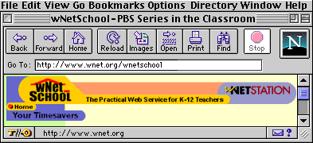

---
categories:
  - Explore
date: 2021-07-15T21:46:32Z
description: ""
draft: false
postimage: /banners/default-explore-banner.webp
slug: can-i-write-my-own-html-tags
summary: Can you create your own HTML tags? The answer is..... sorta. Yes and no. Not completely, but a little. Typical, I know.
tags:
  - html
title: Can I write my own HTML tags?
---
As usual, the answer is... yes and no.

There's a standard set of HTML tags, css elements, and JavaScript code that you can use in any browser, like div and font-weight and alert, but the reason any of it works is a two-step process.

1. Someone writes up what all those tags and styles should do, and documents them in the [HTML Standard](https://html.spec.whatwg.org/), [CSS specs](https://www.w3.org/Style/CSS/specs.en.html), [ECMAScript language spec](https://262.ecma-international.org/12.0/), [Web API specs](https://developer.mozilla.org/en-US/docs/Web/API), etc.
2. Someone else creates a browser that implements all those standards, so that font-weight makes your text appear bold, not colored red.

This leads to a nice, predictable experience, unlike ye olden days when [IE](https://docstore.mik.ua/orelly/web2/wdesign/appd_01.htm) and [Netscape](https://docstore.mik.ua/orelly/web2/wdesign/appd_02.htm) used to create their own proprietary tags that only worked in their own browsers. If you've been around long enough, you'll remember seeing these littered throughout the net, usually when a site only worked well in a single browser.


But now, standards and standards-compliance is the name of the game, and the differences between the major browsers are in the features they provide (sync'ing bookmarks, ad blocking, etc), not in how they display web pages. It's a win-win for everyone.

We can use the standard HTML elements, and apply the standard CSS styles to those elements...

```html
<style type="text/css">
    div { background: #ff6; color: red; }
</style>
<div>Sample!</div>
```

... and we'll always get a box with a yellow background and red text.


_But..._ what if we don't want all our div boxes to have a yellow background? What if you want some of them to have a _blue_ background? Just assign a class named "blue" to the div, and layer on the css...

```html
<style type="text/css">
    div { background: #ff6; color: red; }
    div.blue { background: #6cf; }
</style>
<div>Sample!</div>
<div class="blue">Sample 2!</div>
```

... and the new styles are applied to the second div.


But _but..._ what if you didn't want to keep applying that class to divs that should be blue? What if you just wanted an "angrydiv" element that displays a bright red box?

```html
<style type="text/css">
    div { background: #ff6; color: red; }
    angrydiv { background: red; color: white; display: block; }
</style>
<div>Sample!</div>
<angrydiv>Arrrg!</angrydiv>
```

That's completely doable. Just create a new element, then use the standard css styles to give it the look you want.


It's interesting that this works, but it's completely predicable and works in every browser I've tried, so I imagine there's something in the specs that allows for it. If you know where, feel free to leave a comment. I'd be interested in checking it out.

The limitation here is that you can't extend existing elements, or just invent new elements that do something outside of how css can change their appearance. Like, you can't just create an "errortable" element and use that with tr and td elements inside it, because the browser uses all of those in combination, and has no idea what to do with a td if it's not nested in a standard table. Most likely, it'll just display all your text on one line instead of in a tabular format.

But css can do a _lot._ You can have div's that behave much like tables, then create an errortable, errorrow, etc. I'm not saying that's a great idea. In fact, it doesn't offer much of anything over just assigning a class to the table, especially if you're not writing the site by hand using HTML. It's just an interesting oddity.


Because? Why not? Actually, the idea for writing about this came from [Leon Arnott's neocities site](https://leonarnott.neocities.org/), which I stumbled on at random while hopping around the geocities replacement the other day. The sites on there are _seriously_ bad.. in a wow-websites-were-ugly-so-why-do-i-still-feel-nostalgic sorta way.

Here's a few elements based on those CSS elements (I think I got these from [Brad Gessler](https://bradgessler.com/) originally, but I've lost the direct link):

[Goofy CSS effects](https://codepen.io/astrangegame/pen/bNVjxmN)

Still here? Something else random to reward you with then...

When I was looking for those browser button images at the top of this post, I stumbled across something from 20 years ago that's somehow still up. I love finding this stuff. [What is the Internet](https://www.thirteen.org/edonline/primer/)? How do you [get the most out of your browser](https://www.thirteen.org/edonline/primer/b_how.html)? All your questions will be answered. You're welcome!


