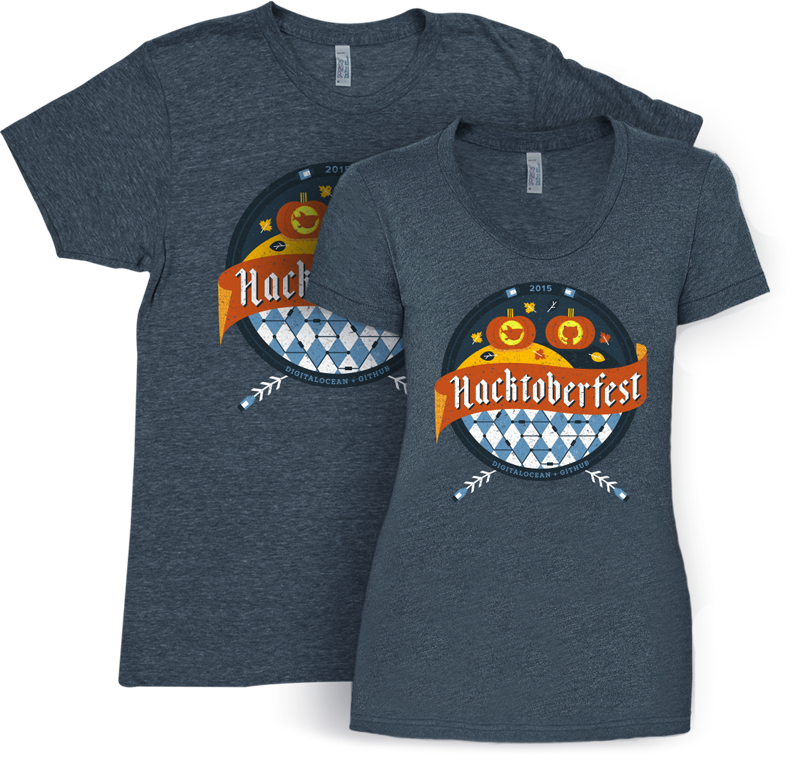

---
categories:
  - Reflections
date: 2015-11-12T07:27:00Z
description: ""
draft: false
cover:
  image: hacktoberfest-sticker.png
slug: hacktoberfest-and-making-my-first-oss-contributions
summary: I made my first OSS contributions during HacktoberFest, gaining experience (and swag!) with the help of DigitalOcean and GitHub. :)
tags:
  - oss
title: HacktoberFest and My First OSS Contributions
---
All last month, DigitalOcean carried out an event called HacktoberFest. In their own words…

> HacktoberFest is a month-long event encouraging people to contribute to GitHub-hosted open source projects, whether by fixing bugs, creating new features, or updating and writing documentation.

More significantly, t-shirts were involved. And stickers.

Developers love them some swag. And we’re pretty much suckers for any kind of prize if it means proudly lording it over our fellow developers for a little while. In hopes of inspiring each other, of course.

DigitalOcean didn’t leave people to flounder about looking for projects either. They worked with project owners to compile [The List](https://hacktoberfest.digitalocean.com#projects), filterable by language, and then those owners could tag issues as “up for grabs” or “jump in”. It made it easier to find things to work on.

Some people in our local Akron/Cleveland community even organized meetups throughout the month, which was great. It gave the rest of us an opportunity to hack (and learn) together.

In the end, I only managed 2 pull requests, but I’m okay with that. At least I got my feet wet, and provided a couple contributions, which after all was the spirit of the thing…

What did I learn?

- **Look for documentation.** My first PR was for someone who knew English, but wasn’t fluent. He opened an issue asking for proof-reading, and seemed genuinely happy with my contribution.
- **It’s not your baby.** My second PR wasn’t accepted, and the terse comment left on it gave me nothing to improve. But I didn’t grow the project from scratch, laboring hour after hour to cultivate it. In the end, I tried to provide something of value and apparently didn’t.
- **Look for other lists too**, like [up-for-grabs.net](http://up-for-grabs.net/#/).
- **I found cool projects I never knew existed**, like this curated [list of free programming books](https://github.com/vhf/free-programming-books).
- **GitHub makes it easy to contribute.** Fork a project, make changes, and complete a PR right from the web. And when your PR is accepted, GitHub will let you know it’s safe to delete your fork, and even give you a button to do it.

It got me thinking about all the awesome free software I use (open source or otherwise). While writing this, I visited the page for every WordPress plugin I use and left a thank you comment and positive rating. It’s easy to forget how much time and effort goes into some of the software we use every day!
