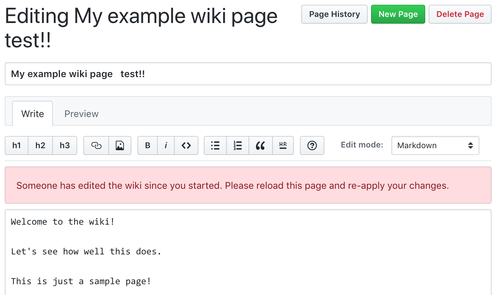

---
categories:
  - Tools
date: 2018-10-29T12:19:38Z
description: ""
draft: false
cover:
  image: photo-1498707406720-1094aef934da.jpg
slug: hosting-a-github-wiki-remotely-on-ubuntu
summary: I've always been a fan of wikis, but GitHub's is so poorly designed it doesn't get much love. I once wrote about cloning a wiki locally and editing it using Gollum, but now I'm taking a look at hosting it externally on DigitalOcean, using Gollum and keeping it in sync with the repo hosted on GitHub.
tags:
  - wiki
  - github
title: Hosting a GitHub wiki on Ubuntu (and keeping it in sync)
---
I've always been a fan of wikis for documentation and record-keeping. I even keep an instance of [Dokuwiki running on DigitalOcean](https://grantwinney.com/creating-your-own-secure-wiki-using-dokuwiki/) for personal notes, and before that I had Confluence running on a spare machine at home. GitHub uses wikis too, creating one for every project you spin up. Unfortunately it's so poorly designed that I don't think it gets much love. There's no built-in search, no file upload, no table of contents... it _could_ be a whole lot more.

Awhile back, I wrote about how [GitHub wikis are separate repos](https://grantwinney.com/5-things-you-can-do-with-a-locally-cloned-github-wiki/) you can clone and edit using [Gollum](https://github.com/gollum/gollum), which gives you a much richer interface, but that was about running locally and assumed no one else would be editing the wiki online. What if we could host a clone of the wiki externally - like on a DigitalOcean vm - using the full capabilities of Gollum to edit it, and keep it in sync with the repo hosted on GitHub? We can.. but first...

## What this isn't

This isn't a production-ready solution. If you follow this through, you'll have a publicly available clone of your GitHub wiki, which can sync with GitHub in both directions (most of the time). But there are security considerations and other caveats, which I listed at the end. Every problem has a solution though... maybe you'll be the one to find the answer. :)

Now let's see what we can do!

---

## Spin up a DigitalOcean server

[Sign up for a DigitalOcean account](https://m.do.co/c/448f25462030) if you don't already have one, or login to your existing account, and create a new Ubuntu box. You can spin up a vm wherever you'd like, but I use DO for this blog and playing around with new ideas, and I'd recommend them to anyone - they've got an awesome service. For this little exercise, a minimal $5/mo box will work just fine, and you can always increase it later if you'd like.


It takes a minute or two to create it, and then you'll get an email telling you how to login as root. The first thing I'd suggest doing after you login and change your root password is to [create a new user with sudo access](https://www.digitalocean.com/community/tutorials/how-to-create-a-sudo-user-on-ubuntu-quickstart), and then do everything as _that_ user instead.

Note that there's also an option part way down the page to "[Add your SSH keys](https://www.digitalocean.com/docs/droplets/how-to/add-ssh-keys/)", which is worth checking out, but which I'm not going to cover here. Once it's setup on your machine, you don't have to remember your password anymore.

---

## Install Gollum (and everything else)

The first thing we'll do is [install Gollum](https://github.com/gollum/gollum/wiki/Installation), as well as ruby, git, and a few other tools. The _"Installing ri documentation for ..."_ lines might seem to get stuck, but just wait 5 or 10 minutes and they should complete.

```sh
sudo apt-get update
sudo apt-get install ruby ruby-dev make zlib1g-dev libicu-dev build-essential git cmake
sudo gem install gollum
```

Eventually, you should see something like this:

```sh
Done installing documentation for charlock_holmes, posix-spawn, mime-types-data, mime-types, diff-lcs, gitlab-grit, gollum-grit_adapter, rouge, mini_portile2, nokogiri, stringex, sanitize, github-markup, gemojione, unf_ext, unf, twitter-text, gollum-lib, kramdown, rack, tilt, rack-protection, sinatra, mustache, useragent, gollum after 601 seconds
26 gems installed
```

---

## Clone the wiki repo

We just installed git, so we can clone the repo onto the vm. First though, [setup SSH access to GitHub](https://help.github.com/articles/connecting-to-github-with-ssh/). Without it, you'll either have to enter your login and password for GitHub every time you push something (which won't work for what we're trying to do), or save your login and password to disk (which isn't very secure).

Start by [generating a new SSH key](https://help.github.com/articles/generating-a-new-ssh-key-and-adding-it-to-the-ssh-agent/#platform-linux), and then [add the key to your GitHub account](https://help.github.com/articles/adding-a-new-ssh-key-to-your-github-account/#platform-linux). Just follow the instructions they've laid out - accepting defaults where possible is fine. The only difference is step 1 for adding the key to your account - you're on a vm so copying to your clipboard won't be much help. Type `more ~/.ssh/id_rsa.pub` to output the key to the console so you can manually copy it over to GitHub instead.

After you've [confirmed that the key works](https://help.github.com/articles/testing-your-ssh-connection/#platform-linux), clone the wiki repo into your home directory. You can find the link near the bottom of the wiki, in the lower-right corner (unlike the main project, which lists the "clone" link right at the top).


You'll want to change the link to an SSH format, which they provide for you on a repo but (unhelpfully) not on a wiki repo. That's okay, just manually change it.

- from **https**: `https://github.com/your-account/your-project.wiki.git`
- to **ssh**: `git clone git@github.com:your-account/your-project.wiki.git`

While you're here, provide an email and name for `git` to associate with commits:

```sh
  git config --global user.email "you@example.com"
  git config --global user.name "Your Name"
```

Switch to the "your-repo.wiki" directory and type "gollum" to fire up the Gollum server, which uses [Sinatra](http://www.sinatrarb.com/) running [WEBrick](https://ruby-doc.org/stdlib-2.0.0/libdoc/webrick/rdoc/WEBrick.html) to serve up your wiki pages in a browser. If it starts okay, it should show you something like this:

```none
[2018-10-22 13:16:31] INFO  WEBrick 1.3.1
[2018-10-22 13:16:31] INFO  ruby 2.3.1 (2016-04-26) [x86_64-linux-gnu]
== Sinatra (v1.4.8) has taken the stage on 4567 for development with backup from WEBrick
[2018-10-22 13:16:31] INFO  WEBrick::HTTPServer#start: pid=9445 port=4567
```

Open your browser to `http://your-ip-address:4567` (replacing the IP address with whatever is in your DigitalOcean dashboard). You should see the cloned wiki being displayed by Gollum. As I mentioned earlier, be aware that this is very insecure - anyone with access to the URL can edit your wiki!


Edit a page in Gollum, and it'll automatically commit your changes. Unfortunately, it doesn't _push_ your changes automatically, so that they're reflected on GitHub right away, but we'll fix that soon. Hit ctrl-c to exit Gollum for now.

---

## Send wiki edits to GitHub

Gollum commits wiki edits to the locally cloned repo, but it doesn't push them. Normally an executable file in `.git/hooks` with `git push origin master` in it would be enough, but for some reason Gollum doesn't trigger the hooks. I'm not sure why that is, but [there's a fix](https://github.com/gollum/gollum-lib/issues/12).

Create a file in your home directory called `gollum_config.rb` and add the following to it. After Gollum does a commit, it'll pull in changes from anyone else and then push your changes out.

```ruby
wiki = Gollum::Wiki.new(".")

# on commit, pull latest from repo and push changes to repo
Gollum::Hook.register(:post_commit, :hook_id) do |committer, sha1|
  wiki.repo.git.pull("origin", "master")
  wiki.repo.git.push("origin", "master")
end
```

Switch back to your repo and start Gollum again, this time [passing it your config file](https://github.com/gollum/gollum#configuration):

```sh
gollum --config ../gollum_config.rb
```

Now make a change in your wiki and save it. It'll pause for a moment as it runs the code in the hook, and then you'll see the changes on GitHub!

---

## Get wiki edits from GitHub

We can make changes to the wiki in the vm and they get pushed to GitHub, but what happens when someone makes a change on GitHub? How do we et those updates? GitHub can notify you when nearly anything happens concerning your repo, by letting you specify a URL it should send notifications to (a webhook). One of these events is called the [GollumEvent](https://developer.github.com/v3/activity/events/types/#gollumevent), which is _"triggered when a Wiki page is created or updated"_ and that's the one we need.

### Configure a webhook to send notifications

On GitHub, find the Settings tab for your repository, and configure it to send out notifications when your wiki is updated. _(I removed some available events from the screenshot below for readability - you'll see many more.)_ The `/wiki_update` endpoint is what we'll create next, using Sinatra.


### Receive notifications with Sinatra

We'll use the Sinatra web server _(check out the_ [_Getting Started_](http://sinatrarb.com/intro.html) _guide)_ to receive notifications and take some action. Create a file in your home directory named "receive_updates.rb" and add the following code. Whenever a `POST` is made to the `/wiki_update` endpoint, it'll pull down the latest changes for your wiki's repo.

```ruby
require 'sinatra'

# bind to the public IP address of your vm
set :bind, '142.93.189.174'
set :port, 5678

get '/' do
  'Service Running!'
end

post '/wiki_update' do
  `cd BlogCodeSamples.wiki; git pull`
end
```

You have to [bind to the IP address](http://sinatrarb.com/configuration.html#bind---server-hostname-or-ip-address) of your vm (instead of the default 127.0.0.1) and change the default port number (because Gollum already binds to 4567). I considered trying to pull only the file that was updated, but the relative file path is not included in the [payload](https://developer.github.com/v3/activity/events/types/#gollumevent) (though you could probably hack the `html_url` value) and doing a `git pull` seems to work just fine.

Start your Sinatra server by running the file:

```sh
ruby ~/receive_updates.rb
```

You should see something like this, if all goes well:

```none
[2018-10-21 12:38:50] INFO  WEBrick 1.3.1
[2018-10-21 12:38:50] INFO  ruby 2.3.1 (2016-04-26) [x86_64-linux-gnu]
== Sinatra (v2.0.4) has taken the stage on 5678 for development with backup from WEBrick
[2018-10-21 12:38:50] INFO  WEBrick::HTTPServer#start: pid=12286 port=5678
```

### Create a page and see the notifications

If you open two terminal windows, and start Gollum in one and your "receive_updates" app in the other, you should be able to make updates on the GitHub side and see them in your vm, and vice-versa. [Click here to see a short demo of what it should look like](remote_wiki_test1.gif). _(caution, the file is about 4mb)_

---

## Automating the services

Now we can go both ways, but we have two services to startup, and we're doing it manually. Let's automate everything to start at system bootup. Apparently there are [quite a few ways](https://askubuntu.com/q/814/322373) to do this, but we'll use the `crontab` way. Create a script in your home directory called `start_gollum.sh` and make it executable with `chmod +x start_gollum.sh`. Open it and add the following contents, which run both services in the background (otherwise the first one you run blocks the process, and the other won't start).

```sh
#!/bin/bash

ruby /home/grant/receive_updates.rb &

cd /home/grant/BlogCodeSamples.wiki
/usr/local/bin/gollum --config /home/grant/gollum_config.rb &
```

Then run `crontab -e` and at the very bottom of the file add the following line, which will run the above script when the machine boots up. Change the path as needed of course.

```sh
@reboot /home/grant/start_gollum.sh
```

Now do a `sudo reboot now` and let the machine come back up. Do both services start as expected?

---

## Security considerations

I've mentioned it a couple times, but I'll say it again. This setup as I've laid it out would be very insecure. Here's a few things you'd want to think about:

- **Enable a firewall** - Lock down open ports to only those needed (in this demo, it'd be 4567, 5678 and 22 for ssh), either by [configuring ufw](https://www.digitalocean.com/community/tutorials/how-to-set-up-a-firewall-with-ufw-on-ubuntu-16-04) or DigitalOcean's [cloud firewall](https://www.digitalocean.com/docs/networking/firewalls/).
- **Secure webhooks** - It wouldn't hurt to [secure your webhooks](https://developer.github.com/webhooks/securing/) using GitHub's "secret token" feature.
- **Add SSL** - Encrypt the connection with SSL, since by default everything is transmitted in plain text and is susceptible to [mitm attacks](https://en.wikipedia.org/wiki/Man-in-the-middle_attack).
- **Authentication / password protection** - Check out [this old issue in the Gollum repo](https://github.com/gollum/gollum/issues/107) for more info and some helpful suggestions. There's even a comment (albeit years old now) from someone who seems to work at GitHub and was involved in their efforts to prevent unauthorized access to a repo's wiki.

---

## Caveats

These are just the downsides / limitations that I noticed... I'm sure there's more.

- A delete on the GitHub side doesn't transmit a notification, so it's not reflected in the vm until you make an edit elsewhere that triggers a `git pull`. But a delete in the vm _is_ reflected on GitHub immediately, because it's pushing the change to the repo.
- If someone clones the repo to their machine, then edits a file manually and pushes the change, GitHub kicks off a notification for that file and the vm pulls in the change. However, if someone just uploads an image or other file, without editing a page, no notification is sent.
- If two people are editing a wiki page in GitHub, when one saves the other gets a warning that the page has been updated. This doesn't occur in Gollum, so it's possible to save your changes and blow away someone else's edit.



---

## What next?

Since installing Gollum is pretty much all that's needed here, it'd be interesting to try setting this up by running [Gollum in a Docker container](https://github.com/gollum/gollum/wiki/Gollum-via-Docker), perhaps using [DigitalOcean's one-click Docker app](https://docs.digitalocean.com/products/marketplace/catalog/docker/).

If you want to see what else you can do with Gollum, check out my post on [5 Things You Can Do With a Locally Cloned GitHub Wiki](https://grantwinney.com/5-things-you-can-do-with-a-locally-cloned-github-wiki/).
