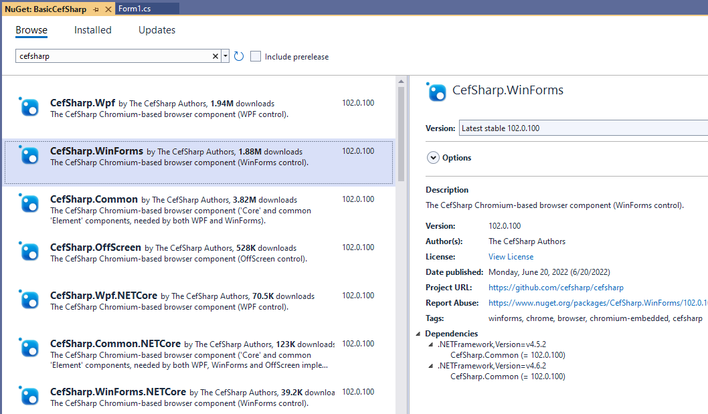
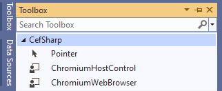
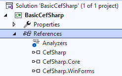
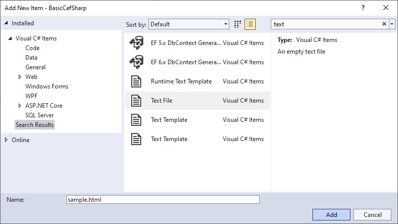
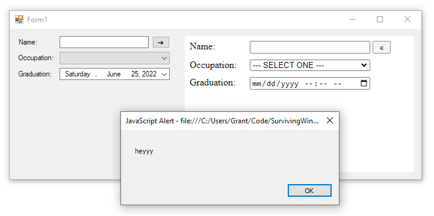
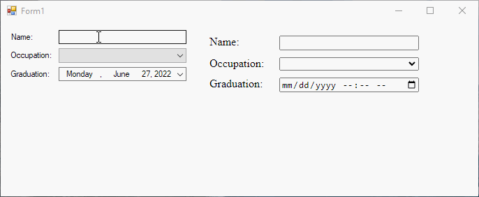

---
categories:
  - Learn
date: 2022-06-28T23:07:09Z
description: ""
draft: false
cover:
  image:
slug: hosting-a-simple-webpage-in-winforms-with-cefsharp
summary: WinForms and the web. Like oil and water, they don't mix well. But with CEFSharp, they mix a LOT better. Let's check it out.
tags:
  - surviving-winforms
  - winforms
  - cefsharp
  - cef
title: Host a simple webpage in WinForms with CefSharp
---
WinForms and the web. Like oil and water, they don't mix well. The web is the future, hands down. If I had an idea for an app that I wanted to share with the world, I'd make it a website, not a WinForms app. Who wants to worry about distribution and piracy and having to support nigh infinite number of slightly different machines it might run on? But WinForms isn't going away any time soon either.

Most companies with legacy WinForms apps, representing hundreds of IT personnel who spent decades (_hundreds of thousands_ of hours of business decisions and codified logic, testing and support, documentation and a proven track record), are not going to cut over to a website overnight. Not when those apps continue to perform and bring in a profit.

What if you wanted to start slowly introducing some webby stuff over time though? You could build new features as a website and host that _inside_ the app, slowly replacing more and more of the old UI with the new. Like a wasp laying an egg in a tarantula, the website slowly devours the WinForms code around it. ... Feel free to use that in your argument when it comes time to justify things later.

## Adding CefSharp to a project

There's a library called [CEF](https://bitbucket.org/chromiumembedded/cef/src/master/) that makes it possible to embed a Chromium browser in an application, and _another_ library called [CefSharp](http://cefsharp.github.io/) that wraps the first one to use with the .NET Framework. With that combo, we can host HTML content inside WinForms. I've used CefSharp before, and it's really powerful once you get the hang of it. Like everything in life, there's a learning curve. Time to dig in.

Fire up a new WinForms app, then search for CefSharp in the NuGet gallery and add the one for WinForms.



After a few moments and some output in the bottom pane, you'll see a few references on the right and a couple new design components in the toolbox on the left. If you're one of those people who customizes everything, then check for output on the top, references on the left, and the components on your other monitor.





Add a new file to your project, choose "text file", and name it "sample.html". Throw some html in there, and maybe some JavaScript. Anything will do. There are few absolute rules in web development, and having 20 ways to do any one thing is something I _love_ as a developer. It's just.. it's great. 😢



Here's what mine looks like:

```html
<html>
<head>
    <title>Sample Webpage</title>
    <style type="text/css">
        div {
            vertical-align: bottom;
        }
        label {
            float: left;
            width: 100px;
        }
        input, select {
            margin-bottom: 10px;
            width: 200px;
        }
    </style>
    <script type="text/javascript">
        function buttonPress() {
            alert('heyyy');
        }
    </script>
</head>
<body>
    <form>
        <div>
            <label>Name:</label>
            <input id="name" type="text" />
            <input id="send" type="button" value="&#171;" style="width:30px; vertical-align: bottom;" onClick="buttonPress()" />
        </div>
        <div>
            <label>Occupation:</label>
            <select id="occupation">
                <option>--- SELECT ONE ---</option>
                <option>Brand Evangelist</option>
                <option>Dynamic Web Mystic</option>
                <option>Emergent Media Maker</option>
                <option>Global Talent Supplier</option>
                <option>Happiness Mindset Exec</option>
                <option>Head of Mobility Dude</option>
                <option>Innovation Sherpa</option>
                <option>Information Advisor</option>
                <option>Zen Cloud Deputy</option>
            </select>
        </div>
        <div>
            <label>Graduation:</label>
            <input id="graduation" type="datetime-local" />
        </div>
    </form>
</body>
</html>
```

After you've got your fancy new page:

- Change the "Copy to output directory" property to "Copy always" for the file.
- Open the Form and drop a ChromiumWebBrowser control on there.
- In the Form constructor, load your new page.

```csharp
public Form1()
{
    InitializeComponent();

    chromiumWebBrowser1.LoadUrl($@"{Application.StartupPath}\sample.html");
}
```

What do you see when you fire it up? Does it load the page after a few moments? My sample's a little elaborate, with a few fields on the Form, and a few matching fields in the website too, and here's what it looks like. Because next... we're gonna take a peek at those handlers.



## What are CefSharp handlers?

You can see the [full list here](https://github.com/cefsharp/CefSharp/wiki/General-Usage#handlers), but handlers let you control from your WinForms app all kinds of things - navigation, page loading, the context menu, file dialogs, keyboard events, etc. In their own words:

> These are simple events that expose a small percentage of the underlying handlers that `CEF` provides. Implementing these handlers will provide you access to the underlying events and callbacks that are the foundation of CEF.

## Using handlers to pass data back and forth

Hosting a webpage inside a WinForms is just.. it's.. a little underwhelming tbh. I mean, why not just open it in a web browser unless there's a _reason_ for it living in the WinForms app? And there's only a reason if the two can actually interact somehow. Let's look at a couple ways to do that - the first is handlers.

You have to create a class that implements one of their handler interfaces and its required methods, and then defines what the methods should do. For example, you could create your own keyboard handler class that implements [IKeyboardHandler](https://cefsharp.github.io/api/102.0.x/html/T_CefSharp_IKeyboardHandler.htm), which (shocker) lets you intercept keyboard events.

The methods can do all kinds of stuff, but many of them have to return true or false, to indicate whether or not the event was handled. In my example, I'm passing the Form controls to the class too, so I can update them when a key is pressed on the webpage.

```csharp
public partial class Form1 : Form
{
    public Form1()
    {
        InitializeComponent();

        chromiumWebBrowser1.KeyboardHandler = new FancyKeyboardHandler(txtName, dtpGraduation);
        chromiumWebBrowser1.LoadUrl($@"{Application.StartupPath}\sample.html");
    }
}

public class FancyKeyboardHandler : IKeyboardHandler
{
    private readonly TextBox txtName;
    private readonly DateTimePicker dtpGraduation;

    public FancyKeyboardHandler(TextBox txtName, DateTimePicker dtpGraduation)
    {
        this.txtName = txtName;
        this.dtpGraduation = dtpGraduation;
    }

    public bool OnKeyEvent(IWebBrowser chromiumWebBrowser, IBrowser browser, KeyType type, int windowsKeyCode, int nativeKeyCode, CefEventFlags modifiers, bool isSystemKey)
    {
        chromiumWebBrowser.EvaluateScriptAsync("document.getElementById('name').value;")
                            .ContinueWith(x => txtName.Invoke(new Action(() => {
                                txtName.Text = Convert.ToString(x.Result.Result);
                            })));

        chromiumWebBrowser.EvaluateScriptAsync("document.getElementById('graduation').value;")
                            .ContinueWith(x => dtpGraduation.Invoke(new Action(() => {
                                dtpGraduation.Value = DateTime.TryParse(x.Result.Result.ToString(), out var gradDate) ? gradDate : DateTime.Now;
                            })));

        return true;
    }

    public bool OnPreKeyEvent(IWebBrowser chromiumWebBrowser, IBrowser browser, KeyType type, int windowsKeyCode, int nativeKeyCode, CefEventFlags modifiers, bool isSystemKey, ref bool isKeyboardShortcut)
    {
        // If you return true here, the keyboard event is considered 'handled', and OnKeyEvent will not fire.
        return false;
    }
}
```

Although I think handlers are really handy (ugh), sometimes they aren't quite enough. What about tracking mouse events to capture changes in the webpage? What about going the other direction, and using events in the WinForms UI to change the webpage?

## Executing JavaScript and intercepting data

There's a few other features in CefSharp that let us dial things up to 11.

- The `ExecuteScriptAsync` function lets you define a bit of JavaScript to execute against the webpage, performing some action like setting a value. You could even _get_ a value, and send it back to your WinForms app.
- The `CefSharp.PostMessage` function is what lets you send data back. You call it from within your JavaScript, as if it were any other valid JS command. But.. then you need to intercept that somehow.
- And that's where the `JavascriptMessageReceived` event handler comes in, watching for those posted messages so you can unwrap them.

Let's expand on the previous example to include these too. Here's what the updated code looks like.

By watching the `LoadingStateChanged` event, we know when the page is done loading and all the elements are available. When it's loaded, we can attach a script to watch for values changing on the website, and send those back to the WinForms.

If you want to send values from several different elements on the webpage, and be able to tell which one was sent, JSON is a pretty good solution. At least, it's the one I used below. That comes through the C# side of things as some kind of dynamic [ExpandoObject](https://docs.microsoft.com/en-us/dotnet/api/system.dynamic.expandoobject?view=net-6.0) thing, which happens to implement `IDictionary<string, object>` so it's trivial to parse the JSON and get the values back out.

Check out the event handlers like `cbxOccupation_SelectedIndexChanged` below too. It's also trivial to pass data from WinForms back to the website via JavaScript.

```csharp
public partial class Form1 : Form
{
    public Form1()
    {
        InitializeComponent();

        chromiumWebBrowser1.KeyboardHandler = new FancyKeyboardHandler(txtName, dtpGraduation);
        
        chromiumWebBrowser1.LoadingStateChanged += chromiumWebBrowser1_LoadingStateChanged;
        chromiumWebBrowser1.JavascriptMessageReceived += chromiumWebBrowser1_JavascriptMessageReceived;

        chromiumWebBrowser1.LoadUrl($@"{Application.StartupPath}\sample.html");
    }

    private void chromiumWebBrowser1_LoadingStateChanged(object sender, LoadingStateChangedEventArgs e)
    {
        if (!e.IsLoading)
        {
            chromiumWebBrowser1.ExecuteScriptAsync(@"
                let occupation = document.getElementById('occupation');
                occupation.addEventListener('change', (e) => {
                    CefSharp.PostMessage({occupation: occupation.options[occupation.selectedIndex].text});
                });

                let gradDate = document.getElementById('graduation');
                gradDate.addEventListener('input', (e) => {
                    CefSharp.PostMessage({gradDate: gradDate.value});
                });
            ");
        }
    }

    private void chromiumWebBrowser1_JavascriptMessageReceived(object sender, JavascriptMessageReceivedEventArgs e)
    {
        var message = ((IDictionary<string, object>)e.Message).Single();
        switch (message.Key)
        {
            case "gradDate":
                dtpGraduation.Invoke(new Action(() =>
                    dtpGraduation.Value = DateTime.TryParse(message.Value.ToString(), out var gradDate) ? gradDate : DateTime.Now
                ));
                break;
            case "occupation":
                cbxOccupation.Invoke(new Action(() =>
                {
                    if (message.Value.ToString() != "")
                        cbxOccupation.Text = message.Value.ToString();
                    else
                        cbxOccupation.SelectedIndex = -1;
                }));
                break;
        }
    }

    private void cbxOccupation_SelectedIndexChanged(object sender, EventArgs e)
    {
        chromiumWebBrowser1.ExecuteScriptAsync($"document.getElementById('occupation').value = '{cbxOccupation.Text}';");
    }

    private void dtpGraduation_ValueChanged(object sender, EventArgs e)
    {
        chromiumWebBrowser1.ExecuteScriptAsync($"document.getElementById('graduation').value = '{dtpGraduation.Value:yyyy-MM-ddThh:mm}';");
    }

    private void txtName_TextChanged(object sender, EventArgs e)
    {
        chromiumWebBrowser1.ExecuteScriptAsync($"document.getElementById('name').value = '{txtName.Text}';");
    }
}

public class FancyKeyboardHandler : IKeyboardHandler
{
    private readonly TextBox txtName;
    private readonly DateTimePicker dtpGraduation;

    public FancyKeyboardHandler(TextBox txtName, DateTimePicker dtpGraduation)
    {
        this.txtName = txtName;
        this.dtpGraduation = dtpGraduation;
    }

    public bool OnKeyEvent(IWebBrowser chromiumWebBrowser, IBrowser browser, KeyType type, int windowsKeyCode, int nativeKeyCode, CefEventFlags modifiers, bool isSystemKey)
    {
        chromiumWebBrowser.EvaluateScriptAsync("document.getElementById('name').value;")
                            .ContinueWith(x => txtName.Invoke(new Action(() => {
                                txtName.Text = Convert.ToString(x.Result.Result);
                            })));

        chromiumWebBrowser.EvaluateScriptAsync("document.getElementById('graduation').value;")
                            .ContinueWith(x => dtpGraduation.Invoke(new Action(() => {
                                dtpGraduation.Value = DateTime.TryParse(x.Result.Result.ToString(), out var gradDate) ? gradDate : DateTime.Now;
                            })));

        return true;
    }

    public bool OnPreKeyEvent(IWebBrowser chromiumWebBrowser, IBrowser browser, KeyType type, int windowsKeyCode, int nativeKeyCode, CefEventFlags modifiers, bool isSystemKey, ref bool isKeyboardShortcut)
    {
        // If you return true here, the keyboard event is considered 'handled', and OnKeyEvent will not fire.
        return false;
    }
}
```

## What's it looks like?

It's pretty neat I think. Update the fields in the WinForms UI or in the website, and the data is sync'd up between the two. The CefSharp repo has [more examples](https://github.com/cefsharp/CefSharp.MinimalExample/tree/master/CefSharp.MinimalExample.WinForms), if you want to check out what else is possible. They have a lot in their wiki too.



This was a really brief (admittedly contrived!) example of what CefSharp can do, but hopefully it gets you started. I'm thinking of checking out a couple other, more real-world, scenarios in future posts. It'd be interesting to show a webpage that wasn't just included in the project itself (maybe from this blog?) and interact with it. Or maybe hosting a website in IIS and showing CefSharp interacting with that too? The sky's the limit.

If you find a use for CefSharp, and this post gave you a jump start, please leave a comment below! I'd be interested in hearing more about what you're trying to do. Good luck!
