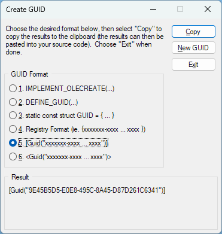
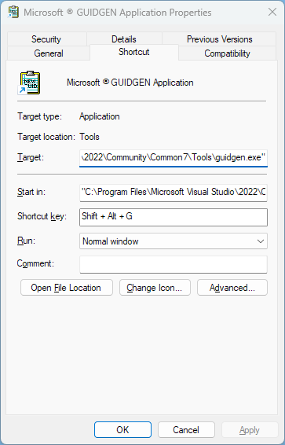
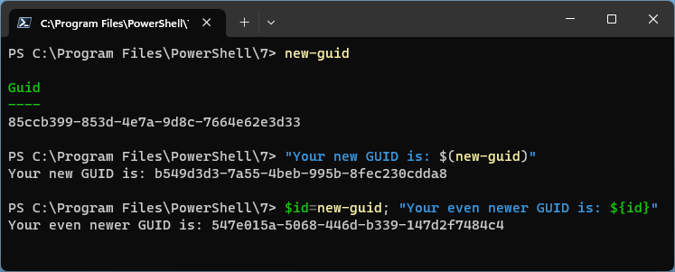

---
categories:
- Coding
date: "2023-07-27T22:12:21Z"
description: ""
draft: false
cover:
  image: photo-1605142859862-978be7eba909.jpg
slug: how-can-i-generate-a-new-guid
summary: GUIDs are heavily used in the world of development, so let's look at a few
  quick and easy ways to generate them whenever we need them.
tags:
- Coding
title: How can I generate a new GUID?
---
GUIDs, or globally unique identifiers, are heavily used in the world of development. And while they certainly are unique (32 hex characters means all 8 billion people on Earth could generate a billion GUIDs every second, and there'd still be enough for 1.3 _trillion_ years), in reality no GUID _needs_ to be unique across the world - just your system.

For the uninitiated, GUIDs can be used as identifiers in a database (or across databases) to link records, or as identifiers in other systems (like Windows does in its registry), or as temporary file names, or anywhere else you need guaranteed uniqueness but not human readableness _(totally a real word)_.

If you're interested in reading more about what goes on under the covers to create them, [Raymond Chen's article](https://devblogs.microsoft.com/oldnewthing/20080627-00/?p=21823) should pique your interest.. or make your brain hurt. Personally, I'm not so interested in how they're calculated, but how I can easily generate one (or several) when I need it.

Let's look at some of the different tools at our disposal.

## Visual Studio

There's a tiny utility for generating GUIDs that gets installed with every version of Visual Studio, going back to at least VS 2005 (the earliest I have installed). It's accessible in the VS menu but it's also a stand-alone exe, so you can just pin it or create a shortcut to it, and then assign a shortcut key to it if that's what you want.






## VS Code

VS Code has been my favorite editor for the last few years, and definitely one of [my go-to tools](https://grantwinney.com/8-tools-every-developer-should-know-and-use/). There's [extensions for just about anything](https://marketplace.visualstudio.com/VSCode), including one for [inserting GUIDs](https://marketplace.visualstudio.com/items?itemName=heaths.vscode-guid). Just install it and you get two new options, one to insert a single GUID and another to insert multiple GUIDs.

Here's an example, that definitely only took 30 seconds to create and that I certainly didn't have to re-record 5 times because I kept pressing the wrong keys. Notice how the "manager_id" gets the same value as the manager's "id", but then the two employees get different values for their IDs, depending on which command is selected. Convenience!


## PowerShell

Somewhere on my long list of things to get more familiar with is [PowerShell](https://learn.microsoft.com/en-us/powershell/scripting/install/installing-powershell). For anyone out there who uses it regularly (maybe even leaves it open all day), there's a [New-Guid](https://learn.microsoft.com/en-us/powershell/module/microsoft.powershell.utility/new-guid) command that, well, does what you'd think.

Running the command by itself presents a column header, which seems a little weird to me .. it's not like I'm going to think that value is something _else._ Using the value in a string (whether it's saved in a variable first or just called inline), it outputs only the GUID, as I'd expect it to.



## APIs

There's some sites out there that will provide you with a GUID, like the [Online GUID Generator Tool](https://www.uuidgenerator.net/guid), but what about making an API call? I wrote about the PasswordRandom.com API (by [Koshovyi Dmytro](http://koshovyi.com/)) awhile back, but its usage is incredibly simple.

[Generate random passwords, numbers and GUIDs with the PasswordRandom API](https://grantwinney.com/passwordrandom-api/)

You don't need to authenticate, so it's a simple one line call. Use it from an app, or just bookmark it if you need quick access to a few GUIDs from time to time. It can produce `json` and `xml` formats too.

```txt
https://www.passwordrandom.com/query?command=guid&count=3&format=plain

12e99949-1ffd-4892-95ca-697f9ebacaae
fe6d2f03-b4bb-4df8-9247-5ece632a9fc1
09650940-a428-4bf0-a7aa-352dc1ae2eec
```

## DuckDuckGo

The privacy-friendly search engine is well known (among those of us who use it) for its [easter eggs](https://dev.to/harshhhdev/fun-duckduckgo-tricks-4c5h) and [hidden features](https://itsfoss.com/duckduckgo-easter-eggs/), some that stick around and others that eventually disappear. One of those features is generating a GUID.

Just do a search for "guid" and above the search results you get a new one. It's a little more convenient if you have DDG setup as your default search engine, and then you can just type "guid" in the address bar.


If you have a better way to generate GUIDs on-the-fly, for your app, personal use, or whatever else, feel free to share below. I'd love to add a few more tools to my toolbox!
