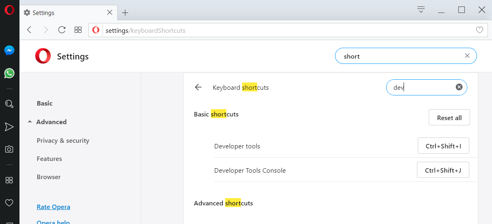
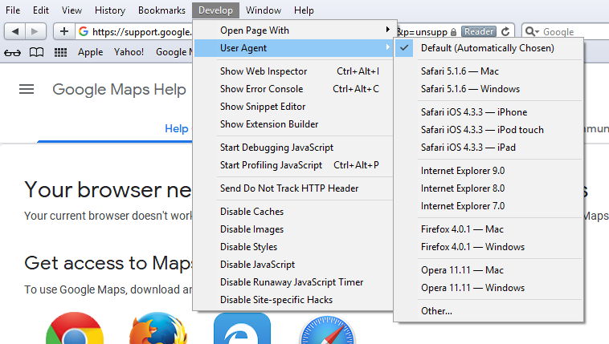

---
categories:
- Tools of the Trade
date: "2019-03-26T14:47:54Z"
description: ""
draft: false
cover:
  image: photo-1516828956617-80b9eec69bbb.jpg
slug: how-do-i-view-the-dev-console-in-my-browser
summary: Most people will never even know their browser hides a great set of tools,
  mostly used by web developers, but which can be useful for anyone trying to figure
  out why their browser is misbehaving.
tags:
- Tools of the Trade
title: Opening the developer console in every major browser
---
Most people will never know their browser hides a great set of tools, mostly used by web developers, but which can be useful for anyone trying to figure out why their browser seems to be acting up.

Finding out why a page is slow, when an addon is throwing errors, what's being requested or sent out - all possible in the dev console. I had to use them just the other day to figure out why a single post on this blog wasn't displaying the summary on the main page - an unexpected character was messing up some custom JavaScript code.

Without further ado...

## Chrome

Author: Google  
Toolset: [Chrome DevTools](https://developers.google.com/web/tools/chrome-devtools/)

- To view elements of the page (DOM/CSS), either right-click and select "Inspect" **or** press `Command+Option+C` (Mac) or `Control+Shift+C` (Windows, Linux, Chrome OS).
- To view the console (logged messages, run JavaScript), press `Command+Option+J` (Mac) or `Control+Shift+J` (Windows, Linux, Chrome OS).

## Firefox

Author: Mozilla  
Toolset: [Web Console](https://developer.mozilla.org/en-US/docs/Tools/Web_Console)

- Select "Web Console" from the Web Developer submenu in the Firefox menu (or Tools menu if you display the menu bar or are on Mac).
- Or press `Ctrl+Shift+K` or `Ctrl+Shift+C` or `Ctrl+Shift+I` (Windows).
- Or press `Command+Option+K` (Mac).

## Opera

Author: Opera Software  
Toolset: Developer Tools Console

The shortcuts seem to be the same as Chrome, at least by default.

- To view elements of the page (DOM/CSS), either right-click and select "Inspect" **or** press `Command+Option+C` (Mac) or `Control+Shift+C` (Windows, Linux, Chrome OS).
- To view the console (logged messages, run JavaScript), press `Command+Option+J` (Mac) or `Control+Shift+J` (Windows, Linux, Chrome OS).

You can also change the shortcuts if you'd like:

## Brave

[If you're not using Brave yet, do](https://brave.com/gra339). This is my preferred browser now that they have all of the annoying kinks worked out... it's more secure by default and they have this novel idea for rewarding good content.

Author: Brave Software Inc  
Toolset: Developer Tools

The shortcuts seem to be the same as Chrome and Opera.

- To view elements of the page (DOM/CSS), either right-click and select "Inspect" **or** press `Command+Option+C` (Mac) or `Control+Shift+C` (Windows, Linux, Chrome OS).
- To view the console (logged messages, run JavaScript), press `Command+Option+J` (Mac) or `Control+Shift+J` (Windows, Linux, Chrome OS).

## Internet Explorer

Author: Microsoft  
Toolset: [Developer Tools](https://msdn.microsoft.com/library/hh968260\(v=vs.85)

- Press `F12`.
- Or right-click and choose "View source" or "Inspect element".

## Edge

Author: Microsoft  
Toolset: [Microsoft Edge DevTools](https://docs.microsoft.com/en-us/microsoft-edge/devtools-guide)

- Press `F12` or `Control+Shift+J` or `Control+Shift+I`.
- Or right-click and choose "View source" or "Inspect element" _(possibly only after opening the DevTools at least once)_.

## Safari

Author: Apple  
Toolset: [Web Inspector](https://developer.apple.com/safari/tools/)

That link is a pretty basic (nearly useless) overview - there's more detail in the [Safari Developer Help docs](https://support.apple.com/en-gb/guide/safari-developer/safari-developer-tools-overview-dev073038698/mac). I don't have a Mac or Safari, so the best I could do to test this was [download Safari 5 for Windows](https://apple.stackexchange.com/a/68837/156872) from 2012.

- Enable the Develop menu in Advanced preferences: `Safari > Preferences > Advanced > Show Develop menu`, then choose `Develop > Show Error Console`
- Select Show Web Inspector Option-Command-I in the Develop Menu. Or control-click anywhere in the Safari tab and choose "Inspect Element" from the menu.
- You can also add a Web Inspector button to your toolbar by customizing your Safari Window.
- If you're using the last available Windows version from 2012: `Edit > Preferences > Advanced > Show Develop menu in menu bar`
- After showing the new menu, you can view page elements with `Control+Alt+I` or the console with `Control+Alt+C`. Beware, it's a pretty busted experience. 🙄

