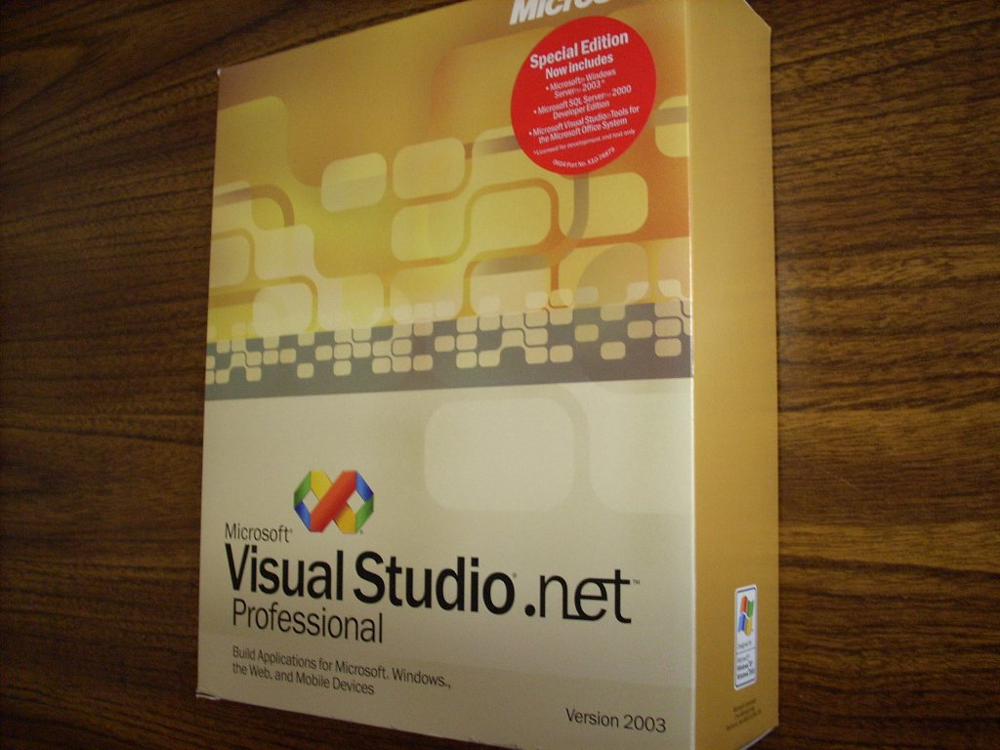
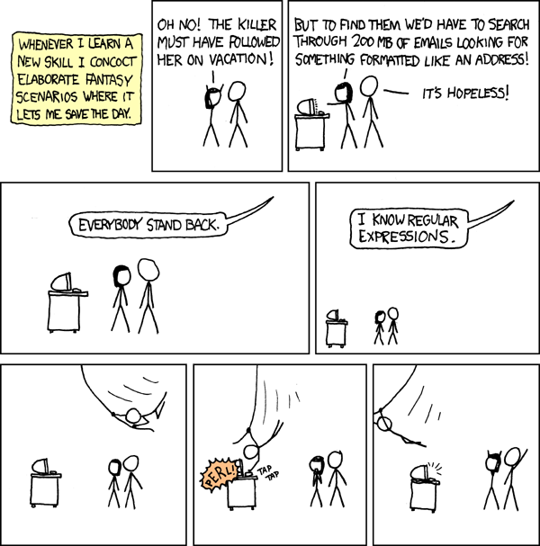
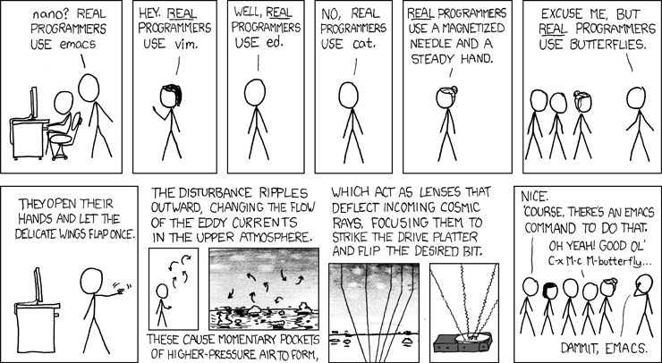

---
categories:
- Reflections
date: "2020-09-15T03:52:08Z"
description: ""
draft: false
cover:
  image: photo-1470506926202-05d3fca84c9a.jpg
slug: how-do-you-know-when-youre-a-programmer
summary: How do you know when you've finally arrived, and are officially a programmer?
  Is it a set of skills, a certain amount of time? Can you ever really arrive, when
  it's a race of one with no finish line?
tags:
- Reflections
title: How will I know when I'm a programmer?
---
In the early 2000s, I worked for a small business where part of my job involved writing some software our clients used for uploading data to us. Still in college, I bought the academic version of .NET 2003 to get familiar with programming at home. I remember the excitement I felt opening that large honking package, with a thick book and 6 CDs, when it finally arrived in the mail. I was on my way to becoming a programmer!

A few years later, on a help desk at a much larger company, I'd occasionally wander into other areas of the campus, as we called it, to check out where the developers worked. There were whiteboards all over, with drawings and flowcharts. I didn't know what Agile and kanban were at the time, but I figured if I could decipher what it all meant, well... _then_ I'd be able to become a programmer.

I spent a year applying internally to beginner level programming positions, but it wasn't panning out. The lack of progress was disheartening and I began looking elsewhere. It felt as if "programming" were an X on a map that I couldn't find.

Eventually I found a position to break into the field, and after 6 months it hit me - I'd arrived! It said "developer" on my nameplate, and I was writing code and compiling things. I was _finally_ a programmer.

In reality, I was on a team of 3 devs, maintaining a legacy app, with little direction and little clue how to do my job well. The team grew, I met people who knew far more than I did, and suddenly I didn't feel so impressive. Several years went by, and I found myself wondering if I were really a decent programmer at all. Notice a pattern?

I've gone back and forth over the years, following the fine tradition of alternating between self-doubt and self-congratulation, every few days sometimes. If you're in the same boat, asking yourself how you know when you're a programmer, then read on. This is as much for me as you, lol.

## You'll improve

You'll learn new things, you'll learn from your mistakes, you'll learn from others. You'll get better, and a year from now you'll be a better programmer than you were a year ago. Maybe you'll get lucky and save the day! Maybe you'll get a PR in right before the weekend that gets approved with no corrections, and it'll feel _good._

To be a programmer is to improve, better today than you were yesterday.

https://xkcd.com/208

## You'll grow

In reality, telling a computer what to do (aka programming) is too general to perfect in a lifetime. Technologies evolve, techniques evolve, and the codebase you're working in evolves (moreso on a large team).

Devs will come and go, each with their own best practices and favorite tools, more than you could learn in 10 lifetimes. Some will be awesome and blow you away with their level of knowledge and willingness to share it. Some will be less-than-awesome but may still blow you away with their level of knowledge and tireless preaching on how "real programmers" do it. 🙄 Still others will... just make you feel good about where you're at. 😏

To be a programmer is to continually grow, better tomorrow than you are today.

https://xkcd.com/378/

## You're more

Whether you're banging out open source tools for free, or you find a company willing to pay you for what you know, you're a programmer. If you stick with it, you've already arrived... and yet, you'll never arrive at any final destination. It's a marathon, not a sprint. And it's a marathon without any definitive finish line until you decide to draw one by retiring or switching career paths. 😀

13 years (and some minor crises of identity) later, I'm learning self-control over the urge to redo things that don't need redoing, and the benefits of many things (tools and soft skills) that I used to think were a waste of time.

I'm a good programmer. Better than I was a decade ago.

I'm not as good as I could be. I'll learn more in the next decade.

No matter what direction you go with it, remember that you're far more than someone churning out some code. There are people (not too many, I hope) who seem to have their identity and self-worth wrapped up in their ability to hack on software and hardware. Life is too short and programming, though pretty cool, is not all there is.
