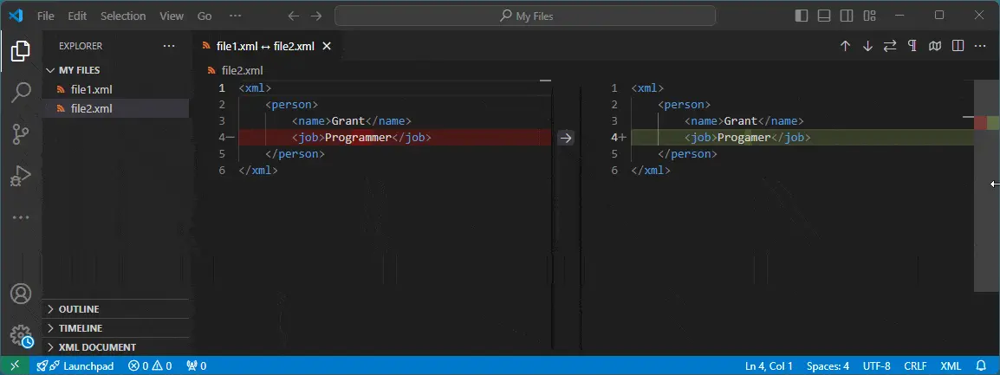

---
categories:
  - Tools
date: 2023-07-26T22:15:20Z
description: ""
draft: false
cover:
  image:
slug: how-to-compare-files-using-vs-code
summary: VS Code is a great editor with a lot of useful features, like being able to compare two random files for differences. Let's see how.
tags:
  - vscode
title: Comparing files in VS Code
---
I recently found myself in need of comparing two versions of an XML file for a merge, something that seems to frequently confuse git. Even better, this particular file was generated as a [minified file](https://grantwinney.com/minification-vs-obfuscation/), which _really_ confuses git. Fortunately, VS Code helps with formatting _and_ comparing files, but let's stick to comparing.

## Files that are saved in the same folder

If the files are saved to disk in the same folder, open the folder, either with the "Open Folder" button on the left (if the "Explorer" pane is open), or with the "Open Folder" option in the "File" menu, or with the "ctrl-k, ctrl-o" shortcut (in Windows):

Then select both files, right click, and choose "Compare Selected":

We get a nice de that collapses into an inline comparison if the window's too small:

## Files that _aren't_ in the same folder.. or aren't saved at all

Whether your files are saved to disk or not, the first thing you'll need to do is show all open editors, something that doesn't seem to be displayed by default and is hidden in the "three dots" menu.

Open the "Explorer" pane on the left, then press the "..." item in the top corner and select "Open Editors". Select both files, right click, and choose "Compare Selected" from the context menu:

This works just as well for files that aren't saved too:

