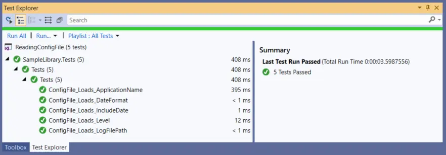

---
categories:
  - Coding
date: 2019-04-15T14:37:19Z
description: ""
draft: false
cover:
  image:
slug: how-to-use-an-app-config-file-with-a-net-standard-app-and-nunit-3
summary: Porting .NET Framework code to .NET Standard has been a learning experience, with some challenges too. This time I had a .NET Standard library that expected an application config file, but loading one from an NUnit test suite proved to be more difficult than it sounded at first.
tags:
  - csharp
  - testing
title: Using an application config file with a .NET Standard app and NUnit 3
---
I've been busy porting some .NET Framework 4.x code to individual [.NET Standard](https://docs.microsoft.com/en-us/dotnet/standard/net-standard) libraries at work, in the hopes of modularizing some of our codebase and making it possible to build and run on different platforms. Since quite a few of our devs use OSX and there's a [Visual Studio for Mac](https://visualstudio.microsoft.com/vs/mac/), this could be a nice win... but it's led to some frustrating issues too. The whole idea of a .NET Standard app is that it's sort of a "lowest common denominator" of the .NET family, containing a minimum of API calls in order to work on more platforms than just Windows.

What's annoying though is that some API calls throw a `PlatformNotSupportedException`. For example, locking/unlocking a FileStream is not supported on OSX. To run code on only one platform or another, there's the [IsOSPlatform](https://docs.microsoft.com/en-us/dotnet/api/system.runtime.interopservices.runtimeinformation.isosplatform?view=netstandard-2.0) method, but that seems odd to me.

```csharp
if (RuntimeInformation.IsOSPlatform(OSPlatform.Windows))
    // do something on Windows only

if (!RuntimeInformation.IsOSPlatform(OSPlatform.OSX))
    // do something as long as we're not running in OSX
```

In a framework meant to target multiple platforms, it seems like a call not supported on _all_ platforms shouldn't be present at all. But I digress...

---

## Trying to load a config file from NUnit

One of the .NET Standard libraries I created assumes the app using it will provide an application configuration file, and so I pulled in [System.Configuration.ConfigurationManager](https://www.nuget.org/packages/System.Configuration.ConfigurationManager) from NuGet _(Microsoft's been splitting functionality out of the gargantuan .NET Framework into smaller components too)_ to read the config file. I had no problem testing the library out by creating a .NET Core app that consumed it and provided a file called `app.config`. I had a problem when I tried to test the library with [NUnit](https://nunit.org/) though. I wanted my test suite to provide a config file too, but for the life of me couldn't figure out what to name it or how to load it.

It _seems_ like [NUnit supports config files](https://github.com/nunit/docs/wiki/Configuration-Files), but I'm not sure if the docs are referring to some special NUnit config file, something with a specific name, or if the docs are just outdated. What exactly did I try?

- Dropping in an app.config file
- Renaming the app.config file to my_test_project_name.dll.config
- Setting the file's "Copy to output directory" setting to "Copy always"
- Creating copies with every name I could think of, hoping _one_ would load... app.config, App.config, my_test_project_name.config, my_test_project_name.dll.config, etc, etc..
- Loading the config file using `AppDomain.CurrentDomain.SetData()` (didn't work, possibly because NUnit3 doesn't support AppDomain)

```
AppDomain.CurrentDomain.SetData("APP_CONFIG_FILE", @"C:\Path\To\My\Tests\my_test_project_name.dll.config");
```

There are tests in the NUnit repo that suggest [using a configuration file in NUnit3 is possible](https://github.com/nunit/nunit3-vs-adapter-demo/blob/master/src/csharp/ConfigFileTests.cs), but that particular test file is only referenced in the [.NET 4.5 demo project](https://github.com/nunit/nunit3-vs-adapter-demo/blob/master/solutions/vs2017/CSharpTestDemo/CSharpTestDemo.csproj#L49), not the [.NET Core demo project](https://github.com/nunit/nunit3-vs-adapter-demo/blob/master/solutions/vs2017/NUnit3CoreTestDemo/NUnit3CoreTestDemo.csproj#L10). _Sigh..._

---

## Naming things is hard...

After doing research and messing with it for most of a day, I threw in the towel and [turned to StackOverflow](https://stackoverflow.com/q/55541912/301857). After a couple days I had gotten about 10 views, but I've got enough magical points to buy more attention, after which I got a couple hundred views and [the answer I was after](https://stackoverflow.com/a/55592119/301857):

> When you execute the following line within a unit test and inspect its result, you may notice that the NUnit project looks for a configuration file called `testhost.dll.config`.  
>   
> `ConfigurationManager.OpenExeConfiguration(ConfigurationUserLevel.None).FilePath;`  
>   
> Also, make sure that the _Copy to Output Directory_ setting for the configuration file is set to `Copy always`.

That name was the secret sauce! It seems that NUnit looks for that specific file, and sure enough after I renamed the config file, it loaded just fine.

Now we can argue all day about whether I should be doing this in a unit test, or an integration test, or whether the .NET Standard library should be expecting a config file at all (it's supported and I'm cool with it), but at the end of the day it's possible and this is how.

---

## What I ended up with

As usual, I posted to GitHub the code I used to test this - you can [view it here](https://github.com/grantwinney/BlogCodeSamples/tree/master/Languages/CSharp/ReadingConfigFile). The Demo project is the .NET Core console app that implements the library, while the Tests project is the NUnit project.

### Parsing the config file in .NET Standard

I created a class that matches the config file, in order to make using it easier. If you'd like to learn more about how that works, I wrote about it and [the many other uses of attributes](https://grantwinney.com/csharp-attributes/#parsing-config-files).

```csharp
public class LogSettings : ConfigurationSection
{
    public static Settings Instance => (ConfigurationManager.GetSection("appConfiguration/logging") as LogSettings).Settings;

    [ConfigurationProperty("application")]
    public Settings Settings
    {
        get { return (Settings)this["application"]; }
    }
}

public class Settings : ConfigurationElement
{
    public LogLevel Level
    {
        get { return (LogLevel)Enum.Parse(typeof(LogLevel), Convert.ToString(LevelInternal)); }
    }

    [ConfigurationProperty("level", DefaultValue = "1", IsRequired = false)]
    private int LevelInternal
    {
        get { return Convert.ToInt32(this["level"]); }
    }

    [ConfigurationProperty("name", IsRequired = true)]
    public string ApplicationName
    {
        get { return Convert.ToString(this["name"]); }
    }

    [ConfigurationProperty("logFilePath", IsRequired = true)]
    public string LogFilePath
    {
        get { return Convert.ToString(this["logFilePath"]); }
    }

    [ConfigurationProperty("dateFormat", DefaultValue = "MM/dd/yyyy", IsRequired = false)]
    public string DateFormat
    {
        get { return Convert.ToString(this["dateFormat"]); }
    }

    [ConfigurationProperty("includeDate", DefaultValue = "true", IsRequired = false)]
    public bool IncludeDate
    {
        get { return Convert.ToBoolean(this["includeDate"]); }
    }
}
```

### Providing a config file from NUnit

In my NUnit project, I created a file called `testhost.dll.config` and set the "Copy to Output Directory" setting to "Copy always".

```xml
<?xml version="1.0" encoding="utf-8" ?>
<configuration>
  <configSections>
    <sectionGroup name="appConfiguration">
      <section name="logging"
               type="SampleLibrary.LogSettings, SampleLibrary"
               allowLocation="true"
               allowDefinition="Everywhere" />
    </sectionGroup>
  </configSections>
  <appConfiguration>
    <logging>
      <application level="2"
                   name="test_logger"
                   logFilePath="C:\ProgramData\MyApp\TestLogs\"
                   includeDate="false" />
    </logging>
  </appConfiguration>
</configuration>
```

### Testing that the config file loaded correctly

Finally, I created a set of tests to make sure the config file was consumed by the .NET Standard library correctly.

```csharp
[TestFixture]
public class Tests
{
   [Test]
    public void ConfigFile_Loads_ApplicationName()
    {
        Assert.AreEqual("test_logger", LogSettings.Instance.ApplicationName);
    }

    [Test]
    public void ConfigFile_Loads_Level()
    {
        Assert.AreEqual(LogLevel.Warn, LogSettings.Instance.Level);
    }

    [Test]
    public void ConfigFile_Loads_LogFilePath()
    {
        Assert.AreEqual(@"C:\ProgramData\MyApp\TestLogs\", LogSettings.Instance.LogFilePath);
    }

    [Test]
    public void ConfigFile_Loads_DateFormat()
    {
        Assert.AreEqual("MM/dd/yyyy", LogSettings.Instance.DateFormat);
    }

    [Test]
    public void ConfigFile_Loads_IncludeDate()
    {
        Assert.IsFalse(LogSettings.Instance.IncludeDate);
    }
}
```

### Results... Success!

