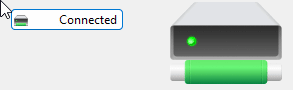
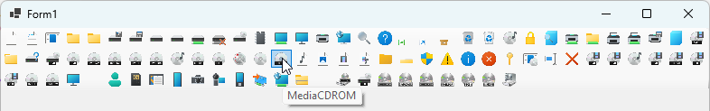

---
categories:
  - .NET 8
  - WinForms
  - C# 12
  - Coding
date: 2024-12-18T15:50:31Z
description: ""
draft: false
cover:
  image: harpal-singh-_zKxPsGOGKg-unsplash.jpg
slug: how-to-use-getstockicon-for-winforms
summary: Buried deep in the list of .NET 8 improvements for WinForms is the GetStockIcon method. It gives us a way to access stock Windows icons at runtime for the OS the app is running on. Let's check it out.
tags:
  - WinForms
  - Coding
  - CSharp
  - .NET 8
  - CSharp12
title: How to Use GetStockIcon for WinForms in .NET 8
---
Scouring the features that WinForms got in .NET 8, I found one slipped in near the very bottom of the list under "[miscellaneous improvements](https://learn.microsoft.com/en-us/dotnet/desktop/winforms/whats-new/net80?view=netdesktop-9.0#miscellaneous-improvements)" called [GetStockIcon](https://learn.microsoft.com/en-us/dotnet/api/system.drawing.systemicons.getstockicon). It's a new method for grabbing Windows stock icons (i.e. save, folder, etc) at runtime, to use in the UI.

When I've wanted to add system icons to buttons, toolbars, etc in the past, it usually meant extracting them from shell32.dll, imageres.dll.mun, the [Visual Studio Image Library](https://www.microsoft.com/en-us/download/details.aspx?id=35825), etc, and then copying them into the project. Then I'd add them to an `ImageList` and hook that up to various UI elements. So I'm wondering.. does this new method give us an easier way to use system icons?

> The code in this post is available on [GitHub](https://github.com/grantwinney/Surviving-WinForms/tree/master/.NET%2008/GetStockIcon), for you to use, extend, or just follow along while you read... and hopefully discover something new along the way!

## Usage

The way it's called is simple enough. We just pass a [StockIconId enum](https://learn.microsoft.com/en-us/dotnet/api/system.drawing.stockiconid) value to tell it which icon to retrieve, and then do whatever we like with the icon:

```csharp
Icon driveIcon = SystemIcons.GetStockIcon(StockIconId.DriveNet);
```

Once we have it, we could add it to an `ImageList` and then use that on a `Button` or other controls. We could also specify a size in the second parameter, like I did here with a `PictureBox` to display a larger icon that's still sharp:

```csharp
// Populate image list with default size, which should be 32 px
imageList1.Images.Add("Conn", SystemIcons.GetStockIcon(StockIconId.DriveNet));
imageList1.Images.Add("Disconn", SystemIcons.GetStockIcon(StockIconId.DriveNetDisabled));

button1.ImageKey = "Conn";
pictureBox1.Image = SystemIcons.GetStockIcon(StockIconId.DriveNet, 128).ToBitmap();
```



Or we could loop through _all_ of them, adding each to an `ImageList`, and then use that to create the world's busiest toolbar: 😏

```csharp
foreach (StockIconId icon in Enum.GetValues(typeof(StockIconId)))
    imageList2.Images.Add(icon.ToString(), SystemIcons.GetStockIcon(icon, 64));

toolStrip1.Items.AddRange(imageList2.Images.Keys.Cast<string>().Select(x =>
    new ToolStripButton(imageList2.Images[x]) { ToolTipText = x }).ToArray());
```



## Pros and Cons

The biggest limitation is only being able to call this at runtime. Of course, that's just the nature of this being a method call, but one of the best things about WinForms is its drag-and-drop designer and this definitely works against that. I'm not sure how much usage this will get if it means having a designer with blank toolbars, incomplete buttons, etc. Maybe I'm missing an obvious use case?

A nice feature, though, is that this method _"returns icons that are themed for the running version of Windows"._ If we copy icons into the project, they are what they are, unchanged no matter what version of Windows someone happens to be running. But with this new call, when someone runs our app in a different version of Windows from the one we designed it in, they'll see the icons that are normal for their OS.

## Learning More

If you want to learn more, check out the [GetStockIcon](https://learn.microsoft.com/en-us/dotnet/api/system.drawing.systemicons.getstockicon) docs, the [StockIconId](https://learn.microsoft.com/en-us/dotnet/api/system.drawing.stockiconid) enum that lists all the available images, and the [StockIconOptions](https://learn.microsoft.com/en-us/dotnet/api/system.drawing.stockiconoptions) enum that lets us set a few options like adding a link overlay to the image. Since a couple of the options involve resizing the icon, we're not allowed to specify a size _and_ options, but that also means it's not possible to request a larger image that has a link overlay.. seems like an odd choice.

Lastly, since the StockIconId page doesn't include the actual _images_ of the icons, here's a list so you can see what they look like, at least in Windows 11:

|Name|Value|Description|Image|
|---|---|---|---|
|DocumentNoAssociation|0|Document (blank page), no associated program.||
|DocumentWithAssociation|1|Document with an associated program.||
|Application|2|Generic application with no custom icon.||
|Folder|3|Closed folder.||
|FolderOpen|4|Open folder.||
|Drive525|5|5.25" floppy disk drive.||
|Drive35|6|3.5" floppy disk drive.||
|DriveRemovable|7|Removable drive.||
|DriveFixed|8|Fixed drive.||
|DriveNet|9|Network drive.||
|DriveNetDisabled|10|Disabled network drive.||
|DriveCD|11|CD drive.||
|DriveRam|12|RAM disk drive.||
|World|13|Entire network.||
|Server|15|A computer on the network.||
|Printer|16|Printer.||
|MyNetwork|17|My network places.||
|Find|22|Find.||
|Help|23|Help.||
|Share|28|Overlay for shared items.||
|Link|29|Overlay for shortcuts to items.||
|SlowFile|30|Overlay for slow items.||
|Recycler|31|Empty recycle bin.||
|RecyclerFull|32|Full recycle bin.||
|MediaCDAudio|40|Audio CD media.||
|Lock|47|Security lock.||
|AutoList|49|AutoList.||
|PrinterNet|50|Network printer.||
|ServerShare|51|Server share.||
|PrinterFax|52|Fax printer.||
|PrinterFaxNet|53|Networked fax printer.||
|PrinterFile|54|Print to file.||
|Stack|55|Stack.||
|MediaSVCD|56|SVCD media.||
|StuffedFolder|57|Folder containing other items.||
|DriveUnknown|58|Unknown drive.||
|DriveDVD|59|DVD drive.||
|MediaDVD|60|DVD media.||
|MediaDVDRAM|61|DVD-RAM media.||
|MediaDVDRW|62|DVD-RW media.||
|MediaDVDR|63|DVD-R media.||
|MediaDVDROM|64|DVD-ROM media.||
|MediaCDAudioPlus|65|CD+ (Enhanced CD) media.||
|MediaCDRW|66|CD-RW media.||
|MediaCDR|67|CD-R media.||
|MediaCDBurn|68|Burning CD.||
|MediaBlankCD|69|Blank CD media.||
|MediaCDROM|70|CD-ROM media.||
|AudioFiles|71|Audio files.||
|ImageFiles|72|Image files.||
|VideoFiles|73|Video files.||
|MixedFiles|74|Mixed files.||
|FolderBack|75|Folder back.||
|FolderFront|76|Folder front.||
|Shield|77|Security shield. Use for UAC prompts only.||
|Warning|78|Warning.||
|Info|79|Informational.||
|Error|80|Error.||
|Key|81|Key / secure.||
|Software|82|Software.||
|Rename|83|Rename.||
|Delete|84|Delete.||
|MediaAudioDVD|85|Audio DVD media.||
|MediaMovieDVD|86|Movied DVD media.||
|MediaEnhancedCD|87|Enhanced CD media.||
|MediaEnhancedDVD|88|Enhanced DVD media.||
|MediaHDDVD|89|HD-DVD media.||
|MediaBluRay|90|BluRay media.||
|MediaVCD|91|VCD media.||
|MediaDVDPlusR|92|DVD+R media.||
|MediaDVDPlusRW|93|DVD+RW media.||
|DesktopPC|94|Desktop computer.||
|MobilePC|95|Mobile computer.||
|Users|96|Users.||
|MediaSmartMedia|97|Smart media.||
|MediaCompactFlash|98|Compact Flash.||
|DeviceCellPhone|99|Cell phone.||
|DeviceCamera|100|Camera.||
|DeviceVideoCamera|101|Video camera.||
|DeviceAudioPlayer|102|Audio player.||
|NetworkConnect|103|Connect to network.||
|Internet|104|Internet.||
|ZipFile|105|ZIP file.||
|Settings|106|Settings.||
|DriveHDDVD|132|HD-DVD drive.||
|DriveBD|133|BluRay drive.||
|MediaHDDVDROM|134|HD-DVD-ROM media.||
|MediaHDDVDR|135|HD-DVD-R media.||
|MediaHDDVDRAM|136|HD-DVD-RAM media.||
|MediaBDROM|137|BluRay-ROM media.||
|MediaBDR|138|BluRay-R media.||
|MediaBDRE|139|BluRay-RE media.||
|ClusteredDrive|140|Clustered disk.||

If you found this content useful, and would like to learn more about a variety of [C#](https://grantwinney.com/tag/csharp/) features, check out my [CSharpDotNetFeatures repo](https://github.com/grantwinney/CSharpDotNetFeatures), where you'll find links to plenty more blog posts and practical examples!
