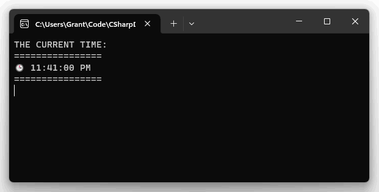

---
categories:
- C# 12
- Testing
- Coding
- TimeProvider
date: "2024-01-11T04:34:20Z"
description: ""
draft: false
cover:
  image: photo-1575197478864-c83e1d2a4443.jpg
slug: how-to-use-timeprovider-and-faketimeprovider-to-test-timers
summary: Testing timers in C# is difficult, but .NET 8 (C# 12) adds an abstract TimeProvider
  class that makes it easier. Let's take a closer look.
tags:
- C# 12
- Testing
- Coding
- TimeProvider
title: How to use (and test) TimeProvider timers in .NET
---
The .NET 8 (C# 12) [release](https://devblogs.microsoft.com/dotnet/announcing-dotnet-8/) included new constructs for abstracting time and timers, two things that have traditionally been a pain when it comes to testing. A few days ago, [I took a first look at time abstraction](https://grantwinney.com/how-to-use-timeprovider-and-faketimeprovider/) using the new [TimeProvider](https://learn.microsoft.com/en-us/dotnet/api/system.timeprovider) abstract class, and then wrote some tests using the new [FakeTimeProvider](https://github.com/dotnet/extensions/blob/d5d15f9fb777ff5572dc3fa1673c2e2704da0193/src/Libraries/Microsoft.Extensions.TimeProvider.Testing/FakeTimeProvider.cs#L16) class provided by the [Microsoft.Extensions.TimeProvider.Testing](https://www.nuget.org/packages/Microsoft.Extensions.TimeProvider.Testing) NuGet package.

If you're brand new to `TimeProvider`, it might be worth checking out my other post first. In this one though, I'd like to check out a different aspect of `TimeProvider`, involving timers.

> The code in this post is available on [GitHub](https://github.com/grantwinney/CSharpDotNetExamples/tree/master/C%23%2012/TimeAbstraction_Timers), for you to use, expand upon, or just follow along while you read... and hopefully discover something new!

If you don't have .NET 8 yet, [download the SDK](https://dotnet.microsoft.com/en-us/download/visual-studio-sdks).

A developer might use a timer for all kinds of things, like periodically reminding a user to take some action, checking a database table to see if there's any orders to process, or hitting an API endpoint to update some widget in the UI. One of the things a developer can't easily do with a timer, though, is _test_ it.

You _could_ move whatever the timer's doing into another method and then test that method directly, but then you're rearranging your code to support testing. It's not the end of the world, but it's not ideal either... and in this case (thanks to .NET 8), it's not even necessary.

## A sample timer

Let's start with a little class that creates one timer, which prints the current time to the screen every second. Most of the time, it prints one particular message, but on Friday evenings it prints a different one.

```csharp
public class TimerSamples : ITimerSamples
{
    private readonly TimeProvider _timeProvider;
    private readonly IConsole _console;

    public TimerSamples(TimeProvider timeProvider, IConsole console)
    {
        _timeProvider = timeProvider;
        _console = console;
    }

    public void StartTimers()
    {
        _timeProvider.CreateTimer(PrintTime, null, TimeSpan.Zero, TimeSpan.FromSeconds(1));
    }

    public void PrintTime(object? _)
    {
        var today = _timeProvider.GetLocalNow();
        var message = (today.DayOfWeek == DayOfWeek.Friday && today.Hour >= 17)
            ?
                $"""
                TGIF!!!

                It's {_timeProvider.GetLocalNow():hh:mm tt}... go home!
                """
            :
                $"""
                THE CURRENT TIME:
                ================
                🕒 {_timeProvider.GetLocalNow():hh:mm:ss tt}
                ================
                """;

        _console.Clear();
        _console.WriteLine(message);
    }
}

public interface ITimerSample
{
    void StartTimers();
}
```

Creating a timer that prints the time to the console every second

There's a few things to note here, one of which is the call to `CreateTimer`. When the `StartTimers` method is called, we use `TimeProvider` to create a new timer, and pass it several values:

- Which method to run (in this case, it's `PrintTime`)
- What value to pass to the method (don't need it, so `null` is fine)
- When to start it (the `TimeSpan.Zero` value says to start it immediately)
- How often to tick the event (in this case, every second)

The constructor is being passed two parameters to support [dependency injection](https://phoenixnap.com/kb/dependency-injection) and testing. The first one is the abstract `TimeProvider` class, while the second is an `IConsole` interface to mock the call to `Console.WriteLine`. This is a console app, and I don't want the tests attempting to write to the console, so I created a tiny wrapper class around it.

```csharp
public class ConsoleWrapper : IConsole
{
    public void Clear() => Console.Clear();
    public void WriteLine(string value) => Console.WriteLine(value);
}

public interface IConsole
{
    void Clear();
    void WriteLine(string value);
}
```

A wrapper around Console to help with mocking from the tests

Being that this is a console app, everything starts in the `program.cs` file. And being that we're using DI, we want to add a list of services as well, so that the app knows what to hand our `TimerSamples` class when it asks for an `IConsole`.

One magic line below tells the app what to pass in when a `TimeProvider` is requested, and that's the one with `TimeProvider.System` on it. The .NET team defined an implementation of `TimeProvider` called `SystemTimeProvider`, and we can access it using `TimeProvider.System`. That's what the app will use at runtime, although we'll use a different class in our tests...

```csharp
using Microsoft.Extensions.DependencyInjection;
using System.Text;
using TimeAbstractionTimers;
using TimeAbstractionTimers.Wrappers;

Console.OutputEncoding = Encoding.UTF8;

var services = new ServiceCollection();
var provider = services
    .AddScoped<ITimerSamples, TimerSamples>()
    .AddScoped<IConsole, ConsoleWrapper>()
    .AddSingleton(TimeProvider.System)
    .BuildServiceProvider();

var ts = provider.GetService<ITimerSamples>();
ts.StartTimers();

Console.Clear();
Console.ReadLine();
```

That's all we need to run the app, which does just absolutely _amazing_ things all by itself. Really, what a work of beauty. A true labor of love. If you run it on a Friday evening, the message will be different, but it isn't Friday right now so we have to wait. Or do we..?



## A sample timer test (or several)

In order to test the abstract `TimeProvider` class, you'll need to write your own class that overrides some things, and then adds some other methods that make the whole thing easily testable, in a flexible sort of way. Or you could just grab the `FakeTimeProvider` class that the .NET team wrote. 😅


You can see more examples of it being used in [my previous post](https://grantwinney.com/how-to-use-timeprovider-and-faketimeprovider/), but basically you just pass it in place of `TimeProvider.System`. It's just another implementation of the abstract `TimeProvider` class, and isn't tied down to any particular test suite, so you can use it with NUnit, xUnit, or anything else you'd like.

Here's how I started an NUnit test suite, with a `Setup` method that gives us a fresh `FakeTimeProvider`, a mocked `IConsole` (courtesy of [Moq](https://www.nuget.org/packages/moq/)), and a `TimerSample` instance for each test. We don't want two tests accidentally interacting somehow.

```csharp
private TimerSamples timerSamples;
private FakeTimeProvider fakeTimeProvider;
private Mock<IConsole> consoleMock;

[SetUp]
public void Setup()
{
    fakeTimeProvider = new FakeTimeProvider();
    consoleMock = new Mock<IConsole>();
    timerSamples = new TimerSamples(fakeTimeProvider, consoleMock.Object);
}
```

Setting up an NUnit test suite to test timers

Now let's write some tests, and see what kind of things we can do!

As I said, the app writes out a certain message most of the week, only switching it up on Friday evenings. We can set the current time to the day we want, start the timer, and then let the test just sit for awhile until the interval passes......... lol, no. One of the powerhouse capabilities of the `FakeTimeProvider` is that we can immediately `Advance` into the future.

In this first test, let's set the day to Tuesday, start the timer, jump forward in time a few seconds, and make sure the message we expected was printed (and that the message we _don't_ expect _wasn't_ printed).

```csharp
[Test]
public void PrintTimeTimer_NoTGIFMessage_WhenNotFriday()
{
    fakeTimeProvider.SetUtcNow(new DateTimeOffset(2024, 1, 9, 1, 0, 0, TimeSpan.Zero)); // Tues
    fakeTimeProvider.SetLocalTimeZone(TimeZoneInfo.Utc);

    // Start the timer, then teleport 5 seconds into the future
    timerSamples.StartTimers();
    fakeTimeProvider.Advance(TimeSpan.FromSeconds(5));

    consoleMock.Verify(x => x.WriteLine(It.Is<string>(x => x.StartsWith("THE CURRENT TIME"))), Times.AtLeastOnce());
    consoleMock.Verify(x => x.WriteLine(It.Is<string>(x => x.StartsWith("TGIF!!!"))), Times.Never());
}
```

Set day to Tues, and make sure the first message prints

You just couldn't do something like this before, at least that I know of, and I'm sure nowhere near this easily. It probably would've been easier to have a test suite that ran Friday evenings just to make sure the test was right rather than try to create your own version of what's happening here.

In this second test, let's set the date to a Friday at 5pm, when the alternate message should show. Doing the same thing as before, we start the timers, time travel a few seconds, and verify the _other_ message printed (and the first one didn't).

```csharp
[Test]
public void PrintTimeTimer_TGIFMessage_WhenFridayEvening()
{
    fakeTimeProvider.SetUtcNow(new DateTimeOffset(2024, 1, 12, 17, 0, 0, TimeSpan.Zero)); // Fri @ 5pm
    fakeTimeProvider.SetLocalTimeZone(TimeZoneInfo.Utc);

    // Start the timer, then teleport 5 seconds into the future
    timerSamples.StartTimers();
    fakeTimeProvider.Advance(TimeSpan.FromSeconds(5));

    consoleMock.Verify(x => x.WriteLine(It.Is<string>(x => x.StartsWith("THE CURRENT TIME"))), Times.Never());
    consoleMock.Verify(x => x.WriteLine(It.Is<string>(x => x.StartsWith("TGIF!!!"))), Times.AtLeastOnce());
}
```

Set day to Fri @ 5p, and make sure the second message prints

Here's one more, that sets the time right before the transition occurs, jumps past the transition, and then double-checks that _both_ messages were printed at least once.

```csharp
[Test]
public void PrintTimeTimer_MessageTransitionsCorrectly_WhenFridayAfternoonTurnsToEvening()
{
    fakeTimeProvider.SetUtcNow(new DateTimeOffset(2024, 1, 12, 16, 59, 57, TimeSpan.Zero)); // Fri @ 4:59:57pm
    fakeTimeProvider.SetLocalTimeZone(TimeZoneInfo.Utc);

    // Start the timer, then teleport 5 seconds into the future
    timerSamples.StartTimers();
    fakeTimeProvider.Advance(TimeSpan.FromSeconds(5));

    consoleMock.Verify(x => x.WriteLine(It.Is<string>(x => x.StartsWith("THE CURRENT TIME"))), Times.AtLeastOnce());
    consoleMock.Verify(x => x.WriteLine(It.Is<string>(x => x.StartsWith("TGIF!!!"))), Times.AtLeastOnce());
}
```

Set day to Fri, right before 5p, and make sure both messages printed

Everything works, and 4 tests that should've taken 20 seconds to run (in realtime) ran in _less than half a second._


## Caveat?

Here's an interesting point. It makes sense when you think about it, but with all the seemingly magic things happening here, it might be easy to neglect. Even though, by advancing the timer, we don't have to actually wait for the timer interval to pass, all the tick events _are_ firing, one after the other.

What I mean by that last part is, if we modified the `PrintTime` method, inserting one line of code that told it to sleep for 10 ms, all the tests will take just a hair longer to run.

```csharp
public void PrintTime(object? _)
{
    Thread.Sleep(10);

    var today = _timeProvider.GetLocalNow();
    var message = (today.DayOfWeek == DayOfWeek.Friday && today.Hour >= 17)
        ?
            $"""
            TGIF!!!

            It's {_timeProvider.GetLocalNow():hh:mm tt}... go home!
            """
        :
            $"""
            THE CURRENT TIME:
            ================
            🕒 {_timeProvider.GetLocalNow():hh:mm:ss tt}
            ================
            """;

    _console.Clear();
    _console.WriteLine(message);
}
```

Here's the result of running the tests again, first with a 10 ms sleep, and then a 100 ms sleep. The durations get longer and longer, which makes sense.


Running the tests, with a 10 ms sleep in the PrintTime method


Running the tests again, after increasing the sleep to 100 ms

The takeaway here, I think, is that we need to be careful what we're testing, because we're not skipping over _everything_... just over the intervals we'd normally have to wait for between tick events. The sleep I put in there is silly, but if there's a time-consuming dependency, you might want to make adjustments for that.

In a unit test, we typically remove as many things as possible that are outside of our control or not things we want to test (like writing to the console, or to disk). But what about some kind of integration test, where we want to test a larger part of the system, maybe even make sure a file actually gets written to? That could be a reasonable test.

But what if the tick event hits an outside API to get some data back? In production, that API might only get hit once every minute, which is perfectly acceptable. But if that piece of code were caught up in a test like this, and you advanced several hours or days, I'm fairly certain it would attempt to hit that API hundreds of times in rapid succession. I haven't actually tested it, but it seems consistent with what I'm seeing here. If you know differently though, please share below!

If you'd like to learn more about this intriguing new .NET 8 feature, I'd encourage you to check out these excellent posts on the subject.

- [Testing Time-Dependent Code With TimeProvider in .NET | CodeMaze](https://code-maze.com/csharp-testing-time-dependent-code-with-timeprovider/)
- [Avoiding flaky tests with TimeProvider and ITimer | Andrew Lock](https://andrewlock.net/exploring-the-dotnet-8-preview-avoiding-flaky-tests-with-timeprovider-and-itimer/)

If you found this content useful, and would like to learn more about a variety of [C#](https://grantwinney.com/tag/csharp/) features, check out the [CSharpDotNetExamples repo](https://github.com/grantwinney/CSharpDotNetExamples), where you'll find links to plenty more blog posts and practical examples!
