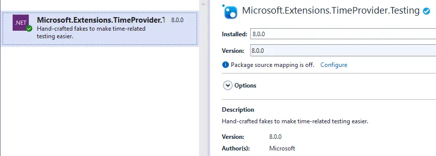
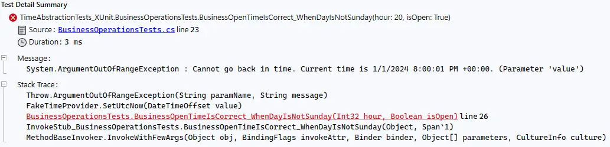
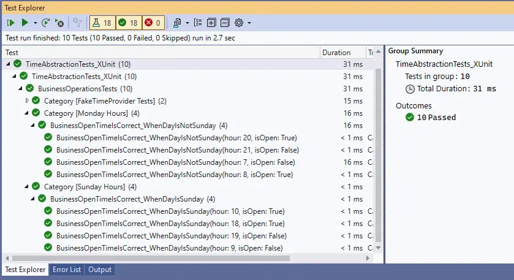
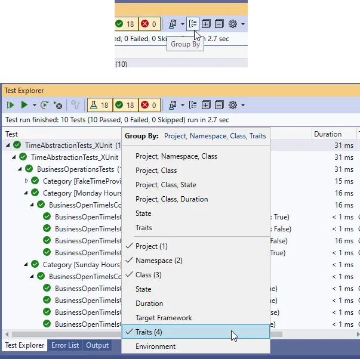
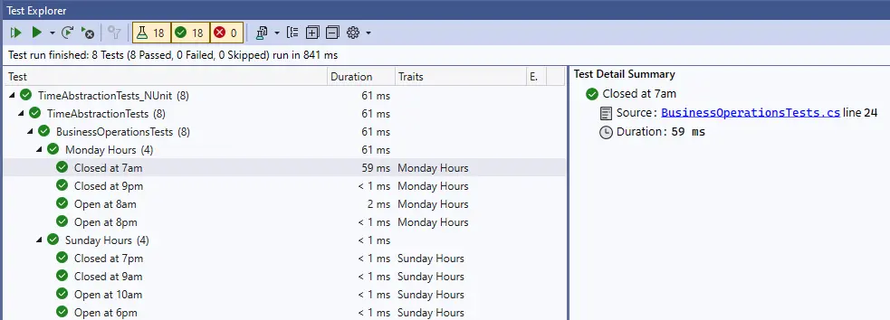

---
categories:
  - Coding
date: 2024-01-07T04:14:00Z
description: ""
draft: false
cover:
  image:
slug: how-to-use-timeprovider-and-faketimeprovider
summary: Testing time in C# is difficult, but .NET 8 (C# 12) adds an abstract TimeProvider class that makes it easier. Let's take a closer look.
tags:
  - csharp-12
  - datetime-handling
  - testing
  - time-provider
  - fake-time-provider
title: How to use TimeProvider and FakeTimeProvider (time abstraction in .NET)
---
Since it's the Christmas season, and .NET 8 (C# 12) was [recently released](https://devblogs.microsoft.com/dotnet/announcing-dotnet-8/), it seems like a good time to unwrap some of the goodies we got. A couple of the most intriguing ones, IMO, are new constructs for abstracting time and timers, two things that have traditionally been a pain when it comes to testing.

Let's take a closer look at abstracting time first, and save timers for [another post](https://grantwinney.com/how-to-use-timeprovider-and-faketimeprovider-to-test-timers/).

> The code in this post is available on [GitHub](https://github.com/grantwinney/CSharpDotNetExamples/tree/master/C%23%2012/TimeAbstraction), for you to use, expand upon, or just follow along while you read... and hopefully discover something new!

If you don't have .NET 8 yet, [download the SDK](https://dotnet.microsoft.com/en-us/download/visual-studio-sdks) as well.

## How do we deal with time today?

Let's take a look at a few ways to work with time in a C# app, starting with the one that's the least work ... and also the least flexible.

### Access the static date/time right when you need it

Most of the time, in my experience anyway, when someone needs the current time, they just grab it at that moment. The .NET framework makes it incredibly easy with static properties like `DateTime.Now`, `DateTime.UtcNow`, `DateTimeOffset.UtcNow`, etc.

It's easy to define a method that grabs the current time and uses that to determine whether, for example, a business is currently open or not. Ignore the fact that my example is incredibly naive and only works for a single business.. keepin' it simple!

```csharp
public bool IsOpenHours()
{
    var now = DateTime.UtcNow;

    // Open 10a - 6p on Sundays
    if (now.DayOfWeek == DayOfWeek.Sunday)
        return now.Hour >= 10 && now.Hour <= 18;

    // Open 8a - 8p the rest of the week
    return now.Hour >= 8 && now.Hour <= 20;
}
```

Any attempt to test the above code, whether it's a tiny unit test or some larger integration test that happens to hit this code along the way, is restricted by the fact that `DateTime.UtcNow` will return whatever the current time is when the test runs. If the test is running on a Wednesday, the "Sunday" condition won't be hit. If the test suite runs automatically at midnight every night, the method _always_ return "false". If we can't control the current time, we can't control what the method returns - it's untestable.

### Pass a date/time value to the method

There's ways around that, of course. You could pass a `DateTime` or `DateTimeOffset` in as a parameter, and then at least a unit test could pass it different values for different edge cases.

```csharp
public bool IsOpenHours(DateTime now)
{
    // Open 10a - 6p on Sundays
    if (now.DayOfWeek == DayOfWeek.Sunday)
        return now.Hour >= 10 && now.Hour <= 18;

    // Open 8a - 8p the rest of the week
    return now.Hour >= 8 && now.Hour <= 20;
}
```

But I'd argue that this seems wrong somehow, allowing callers to pass in a `DateTime` value that should only ever represent _now_, just to support testing. And since it only bumps the concern a level up, any integration tests that run against larger areas of the system will still run into the problem of not being able to change the date/time value that this method uses.

### Inject a dependency that provides the date/time

Taking things a step further.. by wrapping the `DateTime` or `DateTimeOffset` class as in the `BusDateTime` class below, then injecting the dependency into the class (like with `AddScoped` or `AddSingleton` in an ASP.NET Core Web API), we can [mock the dependency](https://grantwinney.com/what-is-mocking-a-dependency) in a test suite.

```csharp
public class BusinessOperations : IBusinessOperations
{
    readonly DateTime _now;

    public BusinessOperations(IDateTime now) => _now = now.Now;

    public bool IsOpenHours()
    {
        // Open 10a - 6p on Sundays
        if (_now.DayOfWeek == DayOfWeek.Sunday)
            return _now.Hour >= 10 && _now.Hour <= 18;

        // Open 8a - 8p the rest of the week
        return _now.Hour >= 8 && _now.Hour <= 20;
    }
}

public interface IBusinessOperations
{
    bool IsOpenHours();
}

public class BusDateTime : IDateTime
{
    public DateTime Now => DateTime.UtcNow;
}

public interface IDateTime
{
    DateTime Now { get; }
}
```

```csharp
builder.Services.AddScoped<IDateTime, BusDateTime>();
builder.Services.AddScoped<IBusinessOperations, BusinessOperations>();
```

The downside of this is needing to define a class that redefines all the same properties we get in the .NET classes (the ones our app needs, anyway), and then creating an interface that defines the properties yet again. Its repetitive. Wouldn't it be nice if there was an official .NET way of doing this?

_Drum roll please..._

## Abstraction with TimeProvider

Finally, it's time to check out the new [TimeProvider](https://learn.microsoft.com/en-us/dotnet/api/system.timeprovider?view=net-8.0) class. It's [abstract](https://learn.microsoft.com/en-us/dotnet/csharp/language-reference/keywords/abstract), so it can't be used directly - it needs to be inherited by other classes. We could define our own, but we're already given one (shown below), called `SystemTimeProvider`. It doesn't get easier than that! It's super tiny, since all the properties and methods in `TimeProvider` have default values and implementations. The only thing abstract about `TimeProvider` is the class itself.

```csharp
/// <summary>
/// Used to create a TimeProvider instance returned from System and uses the
/// default implementation, provided by TimeProvider which uses
/// DateTimeOffset.UtcNow, TimeZoneInfo.Local, Stopwatch, and Timer.
/// </summary>
private sealed class SystemTimeProvider : TimeProvider
{
    /// <summary>Initializes the instance.</summary>
    internal SystemTimeProvider() : base()
    {
    }
}
```

Accessing the new class is super easy too - just use the static accessor in the `TimeProvider` class that passes back a single instance of `SystemTimeProvider`. In fact, that's the only way to get a new instance, since it's marked `private` and actually lives _inside_ the abstract `TimeProvider` class. What that means is, anywhere you access that property from, you get the same (singleton) instance.

```csharp
/// <summary>Provides an abstraction for time.</summary>
public abstract class TimeProvider
{
  /// <summary>
  /// Gets a TimeProvider that provides a clock based on DateTimeOffset.UtcNow,
  /// a time zone based on TimeZoneInfo.Local, a high-performance time stamp
  /// based on Stopwatch, and a timer based on Timer.
  /// </summary>
  /// <remarks>
  /// If the TimeZoneInfo.Local changes after the object is returned, the change
  /// will be reflected in any subsequent operations that retrieve GetLocalNow.
  /// </remarks>
  public static TimeProvider System { get; } = new SystemTimeProvider();

  ...
  ...
}
```

Accessing that static property directly in our own code, though, will land us right back where we started in the very first example - with methods that we can't test, because we can't control them. This code will work, but it's untestable as-is:

```csharp
public bool IsOpenHours()
{
    var utc = TimeProvider.System.GetUtcNow();

    // Open 10a - 6p on Sundays
    if (utc.DayOfWeek == DayOfWeek.Sunday)
        return utc.Hour >= 10 && utc.Hour <= 18;

    // Open 8a - 8p the rest of the week
    return utc.Hour >= 8 && utc.Hour <= 20;
}
```

No better, from a testing standpoint, than using DateTime.Now or DateTimeOffset.Now

Instead of calling `TimeProvider.System.GetUtcNow()` directly, we can set things up for dependency injection by accepting a `TimeProvider` in the constructor and then configuring the DI system to inject the `SystemTimeProvider` as needed.

```csharp
public class BusinessOperations : IBusinessOperations
{
    private readonly TimeProvider _now;

    public BusinessOperations(TimeProvider now) => _now = now;

    public bool IsOpenHours()
    {
        var utc = _now.GetUtcNow();

        // Open 10a - 6p on Sundays
        if (utc.DayOfWeek == DayOfWeek.Sunday)
            return utc.Hour >= 10 && utc.Hour <= 18;

        // Open 8a - 8p the rest of the week
        return utc.Hour >= 8 && utc.Hour <= 20;
    }
}

public interface IBusinessOperations
{
    bool IsOpenHours();
}
```

Using ASP .NET Core as an example again, we'd just add a [singleton](https://grantwinney.com/difference-between-singleton-scoped-transient) like this (below). Now anytime some class expects an instance of `IBusinessOperations` to be injected, the singleton instance of `SystemTimeProvider` will get injected too.

```csharp
builder.Services.AddScoped<IBusinessOperations, BusinessOperations>();
builder.Services.AddSingleton(TimeProvider.System);
```

## Testing with FakeTimeProvider

All of that's well and good, and possibly even interesting, but how does it help us with testing? Well, .NET 8 provides us with one more new class, via NuGet package, and that's the `FakeTimeProvider`.



It's another implementation of the abstract `TimeProvider` class, with additional methods for making us the masters of time. Here's part of it, with everything cut out except what I think is relevant at the moment. Things to note:

- It defaults to Jan 1, 2000 at midnight UTC.
- The `SetUtcNow` method lets you move forward in time (but never backwards).
- The `Advance` method does the same, although it has effects on timers, another part of the `TimeProvider` that I'll cover in a separate post.
- The `SetLocalTimeZone` method lets you change time zones.

```csharp
// Represents a synthetic time provider that can be used to enable
// deterministic behavior in tests.
public class FakeTimeProvider : TimeProvider
{
    private DateTimeOffset _now = new DateTimeOffset(2000, 1, 1, 0, 0, 0, 0, TimeSpan.Zero);
    private TimeZoneInfo _localTimeZone = TimeZoneInfo.Utc;

    public FakeTimeProvider(DateTimeOffset startDateTime)
    {
        Throw.IfLessThan(startDateTime.Ticks, 0L, "startDateTime.Ticks");
        _now = startDateTime;
        Start = _now;
    }

    // Sets the date and time in the UTC time zone.
    public void SetUtcNow(DateTimeOffset value)
    {
        ...
        if (value < _now)
        {
            DefaultInterpolatedStringHandler defaultInterpolatedStringHandler = new DefaultInterpolatedStringHandler(41, 1);
            defaultInterpolatedStringHandler.AppendLiteral("Cannot go back in time. Current time is ");
            defaultInterpolatedStringHandler.AppendFormatted(_now);
            defaultInterpolatedStringHandler.AppendLiteral(".");
            Throw.ArgumentOutOfRangeException("value", defaultInterpolatedStringHandler.ToStringAndClear());
        }

        _now = value;
        ...
    }

    // Advances time by a specific amount.
    //
    // Advancing time affects the timers created from this provider, and all other operations
    // that are directly or indirectly using this provider as a time source. Whereas
    // when using System.TimeProvider.System, time marches forward automatically in
    // hardware, for the fake time provider the application is responsible for doing
    // this explicitly by calling this method.
    public void Advance(TimeSpan delta)
    {
        ...
        _now += delta;
        ...
    }

    // Sets the local time zone.
    public void SetLocalTimeZone(TimeZoneInfo localTimeZone)
    {
        _localTimeZone = Throw.IfNull(localTimeZone, "localTimeZone");
    }

    ...
    ...
}
```

If you try to move backwards, or set the time to something less than Jan 1, 2000, it throws an exception like the one below. So no testing like it's 1999.



### Using FakeTimeProvider with xUnit

Using the FakeTimeProvider just involves setting the date to whatever date and time you want to test. Here's a couple of xUnit tests that make sure the store shows as open or closed as expected, at different times on different days.

```csharp
public class BusinessOperationsTests
{
    private readonly FakeTimeProvider fake;
    private readonly BusinessOperations busOp;

    public BusinessOperationsTests()
    {
        fake = new();
        busOp = new(fake);
    }

    [Theory]
    [Trait("Category", "Monday Hours")]
    [InlineData(7, false)]   // 7a
    [InlineData(8, true)]    // 8a
    [InlineData(20, true)]   // 8p
    [InlineData(21, false)]  // 9p
    public void BusinessOpenTimeIsCorrect_WhenDayIsNotSunday(int hour, bool isOpen)
    {
        fake.SetUtcNow(new DateTimeOffset(2024, 1, 1, hour, 0, 1, TimeSpan.Zero));  // Monday
        Assert.Equal(isOpen, busOp.IsOpenHours());
    }

    [Theory]
    [Trait("Category", "Sunday Hours")]
    [InlineData(9, false)]   // 9a
    [InlineData(10, true)]   // 10a
    [InlineData(18, true)]   // 6p
    [InlineData(19, false)]  // 7p
    public void BusinessOpenTimeIsCorrect_WhenDayIsSunday(int hour, bool isOpen)
    {
        fake.SetUtcNow(new DateTimeOffset(2023, 12, 31, hour, 0, 1, TimeSpan.Zero));  // Sunday
        Assert.Equal(isOpen, busOp.IsOpenHours());
    }
}
```



_Unrelated note:_ The eagle-eyed reader might've noticed the above tests are grouped by category. You can set category names (aka "traits") on your xUnit tests, and then choose to "Group By" those traits in the test explorer pane. It's a nice way of organizing things a bit.



### Using FakeTimeProvider with NUnit

Personally I prefer NUnit, although really it's only because I've used it a lot more. Fortunately, the `FakeTimeProvider` class isn't tied to any particular testing suite, so you can use it with anything. Here's the same tests, using NUnit:

```csharp
[TestFixture]
public class BusinessOperationsTests
{
    private FakeTimeProvider fake;
    private BusinessOperations busOp;

    [SetUp]
    public void Setup()
    {
        fake = new();
        busOp = new(fake);
    }

    [Category("Monday Hours")]
    [TestCase(7, false, TestName = "Closed at 7am")]
    [TestCase(8, true, TestName = "Open at 8am")]
    [TestCase(20, true, TestName = "Open at 8pm")]
    [TestCase(21, false, TestName = "Closed at 9pm")]
    public void BusinessOpenTimeIsCorrect_WhenDayIsNotSunday(int hour, bool isOpen)
    {
        fake.SetUtcNow(new DateTimeOffset(2024, 1, 1, hour, 0, 1, TimeSpan.Zero));  // Monday
        Assert.That(busOp.IsOpenHours(), Is.EqualTo(isOpen));
    }

    [Category("Sunday Hours")]
    [TestCase(9, false, TestName = "Closed at 9am")]
    [TestCase(10, true, TestName = "Open at 10am")]
    [TestCase(18, true, TestName = "Open at 6pm")]
    [TestCase(19, false, TestName = "Closed at 7pm")]
    public void BusinessOpenTimeIsCorrect_WhenDayIsSunday(int hour, bool isOpen)
    {
        fake.SetUtcNow(new DateTimeOffset(2023, 12, 31, hour, 0, 1, TimeSpan.Zero));  // Sunday
        Assert.That(busOp.IsOpenHours(), Is.EqualTo(isOpen));
    }
}
```

One more side note.. you can categorize tests in NUnit too, with a slightly different syntax, by decorating the test methods with a `CategoryAttribute`.



That's it for now! Will this be a game-changer? Who knows. I hope it gets adopted over time. There's even [a way to use this in legacy code](https://grantwinney.com/using-timeprovider-and-faketimeprovider-in-winforms/), thanks to the .NET team developing a NuGet package that retrofits it to the .NET Framework.

If you'd like to learn more about this intriguing new .NET 8 feature, I'd encourage you to check out these excellent posts on the subject.

- [Testing Time-Dependent Code With TimeProvider in .NET | CodeMaze](https://code-maze.com/csharp-testing-time-dependent-code-with-timeprovider/)
- [Avoiding flaky tests with TimeProvider and ITimer | Andrew Lock](https://andrewlock.net/exploring-the-dotnet-8-preview-avoiding-flaky-tests-with-timeprovider-and-itimer/)

If you found this content useful, and would like to learn more about a variety of [C#](https://grantwinney.com/tags/csharp/) features, check out the [CSharpDotNetExamples repo](https://github.com/grantwinney/CSharpDotNetExamples), where you'll find links to plenty more blog posts and practical examples!
