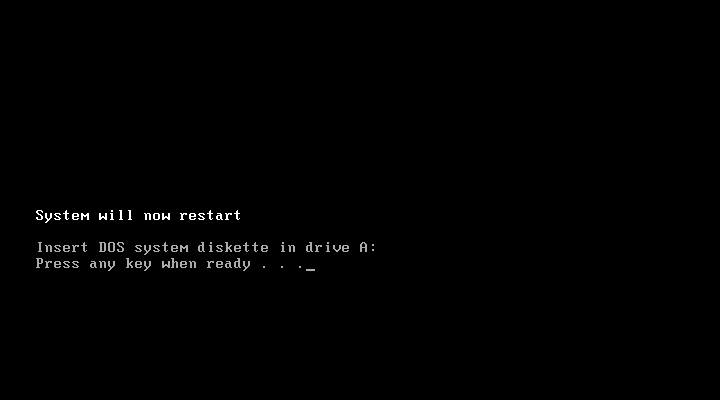

---
categories:
  - Retro
date: 2013-10-23T01:26:46Z
description: ""
draft: false
postimage: /banners/generic-build-banner.webp
slug: installing-dos-6-22-in-vmware-player
summary: While looking for a copy of Windows 98 on MSDN to install some old software (compatibility mode under Windows 7 didn’t work), I came across Windows 3.11. I just had to try installing it! But first, DOS 6.22...
tags:
  - virtualization
title: Installing DOS 6.22 in VMware Player
---
I started off looking at my MSDN account for a copy of Windows 98 to install some old software (compatibility mode under Windows 7 didn’t work), and noticed the only versions of Windows available are 7, 8 and….. 3.11. Ooo, I already have Windows 8 running in a virtual machine. Why not fire up Win 3.11?

This was back in the days when Windows ran on top of DOS though, so I needed to install DOS 6.22 first. Should be easy. Oh, but MSDN and TechNet only provide floppy disk images (IMG files) for the _upgrade_ versions of DOS 6.22. They provide other copies of DOS 6.0 and 6.22, but those seem to be the contents of a CD or a file from a hard drive. Not exactly useful, and if you try to mount the floppy disks, you’ll get an error and the setup stops.

First, you’ll need:

- ~~VMware Player~~ I _think_ this was replaced by [VMware Fusion and Workstation](https://www.vmware.com/products/desktop-hypervisor/workstation-and-fusion)
- A valid copy of the DOS 6.22 floppy disk image files - Available with an MSDN or TechNet account
- Also available for free from [AllBootDisks](http://www.allbootdisks.com/download/iso.html); I can’t vouch for them, but they were linked to on several forums, including Microsoft’s

Install “VMware Player” and then unzip the contents of the DOS file to wherever’s convenient.

Here’s how I setup the virtual machine to prepare for DOS. First, create a new machine and decide where to save it:

I lowered the disk size from the default 8 GB. I mean, really, _1_ GB was a dream back then.

No floppy drive by default. We’ll need one of those to install our flashy new disk operating system. Open the DISKS folder wherever you unzipped DOS, and find the three 144UPGx.IMG files. Load the first one (see the following screen shots), and then “OK” your way out of all the virtual machine setup screens.

Fire up the virtual machine and it’ll load the floppy disk you mounted and start the DOS setup process. **DON’T PRESS ENTER** after the first screen below!

D’oh! Like I mentioned earlier, MSDN and TechNet only provide the upgrade versions of DOS 6.22. Luckily, we can trick it. If you did press enter in the previous screen, just reboot the machine so you get back to the DOS setup screen.

Press F3 multiple times until you exit out to a prompt.

Now type FDISK to enter the disk format utility. Follow the prompts, accept the defaults and voila .. you have an unformatted c: drive. Thank you to someone in the [TechNet](http://social.technet.microsoft.com/Forums/windowsserver/en-US/e18f4409-6b2d-437a-b505-7e18db77f608/msdos-622-under-hyperv?forum=winserverhyperv) forums.

Reboot, which will load the DOS setup screen again. F3 your way out, go into FDISK again, and follow the prompts again… and voila, you have a formatted c: drive.

Here’s where we trick DOS into thinking it’s doing an upgrade an not an initial install. Switch to your freshly minted c: drive, create a directory named DOS and copy the contents of your floppy disk image to it.

Reboot the computer again. Enter setup again. Now the setup program sees the files on the hard drive and assumes you’re upgrading an existing system. Run through the whole installation, mowing right over the files you copied out there in the previous step.

When prompted, load the other two floppy disk images to complete the installation.

One final reboot and you’re the envy of all your friends with their smith corona typewriters. Except you can’t actually type a document yet.

Ok, now what was I originally trying to install? Oh yeah... [click here to read about how I installed Windows 3.1 on top of this.](https://grantwinney.com/installing-windows-3-1-in-vmware-player/)
