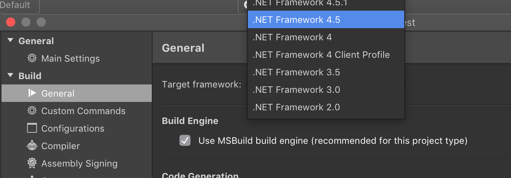

---
categories:
- visual-studio
- tools-of-the-trade
- VS4Mac
date: "2018-08-20T16:20:12Z"
description: ""
draft: false
cover:
  image: photo-1498050108023-c5249f4df085.jpg
slug: installing-earlier-net-versions-on-visual-studio-for-mac
summary: Despite its marketing, Visual Studio for Mac is not the Visual Studio that
  millions love, ported to the Mac. Something that's absolutely trivial in standard
  VS, switching between .NET Frameworks, wasted several of my evenings. Maybe it'll
  help someone else.
tags:
- visual-studio
- tools-of-the-trade
- vs4mac
title: 'How to select an earlier .NET version on Visual Studio for Mac (tl;dr: you
  can''t)'
---
I saw an implementation of some C# code this week that looked like it _should_ work, but wasn't producing the expected results for me using .NET 4.6. I thought I'd setup a local project in [Visual Studio for Mac](https://visualstudio.microsoft.com/vs/mac/) and then turn the clock back a bit to see if maybe how the code was implemented changed between .NET versions. That'd actually be pretty unusual, since .NET values backwards compatibility, but [it's not unheard of](https://blogs.msdn.microsoft.com/ericlippert/2009/11/16/closing-over-the-loop-variable-part-two/).

So I spent a few evenings trying to target a C# project for an earlier version of .NET, which seemed as if it were going to be trivial. You can right-click a project and choose options to find a dropdown under the "Build" settings, which is very similar to Visual Studio on Windows.

However, switching to an earlier version of .NET alternated between showing an error in the console when I tried to run my tiny app:

> WARNING: The runtime version supported by this application is unavailable.  
> Using default runtime: v4.0.30319

And sometimes the IDE blew up completely by underlining everything and claiming it could no longer find `System.Object` or `System.Int32`. This is fairly typical of my experience in VS4Mac... it works okay as long as you stay in the lines. Once you start doing anything remotely interesting though...

Even after restarting (and reinstalling) VS4Mac, that project appeared to be permanently hosed, and I had to create a new one. I even tried committing the project to git before this happened so I could restore it, but it showed no changes, so whatever got borked must've been in some hidden file.

## Try a different Mono version?

When I checked the .NET Runtimes tab in preferences, all I had was Mono 5. Okay, so maybe each Mono version supports whatever version of the .NET Framework was out when it was released, and I needed to install them? Sure, just a guess, but it seemed logical.

I [downloaded](https://download.mono-project.com/archive/) the last release for 2.x, 3.x, etc and installed them all. Afterwards, I tried different combinations of Mono release _(Project / Active Runtime)_ to .NET framework, but no luck there either. Same error.

## Getting official help

After awhile, I [opened a ticket](https://developercommunity.visualstudio.com/content/problem/309591/getting-the-runtime-version-supported-by-this-appl.html) in the developer community forums with all the details above, including what I'd tried. A few days later, it was closed with this response from a Microsoft employee:

> Thank you for your feedback! We have determined that this issue is not a bug. Mono by design only supports latest versions of .NET and is not .NET 2.0, 3.5 versions of CRL. So warning is valid and intended, hence closing this as not a bug. If you want to compare behavior between .NET 3.5 and 4.5 or something similar, I suggest installing very old Mono or even better do it on Windows with .NET instead of Mono.

In other words, the marketing team should've probably thought a little longer about how to brand this. There's no need to "Visual Studio" all the things. I replied asking for any other hints or tips on how to do that, but haven't heard back yet. I can only assume he means I should compile the [MonoDevelop source code](https://github.com/mono/monodevelop)... or just use Windows.

After doing some more research, I found [release notes for MonoDevelop 4.0.0](https://www.mono-project.com/docs/about-mono/releases/4.0.0/#dropped-support-for-old-frameworks) that corraborated what he said. Although I don't know why the 2.x and 3.x versions of Mono don't work then... or why there's an available selection for the .NET Framework at all. Or why the MonoDevelop team decided to drop support for devs writing apps in a corporate environment, where only an older version of .NET is installed.

> Dropped Support for Old Frameworks  
>   
> Reference Assemblies  
>   
> We no longer build the reference assemblies for the .NET 2.0, .NET 3.5 or .NET 4.0 APIs, we now ship binaries of the reference assemblies (API contracts, without any actual executable code in them).  
>   
> Mono will now only build the .NET 4.5 assemblies as well as the mobile-based profiles.  
>   
> Note: You can still run assemblies compiled for earlier .NET profiles on Mono, there's no need to recompile them (they’ll just run on the .NET 4.5 assemblies instead).

## What now?

Use Visual Studio on Windows, I guess. Seriously. I found at least [one workaround](https://blog.rubenwardy.com/2016/07/20/rimworld-install-monodevelop-with-dot-net-3.5/) but it seems to be for MonoDevelop only, not Visual Studio. Realizing your only option is to compile from source code makes you take a long, hard look at how badly you need to test a piece of code. For me, not that badly. 😩

I think the most frustrating thing is that this app, which is really a [rebranded Xamarin Studio](https://developer.xamarin.com/releases/studio/xamarin.studio_6.3/xamarin.studio_6.3/), is marketed like it's the full Visual Studio IDE ported from Windows to Mac. It is absolutely _**not**_. A better name would've helped avoid confusion _(_[_something that frustrated devs from the moment it launched_](https://news.ycombinator.com/item?id=14308754)_),_ but MS has had a rough history of finding good names for products.

