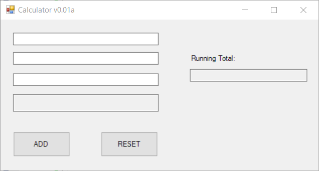
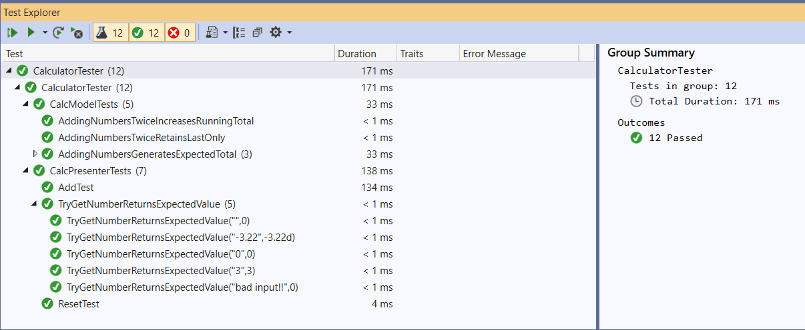

---
categories:
  - Learn
date: 2021-06-09T02:12:00Z
description: ""
draft: false
cover:
  image:
slug: its-possible-to-test-a-winforms-app-using-mvp
summary: If you find yourself supporting a WinForms application, you're likely to notice the tests... or lack thereof. Just because we may not have been so focused on automated tests and continuous integration when WinForms was younger, that doesn't mean we can't introduce them now. Better late than never!
tags:
  - mvp-design
  - winforms
  - testing
  - surviving-winforms
title: Using MVP to test a WinForms app
---
If you find yourself in a position where you're supporting a WinForms application, you're likely to notice the tests... or lack thereof. Just because we may not have been so focused on automated tests and continuous integration when WinForms was younger, that doesn't mean we can't introduce them now. Better late than never!

Let's say you had a simple Form, like this one. It has 3 fields to enter numbers and an `ADD` button to, you know, _add_ them in the bottom field. The "Running Total" field never resets, but just keeps adding each total as long as the app is running.



Assume the above is implemented like this.. a relatively short bit of code. _None_ of these methods can take advantage of automated testing. You'd need an instance of the Form itself, and every method is accessing or otherwise updating UI components.

```csharp
public partial class CalcForm : Form
{
    public Form1()
    {
        InitializeComponent();
    }

    private void btnAdd_Click(object sender, EventArgs e)
    {
        decimal total = 0;
        
        total += SafeGetNumber(txtNumber1);
        total += SafeGetNumber(txtNumber2);
        total += SafeGetNumber(txtNumber3);
        
        txtTotal.Text = total.ToString();
        txtRunningTotal.Text = SafeGetNumber(txtTotal) + total;
    }

    private void btnReset_Click(object sender, EventArgs e)
    {
        txtNumber1.Text = txtNumber2.Text = txtNumber3.Text = txtTotal.Text = "";

        txtNumber1.Focus();
    }
    
    private decimal SafeGetNumber(TextBox tb)
    {
    	return decimal.TryParse(tb.Text, out decimal res) ? res : 0;
    }
}
```

## What is MVP?

In a nutshell, it's one of many frameworks (MVP, MVC, MVVM, etc) that all try to do the same thing - separate the UI and storage mechanisms from the business logic. There's multiple reasons for this, but right now I'm focusing on the fact that it makes it easier to test the business logic.

MVP achieves this in 3 parts - a View, a Presenter, and a Model... and some interfaces thrown in for good measure. A quick disclaimer first - no doubt there are more ways to implement MVP than what I'm about to present, but keep in mind the end goal - to separate the UI from the code we want to test.

### The View

The "View" part of MVP is the Form itself, and it includes an interface that represents everything you might need to get from (or set to) the Form, which is then used by the "Presenter" (more on that later) to tell it what to display next. Whereas before the View (your Form) had all the code neatly tucked away inside it, it's now very bare.

Here's how I converted the Form. Note that it's actually doing nothing intelligent now, other than wiring up all the UI components to properties defined in the interface. I also took the button click event handlers out of the designer file (where they automatically get created), and made those part of the interface as well. When a button's clicked, the Presenter will know about it, can act on it, and will tell the View what to display next.

```csharp
public interface ICalcView
{
    event EventHandler Add;
    event EventHandler Reset;
    string Value1 { get; set; }
    string Value2 { get; set; }
    string Value3 { get; set; }
    string Total { set; }
    string RunningTotal { set; }
    void SetFocusOnFirstTextBox();
    void Show();
}

public partial class CalcForm : Form, ICalcView
{
    public event EventHandler Add;
    public event EventHandler Reset;

    public CalcForm()
    {
        InitializeComponent();

        btnAdd.Click += (s, e) => Add.Invoke(s, e);
        btnReset.Click += (s, e) => Reset.Invoke(s, e);
    }

    string ICalcView.Value1
    {
        get => txtNumber1.Text;
        set => txtNumber1.Text = value;
    }
    string ICalcView.Value2
    {
        get => txtNumber2.Text;
        set => txtNumber2.Text = value;
    }
    string ICalcView.Value3
    {
        get => txtNumber3.Text;
        set => txtNumber3.Text = value;
    }

    public string Total
    {
        set => txtTotal.Text = value;
    }
    public string RunningTotal
    {
        set => txtRunningTotal.Text = value;
    }

    public void SetFocusOnFirstTextBox()
    {
        txtNumber1.Focus();
    }
}
```

### The Model

The "Model" represents an object that you're operating on. In my case, I made the Model a sort of calculator object that stores the totals and has a couple of (very testable) methods for affecting that data.

What you put in here is up to you, but just keep the end goal in mind of wanting to be able to test the logic. The View is the UI, the Presenter is the business logic, and the Model is for data.

```csharp
public interface ICalcModel
{
    decimal Total { get; set; }
    decimal RunningTotal { get; set; }
    void CalculateTotal(List<decimal> numbers);
    void ResetTotal();
}

public class CalcModel : ICalcModel
{
    public decimal Total { get; set; }
    public decimal RunningTotal { get; set; }

    public void CalculateTotal(List<decimal> numbers)
    {
        Total = numbers.Sum();
        RunningTotal += Total;
    }

    public void ResetTotal()
    {
        Total = 0;
        RunningTotal = 0;
    }
}
```

### The Presenter

So far, we've got a View that displays nothing, and a Model that stores numbers but can't do much else. What's the glue that ties them together? I present.. the Presenter!

The Presenter doesn't have an interface, at least not the way I designed it. But it does accept the interfaces that the View and Model implement, and it operates on those. It orchestrates everything, subscribing to events in the View, getting data from the View, passing that data to the Model, and moving things back and forth as needed.

Note that it doesn't actually _touch_ the UI though. It just calls methods on and passes data back to the View, which in turn updates the UI. That's important for testing, because if our presenter touches the UI then we're right back where we started.

```csharp
public class CalcPresenter
{
    readonly ICalcView calcView;
    readonly ICalcModel calcModel;

    public CalcPresenter(ICalcView view, ICalcModel model)
    {
        calcView = view;
        calcModel = model;

        calcView.Add += (s, e) => Add();
        calcView.Reset += (s, e) => Reset();

        calcView.Show();
    }

    public void Add()
    {
        calcModel.CalculateTotal(new List<string> { calcView.Value1, calcView.Value2, calcView.Value3 }.ConvertAll(TryGetNumber));

        calcView.Total = Convert.ToString(calcModel.Total);
        calcView.RunningTotal = Convert.ToString(calcModel.RunningTotal);
    }

    public void Reset()
    {
        calcModel.ResetTotal();

        calcView.Value1 = calcView.Value2 = calcView.Value3 = calcView.Total = calcView.RunningTotal = "";
        calcView.SetFocusOnFirstTextBox();
    }

    public decimal TryGetNumber(string input)
    {
        return decimal.TryParse(input, out decimal res) ? res : 0;
    }
}
```

## How do I tie these layers together?

The way I have it above, the constructor in the Presenter accepts the interface for the View and Model. How you pass concrete instances of each is up to you.

The easy way is to just create an instance of both when you need them, assuming there's nothing around that logic that you want to test. Personally, I don't care what the "launch calculator" button is doing.

```csharp
private void btnLaunchCalculator_Click(object sender, EventArgs e)
{
    new CalcPresenter(new CalcForm(), new CalcModel());
}
```

The other way is to use dependency injection, where you configure a framework to resolve dependencies for you, instead of having to instantiate everything yourself. That's much more than I want to go into here, but there's plenty of resources out there if you want to learn more.

Here's a couple links regarding Unity:

- [Dependency Injection Using Unity - Resolve Dependency Of Dependencies](https://www.c-sharpcorner.com/article/dependency-injection-using-unity-resolve-dependency-of-dependencies/)
- [Dependency Injection: Going Start to Finish With Unity in C#](https://www.accusoft.com/resources/blog/dependency-injection-going-start-finish-unity-c/)

And some SO advice on using a standard Microsoft package:

- [How to use Dependency Injection (DI) in Windows Forms (WinForms)](https://stackoverflow.com/a/70476716)

## Now how does all this help with testing?

"Ugh, this is _soo_ much longer than before", you might be thinking. Okay, it is.... but it's also more intentional, and concerns are more separated. It allows us to mock the interfaces and _thoroughly_ test the logic in the Presenter and Model, like this.

```csharp
[TestFixture]
public class CalcPresenterTests
{
    Mock<ICalcView> mockView;
    Mock<ICalcModel> mockModel;
    CalcPresenter presenter;

    [SetUp]
    public void Setup()
    {
        mockModel = new Mock<ICalcModel>();
        mockView = new Mock<ICalcView>();
        presenter = new CalcPresenter(mockView.Object, mockModel.Object);
    }

    [Test]
    public void AddTest()
    {
        mockView.SetupGet(x => x.Value1).Returns("10");
        mockView.SetupGet(x => x.Value2).Returns("20");
        mockView.SetupGet(x => x.Value3).Returns("30");
        mockModel.SetupGet(x => x.Total).Returns(60m);
        mockModel.SetupGet(x => x.RunningTotal).Returns(100m);

        presenter.Add();

        mockModel.Verify(x => x.CalculateTotal(It.IsAny<List<decimal>>()), Times.Once);
        mockView.VerifySet(x => x.Total = "60", Times.Once);
        mockView.VerifySet(x => x.RunningTotal = "100", Times.Once);
    }

    [Test]
    public void ResetTest()
    {
        presenter.Reset();

        mockView.VerifySet(x => x.Value1 = "", Times.Once);
        mockView.VerifySet(x => x.Value2 = "", Times.Once);
        mockView.VerifySet(x => x.Value3 = "", Times.Once);
        mockView.VerifySet(x => x.Total = "", Times.Once);
        mockView.VerifySet(x => x.RunningTotal = It.IsAny<string>(), Times.Never);
    }

    [Test]
    [TestCase("3", 3)]
    [TestCase("-3.22", -3.22)]
    [TestCase("0", 0)]
    [TestCase("", 0)]
    [TestCase("bad input!!", 0)]
    public void TryGetNumberReturnsExpectedValue(string input, decimal output)
    {
        Assert.AreEqual(output, presenter.TryGetNumber(input));
    }
}

[TestFixture]
public class CalcModelTests
{
    CalcModel model;

    [SetUp]
    public void Setup()
    {
        model = new CalcModel();
    }

    [Test]
    [TestCase(-13, -1, -1, -1, -10)]
    [TestCase(0, 0, 0, 0)]
    [TestCase(15, 1, 2, 3, 4, 5)]
    public void AddingNumbersGeneratesExpectedTotal(decimal expectedTotal, params int[] inputs)
    {
        model.CalculateTotal(inputs.Select(Convert.ToDecimal).ToList());

        Assert.AreEqual(expectedTotal, model.Total);
    }

    [Test]
    public void AddingNumbersTwiceRetainsLastOnly()
    {
        model.CalculateTotal(new List<decimal> { 1, 2, 3 });
        model.CalculateTotal(new List<decimal> { 10, 20, 30 });

        Assert.AreEqual(60, model.Total);
    }

    [Test]
    public void AddingNumbersTwiceIncreasesRunningTotal()
    {
        model.CalculateTotal(new List<decimal> { 1, 2, 3 });
        Assert.AreEqual(6, model.RunningTotal);

        model.CalculateTotal(new List<decimal> { 10, 20, 30 });
        Assert.AreEqual(66, model.RunningTotal);
    }
    
    [Test]
    public void ResetNumbersToZeroWorksAsExpected()
    {
        model.CalculateTotal(new List<decimal> { 1, 2, 3 });
        Assert.AreEqual(6, model.Total);
        Assert.AreEqual(6, model.RunningTotal);

        model.ResetTotal();
        Assert.AreEqual(0, model.Total);
        Assert.AreEqual(0, model.RunningTotal);
    }
}
```

The end result? The beginnings of an automated test suite! You can plug this into TeamCity, Jenkins, or another CI tool and begin to get automated test runs. Yes, this is a lot more difficult in a large app that's been around for years, but with effort it's absolutely doable, one step at a time.


