---
categories:
  - Explore
date: 2019-05-22T02:23:58Z
description: ""
draft: false
postimage: /banners/default-explore-banner.webp
slug: keeping-your-github-code-secure
summary: GitHub, GitLab, and Bitbucket just released a joint statement on a widespread ransomware attack that resulted  in compromised accounts. That got me thinking, what can a person do to protect his or her code on GitHub? As it turns out, a lot...
tags:
  - github
  - security
  - 2fa
title: Protect your GitHub account to keep your code secure
---
A few days ago, [GitHub](https://github.blog/2019-05-14-git-ransom-campaign-incident-report/) (along with [Bitbucket](https://bitbucket.org/blog/git-ransom-campaign-incident-report-atlassian-bitbucket-github-gitlab) and [GitLab](https://about.gitlab.com/2019/05/14/git-ransom-campaign-incident-report-atlassian-bitbucket-github-gitlab/)) reported that numerous users across their platforms had repos hacked, their code forcibly overwritten and held for ransom. You can read the whole thing in any of their blog posts (they're all the same), but here's a few takeaways:

**No one hacked GitHub et al directly.**  
_"All account compromises were the result of credential leakage by users or other third-parties ... using legitimate credentials including passwords, app passwords, API keys, and personal access tokens."_

**One or more sites with access to repos either leaked data or were hacked.**  
_"[W]e identified a third-party credential dump ... where the account compromise activity had originated. That credential dump comprised roughly one third of the accounts affected by the ransom campaign."_

**There are more ways than a large-scale hack to become a victim too.**  
_"[C]ontinuous scanning for publicly exposed_ `.git/config` _and other environment files has been and continues to be conducted by the same IP address that conducted the account compromises. These files can contain sensitive credentials and personal access tokens..."_

As a developer, there are few accounts I'd hate to lose access to more than my GitHub account. Writing code is such an intangible thing - it can be tough enough to show results without having it deleted from under you ([sometimes necessary](https://help.github.com/en/articles/removing-sensitive-data-from-a-repository) but in this case completely malicious). And for a technology company, it could be a death knell - their bread and butter suddenly gone from their control, their intellectual property exposed to the world.

---

# Securing Your Code

So on that cheery note, what can we do to avoid this? Well, as it turns out, _a lot._

## Choose a good password

The first and easiest thing we can do is to choose a good password. Ironically, we tend to be much worse at it than we think, selecting a shorter (thus easier to hack) password that's tough to remember, rather than a longer yet more memorable one.


_source:_ [_xkcd.com_](https://xkcd.com/936) _(_[_good explanation_](https://security.stackexchange.com/questions/6095/xkcd-936-short-complex-password-or-long-dictionary-passphrase)_)_

For the curious, try out a tool like Tyler Akins's [password strength tester](http://rumkin.com/tools/password/passchk.php) to see how length can increase security even without adding special characters. For instance, an apparently random one presents 18.5 billion billion trillion possibilities, but a random string of words presents for more (7 trillion trillion trillion trillion).

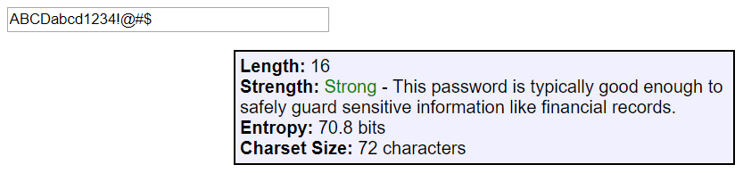

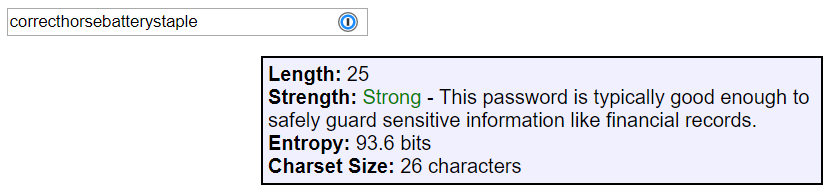

If you save your passwords in a password manager like [1Password](https://1password.com/) _(my personal favorite),_ [Lastpass](https://lastpass.com/), [Keeper](https://keepersecurity.com/), [Clipperz](https://clipperz.is/), or another one you trust, then you can _really_ go completely random. 1Password has a built-in random password generator. The default settings produce a password with 1200 trillion trillion trillion possibilities, but you can dial it to 64 and produce something with _118 quadrillion quadrillion quadrillion quadrillion quadrillion quadrillion quadrillion quintillion possibilities!_

At that level, it's highly unlikely anyone that someone will manage to crack your password (before the heat death of the universe anyway).

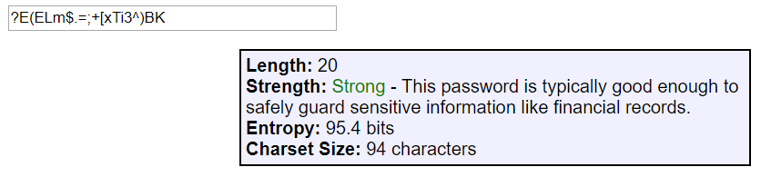

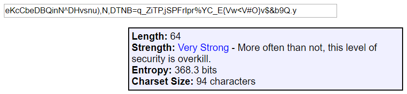

Tyler has a post on passwords that I recommend reading, especially the section on [password security precautions](https://web.archive.org/web/20220123131343/http://www.fidian.com/programming/passwordsecurity#TOC-Precautions-You-Need-To-Take). It's full of great suggestions for choosing a password wisely.

---

## Don't reuse passwords

You'll hear this advice a lot, but why does it matter? Well, no matter how good your password is, some site is going to store it incorrectly.. and get hacked... and your password is going to end up out in the open.

Most people use the same email address as their username everywhere. So once a hacker has your password it's easy to try it out on different sites. And if they've figured out what your GitHub password is, they can try it on other sites developers might frequent like Microsoft and Apple, cloud services like Amazon and DigitalOcean, code repos like GitLab and Bitbucket, and on and on.

The only reasonable way to have a hundred different complex passwords is to use a password manager like [1Password](https://1password.com/), as I mentioned before. Let them generate a long and unique password, and store it for you.

---

## Setup 2FA for your account

Imagine you have a safety box, and in order to gain access you have to whisper a secret phrase to the teller. Now imagine he verifies your phrase but leaves his computer unlocked, and everyone who walks by for the rest of the day can see it. The teller also has a horrible memory _(did I forget to mention that?)_ and a hundred different people repeat your secret phrase, and he just shows everyone the contents of your box. 😒

But what if you needed to insert a physical key into the box too? Anyone with the secret phrase would still be locked out, unable to see the contents. That's two-factor authentication (aka authorization, verification, etc). In addition to something you _**know**_ (your password), you also need something you _**own**_ (your phone, to generate a secret code) or that you _**are**_ (your fingerprint). The more factors (multi-factor auth) that you can add to an account, the less likely anyone has everything they need to access it.

Setup 2FA for [GitHub](https://github.com/settings/security) _(_[_help_](https://help.github.com/en/articles/about-two-factor-authentication)_),_ and then set it up everywhere else that offers it too - [Amazon](https://www.amazon.com/a/settings/approval), [Google](https://myaccount.google.com/signinoptions/two-step-verification)_,_ [LinkedIn](https://www.linkedin.com/psettings/two-step-verification), etc. Here's a great site that documents how (or if) you can enable 2FA for various sites: [twofactorauth.org](https://twofactorauth.org/)

Briefly, how it works is a site generates a unique QR code, which you'll scan with an app like [andOTP](https://github.com/andOTP/andOTP) (which can do encrypted backups). If you scan the code with multiple devices, they'll generate the same (one-time use) code every 30 seconds or so, which is a great way to avoid disaster if one device fails. Print and store any recovery codes they give you too.

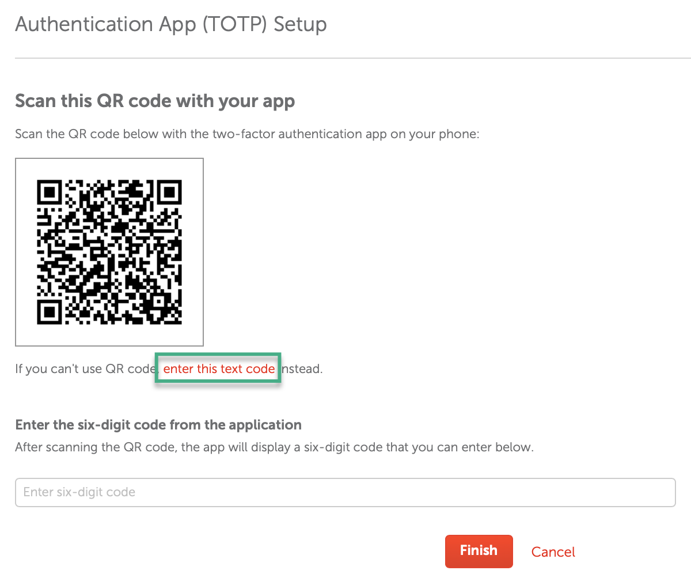

Using an [online decoder](https://zxing.org/w/decode.jspx) on the above QR code, the contents include the site and a unique "secret". The only way this works is if the service stores the secret too and (by combining it with the current time) generates the same code your app does, in order to verify it. This keeps you safe in the event a third party leaks your credentials (like happened with GitHub et al), or a different site gets hacked and you reused the same password, or someone discovers your password scrawled under your keyboard. It's unlikely to help if the site itself gets hacked and the secret is discovered along with your password.

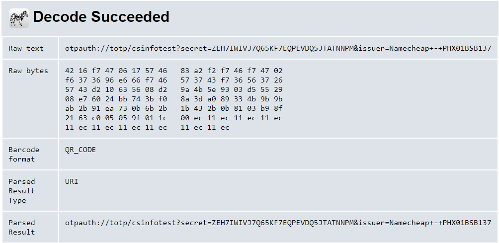

[Learn more about what 2FA is](https://authy.com/what-is-2fa/), the [pros and cons of various 2FA methods](https://web.archive.org/web/20181121184020/https://auth0.com/learn/two-factor-authentication/), or just see [what a typical setup process for enabling 2FA looks like](https://www.namecheap.com/support/knowledgebase/article.aspx/10073/45/how-can-i-use-the-totp-method-for-twofactor-authentication). 1Password can [store and track your 2FA codes for you](https://support.1password.com/one-time-passwords/) too, which seemed a little odd when I first heard about it... but then, if someone hacks them and gets anything useful we're screwed anyway.

---

## Require 2FA for the whole organization

Even if you enable 2FA on your device, what if you're part of a GitHub organization and dozens of other developers _don't_ have 2FA enabled?

If they have access to push changes to the organization's repos, any one of them could fall prey to the issue GitHub just notified everyone about, and their account could be used to wipe the organization's code. Granted, they probably have a local copy, and all the other members have cloned copies too, and GitHub (I would hope) has backups, but the other threats include releasing code to the public that was meant to remain private, or slipping malicious commits in and having them go unnoticed.

GitHub allows [organization owners to force members to enable 2FA](https://help.github.com/en/articles/requiring-two-factor-authentication-in-your-organization). Um, warn them first though, because as soon as you enable this option it'll boot everyone who doesn't have 2FA from the organization, lol. Don't worry, [you can reinstate them](https://help.github.com/en/articles/reinstating-a-former-member-of-your-organization).

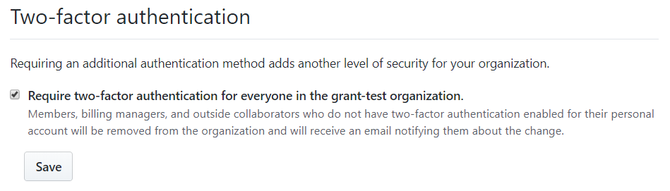

If you didn't want to enforce 2FA on everyone_,_ I can think of another way that _might_ prevent a problem like this as long as the admins have 2FA enabled - [branch restrictions](https://help.github.com/en/articles/enabling-branch-restrictions). Setup a branch protection rule for the pattern "master". That alone disables force-pushes, which is what the hacker used to ransom these accounts. You can also make it so PRs can't be merged without other eyes on the changes, and require signed commits (more on that next).

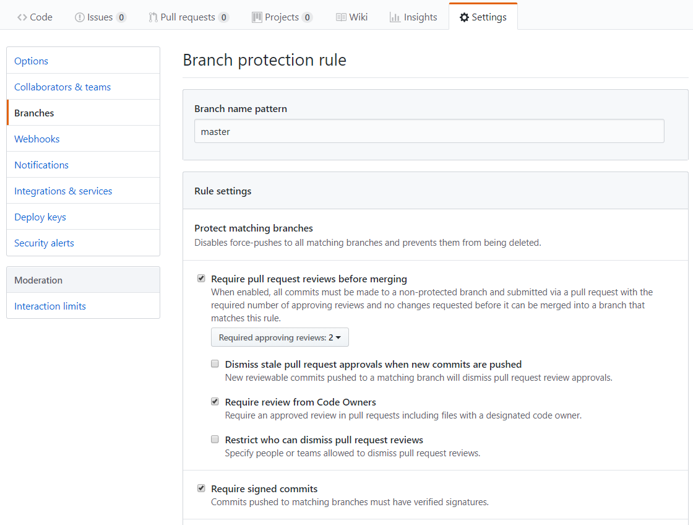

---

## Sign your git commits

You've got a good unique password, it's stored securely, and you've enabled another method of auth so even if your credentials are compromised you're likely to still be okay. What's next?

You can digitally "sign" your commits so everyone knows they came from you, and not someone [pretending to be you](https://softwareengineering.stackexchange.com/a/212216)... which is a [possibility](https://help.github.com/en/articles/why-are-my-commits-linked-to-the-wrong-user) when multiple people have access to a repo. GitHub provides comprehensive docs on [managing commit signature verification](https://help.github.com/en/articles/managing-commit-signature-verification).

### Create a signing key

If you've never setup a key before (I hadn't before writing this), start by [generating a new GPG key](https://help.github.com/en/articles/generating-a-new-gpg-key). Fill in your name and email, etc. If you want, go into [email settings](https://github.com/settings/emails) and select the _"Keep my email address private"_ checkbox first, and use whatever GitHub assigns to you.

```sh
gpg --full-generate-key
```

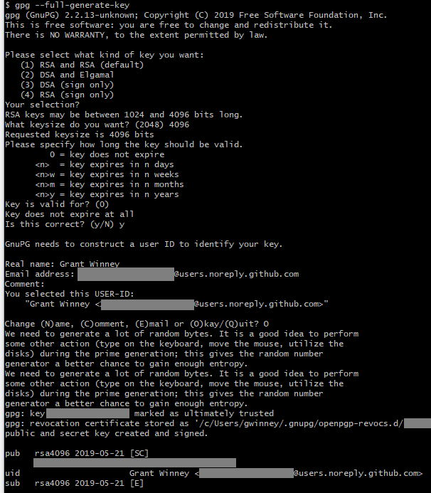

In a minute, you'll need the key id listed next to _"gpg: key"_. If you clear the screen or whatever, you can display it again with this; it's on the first line next to _"rsa4096"._

```sh
gpg --list-secret-keys --keyid-format LONG
```

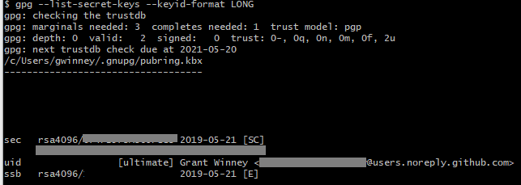

### Add the key id to your local git config

Next, [tell Git about your signing key](https://help.github.com/en/articles/telling-git-about-your-signing-key). Copy the key id and add it to your git config file:

```sh
git config --global user.signingkey 12341234ABCDEF12
```

Open the `~/.gitconfig` file you just edited to make sure it's in there. You should see something like this:

```none
[user]
name = Grant Winney
email = your_email_address@domain.com
signingkey = 12341234ABCDEF12
```

Add one more section underneath that:

```none
[commit]
gpgsign = true
```

### Add the GPG key to GitHub

Finally, you'll need to [add the GPG key to your account](https://docs.github.com/en/authentication/managing-commit-signature-verification/adding-a-gpg-key-to-your-github-account).

```sh
gpg --armor --export 12341234ABCDEF12
```

Open the [SSH and GPG keys](https://github.com/settings/gpg/new) settings and enter the ginormous value it generates for you.

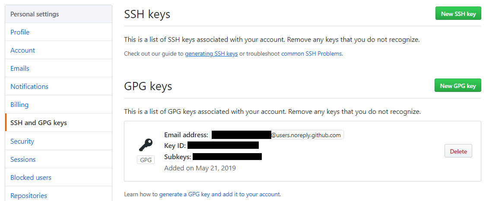

Now when you push to a repo, you'll have to enter the passphrase you chose (you can [save the passphrase](https://stackoverflow.com/a/38422272/301857) so you don't have to enter it with each commit, but I'm not... for now), and you'll see a special badge next to your commits on GitHub.

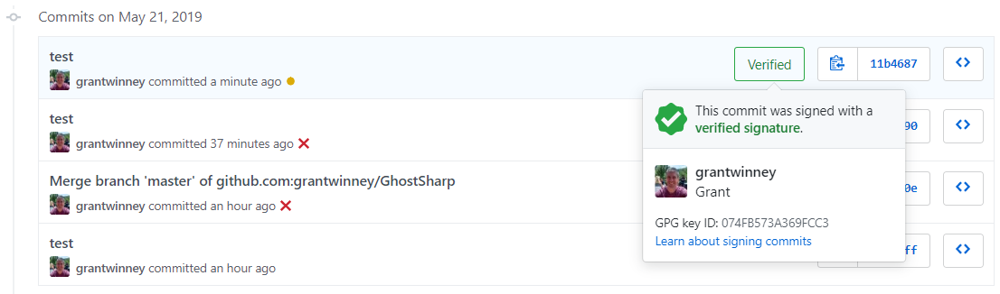

---

## Require signing all commits for a repo

Okay, you're signing your commits... but [what about everyone else with access](https://mikegerwitz.com/2012/05/a-git-horror-story-repository-integrity-with-signed-commits) to your repository? It'd be great if every commit was proven to be from exactly who they seem to be from. You can [require verification for a branch](https://help.github.com/en/articles/about-required-commit-signing), even for admins.

If you wanted to require all commits to master be signed, for instance, you could do that on the "Branches" settings page. This would've (I believe) prevented the hackers from being able to force-push their ransom note and overwrite repo history.

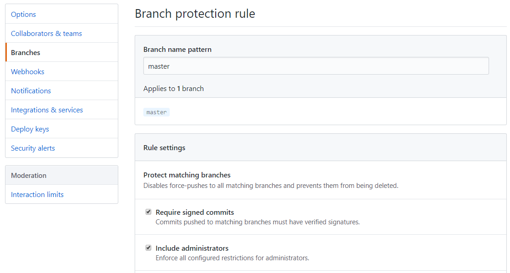

---

## Be wary who you grant access to

This whole thing happened, according to GitHub, because some unnamed third party leaked credentials. So now's a great time to [review those third-party applications](https://github.com/settings/applications) to which you've granted some level of access in the past, and decide whether you need it anymore.

Click on an application to see what it has access to.

- If the only permission is _"Access user email addresses (read-only)",_ then most likely it's being used as a login to a site.
- But if the permissions include _"Full control of private repositories",_ you'll want to think hard about how much you trust that service - they have access to everything!

If you're an admin of an organization, consider [restricting app access](https://help.github.com/en/articles/about-oauth-app-access-restrictions) to the org. And while you're there, [revoke any login sessions](https://github.com/settings/security) you don't recognize too (scroll to the bottom of the page).

---

## Don't expose your .git directory

I don't have experience with an environment where this would be a problem, but I could imagine one pretty easily.

An educational / government / whatever institution stores their entire website in GitHub, then configures some server to clone it and make the whole thing publicly available. Yay versioning! Yay automation and convenience! Except there are sensitive folders like `.git` that might contain logs and other stuff you wouldn't actually want available to the public, so without a little care it could definitely be a security issue.

From the released report, this seems to be one of the things hackers are looking for:

> Continuous scanning for publicly exposed `.git/config` and other environment files has been and continues to be conducted ... as recently as May 10. These files can contain sensitive credentials and personal access tokens ... and they should not be publicly accessible in repositories or on web servers. This [problem](https://en.internetwache.org/dont-publicly-expose-git-or-how-we-downloaded-your-websites-sourcecode-an-analysis-of-alexas-1m-28-07-2015/) is [not](https://laravel-news.com/psa-hide-your-gitconfig-directory) a new [one](https://web.archive.org/web/20190616081313/https://sweetness.hmmz.org/2013-06-10-devs-please-stop-serving-git-to-the-outside.html). More information on the `.git` directory and the `.git/config` file is available [here](https://git-scm.com/docs/gitrepository-layout) and [here](https://git-scm.com/docs/git-config#_configuration_file).

---

## Anything else?

That's all I can think of for now. Here's a couple other resources to check out too:

- [Authenticating to GitHub](https://help.github.com/en/categories/authenticating-to-github)
- [10 GitHub Security Best Practices | Snyk](https://snyk.io/blog/ten-git-hub-security-best-practices/)

Was this helpful? Do you have any other tips for securing your GitHub code?
