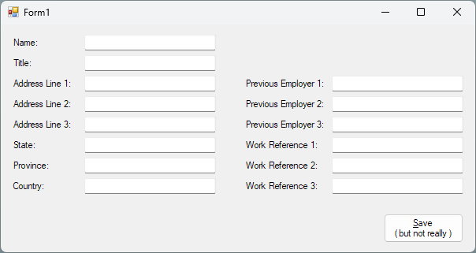
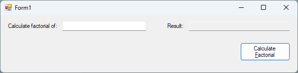

---
categories:
  - Coding
date: 2022-10-08T18:40:48Z
description: ""
draft: false
cover:
  image: photo-1598811629267-faffa0027fe4.jpg
slug: local-functions-in-csharp-aka-nested-methods
summary: C# 7 introduced a new tool for the belt - local functions. Let's take a look at what they are, how to use them, and why we might not want to.
tags:
  - csharp-7
  - csharp
title: Local functions in C# (aka nested methods)
---
I've recently been refreshing myself on some of the goodies we got with [C# 6](https://grantwinney.com/tags/c-6-0/), like [null safety operators](https://grantwinney.com/null-conditional-and-null-coalescing-operators/) and [string interpolation](https://grantwinney.com/using-string-interpolation-to-craft-readable-strings/). I find a use for them from time to time, but I'd bet there's a lot of people besides me who could use a refresher too... if they've heard of them at all.

Everyone wants to learn, but there isn't always an opportunity for discovering the newest and hottest, especially in older apps. Sometimes we get so familiar with the old that it seems good enough, but little improvements help too, which is why I'm doing these posts on [surviving WinForms](https://grantwinney.com/tags/surviving-winforms/).

Today I'm digging into something we got in C# 7 - [local functions](https://learn.microsoft.com/en-us/dotnet/csharp/programming-guide/classes-and-structs/local-functions). These are functions that can be nested inside of _other_ functions. Actually, it's an odd name choice since, unlike some languages, C# typically calls them methods. So why aren't they called nested methods? One of life's great mysteries, I suppose.

As I said, local functions are methods that are nested inside of other methods. Why would you want to do that? One reason might be to [DRY](https://www.nickang.com/2017-12-11-what-is-dry-programming/) up code that's only needed by a single method. I've seen code like this quite a bit, where the same check is being performed on a bunch of separate UI elements. It's repetitive, but there isn't really an obvious way to make it shorter.

Imagine a form loaded with text boxes for collecting information about employees. For some reason, the powers that be want certain fields to be set to "N/A" upon saving, if they're empty. Weird, but hey I don't make the rules...



Here's the code that checks every field individually and sets them to "N/A":

```csharp
private void btnSave_Click(object sender, EventArgs e)
{
    if (txtTitle.Text == string.Empty)
        txtTitle.Text = "N/A";
    if (txtAddr2.Text == string.Empty)
        txtAddr2.Text = "N/A";
    if (txtAddr3.Text == string.Empty)
        txtAddr3.Text = "N/A";
    if (txtState.Text == string.Empty)
        txtState.Text = "N/A";
    if (txtProvince.Text == string.Empty)
        txtProvince.Text = "N/A";
    if (txtPrevEmp2.Text == string.Empty)
        txtPrevEmp2.Text = "N/A";
    if (txtPrevEmp3.Text == string.Empty)
        txtPrevEmp3.Text = "N/A";
    if (txtWorkRef2.Text == string.Empty)
        txtWorkRef2.Text = "N/A";
    if (txtWorkRef3.Text == string.Empty)
        txtWorkRef3.Text = "N/A";
    
    dbContext.Save(txtTitle.Text, .....);
}
```

Local functions allow us to pull the similar code into a separate method that's _only_ accessible by the method it's in, and we can shorten the code a bit. I think it's still plenty readable. What do you think?

```csharp
private void btnSave_Click(object sender, EventArgs e)
{
    void SetNAIfEmpty(TextBox textBox)
    {
        if (textBox.Text == string.Empty)
            textBox.Text = "N/A";
    }

    SetNAIfEmpty(txtTitle);
    SetNAIfEmpty(txtAddr2);
    SetNAIfEmpty(txtAddr3);
    SetNAIfEmpty(txtState);
    SetNAIfEmpty(txtProvince);
    SetNAIfEmpty(txtPrevEmp2);
    SetNAIfEmpty(txtPrevEmp3);
    SetNAIfEmpty(txtWorkRef2);
    SetNAIfEmpty(txtWorkRef3);
    
    dbContext.Save(txtTitle.Text, .....);
}
```

Since the method is the same as any other method, we can change the signature to accept an array, and pass all the TextBox controls in at once. Notice that the "local" method can occur anywhere in its parent method.. it doesn't have to be at the top of it.

```csharp
private void btnSave_Click(object sender, EventArgs e)
{
    SetNAIfEmpty(txtTitle, txtAddr2, txtAddr3, txtState, txtProvince,
        txtPrevEmp2, txtPrevEmp3, txtWorkRef2, txtWorkRef3);
    
    dbContext.Save(txtTitle.Text, .....);

    void SetNAIfEmpty(params TextBox[] textBoxes)
    {
        foreach (var textBox in textBoxes)
            if (textBox.Text == string.Empty)
                textBox.Text = "N/A";
    }
}
```

Is that still readable? I'm not so sure. It takes more time to figure out what the method's accomplishing, and I prefer clarity to brevity. Just because we _can_ do something in fewer lines doesn't always mean we _should._ Like anything, local functions can be taken too far. [Golden hammer](https://ceopedia.org/index.php/Golden_hammer#Golden_hammer_in_computer_programming) and all that.

And keep in mind there's always plenty of ways to solve a problem. Local functions aren't the only way to shorten the original code above. You could use the `Controls` collection and LINQ, for instance, to set every TextBox on the screen. Still pretty readable, but maybe not as flexible.

```csharp
private void btnSave_Click(object sender, EventArgs e)
{
    foreach (var textBox in Controls.OfType<TextBox>().Where(tb => tb.Text == string.Empty))
        textBox.Text = "N/A";
    
    ...
}
```

Another interesting use for local functions is recursion, where you normally need to define a separate method that calls itself (recursively, some may say.. har har), and really has no other use within the class. Instead of leaving it accessible to everything in the class, you can define it locally so only the method that needs it can access it - local functions are always (implicitly) private.

For instance, if you had a small app that finds the factorial of a number, you could place the method that method that recursively calculates that factorial inside the button event method.



```csharp
private void btnCalcFactorial_Click(object sender, EventArgs e)
{
    txtFactorialResult.Text = GetFactorial(Convert.ToInt32(txtFactorialStart.Text)).ToString();
            
    int GetFactorial(int number)
    {
        if (number == 1)
            return 1;

        return number * GetFactorial(number - 1);
    }
}
```

Or if you had a form that calculates how much someone will eventually repay on a loan, you might want to apply the same percentage to some starting number for x months.


```csharp
private void btnCalcTotalRepaid(object sender, EventArgs e)
{
    var totalRepaidAmount = GetTotalRepaidAmount(Convert.ToDecimal(txtOrigLoan.Text),
        Convert.ToDecimal(txtMonthlyInt.Text) / 100, Convert.ToInt32(txtNbrOfMonths.Text));
    txtTotalRepaid.Text = $"${totalRepaidAmount:0.00}";

    decimal GetTotalRepaidAmount(decimal amount, decimal interest, int months)
    {
        if (months == 0)
            return amount;

        return GetTotalRepaidAmount(amount * (1 + interest), interest, --months);
    }
}
```

In both cases, nothing else needs to call GetFactorial or GetTotalRepaidAmount, so why not have them as close to the method that _does_ need each one? As the form grows and things get moved around and jumbled up by future devs, no one will have to hunt around for the methods - they're _right there_.

The caveat to this is that, since the method is accessible only within the method it's in, you can't test it. And the above two methods (GetFactorial and GetTotalRepaidAmont) would be great candidates for a [TestCase](https://docs.nunit.org/articles/nunit/writing-tests/attributes/testcase.html) in NUnit (or [InlineData](https://exceptionnotfound.net/using-xunit-theory-and-inlinedata-to-test-c-extension-methods/) in XUnit), where you could send maybe a half-dozen different values into the method and make sure you get the expected result. You could even move them into a controller and use [MVP](https://grantwinney.com/its-possible-to-test-a-winforms-app-using-mvp/).

So as I said, not a magic hammer, just another tool.. ymmv and all that.

One last thing, on the subject of taking things too far. Looking at these examples, did it occur to you that since the local function is a regular old method, you can do something else with it? Like, nest a local function _in_ the local function?

```csharp
private void HowAreYouFeelingToday()
{
    Console.WriteLine($"I'm feeling {EvenOrOdd()} today.");

    string EvenOrOdd()
    {
        return PositiveOrNegative() > 0 ? "even" : "odd";

        int PositiveOrNegative()
        {
            return IsDayEven() ? 1 : -1;

            bool IsDayEven()
            {
                return DateTime.Now.DayOfYear % 2 == 0;
            }
        }
    }
}
```

You're team is going to _love_ you. Functions alllll the way down... 🐢

If you found this content useful, and want to learn more about a variety of C# features, check out [this GitHub repo](https://github.com/grantwinney/CSharpDotNetExamples), where you'll find links to plenty more blog posts and practical examples!
