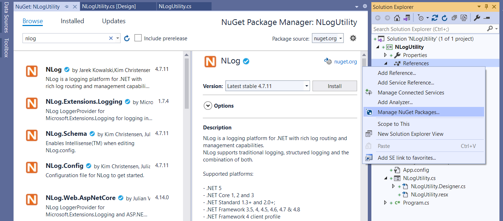
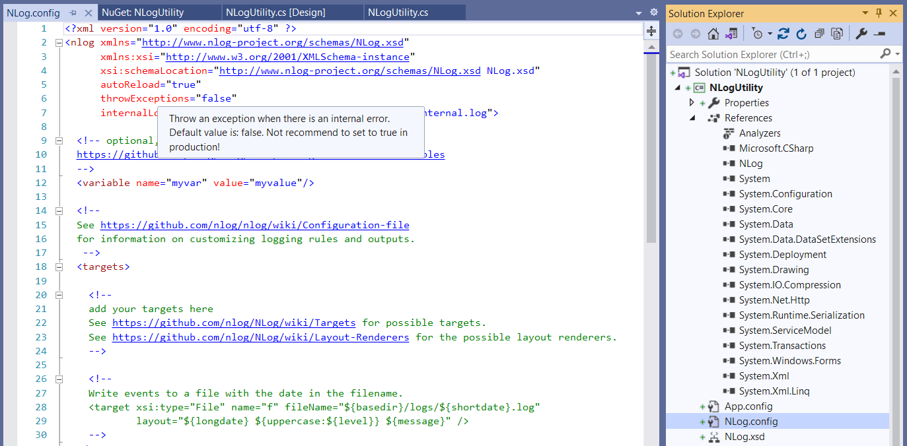
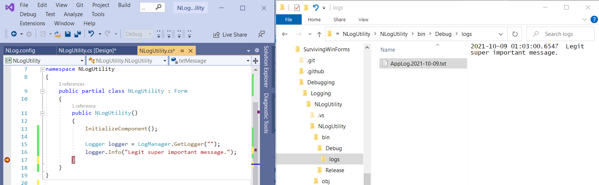
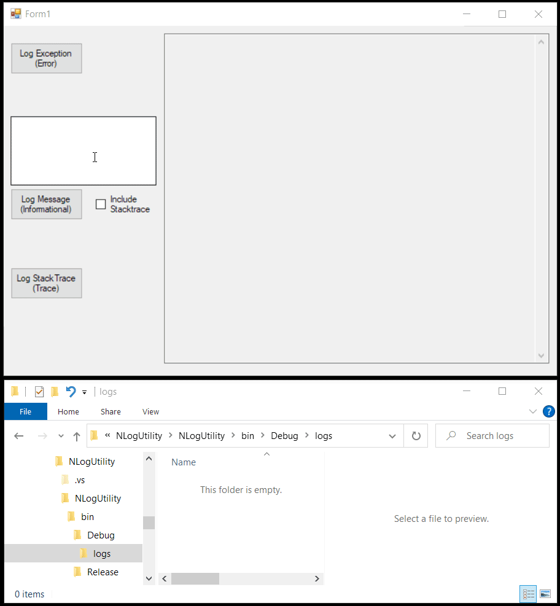

---
categories:
- Surviving WinForms
- Logging
- WinForms
- Coding
- NLog
date: "2021-10-09T15:53:15Z"
description: ""
draft: false
cover:
  image: photo-1454165804606-c3d57bc86b40.jpg
slug: log-errors-in-winforms-with-nlog
summary: Logs are a great tool for squashing bugs and tracing errors. Let's see how
  to add NLog to our project.
tags:
- Surviving WinForms
- Logging
- WinForms
- Coding
- NLog
title: How to log errors in WinForms using NLog
---
What's more annoying than a bug in your code? Not knowing _why_ there's a bug in your code! I've worked in code bases before that have little to no logging, and it's awful. When an exception is thrown, .NET tells us what and where, including the long chain of method calls (stack trace) all the way back to the origin. To not make a note of that somewhere is a shame.. and a waste of everyone's time! Some people love debugging. I'm not one of them.

Even when your code is running perfectly, sometimes it's handy to be able to log informational messages, especially during testing. Or maybe there's no exception but something still seems "off". How convenient it is to write logs, and see what unexpected paths the system is going down!

Even in a monolithic WinForms app that has no logging, it's possible to add it - a little at a time. Now if you're on a team, don't try to fix the whole app and issue the Guinness book of world records sized PR. It's not going to garner the praise and admiration of your peers.. or management.... or customers. Just keep telling yourself things like "Rome wasn't built in a day" and "the road to hell is paved with good intentions". 😂

Configure a tool like [NLog](https://nlog-project.org/), use it in whatever code you're touching at the moment, and go from there!

## Install NLog

There's different kinds of tools to do this, and you could even roll your own if you're a glutton for punishment, but [NLog](https://nlog-project.org/) is a tried and true library, so we'll just use that.

Open your solution, go to "Manage NuGet Packages", and search for NLog. You should see a few items. You _could_ just install the first one, but I'd recommend the fourth instead (NLog.Config), which installs NLog, and a sample `NLog.config` file to start with, _and_ some helpful intellisense for the config file (that's the NLog.Schema one).

What's the NLog.Extensions.Logging one that I glossed over? Something to do with new features in .NET Core and .NET Standard, and probably not something you're worried about in a WinForms app.





## Configure NLog

Everything's driven off the NLog.config file, so open that up and check it out. You should see some boilerplate stuff, a few links, and intellisense if you hover over the different elements. Pretty exciting. _(But then, I spent Friday evening writing this, so my judgement's probably off.)_

There are _so many_ configuration options you can choose from, and you can see them all by visiting those links! And get overwhelmed to your heart's content. For now though, let's just focus on writing to a file, which is [documented here](https://github.com/NLog/NLog/wiki/File-target).

Skip down to the section on "[simple logging](https://github.com/NLog/NLog/wiki/File-target#simple-logging)" and replace everything in the NLog.config file with the contents of that section. That'll get you up and running quickly, and it'll write log files to wherever your app is running. Maybe not ideal in production, but you can adjust that later.

- Remove "fileName" and "keepFileOpen".
- Replace "Debug" with "Trace" in "minLevel".
- Skip further down in the docs to "[archive old log files](https://github.com/NLog/NLog/wiki/File-target#archive-old-log-files)" and copy "fileName" and the two lines below it. Paste them into the "target" section.

You should end up with something like this:

```xml
<?xml version="1.0" ?>
<nlog xmlns="http://www.nlog-project.org/schemas/NLog.xsd"
      xmlns:xsi="http://www.w3.org/2001/XMLSchema-instance">
 
    <targets>
        <target name="file" xsi:type="File"
            layout="${longdate} ${logger} ${message}${exception:format=ToString}" 
            fileName="${basedir}/logs/AppLog.${shortdate}.txt" 
            maxArchiveFiles="4"
            archiveAboveSize="10240"
            encoding="utf-8" />
    </targets>
 
    <rules>
        <logger name="*" minlevel="Trace" writeTo="file" />
    </rules>
</nlog>
```

Those lines about archiving aren't strictly needed for this basic demo, but I think they're important to call out. You don't want a log file that grows too large, so this will archive old files. It also hangs on to 4, although maybe you want to hang on to a month, or even several months. But log files from several years ago just aren't necessary.

## Use NLog

To use it, just create a new instance of the logger. Since we didn't give it a name in the config file, it doesn't matter what name you specify here - even an empty string works. Then write whatever you want, and check for the file in the "bin" folder where `${basedir}` points to.



That's it!

## A more interesting example

NLog can do a _lot_ more, way more than I could cover here. Before wrapping things up though, let's try a slightly more interesting example. It'll probably be easier if you just [grab the code](https://github.com/grantwinney/SurvivingWinForms/tree/master/Debugging/Logging/NLogUtility), but I made a couple changes in the config file - it logs everything (including trace messages), and the message will include the "level" (info, warning, etc).

```xml
<targets>
    <target name="file" xsi:type="File"
        layout="${longdate}|${level:uppercase=true}|${message} ${exception:format=ToString}${newline}" 
        fileName="${basedir}/logs/AppLog.txt" 
        maxArchiveFiles="10"
        archiveAboveSize="10240"
        archiveFileName="${basedir}/logs/archive/AppLog.{####}.txt"
        archiveNumbering="Sequence"
        encoding="utf-8" />
</targets>
 
<rules>
    <logger name="app_logger" minlevel="Trace" writeTo="file" />
</rules>
```

I wrote a little UI that logs a few different types of messages, and you can see the result here. If this is new to you, [get the code](https://github.com/grantwinney/SurvivingWinForms/tree/master/Debugging/Logging/NLogUtility), play around with it, change it, break it, revert the code.. lol.



The [NLog wiki on GitHub](https://github.com/NLog/NLog/wiki) is really comprehensive too - hundreds of pages on there covering everything imaginable. And if you're interested in logging to several targets at once, [check this out](https://grantwinney.com/how-to-log-messages-to-multiple-targets-with-nlog/).

Good luck! Feel free to reach out and let me know how it goes...
