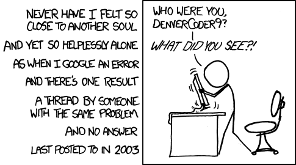

---
categories:
date: 2019-03-13T03:29:29Z
description: ""
draft: false
postimage: /banners/generic-learning-banner.webp
slug: lost-access-to-your-mozilla-addons-account
summary: I recently realized that somehow, in the 6 months since I last logged into my Mozilla developer account, none of my short list of emails would let me back in. Here's how I regained access.
tags:
  - mozilla
  - security
title: Regaining access to a Mozilla Addons account
---
I recently realized that somehow, in the 6 months since I last logged into my Mozilla developer account, none of my short list of emails would let me back in.

As with any company who offers free software to the masses, it was a little tough trying to find just who to ask for help. I stumbled on [Mozilla's Discourse board](https://discourse.mozilla.org/t/i-cant-remember-the-email-address-i-used-to-upload-my-addons-so-i-cant-access-the-account/36785), and posted my situation there. Caitlin, a Community Manager at Mozilla and a moderator on the board, was kind enough to point me in the right direction.

> Hey **@**grantwinney, can you email amo-admins [at] mozilla [dot] org with this information and include the email addresses you think you used with your account? The admins might be able to help you out.

According to their [wiki](https://wiki.mozilla.org/AMO), that email is their support mailing list. So I did as she said and included my usual email addresses, and in short order heard back from Philipp, who also works for Mozilla. _(You can find the_ [_whole team_](https://wiki.mozilla.org/Add-ons) _along with a bunch of other related info too.)_

> Hi Grant, we've received this request, apparently from you. The email address to use is *****@***. If it says there is no account, please create a new account and you will regain access to your add-ons. Thanks, Philipp

There you have it. If you lose access, try emailing the amo-admins list. Or if you only have one email address, try creating a new account with it. I had to create a new account using the email address they said was attached to my addons, and sure enough I regained access and was able to update it again! Weird.

**Kudos to the Mozilla staff. I got very prompt and personal help... thanks!!**

I'm glad I didn't dead-end in a public forum where some other user had the same problem 10 years ago and no one ever answered. 😅

[xkcd: Wisdom of the Ancients](https://xkcd.com/979/)
