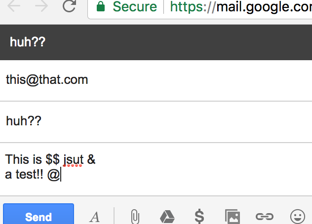

---
categories:
  - Coding
date: 2017-08-16T10:27:33Z
description: ""
draft: false
cover:
  image:
slug: making-your-first-chrome-extension
summary: We all have our favorite web browser with our favorite extensions loaded, but have you ever considered writing your own? In the past few months I've created a couple extensions to suit my own needs. Here's what I've learned!
tags:
  - browser-extension
title: Creating Your First Chrome Extension
aliases:
  - /chrome-extensions-a-peek-under-the-hood
---
We all have our favorite web browser with our favorite extensions loaded, but have you ever considered writing your own? You've probably had at least one idea for _something_ that it'd be nice to have, but there's nothing out there that quite does what you're looking for.

As technology becomes more and more a part of our everyday lives, it's useful to understand how to manipulate it to suit our individual needs. These days, knowing at least a little coding is like learning word processing or writing a basic html page was 15 years ago. It's becoming a basic computer skill.

In the past few months I've created a couple extensions to suit my own needs - unpolished but functional - and threw them in the Chrome Web Store just in case someone out there found them useful. Here's what I've learned.

## Hello World!

Let's start with the easiest thing possible.

The most important file in a Chrome extension is the `manifest.json` file. It specifies everything about your extension, from meta information (name, author, version) to requested permissions, the locations of scripts, icons to display in the browser, and much more. You can [read more about the many settings here](https://developer.chrome.com/extensions/manifest), but you might want to wait until the end of this post, unless you just want to delve right into the deep end!

Here's a bare-bones `manifest.json` file for our very first "Hello World" extension. The first three lines are required, and the extension won't load without them - leave them be for now. The "background" field specifies a script to load, and the empty "browser_action" lets Chrome know there's no html page to display (pop up) when the extension icon is clicked (more on that later). Create a folder and copy this into a file named "manifest.json".

```json
{
    "name": "My First Extension",
    "version": "1.0",
    "manifest_version": 2,
    
    "background": {
        "scripts": ["helloworld.js"]
    },
    "browser_action": {}
}
```

Create a second file and name it "helloworld.js", then paste the following into it. All we're doing is listening for the `browserAction.onClicked` event, and when it fires (when you click the icon for your extension) we can take some action.

```javascript
chrome.browserAction.onClicked.addListener(function(tab) {
    alert('HELLOOOOO WORLD!!');
});
```

Now let's try it out...

## Testing an extension

Chrome makes it easy to test your extensions locally.

Open the "extensions" pane where you'd normally look for new extensions, and then select the "Developer Mode" checkbox in the corner. New options appear, allowing you to load your extension and run it.


Press the "Load unpacked extension..." button and navigate to the folder where you stored the two files you just created. Select the folder and press "Select".


Look for the new generic icon (since we didn't specify an icon for it to use) in the upper-right corner, and press it. This fires our `browserAction.onClicked` event and executes our code - in this case a simple alert box.


If there’s anything wrong with your manifest.json file, or you’ve pointed to a resource that’s missing or inaccessible, you'll see an error section like this:


Fix your mistakes and click the “Reload” link to try again.

## Hello World! (popup edition)

Sometimes, having an extension do only one thing may be exactly what you want. Most of the time though, you'll probably want to display your own HTML page when a user clicks your extension icon. So let's try that next.

Open the `manifest.json` file, then take out the background script and give it a page to show instead.

```json
{
    "name": "My Second Extension",
    "version": "1.0",
    "manifest_version": 2,

    "browser_action": {
        "default_popup": "popup.html"
    }
}
```

Create an html page named "popup.html" with some _really_ advanced markup:

```html
<h1>HELLO WORLD!!</h1>
```

On the extensions page, find your extension (it should be at the top of the list) and look for the "Reload" link. Click that, then click on the extension icon again.


You should see the HTML page you just created. It's a thing of beauty, right? ;)


### Generate an email

You can add any HTML you want in there. How about a box where someone can create an email? Change the HTML file to include a few relevant fields and a submit button:

```html
<html>
    <head>
        <script src="script.js"></script>
    </head>
    <body style="width:200px">
        <p>Email Someone!</p>
        <p style="font-size:smaller"><em>(not as sophisticated as it sounds...)</em></p>
        <p>Email: <input id="emailAddress"></p>
        <p>Subject: <input id="emailSubject"></p>
        <p>Body: <textarea id="emailBody" style="min-height:50px;"></textarea></p>
        <p><input type="submit" id="send"></p>
    </body>
</html>
```

You can use Javascript to handle what happens when the submit button is pressed. Create the "script.js" file referenced above, and paste this code into it. _(I registered the button's_ _`_onclick_`_ _event inside the page's_ _`_load_`_ _event to make sure that the page is fully loaded before trying to access elements on the page.)_

```javascript
window.addEventListener('load', function load(event) {
    document.getElementById('send').onclick = function() {
        var email = document.getElementById('emailAddress').value;
        var subject = document.getElementById('emailSubject').value;
        var body = encodeURIComponent(document.getElementById('emailBody').value);
        window.open(`mailto:${email}?subject=${subject}&body=${body}`);
    };
});
```

Click the icon again to bring up your new form, then fill in the fields and hit enter. Assuming you have a default mail client that handles "mailto" links (like gmail), it should open a new email for you.




### Change the color of the current page

Alright, one more example. Say you'd like a series of buttons to do different things - you can do that too. Add a new section to the `manifest.json` file to specify a permission, so that the file looks like this:

```json
{
    "name": "Button it up!",
    "version": "1.0",
    "manifest_version": 2,

    "browser_action": {
        "default_popup": "popup.html"
    },

    "permissions": [
        "activeTab"
    ]
}
```

Now we can make changes to the currently active tab, such as changing colors on it. The beauty of this particular permission is that it doesn't prompt the user for confirmation (unlike the "tabs" permission, which gives your extension the ability to affect _any_ open tab), although google will ask you to justify using that permission when you upload your extension to their store.

Change the HTML file to throw a few buttons on the page:

```html
<html>
    <head>
        <script src="script.js"></script>
    </head>
    <body style="width:200px">
        <p><input type="button" id="khaki" value="YELLOW"></p>
        <p><input type="button" id="lightblue" value="BLUE"></p>
        <p><input type="button" id="palegreen" value="GREEN"></p>
    </body>
</html>
```

And finally, change the script:

```javascript
window.addEventListener('load', function load(event) {
    ['khaki','lightblue','palegreen'].forEach(function(color) {
        document.getElementById(color).onclick = function() {
            chrome.tabs.query({"active":true,"lastFocusedWindow": true}, function(tabs) {
                chrome.tabs.insertCSS(tabs[0].id, {'code':`html,body,div,p{background:${color}!important}`})
            });
        };
    });
});
```

This script is a little more complex than the previous one. I'm just taking a shortcut to register the `onclick` event for each of the three buttons. As long as the IDs on the buttons match the values in the array, it'll work. One more thing - the `!important` css tag is one you don't want to use very often, but in this case it ensures we can override other styles on the page and change the background color to what we want.

## Hello World! (now with more options)

So far, our extension has been completely uncustomizable.. what about an "options" page? Most likely you'll want someone to be able to edit and save some settings, and that's where the options page comes in.

First, make a couple tweaks to the manifest.json file, to specify an options page and to request permission to store data.

```json
{
    "name": "Options Please",
    "version": "1.0",
    "manifest_version": 2,

    "options_page": "options.html",

    "permissions": [
        "storage"
    ]
}
```

Create a new file named "options.html", that allows for some user input.

```html
<script src="script.js"></script>
<div id="main" style="padding:30px">
    <p>Enter your name: <input id="name"></p>
    <input id="save" type="button" value="SAVE">
</div>
```

Next, modify the "script.js" file to store and retrieve the settings - in this case, just a name. We're not doing much _with_ the name, but if you save and close the options page, then open it back up, the name is pulled out of storage.

```javascript
window.addEventListener('load', function load(event) {
    chrome.storage.local.get('name', function(result) {
        if (result != undefined && result.name != undefined) {
            document.getElementById('name').value = result.name;
        }
    });
    document.getElementById('save').onclick = function() {
        chrome.storage.local.set({'name': document.getElementById('name').value});
    };
});
```


## Publishing an extension

The last thing you might be interested in is actually publishing your extension in the Chrome Web Store once you've finished it. I won't repeat all the steps here, since there's already indepth documentation on how to [publish in the Chrome Web Store](https://developer.chrome.com/webstore/publish).

The process wasn't too complicated, but like everything it's more clear after you run through it once. There's a nominal fee for uploading extensions - I think it's like $5 for up to 20 extensions. For most of us, that $5 is probably the only money we'll ever spend on it.

## What next?

Google has some good documentation:

- Start with the basics in [What are extensions](https://developer.chrome.com/extensions)?
- From there, move to [Getting Started](https://developer.chrome.com/extensions/getstarted).
- Check out the [Sample Extensions](https://developer.chrome.com/extensions/samples).

Learning from others is a good idea too. There are some truly amazing extensions, and by using an extension called [Chrome Extension Source Viewer](https://chrome.google.com/webstore/detail/chrome-extension-source-v/jifpbeccnghkjeaalbbjmodiffmgedin), you can view the source code of any other extension in the store (including itself). It's helpful if you're trying to figure out how someone did something, or just to verify that an extension isn't doing something malicious.

Pick a relatively straight-forward example like the [ShowPassword](https://chrome.google.com/webstore/detail/showpassword/bbiclfnbhommljbjcoelobnnnibemabl/support?hl=en-US) extension, or any other extension you’re currently using and really think is good_._ Check out their manifest.json and various html files, js scripts and other resources like images. Install the extension and compare various actions in it with what you see in the files, so you can see how they affect the user experience.

Good luck!
