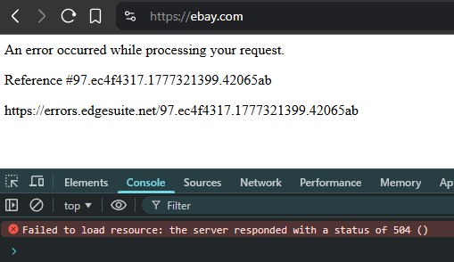
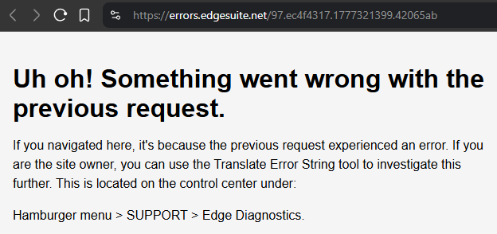
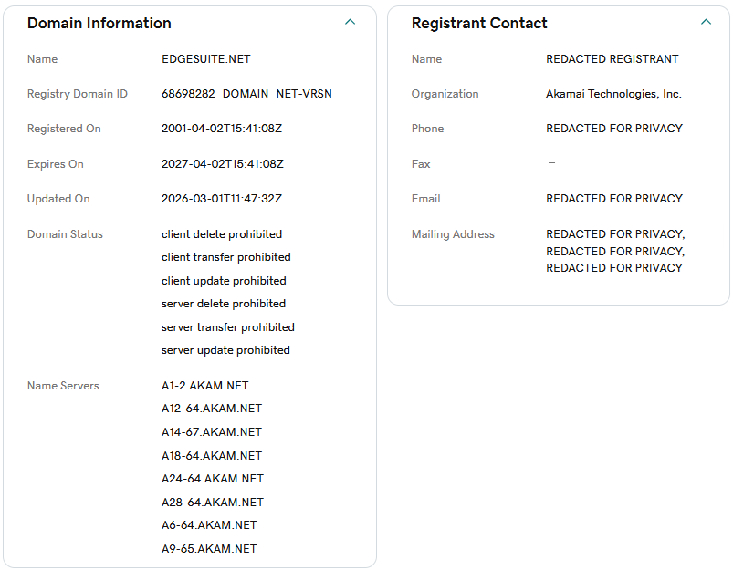

Just a warning, if you're reading this (and you must be, unless you're tasting or smelling it somehow) I can't promise you'll learn anything. I just stumbled on something and felt like looking into it a bit.

When eBay went down the other day (it's gone down a few times recently), the page periodically threw out errors like this one when I tried to visit it:

> An error occurred while processing your request.
> Reference #97.ec4f4317.1777321399.42065ab
> https://errors.edgesuite.net/97.ec4f4317.1777321399.42065ab

Nothing else in the DOM, nothing in the console except that the server got a 504 gateway error. Strange to not just have a page saying "we'll be back shortly" or "please stop DDOS'ing us thx" instead of whatever this cryptic error message is.

The only thing to go on was the link, which begged clicking, so one click later...

Hm, a little more to go on. Clearly a page only useful to whoever the customer is, not the tens of thousands of random people who saw it while trying to buy an item.

One quick visit to a [whois site](https://www.godaddy.com/whois/results.aspx?domain=edgesuite.net) tells us exactly who owns this service, and I'm kinda not shocked this is the experience when something goes down. Some years back I discovered [Akamai is the reason many sites request access to motion sensors](https://grantwinney.com/websites-requesting-access-to-motion-sensors/), which is kind of a weird thing to see in your address bar on the desktop. I can't speak to their effectiveness since I've never used them personally, but they don't seem to bother with hiding their presence.

And if there's any doubt, the [Translate Error String](https://techdocs.akamai.com/edge-diagnostics/docs/translate-error-string) mentioned in the error is documented on Akamai's site. It just takes the cryptic id and returns the error message and logs. At least they don't display the actual logs right on the page for everyone to see, but it's still odd.

This seems to be part of their [Web Application Firewall](https://www.akamai.com/glossary/what-is-a-waf), they're not the only provider that behaves (to me) unexpectedly. I've had a number of sites toss up weird Cloudflare "are you a human" pages that honestly make it look like the site got hacked. Big ugly pages that don't fit the site's theme *at all*. I wonder why these big providers don't polish the experience a bit more? Do the companies that use them not realize, or just not care?