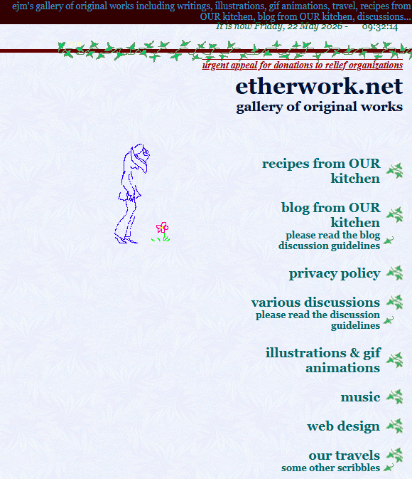
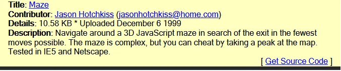

I was trying to get something to work in IrfanView the other day, and for once, instead of being taken to reddit or stackexchange or a yt short, I was surprised to find myself on a homey website called [etherwork.net](https://etherwork.net/). I got my answer, but instead of jumping ship like I'd do with the other sites, I spent a couple hours just looking around.

It looks straight out of the 90s (which it is), and it reminds me of what was fun about the web back then. Not singularly focused, not SEO optimized, not riddled with ads showing gross toenails.. just someone sharing their hobbies and interests with whoever happens by. Most sites like these were abandoned a long time ago, or were the victim of shuttered services, or were reworked and the old content deleted.

What's so unique about this site is that it's still actively being updated. Things from 30 years ago are still there, and then there's new recipe posts from just a month ago. It looks like a labor of love if I ever saw one.

In an era when most roads now lead to the same few large sites (social media, forums, youtube), and nearly everyone's feeding the google monster, this feels like a unicorn. It's pleasant to find someone simply writing and sharing for the sake of writing and sharing. If you lived through the dawn of home internet right around the turn of the century (ugh I feel old), you know what I'm talking about. Don't get me wrong, there was a lot of garbage that no one will miss, but there was a lot of good too.

The author has a [page full of bookmarks](https://etherwork.net/llinks.shtml), including one for an archived copy of a maze someone uploaded to a site called [The JavaScript Source](https://web.archive.org/web/20000815211242/http://javascript.internet.com/games/). The original author of [this maze script](https://web.archive.org/web/20000815215258/http://javascript.internet.com/games/maze.html) was Jason Hotchkiss, who uploaded it back in 1999. Just a few weeks before Y2K hit and the world _didn't_ end. 😏

Although the script was guaranteed to work in IE5 _and_ Netscape (never a given back then!), it doesn't work in Chromium-based browsers. Not a shock. What _is_ shocking is that it works as-is in Firefox.. gotta love Mozilla for their backward-compatibility! I thought it'd be fun to bring it back to life, although I wasn't sure how bad it'd be. The fact that it's working Firefox is promising.

As it turns out, it didn't take much of anything. I plugged it into MS Copilot, which quickly identified why it was failing (mainly the use of Netscape's `document.layers` object) and then rewrote it for me. Amazingly, I had to fix nothing, although I couldn't resist adding in a couple things of my own.

Here it is, in all its ASCII glory. You can press the buttons (duh) or click on the maze to give it focus and then use WASD or the arrows to move around.

  <pre id="viewport" tabindex="0"></pre>
  

 
  <form onsubmit="return false">
    <button onclick="turn(-1);">Left</button>
    <button onclick="turn(1);">Right</button>
    <button onclick="moveForward();">Forward</button>
    <button onclick="moveBack();">Back</button> 
    <button onclick="cheat();"><u>C</u>heat</button>
    <button onclick="start();"><u>R</u>eset</button>
  </form>

If you got this far, there's not really any "point" to this post, but maybe that _was_ the point. [Here's the code](https://github.com/grantwinney/BlogCodeSamples/tree/master/Languages/JavaScript/LegacyGames/LegacyJSMaze) if you want to mess around with it.

It's interesting to me, stumbling onto code that someone put time into making, only for it to be nearly lost to the shifting sands of the internet. And it happens all the time, every day.