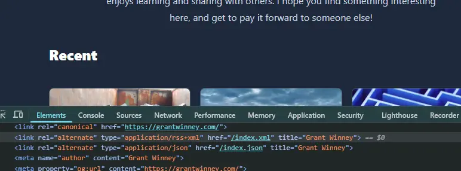
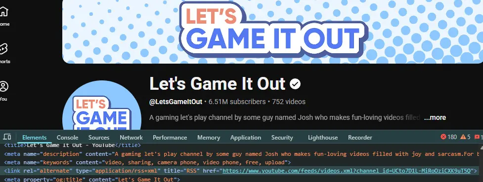
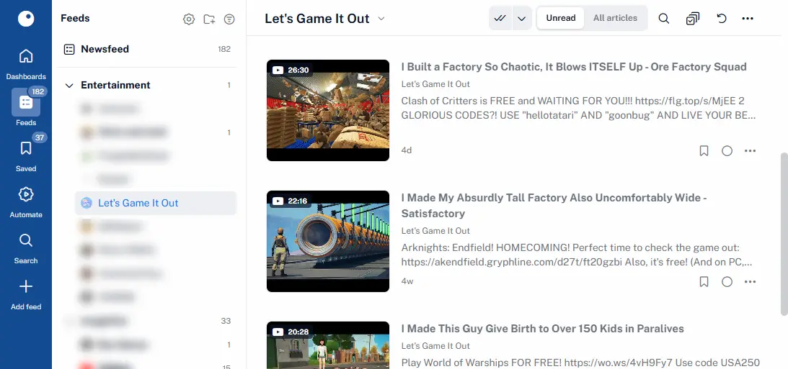
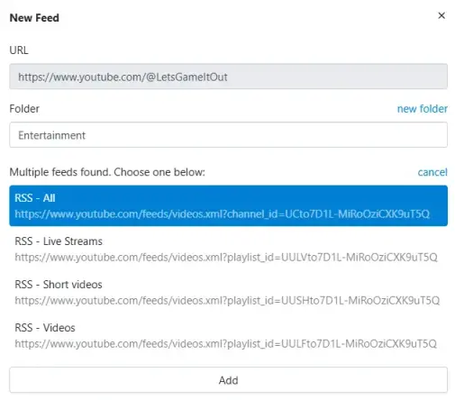
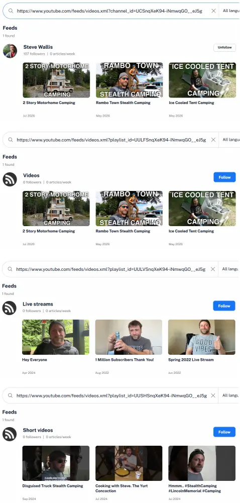
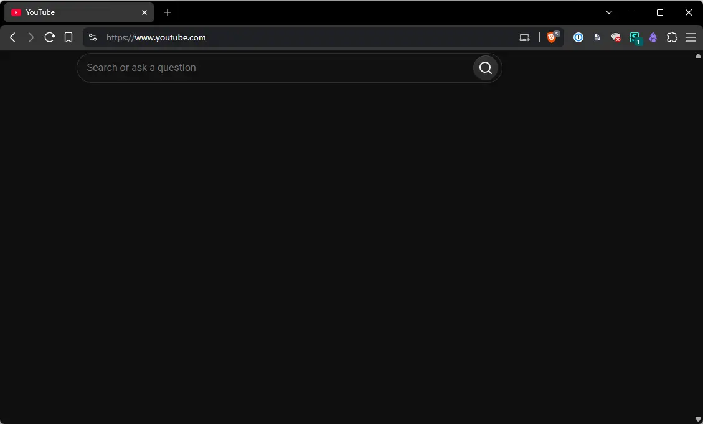

I've always been a fan of [RSS](https://rss.com/blog/how-do-rss-feeds-work/). It's so convenient, having everything I read and follow and want to stay on top of pulled into one place for me to go through when *I'm* ready. It could be a friend, someone I follow professionally, or an app or service I use.

As long as their site provides an RSS feed (mine's pictured below), I don't have to bookmark it or opt in to yet another newsletter to fill my inbox. Just add it to the RSS reader du jour (I've switched it up a few times) and enjoy them at my leisure.



## YouTube + RSS

Something I never considered until recently though, never would've guessed, is that YouTube has RSS feeds too! Every channel has its own, listed with the other headers in the DOM like any blog.



That allows apps like Inoreader to pull in new videos alongside everything else... 



I'm amazed YT supports this, and assume it must go back to the earliest days when they needed every bit of traffic they could get. Or maybe the devs had more say in features back then. Because it's a feature that benefits consumers way more than YT:

- No need to allow subscription notifications in the browser, so fewer interruptions.
- No need to load YT directly to check for new videos, just to get sucked into endless suggested videos and comments. Avoid the algorithm.
- No need to even create a YouTube account to "subscribe" in the first place!

## YouTube + RSS + YARR

It gets even better. I was trying out different RSS readers and when I added a YT channel to [YARR](https://nkanaev.github.io/yarr/en/), a super light-weight, minimalist reader that averages about 15 MB **(!!)** of memory, it prompted me with this:



Waaaait a second. So there's separate RSS feeds for each *type* of video, too?? Apparently so. But they don't exist in the DOM, so I don't know how anyone figured out what they were or that they even existed.

I spent some time digging in the YARR codebase and found what I was looking for in the finder.go file, specifically in the [FindFeeds](https://github.com/nkanaev/yarr/blob/master/src/content/scraper/finder.go#L19) function.

* It looks for `link` nodes with a type of either "application/atom+xml", "application/rss+xml", or "application/json". The second one is what YT uses.
* It uses the "href" value as-is for the main "give me everything" feed.
* It uses [documented YT patterns](https://wiki.archiveteam.org/index.php/YouTube/Technical_details#Playlists) (although the code below does a `strings.CutPrefix` that seems to stray from the pattern) to prepend 4 characters representing live streams, shorts, or regular videos.

The crux of it is here, but check out the code yourself (link above) if you're interested in learning more. Then go check out the [related tests](https://github.com/nkanaev/yarr/blob/master/src/content/scraper/finder_test.go) while you're at it.

```go
	// find direct links
	// css: link[type=application/atom+xml]
	linkTypes := []string{"application/atom+xml", "application/rss+xml", "application/json"}
	isFeedLink := func(n *html.Node) bool {
		if n.Type == html.ElementNode && n.Data == "link" {
			t := htmlutil.Attr(n, "type")
			if slices.Contains(linkTypes, t) {
				return true
			}
		}
		return false
	}
	for _, node := range htmlutil.FindNodes(doc, isFeedLink) {
		href := htmlutil.Attr(node, "href")
		name := htmlutil.Attr(node, "title")
		link := htmlutil.AbsoluteUrl(href, base)
		if link != "" {
			candidates[link] = FeedLink{URL: link, Title: name}

			l, err := url.Parse(link)
			if err == nil && l.Host == "www.youtube.com" && l.Path == "/feeds/videos.xml" {
				// https://wiki.archiveteam.org/index.php/YouTube/Technical_details#Playlists
				channelID, found := strings.CutPrefix(l.Query().Get("channel_id"), "UC")
				if found {
					const baseURL string = "https://www.youtube.com/feeds/videos.xml?playlist_id="

					ogTitle := ""
					isOG := func(n *html.Node) bool {
						return n.Type == html.ElementNode && n.Data == "meta" &&
							htmlutil.Attr(n, "property") == "og:title"
					}
					for _, n := range htmlutil.FindNodes(doc, isOG) {
						ogTitle = htmlutil.Attr(n, "content")
						break
					}
					override := name
					if ogTitle != "" {
						override = ogTitle
					}

					candidates[link] = FeedLink{
						URL:   link,
						Title: name + " - All",
					}
					candidates[baseURL+"UULF"+channelID] = FeedLink{
						URL:           baseURL + "UULF" + channelID,
						Title:         name + " - Videos",
						TitleOverride: override + " - Videos",
					}
					candidates[baseURL+"UULV"+channelID] = FeedLink{
						URL:           baseURL + "UULV" + channelID,
						Title:         name + " - Live Streams",
						TitleOverride: override + " - Live Streams",
					}
					candidates[baseURL+"UUSH"+channelID] = FeedLink{
						URL:           baseURL + "UUSH" + channelID,
						Title:         name + " - Short videos",
						TitleOverride: override + " - Short videos",
					}
				}
			}
		}
	}
```

Bonus points to the YARR author (or maybe one of the contributors) for adding this in. Especially considering Inoreader includes a "YouTube Shorts filter" feature in its $90 /yr "pro" plan. Don't get me wrong, they have a lot of cool features that take real development time, and I don't begrudge them charging for it, but this particular option seems like maybe it should be a freebie.

## YouTube + Bookmarklets

While other readers I checked out either don't have the same feature or charge for it, it's pretty easy to figure out on your own once you know the pattern. Here's some bookmarklets you can drag up to the bookmarks bar. When you're on a YT channel's front page, click one and it'll pop up a message with the link for you to copy and paste into an RSS feed.

* <a href="javascript:(()=>{alert('https://www.youtube.com/feeds/videos.xml?channel_id=' + document.querySelector('link[title=RSS]').href.split(/[/=]+/).pop());})();">YT - All</a>
* <a href="javascript:(()=>{let channelId=document.querySelector('link[title=RSS]').href.split(/[/=]+/).pop(); alert('https://www.youtube.com/feeds/videos.xml?playlist_id=UULF' + channelId.slice(channelId.startsWith('UC')?2:0));})();">YT - Videos</a>
* <a href="javascript:(()=>{let channelId=document.querySelector('link[title=RSS]').href.split(/[/=]+/).pop(); alert('https://www.youtube.com/feeds/videos.xml?playlist_id=UULV' + channelId.slice(channelId.startsWith('UC')?2:0));})();">YT - Live Streams</a>
* <a href="javascript:(()=>{let channelId=document.querySelector('link[title=RSS]').href.split(/[/=]+/).pop(); alert('https://www.youtube.com/feeds/videos.xml?playlist_id=UUSH' + channelId.slice(channelId.startsWith('UC')?2:0));})();">YT - Shorts</a>

Tried it in Inoreader and it seems to work nicely:



## YouTube + Unhook

I mentioned earlier that YT's RSS feeds means not having to visit YT directly and get sucked into the algorithm, but that's only partly true. Inoreader lets you play a video directly from their site, but other apps don't, and once you click through to YouTube to watch a video, well.. 🤷‍♂️

This is all about trying to place some speed bumps in the way to limit how long I end up on there, and the [Unhook](https://chromewebstore.google.com/detail/unhook-remove-youtube-rec/khncfooichmfjbepaaaebmommgaepoid) extension works *very* nicely for this. You can disable as much or as little as you want. My UI looks like this now, lol.



There were a few elements of the UX that Unhook didn't have an option for, but since I already use [Stylus](https://chromewebstore.google.com/detail/stylus/clngdbkpkpeebahjckkjfobafhncgmne), I just added a style for youtube.com that blocks the last of what it missed (a header bar, bit of a side bar, etc).

```css
#start > *, #end > div, #guide, #voice-search-button, div[client-ve-type='307188'], #items  {
    display: none !important;
}
```

It's ridiculously minimalist, but at least I can search for a video without being drawn to whatever the algorithm decides to feed to me. No more sidebar and end of video suggestions, no more comments, no more notifications. Let's face it, we've all lost hours to YT on things we didn't even go on there to watch. The algorithm is real and *it works*.

## Final Thoughts

The feeds sometimes go inaccessible, strangely. I've noticed periodically, later at night in the US, all the RSS feed links return 404s. A couple hours later they come back up, or sometimes the next morning. I don't know what Google's doing that causes that, but it doesn't affect much. Whatever the app already pulled down is still available, and when things come back up you get the latest again. No biggie.

Obviously this is all ridiculous if you're okay with visiting YouTube directly, but then why are you here, lol? At the very least, the Unhook addon can block a *lot* of elements while leaving other parts (like subscriptions) visible, so that's something.

As an aside, I'd *love* to get Facebook into an RSS reader too. Unfortunately, they [stopped providing feeds](https://www.wprssaggregator.com/facebook-rss-feed/#what-is-a-facebook-rss-feed) in 2015, and their DOM is so cryptic and unpredictable that it requires using a subscription service that scrapes the site to generate a fake RSS feed. Inoreader's $90 /yr plan supports 30 FB feeds, while FetchRSS's $60 /yr plan supports 25  feeds with a warning that FB only allows them to poll a few times a day. It's ironic, since [FB is usually open to sharing their data with everyone](https://cybersecurityforme.com/facebook-data-breaches-timeline/). 😓
