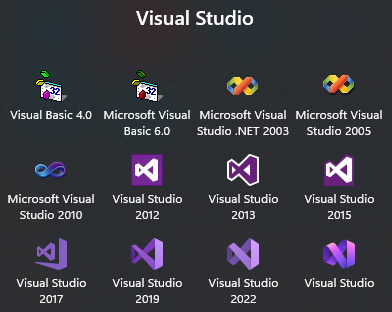
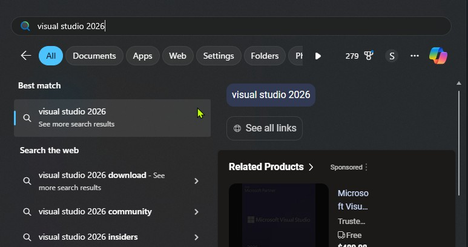
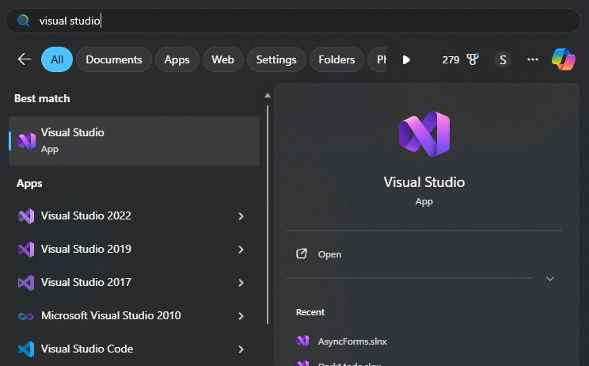
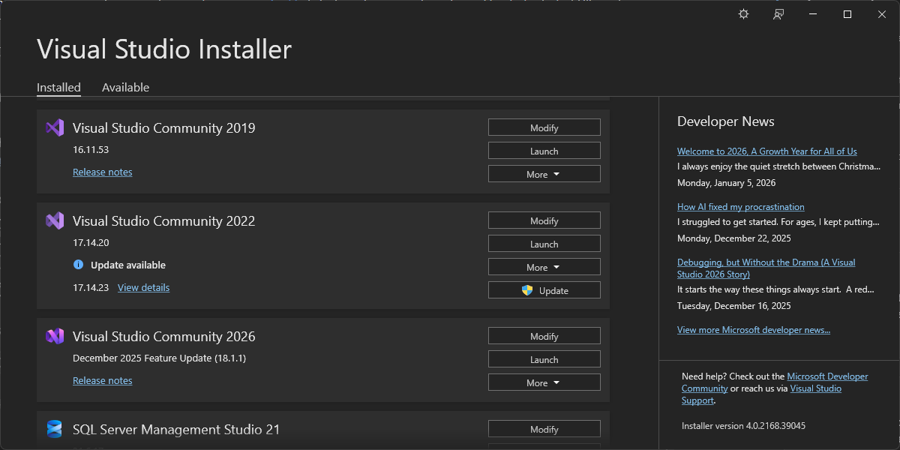
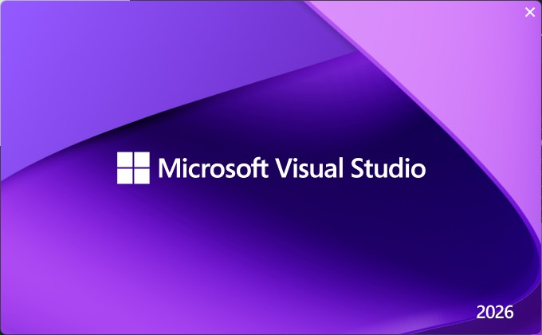
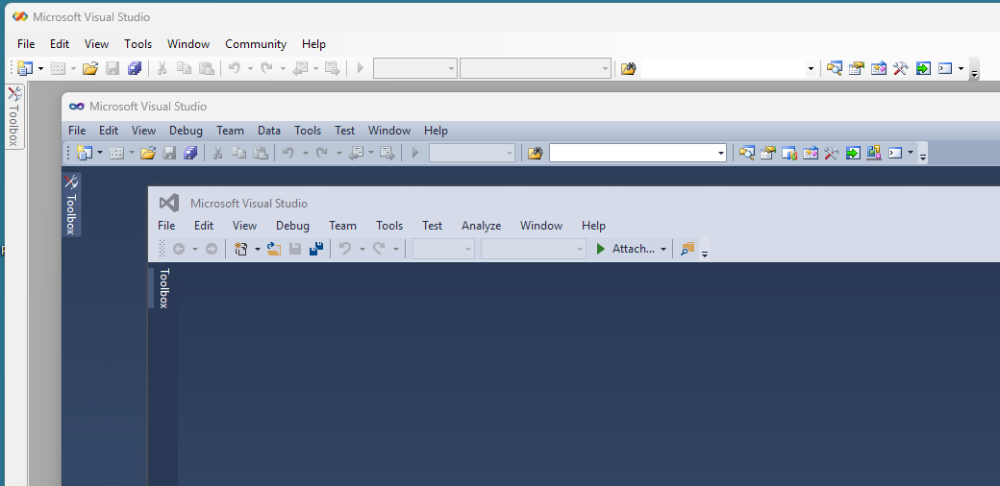
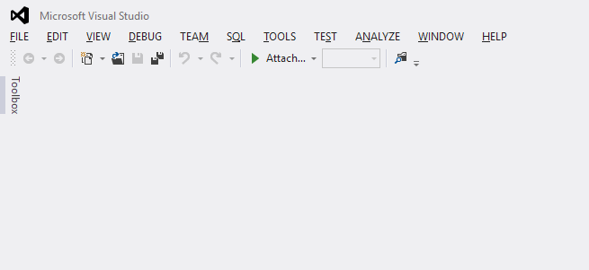

After installing Visual Studio 2026 recently, which rolled out this past November, the first thing I noticed when I went to start it was the shortcut. Specifically, the version.. or lack of one.

My first thought was it's a bug, but a Microsoft program manager confirmed [it's intentional](https://developercommunity.visualstudio.com/t/VisualStudio2026StartMenuIssues:MissingShortcutandIncorrectToolLocation/10998855#TPIN-N11001509):

> The change in naming and shortcut launch behavior is intentional. Opening the “Visual Studio” shortcut will launch Visual Studio 2026, and that will be the primary way to start the IDE moving forward.

It's part of a bigger redesign for Visual Studio, which will release a new version every year, each one *replacing* the previous one. That's right.. replacing. When asked if new versions would be side-by-side (as they've always been) or an upgrade, another program manager confirmed [it's the latter](https://devblogs.microsoft.com/visualstudio/spend-less-time-upgrading-more-time-coding-in-visual-studio-2026/?commentid=30512#comment-30512):

> [T]he next major version of VS (2027) will be an inline upgrade and not a side-by-side install.

The rest of this post is derived from official blog posts as well as release, support and other documentation for VS 2026. Check out these original posts for all the details:

- [Visual Studio 2026 is here: faster, smarter, and a hit with early adopters](https://devblogs.microsoft.com/visualstudio/visual-studio-2026-is-here-faster-smarter-and-a-hit-with-early-adopters/#:~:text=Here%E2%80%99s%20the%20best%20part)
- [Spend Less Time Upgrading, More Time Coding in Visual Studio 2026](https://devblogs.microsoft.com/visualstudio/spend-less-time-upgrading-more-time-coding-in-visual-studio-2026/)
- [Visual Studio – Built for the Speed of Modern Development](https://devblogs.microsoft.com/visualstudio/visual-studio-built-for-the-speed-of-modern-development/)
- [Visual Studio Channels and Release Rhythm | Microsoft Learn](https://learn.microsoft.com/en-us/visualstudio/releases/2026/release-rhythm)
- [Visual Studio Product Lifecycle and Servicing | Microsoft Learn](https://learn.microsoft.com/en-us/visualstudio/releases/2026/servicing-vs)
- [Decoupling the .NET SDK and Visual Studio · dotnet/sdk](https://github.com/dotnet/sdk/blob/main/documentation/general/decouple-vs-and-net-sdk.md)

## What are they changing?

Starting with VS 2026:

- Every November means a new version of Visual Studio (2026, 2027, etc), which will overwrite the previous one. No side-by-side installs.
	- Community users must upgrade to continue getting updates.
	- Pro and Enterprise users can hold off for a bit, but eventually need to update too.
- Updates are monthly, instead of quarterly, as long as the latest release is installed.
- The shortcut won't have a version/year number in it anymore.

## Why are they changing it?

They want to be able to update Visual Studio faster, but the IDE (for writing code) has always been tightly coupled with other related tools, as evidenced by the [.NET SDK, MSBuild, and Visual Studio versioning](https://learn.microsoft.com/en-us/dotnet/core/porting/versioning-sdk-msbuild-vs) page. I can *easily* imagine how separate but related parts being bundled into a single app would slow down overall development. Any dev who's worked with legacy WinForms apps knows what monolithic looks like.

If they update the build tools, but need the old tools to still work and be available, then they have to release a new Visual Studio version too, since everything's bundled. If they also have major updates for Visual Studio, it'd make sense to wait until that new version is being released to include them, but that means delaying new features that we could've benefitted from sooner. Everything has to line up and play nice, and a delay in one area or from one team prevents *everything* from shipping.

Beyond that, it sounds like they want out of the business of [supporting old versions](https://learn.microsoft.com/en-us/visualstudio/releases/2026/servicing-vs#support-for-older-versions) for a decade, too. VS 2015 _just_ went out of support a few months ago, 2017 is supported until next year, and 2019 and 2022 will be supported for years to come. That's a lot to juggle.

## How are they changing it?

They decoupled the Visual Studio IDE from the build tools, so they can be developed and released separately. I imagine that the IDE, being guaranteed to have access to certain tools that were bundled with the install, was probably a bit of a nightmare to disentangle from everything else.

Since the IDE won't be bundled with a particular set of build tools anymore, it uses a new [Setup Assistant](https://learn.microsoft.com/en-us/visualstudio/install/setup-assistant) tool that determines what an app needs and can retrieve missing dependencies. I haven't used it yet, but I assume it looks at the sln/slnx and csproj files.

## What's not changing?

VS 2022 (and earlier) will continue to run side-by-side with 2026 (and later), although they're claiming all projects and extensions that worked in 2022 will work as-is with nothing else needed in 2026.

They're not changing the lifecycle for old versions, but each version going forward will only receive full support for the year it's released, then it *has* to be upgraded.

## Some concerns...

I hope it goes as great as they say it will, but I can imagine how it might _not_...

### Discoverability

Right now, VS 2026 can't be quickly found in the start menu. Typing "Visual Studio 2026" shows nothing, and typing "Visual Studio" shows *every* version of VS that's installed (and VS Code). Maybe eventually as the older versions become unnecessary this won't be an issue, but for now it's annoying.

It shows up as 2026 in the Visual Studio Installer app and on the splash screen. Why not just show the shortcut like that too, and then replace it with "Visual Studio 2027" in November? Why make the shortcut generic when nothing else is?

Ironically, this seems to fly in the face of what was said [when VS 2022 was released](https://devblogs.microsoft.com/visualstudio/weve-upgraded-the-ui-in-visual-studio-2022):

> From a basic wayfinding perspective, distinguishing updates to the look and feel and packaging of a new product make it easier for you to know when you’re using the new product versus other versions you may have running at the same time.

### Legacy Apps

VS 2022 is a 64-bit app with a 64-bit WinForms designer. Because of that, [older 32-bit WinForms apps can't be designed in 2022](https://grantwinney.com/why-doesnt-vs2022-show-my-winforms-ui/). Microsoft's suggestion is the obvious one - upgrade apps to 64-bit. But I've worked on decades-old apps with a hundred projects - upgrading is a large undertaking that's tough for the devs *and* a tough sell to management. Not great, but that's the way it is. They created an [out of process designer](https://devblogs.microsoft.com/visualstudio/winforms-designer-selection-for-32-bit-net-framework-projects/) that helped but had caveats, and I'm not sure how much further they can/will take it. The solution for most teams, I'm guessing, is to keep using VS 2019.

I don't know what else might happen to Visual Studio that would have an impact like this, but what if it does? What's the recourse for companies who paid for Visual Studio, developed an app, and can't afford to overhaul it to appease a new Visual Studio version? I'd like to think there'd be a reasonable workaround, but Microsoft has shown us with Windows 11 that's [it's not afraid to just leave us in the dust](https://www.windowscentral.com/software-apps/windows-11/microsoft-openly-promotes-tossing-your-laptop-into-a-big-pile-of-e-waste). Then again, [they're still supporting .NET Framework](https://learn.microsoft.com/en-us/lifecycle/products/microsoft-net-framework) 4.6 for another year and haven't even placed EOL dates on 4.7 and 4.8. Still, I wouldn't be shocked if they told everyone to update their legacy apps or find a different way to keep developing them.

### Usability

Microsoft has made poor design changes in the past, bad enough to make devs want to skip a version. Anyone here remember VS 2012? For reference, here's VS 2005, 2010, and 2015, with a normal color palette, UI, and menus:

And here's 2012, which tossed out those distracting colors, space-wasting borders, and sheepish menus. I WANT MENUS THAT SCREAM AT ME.

There was so much pushback, they added a regex key to revert the menus, and then reverted everything in 2015. I kept using 2010 for most things, but going forward that wouldn't be an option. If some design guru decides VS 2027 (or 2028, or 2029) needs a UI overhaul, then we're stuck with it.

Reading about the changes, and thinking about it all, it sounds like a really good thing. I'll be cautiously optimistic, and hope that the team not having to support 4-5 separate versions of Visual Studio means we get more innovations faster.