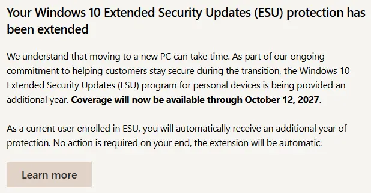

Microsoft sent an email the other day, letting all of us Windows 10 holdouts know that they'll be providing security updates for an extra year. Cool, so I don't have to toss my PC in the trash until *next* year. Sigh.

## One-Two Punch

For anyone needing a recap, Microsoft called it quits on Windows 10 last Oct. They announced they're done with features, bug fixes, and even security updates... sort of. They gave us the option to pay $30 (or buy a OneDrive subscription or redeem 1,000 magic MS points) for [one additional year of updates](https://www.microsoft.com/en-us/windows/extended-security-updates). Companies could get updates for a few years, but the cost increases each year. They *really* want us off it.

Why would anyone want to pay though, instead of just upgrading to Windows 11? Especially when it was a free upgrade for quite awhile? Because we had no choice.

Microsoft drew some lines in the sand when they released Windows 11, requiring certain minimum hardware. I started with Windows 95, and upgrading has always meant a little more free space on your drive, a little more RAM, etc. That's normal for any software upgrade. But for the first time, they've set some unusually stringent hardware requirements.

To install Win 11, a device needs a 64-bit system, a minimum level of processor, and a [TPM chip](https://support.microsoft.com/en-us/windows/security/device-security/what-s-a-trusted-platform-module-tpm). In my case, the PC has a space for the TPM on the motherboard, so I *could* get a chip, but it wouldn't matter anyway because the CPU isn't on their [list of supported processors](https://www.eatyourbytes.com/list-of-windows-11-supported-processors/).

And so a lot of people are stuck, unable to continue with Windows 10 but unable to upgrade to Windows 11. That's what the email above is about.. giving us more time before the inevitable. Because unless they change something about the min reqs, it'll come down to a choice of:

- upgrading devices (expensive, if they even can be),
- trashing devices, and replacing with something newer (more expensive, esp during the RAMpocolypse),
- installing and learning a different OS (not a trivial thing, and not always practical)

## Extended Extension?

So why are they extending their own extension another year, just a few months before they could wash their hands of Windows 10, at least for individual consumers? Good question. Thanks for asking it. I have no idea.. maybe it's just out of the kindness of their collective hearts?

Looking at the data from StatCounter though, over a quarter of all Windows users are *still* on Windows 10! That's a lot, considering it's been 9 months since they flagged it EOL.

Source: <a href="https://gs.statcounter.com/windows-version-market-share/desktop/worldwide/" style="font-weight:normal">StatCounter Global Stats - Windows Version Market Share</a>

I wonder if they're worried about just how many of those users (millions? tens of millions?) will *actually* upgrade their computer (at a time when the AI craze has driven memory and disks prices wayyy up) and *then* buy a Windows 11 license on top of it? I bet more than a few will just stick with (or move to) a Chromebook, iPad or other tablet, etc.

Combine that with smaller businesses that can't afford to upgrade/replace all their old computers just to upgrade to Win 11, and MS may stand to lose a lot of revenue (and good will), now and in the future.

Or maybe they're concerned that if they pull the plug in Oct, a lot of people will just.. do nothing. Many of them will be fine for quite awhile, while some others will get hit with malware and everything else that comes from no more security updates. And when those users recover, they may just say screw it to Windows and go with something else.

Or maybe they're worried about litigation, or major consumer pushback, or politicians getting involved come the October deadline? And keeping the pipeline open that pushes security updates is easier than facing something they see coming? Who knows.

As for me, I still don't know what I'll do. I need the PC because our family shares it for schoolwork, gaming, taxes, etc. It works for us, and it's cheaper and more maintainable than having multiple machines. I can't abandon it because the software we use runs on Windows and requires the power of a desktop. I'm hoping I can upgrade what needs upgrading, and keep the rest (the box, cooling system, graphics card, etc).

We'll see.

What about you? If you're in the same boat, what will you do?