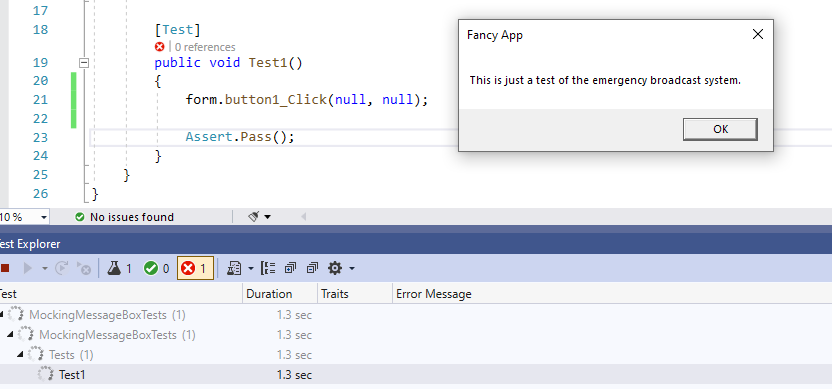
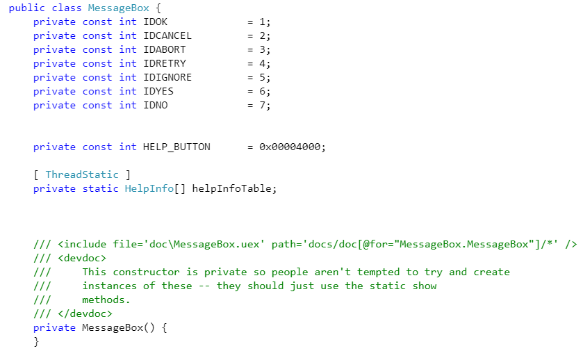
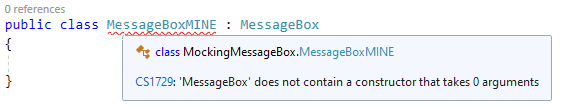

---
categories:
  - Coding
date: 2022-01-07T04:12:17Z
description: ""
draft: false
cover:
  image: photo-1577563908411-5077b6dc7624.jpg
slug: mocking-messagebox-in-winforms
summary: Unit testing a WinForms app is an uphill battle in the best of times, before you add in classes like MessageBox. Let's make the best of it.
tags:
  - surviving-winforms
  - testing
  - csharp
title: Mocking MessageBox (or any static class) in WinForms
---
Trying to integrate testing into a WinForms app can be an uphill battle, especially if it's a legacy app with most of the logic tightly coupled to the UI in the code-behind files of hundreds of forms. It doesn't help when you toss in portions of the .NET Framework that were designed in very test-unfriendly ways.

## The problem

Take the MessageBox class for instance. This is normally what you see, peppered throughout WinForms apps everywhere.

```c#
public partial class Form1 : Form
{
    public Form1()
    {
        InitializeComponent();
    }

    private void button1_Click(object sender, EventArgs e)
    {
        MessageBox.Show("This is just a test of the emergency broadcast system.", "Fancy App");
    }
}
```

It's not testable, at least not with unit tests. The moment you call a method that uses it (I made the button click event public), your test will actually popup a MessageBox. Probably not what you wanted.



## So it's gonna be like that huh...

Unfortunately, the MessageBox class doesn't make it easy for us. Every method is static, so it implements no interface, and you can't mock it. There's no way to extend it with your own class and create an interface for it either. They shut the door on that by giving the class a private constructor.



You can try it anyway to see what I mean.



## Wrapping the MessageBox class to mock it

The only reasonable option left is to create our own message box class, wrap each of the static methods in normal instance methods, and create an interface from that. So let's take a look at how we might do that.

> The code in this article is available on [GitHub](https://github.com/grantwinney/Surviving-WinForms/tree/master/Testing/MockingMessageBox), if you'd like to follow along or use it in your own projects.

The first thing to do is just create your own message box class and name it something similar, like MessagePrompt or just Message. I won't paste the whole class but here's a portion of what it might look like.

```c#
public class MessagePrompt : IMessagePrompt
{
    public DialogResult Show(string text, string caption, MessageBoxButtons buttons, MessageBoxIcon icon, MessageBoxDefaultButton defaultButton, MessageBoxOptions options, bool displayHelpButton)
        => MessageBox.Show(text, caption, buttons, icon, defaultButton, options, displayHelpButton);

    public DialogResult Show(IWin32Window owner, string text, string caption, MessageBoxButtons buttons)
        => MessageBox.Show(owner, text, caption, buttons);

    public DialogResult Show(IWin32Window owner, string text, string caption, MessageBoxButtons buttons, MessageBoxIcon icon)
        => MessageBox.Show(owner, text, caption, buttons, icon);

    ...
    ...
```

Then you'll extract an interface from that. In Visual Studio, that's as simple as `ctrl + .` and choose "extract interface" from the dropdown.

```c#
public interface IMessagePrompt
{
    DialogResult Show(IWin32Window owner, string text);
    DialogResult Show(IWin32Window owner, string text, string caption);
    DialogResult Show(IWin32Window owner, string text, string caption, MessageBoxButtons buttons);

    ...
    ...
```

The rest of how you use it is up to you, but I put together a quick little sample out on GitHub if you want to check it out. It uses Unity for dependency injection (to connect the interface to the concrete class at runtime), and NUnit and Moq to do some light testing.

I kept the implementation as simple as possible too; the kind of thing you might want to do if you're adding the first unit test to a big old WinForms app. I'd much rather rework things to use an MVP type of format though, but that's not always possible right away. If you want to read a little more about MVP, [check this out](https://grantwinney.com/its-possible-to-test-a-winforms-app-using-mvp).

As for this project, I just added a second constructor that accepted the interface...

```c#
public partial class Form1 : Form
{
    private readonly IMessagePrompt messagePrompt;

    public Form1()
    {
        InitializeComponent();

        messagePrompt = DependencyInjector.Retrieve<IMessagePrompt>();
    }

    public Form1(IMessagePrompt msgPrompt)
    {
        InitializeComponent();

        messagePrompt = msgPrompt;
    }

    private void btnShowMessage_Click(object sender, EventArgs e)
    {
        ShowBroadcastMessage();
    }

    public void ShowBroadcastMessage()
    {
        messagePrompt.Show("This is just a test of the emergency broadcast system.", "Fancy App");
    }
}
```

... and then mocked one up and injected it from the test suite. Although I suppose "suite" is a loose term for a single test. :)

```c#
public class Tests
{
    Form1 form;
    Mock<IMessagePrompt> messagePrompt;

    [SetUp]
    public void Setup()
    {
        messagePrompt = new Mock<IMessagePrompt>();
        form = new Form1(messagePrompt.Object);
    }

    [Test]
    public void Test1()
    {
        form.ShowBroadcastMessage();

        messagePrompt.Verify(x => x.Show(It.IsAny<string>(), "Fancy App"));
    }
}
```
