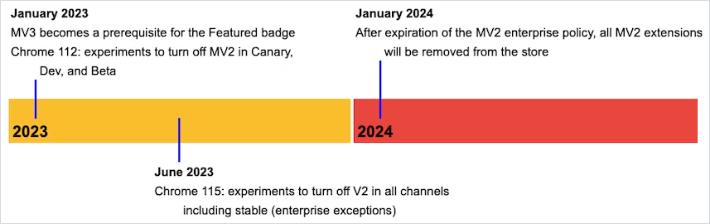
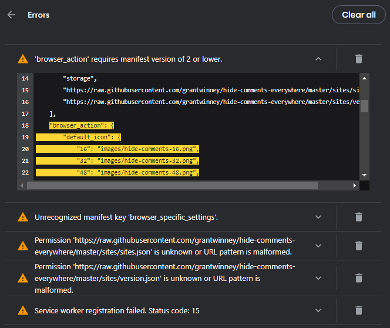
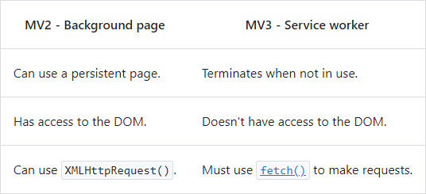

---
categories:
date: 2022-11-19T22:09:03Z
description: ""
draft: false
postimage: /banners/default-thoughts-banner.webp
slug: my-experience-migrating-to-mv3
summary: I migrated my addons to MV3, and learned that version numbers increase, DRY is overrated, and 3 and 15 are probably important but I have no idea why. What I didn't learn is how MV3 made my addon better.
tags:
  - browser-extension
  - google
  - mv3
title: My experience migrating to MV3
---
Over the summer [I wrote about Google's forced manifest v3 update](https://grantwinney.com/what-is-manifest-v3-and-why-is-google-pestering-me), and was up in the air about whether to bother figuring it out. Well, with only about 6 weeks left _(actually, things got_ [_pushed out even more_](https://developer.chrome.com/docs/extensions/mv3/mv2-sunset/) _since the_ [_original article_](https://web.archive.org/web/20210923221800/https://developer.chrome.com/docs/extensions/mv3/mv2-sunset/)_),_ I decided to give it another go, mostly because a good number of people have found [Hide Comments Everywhere](https://grantwinney.com/hide-comments-everywhere/) to be helpful.

To briefly recap, [Google is spearheading a change](https://developer.chrome.com/docs/extensions/mv3/intro/platform-vision/) to the way browser extensions are written, claiming it increases security and privacy. However, it'll be deterimental to the way privacy extensions like [Ghostery](https://www.ghostery.com/blog/manifest-v3-the-ghostery-perspective) and [uBlock Origin](https://bugs.chromium.org/p/chromium/issues/detail?id=896897&desc=2#c23) work, and the [Electronic Frontier Foundation](https://www.eff.org/deeplinks/2021/12/chrome-users-beware-manifest-v3-deceitful-and-threatening) is calling it harmful. Since [nearly all the major browsers are built on top of Chromium](https://en.wikipedia.org/wiki/Chromium_\(web_browser\)#Active) however, we're all along for the ride.

What it means is that every developer who writes an addon now needs to spend time figuring out how MV3 works, what changes are required, and make those changes [before June 2023](https://developer.chrome.com/docs/extensions/mv3/mv2-sunset/) when Google unlists MV2 addons from their store. Don't be shocked if some of your favorite browser addons simply vanish next summer.



Google keeps extending the deadline

Firefox, which isn't built on Chromium, is attempting to [support both](https://blog.mozilla.org/addons/2022/05/18/manifest-v3-in-firefox-recap-next-steps/) and will [begin accepting MV3 addons](https://blog.mozilla.org/addons/2022/11/17/manifest-v3-signing-available-november-21-on-firefox-nightly/) in just a couple days, although they aren't requiring anyone to adopt the change. The question is, how manageable will that be in the long run?

The first thing I tried was just bumping up the version number. Maybe I'd get lucky? Nope. I was greeted by a looong line of errors.



Yep, looks pretty good.

One by one, I moved down the list. [Browser_action was renamed to action](https://developer.chrome.com/docs/extensions/mv3/mv3-migration/#action-api-unification) and browser_specific_settings is a Firefox thing which [_might_ be required in Firefox for MV3](https://extensionworkshop.com/documentation/develop/extensions-and-the-add-on-id/#when-do-you-need-an-add-on-id). Requesting host URLs (like I do, to periodically grab updated css selectors to block on sites) got moved into their own section called [host permissions](https://developer.chrome.com/docs/extensions/mv3/mv3-migration/#host-permissions). All pretty straight-forward so far, and documented pretty well in a number of places. Here's a few I found along the way:

- [Migrating to Manifest V3 - Chrome Developers](https://developer.chrome.com/docs/extensions/mv3/mv3-migration/#man-sw)
- [Begin your MV3 migration by implementing new features today | Mozilla](https://blog.mozilla.org/addons/2022/10/31/begin-your-mv3-migration-by-implementing-new-features-today/)

That last error gave me pause. What does "service work registration failed" mean? [Service workers replaced background pages](https://developer.chrome.com/docs/extensions/mv3/mv3-migration/#man-sw), which isn't cryptic, but the error itself is so vague. _Why_ did it fail? Well, reason 15 of course! Including the error number in there required a [bug fix](https://chromium-review.googlesource.com/c/chromium/src/+/3805456), apparently, and oh boy what a good time that would've been to toss some more descriptive text in there. I never did find a source for what the numbers mean, but while I was flailing around for a fix, they kept switching between 3 and 15.

The problem ended up being that my background script required _other_ scripts, which I instructed the manifest file to load in tandem. That's not allowed with service workers.

```json
"background": {
    "scripts": [
        "js/third-party/jquery-3.6.0.min.js",
        "js/third-party/axios.min.js",
        "js/third-party/toastr.min.js",
        "js/shared.js",
        "js/background.js"
    ],
    "persistent": false
},
```

You get to specify _one_ file, which you can mark as a [module](https://web.dev/es-modules-in-sw/#static-imports-only) in order to import code from other modules that export their functions. Or something. I'm sure a web developer could explain all this, but I'm not one, nor do I feel like learning about this weekend. I gave it the ol' college try, it didn't go well, and I ended up copying whatever I needed from other files into the "service worker" file itself. For the more intrepid, [maybe this'll help](https://developer.mozilla.org/en-US/docs/Web/JavaScript/Guide/Modules). I decided DRY code wasn't worth my sanity.

One of the benefits of having to go through everything with a fine-tooth comb, though, was that I streamlined my background page / service worker. I realized I didn't need toastr, so I dropped that reference. jQuery is rarely a necessity, and wasn't in my service worker, so I dropped that reference too. I dropped Axios from the addon altogether, in favor of [fetch](https://developer.mozilla.org/en-US/docs/Web/API/Fetch_API/Using_Fetch). Here's a nice little comparison that I found informative: [Axios vs. fetch(): Which is best for making HTTP requests?](https://blog.logrocket.com/axios-vs-fetch-best-http-requests/)

This code seems to work just fine with MV3, where I inject the stylesheet into the page, which had me scratching my head. I guess it's okay because it's in the content script, running within the context of the current page?

```js
var header = document.querySelector('head');
if (header) {
    header.appendChild(style);
} else {
    document.documentElement.prepend(style);
}
```

The reason for my concern is that one of the [differences between background pages and service workers](https://developer.chrome.com/docs/extensions/mv3/mv3-migration/#background-service-workers) is that the latter doesn't have access to the DOM. I interpreted that as not having access to the DOM at all, but it seems I was mistaken. I hope.



In MV2, anyone could get out there and write an addon, and I feel like the complexities here might stymie a lot of people with neat ideas. Time will tell.

I already linked to some of these articles throughout this post, but here's a bunch of sites I found useful while trying to migrate. Oh, and [my migration is complete](https://github.com/grantwinney/hide-comments-everywhere/pull/137), uploaded, and was accepted the next day.

- [Service worker overview - Chrome Developers](https://developer.chrome.com/docs/workbox/service-worker-overview/)
- [JavaScript modules - JavaScript | MDN](https://developer.mozilla.org/en-US/docs/Web/JavaScript/Guide/Modules)
- [Using the Fetch API - Web APIs | MDN](https://developer.mozilla.org/en-US/docs/Web/API/Fetch_API/Using_Fetch)
- [Axios vs. fetch(): Which is best for making HTTP requests? - LogRocket](https://blog.logrocket.com/axios-vs-fetch-best-http-requests/)

As for the Firefox store, [they don't begin accepting MV3 extensions until next week](https://blog.mozilla.org/addons/2022/11/17/manifest-v3-signing-available-november-21-on-firefox-nightly/), so I guess that's a story for another time. Here's some more links, from Mozilla:

- [Mozilla’s Manifest v3 FAQ | Mozilla Add-ons Community](https://blog.mozilla.org/addons/2019/09/03/mozillas-manifest-v3-faq/)
- [Manifest v3 update | Mozilla Add-ons Community](https://blog.mozilla.org/addons/2021/05/27/manifest-v3-update/)
- [Manifest v3 in Firefox: Recap & Next Steps | Mozilla Add-ons Community](https://blog.mozilla.org/addons/2022/05/18/manifest-v3-in-firefox-recap-next-steps/)
- [Manifest V3 Firefox Developer Preview — how to get involved | Mozilla](https://blog.mozilla.org/addons/2022/06/08/manifest-v3-firefox-developer-preview-how-to-get-involved/)
