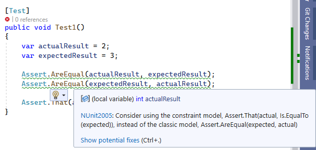
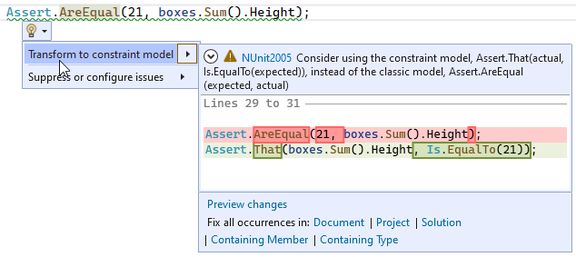
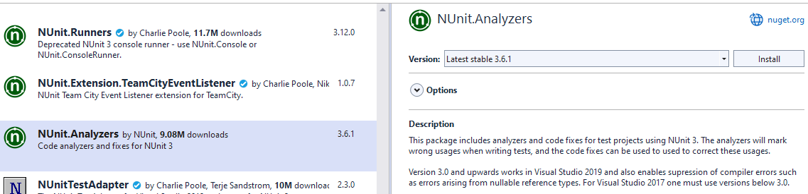
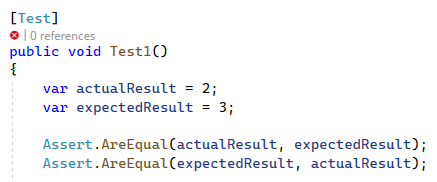

---
categories:
- Testing
- NUnit
- Coding
date: "2023-06-26T10:45:44Z"
description: ""
draft: false
cover:
  image: photo-1454165804606-c3d57bc86b40.jpg
slug: nunit-constraint-model
summary: I recently discovered the constraint model in NUnit. It's been there for years, hiding in plain sight! What is it? Is it worth using? Let's check it out.
tags:
- testing
- nunit
- coding
title: What is the NUnit constraint model?
---
When I wrote about the new [Generic Math support in C# 11](https://grantwinney.com/csharp-generic-math-support/), along with some related topics like [static abstract interface methods](https://grantwinney.com/whats-a-static-abstract-interface-method-in-c/) and [overloading operators](https://grantwinney.com/csharp-overload-arithmetic-equality-comparison-operators/), I created a few examples as I usually do. I added some unit tests using NUnit, and noticed warnings in Visual Studio that I hadn't seen before.





Those helpful little squiggly prompts only show up when you reference the [analyzers for NUnit](https://github.com/nunit/nunit.analyzers), a [separate NuGet package](https://www.nuget.org/packages/NUnit.Analyzers/) from the test library and not one I ever recall adding.



Actually, I don't remember adding it _this_ time either, and it isn't part of the NUnit project template in VS, so I'm not sure how it got added... but I'm glad it did. Today we get to learn something new!

## What is the classic model?

The classic model, as its name would suggest, is the original syntax for writing tests in NUnit, [starting in the early 2000s](https://web.archive.org/web/20070214135309/sourceforge.net/project/showfiles.php?group_id=10749&release_id=101664). For the exceptionally curious, you can still check out their [early source code on SourceForge](https://sourceforge.net/projects/nunit/files/). I've always written my NUnit tests using the above "classic" syntax (didn't know it had a name), probably because I read a tutorial back when I started programming 15 years ago and never looked back.

Over time I learned [all the different methods on the Assert class](https://docs.nunit.org/articles/nunit/writing-tests/assertions/assertion-models/classic.html) that I might have to call (Less, GreaterOrEqual, IsTrue, etc). For many of them, it's super easy (and common) to mix up the parameters, even after years of use. Without checking for yourself (no cheating!), can you remember whether the _actual_ or _expected_ result is supposed to be passed in first or second in the following example?



For this reason and more (some of which we'll look at below), the authors of NUnit have been [nudging devs](https://github.com/nunit/nunit.analyzers/blob/master/documentation/NUnit2005.md) towards a different model for years.

## What is the constraint model.. and why is it better?

The "constraint" model is newer in the sense that NUnit was created over 20 years ago, but it's not really all that new. It's been around at least since [v3.0](https://github.com/nunit/nunit/releases/tag/3.0.0) was released in 2015, and no doubt in discussion and development before that.

I couldn't find a good definition of what "constraint" means in this context (if you do, please let me know below), but the authors have really taken things in a different direction. Whereas the classic model has [many differently named methods](https://docs.nunit.org/articles/nunit/writing-tests/assertions/assertion-models/classic.html) in a single _"Assert"_ class, the constraint model uses a single _"That"_ method with a syntax that makes it easier to understand at a glance what's being tested and how.

So if you're considering using it, or just recently found about it like I did and want to know more, read on. If you're wondering if (and how much) it's worth bothering about, let's check it out together!

### It reads more like natural language

The constraint model seems to flow better. When reading the examples below aloud, it sounds to me more like natural language. Of course, whether or not you think that sounds like a _good_ idea is subjective (what isn't, lol).

```csharp
[Test]
public void EqualityTest()
{
    var actualResult = 1;
    var actualMessage = "Calculation Succeeded";

    var expectedResult = 1;

    // classic
    Assert.AreEqual(expectedResult, actualResult);
    Assert.AreNotEqual("Calculation Failed", actualMessage);

    // constraint
    Assert.That(actualResult, Is.EqualTo(expectedResult));
    Assert.That(actualMessage, Is.Not.EqualTo("Calculation Failed"));
}
```

I think I could hand off the titles of these tests to someone with little development experience, or have an automatic email sent out from a DevOps environment with just the title and result of failing tests, and most people would understand them.

True, the classic model isn't difficult to understand, per se, but it doesn't exactly roll off the tongue either. Given a choice between...

- _"assert are equal 'calculation failed' and actual message",_ or
- _"assert that the message is not equal to 'calculation failed"_

... personally I'd choose the latter.

### It's less error prone

The equal and not equal cases are straight-forward, so let's consider some of the other comparisons. How about greater than or less than? Like before, it's impossible to tell at a glance which value is supposed to be greater (or less) than the other, unless you already know which is which.

```csharp
[Test]
public void GreaterOrLessTest()
{
    var actualResult = 427;

    var expectedMinPossibleValue = 100;
    var expectedMaxPossibleValue = 999;

    // classic
    Assert.GreaterOrEqual(actualResult, expectedMinPossibleValue);
    Assert.LessOrEqual(actualResult, expectedMaxPossibleValue);

    // constraint
    Assert.That(actualResult, Is.GreaterThanOrEqualTo(expectedMinPossibleValue));
    Assert.That(actualResult, Is.LessThanOrEqualTo(expectedMaxPossibleValue));
}
```

Okay, my variable names kinda give it away, but that's no guarantee. What if I accidentally mixed up the parameters? I could inadvertently write a passing test (as the two tests below do), even though they should fail if you look closely at the values.

```csharp
[Test]
public void GreaterOrLessOopsIGoofedUpTest()
{
    var actualResult1 = 2;
    var actualResult2 = 20000;
    
    var expectedMinPossibleValue = 100;
    var expectedMaxPossibleValue = 999;

    Assert.GreaterOrEqual(expectedMinPossibleValue, actualResult1);
    Assert.LessOrEqual(expectedMaxPossibleValue, actualResult2);
}
```

Thanks to the way the syntax is phrased in the constraint model, it's highly unlikely you'll mix up variables like that. If you somehow did put them wrong, the entire test reads weirdly too. Assert that the minimum possible value is greater than the actual result? Assert that the max possible value is less than the other actual result? Uh, what?

```csharp
// neither of these make sense when you read them out loud

Assert.That(expectedMinPossibleValue, Is.GreaterThanOrEqualTo(actualResult1));
Assert.That(expectedMaxPossibleValue, Is.LessThanOrEqualTo(actualResult2));
```

### It's more flexible

The NUnit wiki page on [assertions](https://docs.nunit.org/articles/nunit/writing-tests/assertions/assertions.html) has a nice example of the increased flexibility the constraint model provides. In the following test, they're making sure the array has exactly one "3", has exactly two numbers greater than "1", etc.

```csharp
int[] array = { 1, 2, 3 };

Assert.That(array, Has.Exactly(1).EqualTo(3));
Assert.That(array, Has.Exactly(2).GreaterThan(1));
Assert.That(array, Has.Exactly(3).LessThan(100));
```

There are ways to achieve this with the classic model using LINQ, but none of them are as readable as what the above syntax produces.

```csharp
int[] array = { 1, 2, 3 };

Assert.True(array.Count(x => x == 1) == 1);
Assert.IsTrue(array.Count(x => x > 1) == 2);
Assert.AreEqual(3, array.Count(x => x < 100));
```

### It's has clearer error messages

As I said, you can achieve most of the constraint model stuff using LINQ, but many of those statements will just resolve to True or False. NUnit can't do much with that information other than tell you that you got one or the other, like in the following example.

```csharp
int[] array = { 1, 2, 3 };

Assert.Multiple(() =>
{
    Assert.True(array.Count(x => x == 1) == 50);
    Assert.IsTrue(array.Count(x => x > 1) == 500);
    Assert.AreEqual(5000, array.Count(x => x < 100));
});


/****
Message: 
  Multiple failures or warnings in test:
    1)   Expected: True
    But was:  False

    2)   Expected: True
    But was:  False

    3)   Expected: 5000
    But was:  3
****/
```

Classic Model

Using the constraint syntax, you get a more specific response about what was expected and what the actual result was.

```csharp
int[] array = { 1, 2, 3 };

Assert.Multiple(() =>
{
    Assert.That(array, Has.Exactly(50).EqualTo(1));
    Assert.That(array, Has.Exactly(500).GreaterThan(1));
    Assert.That(array, Has.Length.EqualTo(5000));
});

/****
//  Message: 
//    Multiple failures or warnings in test:
//      1)   Expected: exactly 50 items equal to 1
//      But was:  1 item < 1, 2, 3 >
//
//      2)   Expected: exactly 500 items greater than 1
//      But was:  2 items < 1, 2, 3 >
//
//      3)   Expected: property Length equal to 5000
//      But was:  3
****/
```

Here's another example, where I created an `Employee` class, populated a collection of employees, and then wrote a few tests to validate the results.

```csharp
var acme = new Company();
acme.Employees.Add(new Employee { Name = "Sam" });
acme.Employees.Add(new Employee { Name = "Sue", IsExec = true });
acme.Employees.Add(new Employee { Name = "Wile E", IsExec = true, IsCEO = true });
acme.Employees.Add(new Employee { Name = "Ron" });
acme.Employees.Add(new Employee { Name = "Gale" });

Assert.Multiple(() =>
{
    Assert.AreEqual(3, acme.Execs.Count);
    Assert.Greater(10, acme.Execs.Count);
    Assert.True(acme.CEO.Name.StartsWith("R") && acme.CEO.Name.EndsWith("n"));
});


/****
Message: 
  Multiple failures or warnings in test:
    1)   Expected: 3
    But was:  2

    2)   Expected: less than 2
    But was:  5

    3)   Expected: True
    But was:  False
****/
```

Again, the constraint model provides us with more specific, more readable explanations when tests fail.

```csharp
var acme = new Company();
acme.Employees.Add(new Employee { Name = "Sam" });
acme.Employees.Add(new Employee { Name = "Sue", IsExec = true });
acme.Employees.Add(new Employee { Name = "Wile E", IsExec = true, IsCEO = true });
acme.Employees.Add(new Employee { Name = "Ron" });
acme.Employees.Add(new Employee { Name = "Gale" });

Assert.Multiple(() =>
{
    Assert.That(acme.Execs, Has.Count.EqualTo(3));
    Assert.That(acme.Execs, Has.Count.GreaterThan(10));
    Assert.That(acme.CEO.Name, Does.StartWith("R").And.EndsWith("n"));
});


/****
Message: 
  Multiple failures or warnings in test:
    1)   Expected: property Count equal to 3
    But was:  2

    2)   Expected: property Count greater than 10
    But was:  2

    3)   Expected: String starting with "R" and String ending with "n"
    But was:  "Wile E"
```

### It works side-by-side with the classic model

Both models can live happily side-by-side. In fact, under the covers [the classic model just calls the constraint model](https://docs.nunit.org/articles/nunit/writing-tests/assertions/assertions.html).

There's an [ongoing discussion](https://github.com/nunit/nunit/issues/3688) about whether the classic model should officially be marked legacy or obsolete, but as I poked around it became evident that the authors have intentionally tried to _not_ break codebases that use the classic syntax. It's not being actively developed, but I doubt it's going anywhere anytime soon.

So if you, like me, decide to give it a try the next time you're writing some tests, you can do it without feeling like you need to rewrite any old tests. And if after awhile you decide the constraint model isn't doing it for you and you switch back, you don't need to rewrite any of those constraint tests either.

Sounds to me like there's nothing to lose!
